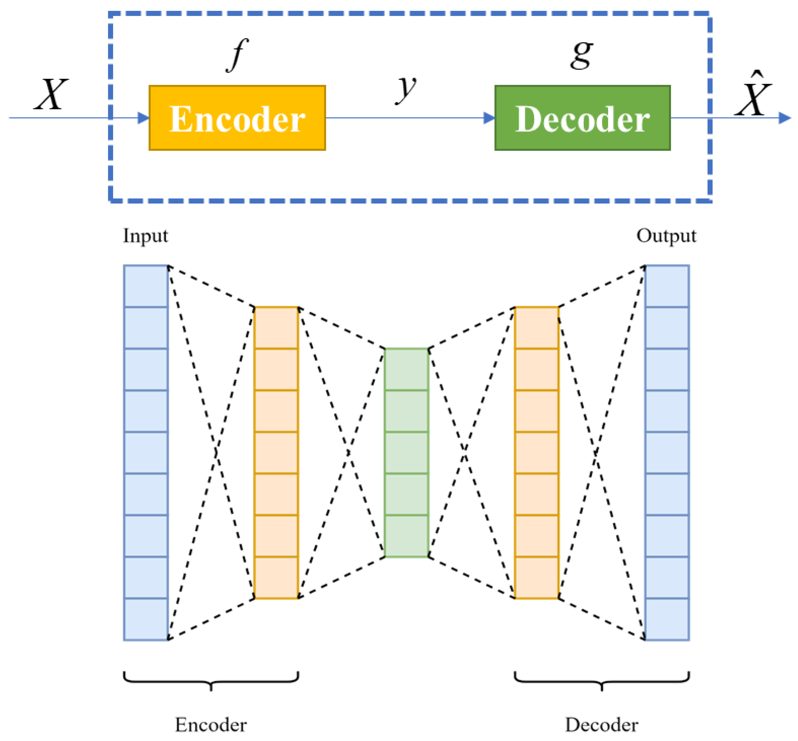

## Table of Contents

## What are Hybrid Parallel Methods in the context of machine learning?

Hybrid Parallel Methods in machine learning are techniques that combine different types of parallelism to speed up the training and processing of large-scale machine learning models. These methods are essential when dealing with big data and complex models that require significant computational resources. By using hybrid parallel methods, researchers and engineers can distribute the workload across multiple processors or machines, allowing for faster training times and the ability to handle larger datasets.

One common approach in hybrid parallel methods is to combine data parallelism with model parallelism. Data parallelism involves splitting the training data across different processors, where each processor computes the gradients for its subset of the data. Model parallelism, on the other hand, involves splitting the model itself across different processors, where each processor handles a different part of the model. By using both techniques together, hybrid parallel methods can achieve better scalability and efficiency. For example, if you have a large neural network, you can split the layers of the network across different machines (model parallelism) while also splitting the data across these machines (data parallelism).

In practice, implementing hybrid parallel methods can be complex and requires careful consideration of the trade-offs between different types of parallelism. For instance, while data parallelism can be easier to implement and can scale well with increasing data size, it may lead to communication overheads when synchronizing gradients across processors. Model parallelism can help reduce this communication overhead by allowing different parts of the model to be updated independently, but it can be more challenging to implement, especially for models with intricate dependencies between layers. Therefore, choosing the right hybrid parallel strategy depends on the specific requirements of the machine learning task at hand, including the size of the dataset, the complexity of the model, and the available computational resources.

## How do Hybrid Parallel Methods differ from traditional parallel computing techniques?

Hybrid Parallel Methods are different from traditional parallel computing techniques because they mix different ways of dividing work among processors. In traditional parallel computing, you might use only data parallelism, where the data is split across different processors, or only model parallelism, where different parts of a model are handled by different processors. Hybrid methods, however, use both at the same time. This means that while some processors are working on different parts of the data, others might be working on different parts of the model. This combination allows for better use of resources and can handle bigger and more complex tasks.

The main difference in how these methods work is that hybrid methods try to balance the load more effectively. In traditional methods, if you use only data parallelism, all processors need to communicate often to update the model, which can slow things down. If you use only model parallelism, managing how different parts of the model work together can be tricky. Hybrid methods solve these problems by using a bit of both. They can reduce the need for constant communication by letting some processors work on different parts of the model while others handle different data. This makes the whole process faster and more efficient, especially for big [machine learning](/wiki/machine-learning) tasks.

## Can you explain the basic concept behind Parallax in Hybrid Parallel Methods?

Parallax in Hybrid Parallel Methods is a concept that helps in managing how different parts of a machine learning model and data are handled by multiple processors. Imagine you have a big puzzle, and you want to solve it quickly. Instead of one person working on the whole puzzle, you can have multiple people working on different pieces at the same time. In machine learning, this puzzle is split into smaller parts, and different processors work on these parts. Parallax helps to keep track of how these parts fit together and how the work is shared between the processors.

When using Parallax in Hybrid Parallel Methods, the goal is to minimize the time it takes for the processors to communicate with each other. If processors need to wait for each other too much, it slows everything down. Parallax helps by making sure that the work is divided in a way that reduces waiting time. For example, some processors can work on different layers of a [neural network](/wiki/neural-network) while others work on different pieces of data. This way, the processors can work more independently and finish the task faster.

## What is the role of dhf in enhancing machine learning model training?

dhf, or Data-Handling Framework, plays a crucial role in enhancing machine learning model training by managing and optimizing the way data is processed and fed into the model. During training, a machine learning model needs to go through a lot of data quickly and efficiently. dhf helps by organizing this data in a way that makes it easier for the model to learn. For example, it can split the data into smaller chunks and distribute these chunks across different processors. This means the model can train faster because it doesn't have to wait for all the data to be ready at once.

Moreover, dhf can also help in making the training process more reliable. It does this by ensuring that the data is handled consistently and accurately. If the data is not managed well, the model might learn incorrect patterns, which can lead to poor performance. By using dhf, the training process becomes smoother and more stable, which helps in creating better and more accurate machine learning models.

## How does the Herring method contribute to efficient parallel processing in machine learning?

The Herring method helps make parallel processing in machine learning more efficient by dividing the work in a smart way. Imagine you have a big job to do, like painting a large wall. Instead of one person painting the whole wall, you can have many people painting different parts at the same time. The Herring method does something similar with machine learning tasks. It splits the big job of training a model into smaller tasks that can be done by different processors at the same time. This means the model can learn faster because all the processors are working together, but on different parts of the job.

To make sure this works well, the Herring method also takes care of how these processors talk to each other. If they have to wait too long to share information, it can slow everything down. The Herring method makes sure the processors can work mostly on their own without waiting too much. This way, the whole process of training a machine learning model becomes quicker and smoother. By using the Herring method, you can handle bigger and more complex machine learning tasks more easily.

## What are the key features of FastMoE that make it suitable for large-scale model training?

FastMoE is a tool that helps train very big machine learning models quickly. One of the main features of FastMoE is its ability to split the work across many processors. This is called "parallel processing." By doing this, FastMoE can handle huge amounts of data and complex models much faster than if it were using just one processor. Another important feature is that FastMoE uses a smart way to manage how these processors talk to each other. This means they don't have to wait too long to share information, which keeps the training process smooth and fast.

Additionally, FastMoE has built-in tools that make it easier to manage and organize the data being used to train the model. This is important because if the data is not handled well, the model might learn the wrong things. FastMoE helps make sure the data is handled correctly and efficiently, which leads to better and more accurate models. Overall, these features make FastMoE a great choice for training large-scale machine learning models, allowing researchers and engineers to work with bigger datasets and more complex models without running into performance issues.

## How does BytePS optimize data parallelism in distributed machine learning environments?

BytePS optimizes data parallelism in distributed machine learning environments by making sure that data is shared and processed efficiently across different computers. It does this by using a smart way to send data between the computers. Instead of sending all the data at once, BytePS breaks it into smaller pieces and sends them one at a time. This means that the computers don't have to wait too long to start working on their part of the data. By doing this, BytePS makes the whole process of training a machine learning model faster and more efficient.

Another way BytePS helps is by managing how the computers talk to each other. When computers are working together, they need to share information about what they are doing. If they have to wait too long to get this information, it can slow everything down. BytePS uses special techniques to make sure the computers can share information quickly and smoothly. This means they can work together better and finish the training process faster. By using BytePS, researchers and engineers can handle bigger and more complex machine learning tasks without running into performance issues.

## What is the significance of E2EAdaptiveDistTraining in adaptive distribution of training workloads?

E2EAdaptiveDistTraining, which stands for End-to-End Adaptive Distributed Training, is important because it helps make the training of machine learning models faster and more efficient. It does this by figuring out the best way to split the work among different computers. When training a big model, you can use many computers to work together. E2EAdaptiveDistTraining looks at how well each computer is doing and changes the amount of work it gives to each one. This means that if one computer is working faster, it can get more work, and if another is slower, it can get less. This smart way of sharing work helps the whole training process go faster.

This method also helps when the workload changes during training. Sometimes, different parts of the model need more or less work to train properly. E2EAdaptiveDistTraining keeps an eye on these changes and adjusts how the work is distributed. This makes sure that the training stays efficient no matter what. By using E2EAdaptiveDistTraining, researchers and engineers can train big and complex machine learning models more easily and quickly, even when the training conditions change.

## Can you describe how CFlines approach improves the training process of machine learning models?

CFlines, or Cross-Feature Lines, helps make machine learning models train faster and better by looking at how different pieces of data work together. When you train a model, you feed it lots of data, and the model tries to find patterns in this data. CFlines makes this process smoother by figuring out which pieces of data are important and how they connect with each other. This way, the model can focus on the most useful information and learn more quickly. It's like sorting through a big pile of puzzle pieces and finding the ones that fit together best, so you can finish the puzzle faster.

By using CFlines, the training process becomes more efficient because the model doesn't waste time on less important data. This means the model can reach good performance with less training time. CFlines also helps the model be more accurate because it pays attention to the right connections between data. This is especially helpful when you have a lot of data, and it's hard to see which parts are most important. By focusing on these key connections, CFlines makes the whole training process smoother and more effective.

## What makes PipeTransformer unique among other Hybrid Parallel Methods?

PipeTransformer is unique among other Hybrid Parallel Methods because it combines pipeline parallelism with data parallelism in a way that makes training large language models faster and more efficient. Pipeline parallelism means splitting a model into different parts and having these parts work one after the other, like a production line. Data parallelism means splitting the training data across different processors. PipeTransformer uses both of these at the same time. This allows it to handle very big models by breaking them into smaller pieces and processing them in a pipeline while also using many processors to work on different parts of the data at the same time. This combination helps reduce the time it takes to train a model and makes better use of the available computing resources.

Another thing that makes PipeTransformer special is how it manages the flow of data through the pipeline. It uses a technique called "micro-batching" to keep the pipeline full and running smoothly. Micro-batching means breaking the data into very small batches that move through the pipeline quickly. This helps to keep all parts of the pipeline busy and reduces the time processors spend waiting for data. By doing this, PipeTransformer can train large models much faster than other methods. This makes it a powerful tool for researchers and engineers working on big machine learning projects.

## How does HetPipe address the challenges of heterogeneous environments in parallel training?

HetPipe helps solve problems that come up when training machine learning models on computers that are different from each other. In a group of computers, some might be faster or have more memory than others. HetPipe figures out the best way to split the work so that all the computers can work together well. It looks at how fast each computer is and what it can handle, then gives each one a part of the job that fits its abilities. This way, the slower computers don't slow down the whole process, and the faster ones can do more work.

By doing this, HetPipe makes sure that the training process goes smoothly, even if the computers are not all the same. It keeps track of how each computer is doing and can change the amount of work it gives to each one if needed. This means that if one computer starts to work slower, HetPipe can give it less work and give more to the others. This smart way of sharing work helps the whole training process be faster and more efficient, no matter what kind of computers are being used.

## What are the future prospects and potential developments in Hybrid Parallel Methods for machine learning?

The future of Hybrid Parallel Methods in machine learning looks promising as researchers continue to find new ways to make training big models faster and more efficient. One exciting area is the development of more advanced algorithms that can better handle the complexities of splitting work across different processors. These algorithms will be able to adapt to changing conditions during training, making sure that the work is always shared in the best way possible. This could mean using smarter ways to split the model and the data, or finding new ways to manage how processors talk to each other. As a result, training large models will become easier and quicker, allowing researchers to tackle even bigger and more complex problems.

Another potential development is the integration of Hybrid Parallel Methods with new hardware technologies. As computers get faster and more powerful, new types of processors and memory systems are being developed. Hybrid Parallel Methods will need to evolve to take full advantage of these new technologies. This could involve creating methods that are specifically designed for certain types of hardware, or finding ways to make the methods work well across a mix of different hardware. By doing this, the training of machine learning models will become even more efficient, helping to push the boundaries of what is possible in fields like [artificial intelligence](/wiki/ai-artificial-intelligence) and data science.

## References & Further Reading

[1]: Shazeer, N., & Stern, M. (2018). ["Adafactor: Adaptive Learning Rates with Sublinear Memory Cost."](https://arxiv.org/abs/1804.04235) arXiv preprint arXiv:1804.04235.

[2]: Dean, J., Corrado, G., Monga, R., Chen, K., Devin, M., Mao, M., ... & Ng, A. Y. (2012). ["Large Scale Distributed Deep Networks."](https://dl.acm.org/doi/10.5555/2999134.2999271) Advances in Neural Information Processing Systems 25.

[3]: Narayanan, D., Sanjeev, V. V., Shi, L., Suresh, A. T., Kliot, G., & Ganger, G. (2019). ["Pipedream: Generalized Pipeline Parallelism for DNN Training."](https://dl.acm.org/doi/10.1145/3341301.3359646) Proceedings of the 27th ACM Symposium on Operating Systems Principles.

[4]: Sergeev, A., & Del Balso, M. (2018). ["Horovod: Fast and Easy Distributed Deep Learning in TensorFlow."](https://arxiv.org/abs/1802.05799) arXiv preprint arXiv:1802.05799.

[5]: Rajbhandari, S., Rasley, J., Ruwase, O., & He, Y. (2020). ["ZeRO: Memory Optimizations Toward Training Trillion Parameter Models."](https://arxiv.org/abs/1910.02054) Proceedings of the International Conference for High Performance Computing, Networking, Storage and Analysis.

[6]: Li, M., Andersen, D. G., Park, J. W., Smola, A. J., Ahmed, A., Josifovski, V., ... & Su, B. Y. (2014). ["Scaling Distributed Machine Learning with the Parameter Server."](https://www.usenix.org/system/files/conference/osdi14/osdi14-paper-li_mu.pdf) Proceedings of the 11th USENIX Symposium on Operating Systems Design and Implementation (OSDI).

[7]: Zaharia, M., Chowdhury, M., Franklin, M. J., Shenker, S., & Stoica, I. (2010). ["Spark: Cluster Computing with Working Sets."](https://people.csail.mit.edu/matei/papers/2010/hotcloud_spark.pdf) Proceedings of the 2nd USENIX conference on Hot topics in cloud computing.

[8]: Ben-Nun, T., & Hoefler, T. (2019). ["Demystifying Parallel and Distributed Deep Learning: An In-Depth Concurrency Analysis."](https://arxiv.org/abs/1802.09941) ACM Computing Surveys (CSUR).