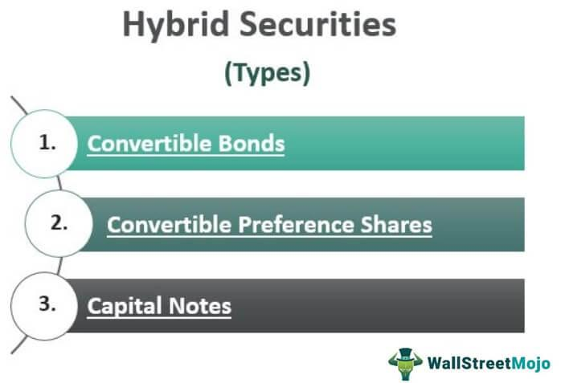

## Table of Contents

## What are hybrid securities?

Hybrid securities are a type of investment that combines features of both debt and equity. This means they have characteristics of bonds, which are loans to a company, and stocks, which are ownership shares in a company. For example, a hybrid security might pay regular interest like a bond, but also give the holder the chance to convert it into stock like an equity.

These securities can be attractive to investors because they offer a mix of income and potential for growth. Companies might issue hybrid securities to raise money in a way that is less costly than issuing regular bonds or diluting ownership through more stock. However, hybrid securities can also be complex and harder to understand than simple stocks or bonds, so investors need to be careful and do their research before buying them.

## How do hybrid securities combine features of debt and equity?

Hybrid securities mix the features of debt and equity in a way that gives investors both the safety of bonds and the growth potential of stocks. When you buy a hybrid security, you might get regular interest payments, just like you would with a bond. This part is like debt because the company is promising to pay you back over time. But, unlike a regular bond, the company doesn't have to pay you back the full amount at the end; instead, it might give you the option to convert your security into shares of the company's stock.

This conversion feature is where the equity part comes in. If the company does well and the stock price goes up, you can turn your hybrid security into stock and possibly make more money than if you just kept getting interest payments. But if the company doesn't do well, you might still get your interest payments, which makes it less risky than just owning stock. So, hybrid securities give you a bit of both worlds: the steady income from debt and the chance to grow your investment like with equity.

## What are the main types of hybrid securities?

There are a few main types of hybrid securities that you might come across. One type is called a convertible bond. This is like a regular bond because it pays interest, but you can also choose to turn it into shares of the company's stock if you want. This can be good if the company's stock price goes up a lot. Another type is a preferred stock. This is like regular stock because it represents ownership in the company, but it also pays you a fixed dividend, which is more like the interest you get from a bond.

Another type of hybrid security is a warrant. A warrant gives you the right to buy the company's stock at a certain price in the future. It's like a ticket that lets you buy stock later if you think the price will go up. Lastly, there are contingent convertibles, or "CoCos." These are special bonds that can turn into stock if certain things happen, like if the company gets into financial trouble. They're used a lot by banks to make sure they have enough money to keep going if things go wrong.

## Can you explain convertible bonds and their benefits?

Convertible bonds are a type of hybrid security that lets you get the best of both worlds from bonds and stocks. When you buy a convertible bond, you're lending money to a company, and in return, they pay you interest regularly, just like with a regular bond. But, there's a special feature: you can choose to convert your bond into shares of the company's stock if you want. This means if the company's stock price goes up a lot, you can turn your bond into stock and maybe make more money than just getting interest.

The benefits of convertible bonds are pretty cool. First, you get regular interest payments, which gives you some steady income. This is great if you want some money coming in without too much risk. Second, if the company does well and the stock price goes up, you can convert your bond into stock and possibly make a lot more money. This gives you a chance to grow your investment, kind of like with regular stocks. So, convertible bonds let you play it safe with interest payments while also giving you a shot at bigger gains if the company does well.

## What are preferred shares and how do they differ from common shares?

Preferred shares are a type of stock that gives you a bit of a different deal than common shares. When you own preferred shares, you get a fixed dividend, which is like getting paid a certain amount of money regularly. This is different from common shares, where the amount you get can go up and down depending on how well the company is doing. Preferred shareholders also get paid their dividends before common shareholders, which means they have a bit more safety if the company runs into money troubles.

Another big difference is that preferred shares usually don't give you voting rights. With common shares, you get to vote on things like who should be on the company's board of directors. But with preferred shares, you don't get a say in those decisions. This can be a trade-off because you get more predictable income and a bit more safety, but you give up some control over the company's decisions. So, preferred shares can be a good choice if you want steady income and a bit less risk, but you're okay with not having a say in how the company is run.

## How do warrants function as hybrid securities?

Warrants are a type of hybrid security that gives you the right to buy a company's stock at a set price in the future. It's like having a ticket that lets you buy the stock later if you think the price will go up. You don't have to buy the stock if you don't want to, but if the stock price goes above the set price, you can use your warrant to buy it cheaper than what it's selling for on the market. This can be a good deal because you might make money if the stock price goes up a lot.

Warrants are different from regular stocks because they don't give you ownership in the company right away. They're more like a bet on the company's future. If the company does well and the stock price goes up, your warrant becomes more valuable. But if the stock price stays the same or goes down, your warrant might not be worth using. So, warrants give you a chance to make money if you think the company will do well, but they also come with more risk because they might not pay off if the stock doesn't go up.

## What role do hybrid securities play in a company's capital structure?

Hybrid securities help companies raise money in a way that mixes the benefits of both debt and equity. When a company needs money, it can issue bonds, which are loans that need to be paid back with interest, or it can issue stocks, which give people a piece of the company. But hybrid securities, like convertible bonds or preferred shares, let the company do a bit of both. This means the company can borrow money and promise to pay it back with interest, but also give investors the chance to turn their investment into stock if the company does well. This can be less costly for the company than issuing regular bonds or diluting ownership through more stock.

Hybrid securities can also make a company's capital structure more flexible. They can help a company manage its finances better because they offer a way to balance between the steady payments of debt and the growth potential of equity. For example, if a company is doing well, investors might choose to convert their hybrid securities into stock, which can help the company grow without having to issue more stock right away. And if the company runs into trouble, the debt part of the hybrid security can provide some safety because the company still has to pay interest. So, hybrid securities can be a smart way for a company to raise money and keep its finances in good shape.

## What are the tax implications of investing in hybrid securities?

Investing in hybrid securities can have different tax effects depending on what type of hybrid security you buy. For example, if you invest in convertible bonds, the interest you get from them is usually taxed as regular income. This is like the tax you pay on your salary. But if you decide to convert your bond into stock, any money you make from selling that stock later might be taxed as a capital gain, which can be a lower tax rate than regular income. So, the tax you pay can change depending on whether you keep the bond or turn it into stock.

Preferred shares also have their own tax rules. The dividends you get from preferred shares are often taxed at a lower rate than regular income, kind of like how capital gains are taxed. This can be good because it means you keep more of the money you earn from dividends. But, if you sell your preferred shares for more than you paid for them, that profit might be taxed as a capital gain. So, with hybrid securities, the taxes you pay can depend on whether you're getting interest, dividends, or selling the security for a profit. It's important to think about these tax effects when you're deciding if hybrid securities are a good investment for you.

## How do hybrid securities impact a company's risk profile?

Hybrid securities can change a company's risk profile by mixing the safety of debt with the growth potential of equity. When a company issues hybrid securities like convertible bonds, it gets to borrow money but also gives investors a chance to own part of the company later. This can make the company's finances more flexible because it can manage its debt better and maybe grow without selling more stock right away. But, there's also more risk because if the company does really well, investors might want to convert their bonds into stock, which can change how much the company owes and how much it's worth.

On the other hand, if the company runs into trouble, the debt part of the hybrid security can be a safety net. The company still has to pay interest on the bonds, which can help keep it stable. But, if too many investors want to convert their bonds into stock when the company is struggling, it could make things worse by diluting the value of the existing stock. So, hybrid securities can help a company balance risk and growth, but they also add complexity and potential risks that the company needs to manage carefully.

## What are the key considerations for investors when choosing hybrid securities?

When choosing hybrid securities, investors should think about the balance between risk and reward. Hybrid securities like convertible bonds or preferred shares offer a mix of steady income from interest or dividends and the chance to grow your investment if the company does well. But they can also be riskier than regular bonds because if the company runs into trouble, you might not get your money back as easily. It's important to look at the company's financial health and see if it's strong enough to handle the hybrid security's terms. Also, consider how long you want to keep your investment, because some hybrid securities might take a while to pay off.

Another thing to think about is the tax effects of hybrid securities. The taxes you pay can be different depending on whether you're getting interest, dividends, or selling the security for a profit. For example, the interest from convertible bonds is usually taxed as regular income, while dividends from preferred shares might be taxed at a lower rate. It's a good idea to talk to a tax advisor to understand how these taxes might affect your investment. Overall, choosing hybrid securities means looking at the company's situation, your own investment goals, and how taxes might change what you earn.

## How do regulatory environments affect the issuance and trading of hybrid securities?

Regulatory environments play a big role in how companies can issue and trade hybrid securities. Different countries have their own rules about what companies need to do before they can sell these securities to the public. For example, in the United States, the Securities and Exchange Commission (SEC) has strict rules that companies must follow to make sure investors are protected. These rules can include things like how much information the company has to share about its financial health and what it plans to do with the money it raises. If the rules are too strict, it might be harder for companies to issue hybrid securities, but it can also make investors feel safer because they know more about what they're buying.

The trading of hybrid securities is also affected by regulations. Some countries have special rules for how these securities can be bought and sold on stock exchanges. For example, there might be rules about how much information has to be given to the public when a trade happens, or limits on who can buy certain types of hybrid securities. These rules can make the market for hybrid securities more or less active. If the rules are clear and fair, more people might want to trade these securities, but if the rules are confusing or too restrictive, it could make the market smaller and less liquid. So, the regulatory environment can really shape how easy or hard it is for companies to use hybrid securities and for investors to trade them.

## What advanced strategies can be used to optimize returns from hybrid securities?

One advanced strategy to optimize returns from hybrid securities is to use a strategy called "convertible [arbitrage](/wiki/arbitrage)." This is when you buy a convertible bond and at the same time, you sell short the stock of the same company. The idea is to make money from the difference between the bond's value and the stock's value. If the stock price goes up, the bond becomes more valuable because you can convert it into stock. But because you sold the stock short, you can buy it back cheaper and make money from that too. This strategy can be tricky and needs a lot of watching and quick decisions, but it can help you make more money if you do it right.

Another strategy is to look for "mispriced" hybrid securities. This means finding securities that are selling for less than they're really worth. You can do this by doing a lot of research and using special tools to figure out the true value of the security. If you find a convertible bond that's cheaper than it should be, you can buy it and then convert it into stock when the price goes up. This can give you a bigger return than just holding onto the bond. It's important to keep an eye on the market and be ready to act quickly, because these opportunities can come and go fast.

## What are the types of financial instruments?

Financial instruments are essential components of the financial markets, serving as vehicles for investment and risk management. These instruments can be broadly categorized into debts, equities, and derivatives, each with distinct characteristics, risk profiles, and return potentials that shape investor decisions based on individual financial goals and risk tolerance.

Traditional financial instruments comprise stocks, bonds, commodities, and, more recently, cryptocurrencies. Stocks represent ownership stakes in companies, providing opportunities for capital appreciation and dividend income. The performance of a stock is typically tied to the financial health and growth prospects of the issuing company, making equities inherently riskier than debt instruments but potentially offering higher returns.

Debt instruments, such as bonds and money market instruments, are generally perceived as safer investments, as they provide fixed returns over a specific period. Bonds, issued by governments or corporations, pay interest to investors and return the principal once the bond matures. The risk associated with bonds largely depends on the creditworthiness of the issuer and prevailing interest rates; however, they are favoured by those seeking stable income streams and lower [volatility](/wiki/volatility-trading-strategies).

Commodities, such as gold, oil, and agricultural products, serve as another class of traditional financial instruments. They are tangible assets whose value can be affected by supply and demand dynamics, geopolitical factors, and market speculation. Investing in commodities provides diversification and a hedge against inflation but carries risks related to market conditions and price volatility.

The advent of cryptocurrencies has introduced a novel form of financial instrument. Cryptocurrencies like Bitcoin and Ethereum are digital assets based on blockchain technology, offering a decentralized medium of exchange and store of value. Their tradeable nature and potential for high returns attract investors; however, they are highly volatile and unregulated, raising concerns about security and legal aspects.

Beyond traditional instruments, derivatives such as options and futures offer sophisticated financial strategies for speculation and hedging. Derivatives derive their value from underlying assets, including stocks, bonds, commodities, or market indices. Options give the holder the right, but not the obligation, to buy or sell an asset at a predetermined price, facilitating strategies to capitalize on price movements. Futures contracts, on the other hand, are agreements to buy or sell an asset at a specified future date and price, allowing investors to hedge against price fluctuations or speculate on market directions.

In summary, financial instruments present varied opportunities and risks, enabling investors to tailor their portfolios according to preferences and market outlooks. Selecting the appropriate instruments involves understanding the inherent risks and balancing them against potential rewards, aligning with individual investment strategies.

 to Hybrid Securities

Hybrid securities are financial instruments that encapsulate features from both debt and equity, thus offering a distinctive blend of advantages for both issuers and investors. These securities, which include convertible bonds, preferred shares, and pay-in-kind (PIK) notes, present a flexible approach to investment that caters to a variety of financial strategies and objectives.

Convertible bonds are a quintessential example of hybrid securities. They provide investors with interest payments akin to those from regular debt instruments. However, they come with the added benefit of being convertible into a predetermined number of company shares. This conversion feature allows investors to capitalize on stock appreciation potential, blending security with growth prospects. The calculation for conversion can be represented as:

$$
\text{Conversion Value} = \text{Conversion Ratio} \times \text{Market Price of Stock}
$$

Preferred shares are another type of hybrid security, striking a balance between the dividend payment preferences of equity and the fixed income characteristics of debt. They offer regular dividend payments, which can be fixed or floating, and sometimes come with the option to convert into common stock. This flexibility makes preferred shares attractive to investors who seek both income and the potential for capital gains.

PIK notes further highlight the adaptability of hybrid securities in financial structuring. These notes provide the issuer the flexibility to pay interest in the form of additional debt rather than cash, making them an advantageous option for companies that may face cash flow challenges. This feature can benefit both the issuer and investors by deferring cash outflows while potentially enhancing returns.

Hybrid securities, due to their complex structures, are often deemed suitable for sophisticated investors who can appreciate their nuanced risk-reward profiles. They offer tax advantages and can be resilient across different market conditions; however, they also bear inherent risks. Key concerns include potential illiquidity, meaning they might not be easily sold or exchanged without a significant loss in value, and the possibility of issuer creditworthiness changes. Investors must weigh these factors carefully, employing diligent research and strategy when incorporating hybrid securities into their investment portfolios.

In summary, hybrid securities provide a flexible and innovative approach to investing, allowing for tailored solutions that accommodate both current income desires and long-term growth plans, albeit with the necessity for thorough understanding and risk assessment.

## What are the types of hybrid securities?

Hybrid securities are financial instruments that embody characteristics of both debt and equity, offering a diverse range of opportunities for investors who seek balance between risk and potential return. Here, we explore the primary types of hybrid securities available in financial markets.

**Convertible Bonds**

Convertible bonds are a type of hybrid security that allows bondholders to convert their bonds into a predetermined number of the issuing company's shares. This conversion option provides investors with not only the fixed income benefits typical of bonds but also the potential for capital appreciation if the company's stock value increases. The conversion ratio, which determines how many shares a bondholder receives per bond, is a crucial element of these instruments. Mathematically, the conversion ratio can be expressed as:

$$
\text{Conversion Ratio} = \frac{\text{Par Value of Bond}}{\text{Conversion Price}}
$$

This dual nature of providing interest payments while offering equity participation is appealing to investors with a moderate risk preference.

**Convertible Preference Shares**

Convertible preference shares are preferred shares that offer dividend payments and the option to convert into common stock at the holder's discretion. This hybrid security provides a combination of fixed income, through dividends, and the potential for capital appreciation found in common equity. Investors can benefit from the stable income of dividends while retaining the flexibility to convert into common shares if the company's market prospects improve. This feature offers a strategic balance between equity participation and the predictability of fixed-income investments.

**Perpetual Bonds**

Perpetual bonds, also known as perpetuities, are fixed-income securities that provide indefinite interest payments without the obligation to repay the principal. These bonds continue to generate a steady income stream and are appealing to investors seeking long-term income without concern for maturity dates. The valuation of perpetual bonds involves calculating the present value of an infinite series of cash flows, which is given by:

$$
\text{Price} = \frac{C}{r}
$$

where $C$ is the annual coupon payment and $r$ is the required rate of return. Despite their perpetual nature, these bonds are subject to interest rate risks, which can impact their market prices.

**Pay-In-Kind Toggle Notes**

Pay-in-kind (PIK) toggle notes are hybrid securities that offer issuers the flexibility to make interest payments in the form of additional debt rather than cash. This feature is particularly advantageous for companies facing temporary cash flow constraints, allowing them to defer cash outlays while maintaining their financial obligations. For investors, PIK notes present a higher yield potential due to the increased risk profile. The option to receive interest in additional securities rather than cash adds a layer of complexity, requiring investors to assess the issuer's creditworthiness and financial conditions carefully.

Hybrid securities like these offer diverse tools for portfolio diversification and yield enhancement, though they demand a keen understanding of their embedded risks and opportunities.

## References & Further Reading

[1]: ["Hybrid Securities Explained"](https://www.wallstreetmojo.com/hybrid-securities/) - Investopedia

[2]: ["Options, Futures, and Other Derivatives"](https://www.amazon.com/Options-Futures-Other-Derivatives-10th/dp/013447208X) by John C. Hull

[3]: Hull, J. (2012). ["The Mechanics of Futures Markets"](https://www.studocu.com/en-gb/document/university-of-exeter/futures-and-options/week-1-hull-chapter-2-the-mechanics-of-futures-markets/23342730). Pearson Education.

[4]: Treleaven, P., Gendal Brown, R., & Yang, D. (2013). ["Algorithmic Trading and High-Frequency Trading."](https://www.semanticscholar.org/paper/Blockchain-Technology-in-Finance-Treleaven-Brown/a59bcf23eadb7fee1b8f3810402910e21fd3496a) Philosophical Transactions of the Royal Society A: Mathematical, Physical and Engineering Sciences.

[5]: ["Flash Boys: A Wall Street Revolt"](https://en.wikipedia.org/wiki/Flash_Boys) by Michael Lewis

[6]: Hasbrouck, J., & Saar, G. (2013). ["Low-Latency Trading."](https://www.sciencedirect.com/science/article/abs/pii/S1386418113000165) The Review of Financial Studies, 26(9), 2090–2134.

[7]: Fabozzi, F. J. (2012). ["Bond Markets, Analysis, and Strategies."](https://books.google.com/books/about/Bond_Markets_Analysis_and_Strategies_ten.html?id=bQpNEAAAQBAJ) Pearson Education.