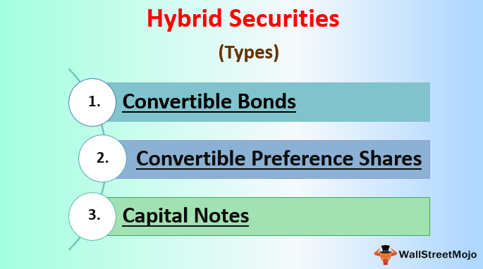

The world of financial investment is vast and multifaceted, offering a myriad of opportunities for investors. Among the many avenues available are financial instruments, each with its unique benefits and risks. These instruments serve as the foundation for crafting investment strategies and achieving financial objectives. Understanding the different types of investments, from traditional stocks and bonds to more complex hybrid securities and algorithmic trading, is essential for developing a robust portfolio that can withstand market fluctuations and align with individual risk tolerance.

Traditional financial instruments, such as stocks and bonds, form the cornerstone of most investment strategies. Stocks represent ownership stakes in companies, offering potential for dividends and capital appreciation, while bonds provide fixed interest payments, generally appealing to risk-averse investors. However, the financial landscape has evolved beyond these classic options, introducing innovative instruments like hybrid securities and algorithmic trading that cater to diverse investment needs.

Hybrid securities, which blend features of both debt and equity, and algorithmic trading, which uses sophisticated computer algorithms to execute trades, represent advanced opportunities in financial investments. These instruments can enhance portfolio diversification, optimize returns, and adapt to dynamic market conditions. However, their complexity and the rapid pace at which they enable transactions necessitate a thorough understanding of their functions and potential implications on investment strategies.

This article will explore various financial instruments, focusing on hybrid securities and algorithmic trading, providing insights into their roles and impact on investment strategies. By examining their definitions, types, risks, and benefits, we aim to equip you with the knowledge necessary to make informed investment decisions in an ever-evolving market landscape. Understanding these instruments not only aids in diversifying portfolios but also in successfully navigating the challenges and opportunities that modern financial markets present.

## Table of Contents

## Types of Financial Instruments

Financial instruments are essential components of the financial markets, serving as vehicles for investment and risk management. These instruments can be broadly categorized into debts, equities, and derivatives, each with distinct characteristics, risk profiles, and return potentials that shape investor decisions based on individual financial goals and risk tolerance.

Traditional financial instruments comprise stocks, bonds, commodities, and, more recently, cryptocurrencies. Stocks represent ownership stakes in companies, providing opportunities for capital appreciation and dividend income. The performance of a stock is typically tied to the financial health and growth prospects of the issuing company, making equities inherently riskier than debt instruments but potentially offering higher returns.

Debt instruments, such as bonds and money market instruments, are generally perceived as safer investments, as they provide fixed returns over a specific period. Bonds, issued by governments or corporations, pay interest to investors and return the principal once the bond matures. The risk associated with bonds largely depends on the creditworthiness of the issuer and prevailing interest rates; however, they are favoured by those seeking stable income streams and lower [volatility](/wiki/volatility-trading-strategies).

Commodities, such as gold, oil, and agricultural products, serve as another class of traditional financial instruments. They are tangible assets whose value can be affected by supply and demand dynamics, geopolitical factors, and market speculation. Investing in commodities provides diversification and a hedge against inflation but carries risks related to market conditions and price volatility.

The advent of cryptocurrencies has introduced a novel form of financial instrument. Cryptocurrencies like Bitcoin and Ethereum are digital assets based on blockchain technology, offering a decentralized medium of exchange and store of value. Their tradeable nature and potential for high returns attract investors; however, they are highly volatile and unregulated, raising concerns about security and legal aspects.

Beyond traditional instruments, derivatives such as options and futures offer sophisticated financial strategies for speculation and hedging. Derivatives derive their value from underlying assets, including stocks, bonds, commodities, or market indices. Options give the holder the right, but not the obligation, to buy or sell an asset at a predetermined price, facilitating strategies to capitalize on price movements. Futures contracts, on the other hand, are agreements to buy or sell an asset at a specified future date and price, allowing investors to hedge against price fluctuations or speculate on market directions.

In summary, financial instruments present varied opportunities and risks, enabling investors to tailor their portfolios according to preferences and market outlooks. Selecting the appropriate instruments involves understanding the inherent risks and balancing them against potential rewards, aligning with individual investment strategies.

 to Hybrid Securities

Hybrid securities are financial instruments that encapsulate features from both debt and equity, thus offering a distinctive blend of advantages for both issuers and investors. These securities, which include convertible bonds, preferred shares, and pay-in-kind (PIK) notes, present a flexible approach to investment that caters to a variety of financial strategies and objectives.

Convertible bonds are a quintessential example of hybrid securities. They provide investors with interest payments akin to those from regular debt instruments. However, they come with the added benefit of being convertible into a predetermined number of company shares. This conversion feature allows investors to capitalize on stock appreciation potential, blending security with growth prospects. The calculation for conversion can be represented as:

$$
\text{Conversion Value} = \text{Conversion Ratio} \times \text{Market Price of Stock}
$$

Preferred shares are another type of hybrid security, striking a balance between the dividend payment preferences of equity and the fixed income characteristics of debt. They offer regular dividend payments, which can be fixed or floating, and sometimes come with the option to convert into common stock. This flexibility makes preferred shares attractive to investors who seek both income and the potential for capital gains.

PIK notes further highlight the adaptability of hybrid securities in financial structuring. These notes provide the issuer the flexibility to pay interest in the form of additional debt rather than cash, making them an advantageous option for companies that may face cash flow challenges. This feature can benefit both the issuer and investors by deferring cash outflows while potentially enhancing returns.

Hybrid securities, due to their complex structures, are often deemed suitable for sophisticated investors who can appreciate their nuanced risk-reward profiles. They offer tax advantages and can be resilient across different market conditions; however, they also bear inherent risks. Key concerns include potential illiquidity, meaning they might not be easily sold or exchanged without a significant loss in value, and the possibility of issuer creditworthiness changes. Investors must weigh these factors carefully, employing diligent research and strategy when incorporating hybrid securities into their investment portfolios.

In summary, hybrid securities provide a flexible and innovative approach to investing, allowing for tailored solutions that accommodate both current income desires and long-term growth plans, albeit with the necessity for thorough understanding and risk assessment.

## Types of Hybrid Securities

Hybrid securities are financial instruments that embody characteristics of both debt and equity, offering a diverse range of opportunities for investors who seek balance between risk and potential return. Here, we explore the primary types of hybrid securities available in financial markets.

**Convertible Bonds**

Convertible bonds are a type of hybrid security that allows bondholders to convert their bonds into a predetermined number of the issuing company's shares. This conversion option provides investors with not only the fixed income benefits typical of bonds but also the potential for capital appreciation if the company's stock value increases. The conversion ratio, which determines how many shares a bondholder receives per bond, is a crucial element of these instruments. Mathematically, the conversion ratio can be expressed as:

$$
\text{Conversion Ratio} = \frac{\text{Par Value of Bond}}{\text{Conversion Price}}
$$

This dual nature of providing interest payments while offering equity participation is appealing to investors with a moderate risk preference.

**Convertible Preference Shares**

Convertible preference shares are preferred shares that offer dividend payments and the option to convert into common stock at the holder's discretion. This hybrid security provides a combination of fixed income, through dividends, and the potential for capital appreciation found in common equity. Investors can benefit from the stable income of dividends while retaining the flexibility to convert into common shares if the company's market prospects improve. This feature offers a strategic balance between equity participation and the predictability of fixed-income investments.

**Perpetual Bonds**

Perpetual bonds, also known as perpetuities, are fixed-income securities that provide indefinite interest payments without the obligation to repay the principal. These bonds continue to generate a steady income stream and are appealing to investors seeking long-term income without concern for maturity dates. The valuation of perpetual bonds involves calculating the present value of an infinite series of cash flows, which is given by:

$$
\text{Price} = \frac{C}{r}
$$

where $C$ is the annual coupon payment and $r$ is the required rate of return. Despite their perpetual nature, these bonds are subject to interest rate risks, which can impact their market prices.

**Pay-In-Kind Toggle Notes**

Pay-in-kind (PIK) toggle notes are hybrid securities that offer issuers the flexibility to make interest payments in the form of additional debt rather than cash. This feature is particularly advantageous for companies facing temporary cash flow constraints, allowing them to defer cash outlays while maintaining their financial obligations. For investors, PIK notes present a higher yield potential due to the increased risk profile. The option to receive interest in additional securities rather than cash adds a layer of complexity, requiring investors to assess the issuer's creditworthiness and financial conditions carefully.

Hybrid securities like these offer diverse tools for portfolio diversification and yield enhancement, though they demand a keen understanding of their embedded risks and opportunities.

## Algorithmic Trading in Modern Markets

Algorithmic trading, often referred to as algo-trading, is a method of executing trades using automated, pre-programmed trading instructions. These algorithms consider numerous variables such as timing, price, and [volume](/wiki/volume-trading-strategy). The primary advantage of [algorithmic trading](/wiki/algorithmic-trading) is its capacity to process vast quantities of data and perform trades at speeds and frequencies that are impossible for a human trader. This aspect of trading is particularly appealing in today’s fast-paced financial markets.

One of the most significant impacts of algorithmic trading is the enhancement of market efficiency. Algorithms can execute thousands of trades in fractions of a second, allowing them to exploit even the smallest discrepancies in market prices. This rapid execution can correct mispricings quickly, leading to more accurate asset pricing and greater market stability over time.

Algorithmic trading strategies can be broadly categorized into two types: rule-based and adaptive. Rule-based algorithms follow specific, predefined instructions. For instance, a simple rule-based strategy might involve buying a stock if its 50-day moving average exceeds its 200-day moving average. On the other hand, adaptive algorithms employ advanced technologies such as [machine learning](/wiki/machine-learning) to analyze market conditions continually and adjust strategies accordingly. These adaptive algorithms can process historical data and real-time information to predict future price movements, learn from trading outcomes, and dynamically alter their parameters to optimize performance.

Despite the advantages, algorithmic trading poses several risks and considerations. A notable concern is the potential effect on market stability. The sheer speed and volume of trades executed by algorithms can lead to significant volatility and occasional market disruption. Events such as flash crashes, where the withdrawal of [liquidity](/wiki/liquidity-risk-premium) results in rapid and deep market price drops, exemplify the potential consequences of high-frequency trading driven by algorithms.

Moreover, while algorithmic trading reduces transaction costs and minimizes human errors associated with trading decisions, it raises ethical concerns. The transparency of trading actions, data privacy, and market fairness are key ethical issues associated with algorithmic trading practices.

In conclusion, algorithmic trading represents a significant evolution in financial markets, offering efficiency and speed. However, it requires prudent oversight and regulation to mitigate risks associated with market stability and ethical considerations. As technology continues to advance, the role of algorithmic trading in shaping modern markets is likely to expand, necessitating ongoing evaluation by market participants and regulators.

## Risks and Considerations

Financial instruments such as hybrid securities and algorithmic trading offer significant potential benefits but are not without risks. Understanding these risks is crucial for investors aiming to maximize returns while minimizing exposure to unexpected losses.

Hybrid securities, which blend elements of debt and equity, can pose valuation challenges. Their complex structures, including features like convertibility and varying return mechanisms, make them difficult to assess correctly. The value of hybrid securities can fluctuate significantly due to market volatility, driven by [interest rate](/wiki/interest-rate-trading-strategies) changes, issuer creditworthiness, and broader economic conditions. For example, a convertible bond's value is sensitive to both bond market fluctuations and the underlying equity market, making it vulnerable to swings in either. This dual exposure requires investors to carefully analyze factors affecting both components.

Algorithmic trading, characterized by the use of computer algorithms to automate trading processes, enhances market efficiency but introduces its own set of risks. Its capability to execute large volumes of trades in milliseconds can magnify market volatility. Recent history has shown instances of algorithmic trading contributing to market disruptions, such as flash crashes, where prices plummet within minutes before recovering. These events raise concerns about market stability and the potential for self-reinforcing negative feedback loops.

Algorithmic trading strategies often depend on minute price discrepancies and rapid execution, which require robust technological infrastructure. However, the over-reliance on automated systems can introduce technical risks, including software bugs and network failures. Furthermore, the opacity of some algorithmic strategies can mask unintended consequences, leading to ethical concerns around market fairness and transparency.

Investors interested in these financial instruments must carefully weigh these risks against potential rewards. A clear understanding of market mechanisms and the specific characteristics of the instruments is essential. This involves thorough research, continuous monitoring of market conditions, and the application of risk management strategies, such as diversification and hedging. Additionally, regulatory compliance and ethical considerations must not be overlooked in algorithmic trading to ensure sustainable market practices.

In conclusion, while hybrid securities and algorithmic trading offer unique and innovative investment opportunities, they come with inherent risks that require diligent assessment and management. Investors must stay informed and agile to navigate these challenges effectively.

## Conclusion

Understanding the nuances of different types of financial instruments is crucial to building a diversified and effective investment portfolio. The dynamic nature of financial markets underscores the need for investors to grasp the fundamentals and advanced concepts underpinning various investment options. Hybrid securities and algorithmic trading are at the forefront of financial innovation, offering unique opportunities and challenges.

Hybrid securities bridge the gap between debt and equity, providing investors with flexibility and unique benefits. These instruments, such as convertible bonds and preferred shares, allow for the potential appreciation of equities while mitiglimiting risk through fixed returns or dividends. However, their complex structures necessitate comprehensive analysis to assess risk accurately, especially concerning creditworthiness and market conditions.

Algorithmic trading, leveraging sophisticated computer algorithms, enhances the efficiency and speed of trade execution. It enables investors to capitalize on small market inefficiencies and reduce transaction costs. Nonetheless, it also poses risks related to market volatility and ethical considerations. The rapid execution of trades can lead to market instability, exemplified by phenomena like flash crashes. Therefore, understanding algorithmic strategies and their potential implications is vital for prudent investment management.

Informed decision-making, thorough research, and ongoing market analysis are key to leveraging these innovative instruments for financial success. Investors must stay updated on market trends and technological advancements to navigate these complex tools effectively. The financial landscape continues to evolve, and maintaining an awareness of new developments is paramount for adapting strategies to align with changing market conditions.

Ultimately, a well-informed approach, grounded in comprehensive research and strategic adaptation, can enable investors to exploit the benefits of hybrid securities and algorithmic trading while mitigating associated risks. This balanced strategy not only enhances portfolio diversification but also positions investors to achieve their long-term financial objectives.

## References & Further Reading

[1]: ["Hybrid Securities Explained"](https://www.wallstreetmojo.com/hybrid-securities/) - Investopedia

[2]: ["Options, Futures, and Other Derivatives"](https://www.amazon.com/Options-Futures-Other-Derivatives-10th/dp/013447208X) by John C. Hull

[3]: Hull, J. (2012). ["The Mechanics of Futures Markets"](https://www.studocu.com/en-gb/document/university-of-exeter/futures-and-options/week-1-hull-chapter-2-the-mechanics-of-futures-markets/23342730). Pearson Education.

[4]: Treleaven, P., Gendal Brown, R., & Yang, D. (2013). ["Algorithmic Trading and High-Frequency Trading."](https://www.semanticscholar.org/paper/Blockchain-Technology-in-Finance-Treleaven-Brown/a59bcf23eadb7fee1b8f3810402910e21fd3496a) Philosophical Transactions of the Royal Society A: Mathematical, Physical and Engineering Sciences.

[5]: ["Flash Boys: A Wall Street Revolt"](https://en.wikipedia.org/wiki/Flash_Boys) by Michael Lewis

[6]: Hasbrouck, J., & Saar, G. (2013). ["Low-Latency Trading."](https://www.sciencedirect.com/science/article/abs/pii/S1386418113000165) The Review of Financial Studies, 26(9), 2090–2134.

[7]: Fabozzi, F. J. (2012). ["Bond Markets, Analysis, and Strategies."](https://books.google.com/books/about/Bond_Markets_Analysis_and_Strategies_ten.html?id=bQpNEAAAQBAJ) Pearson Education.