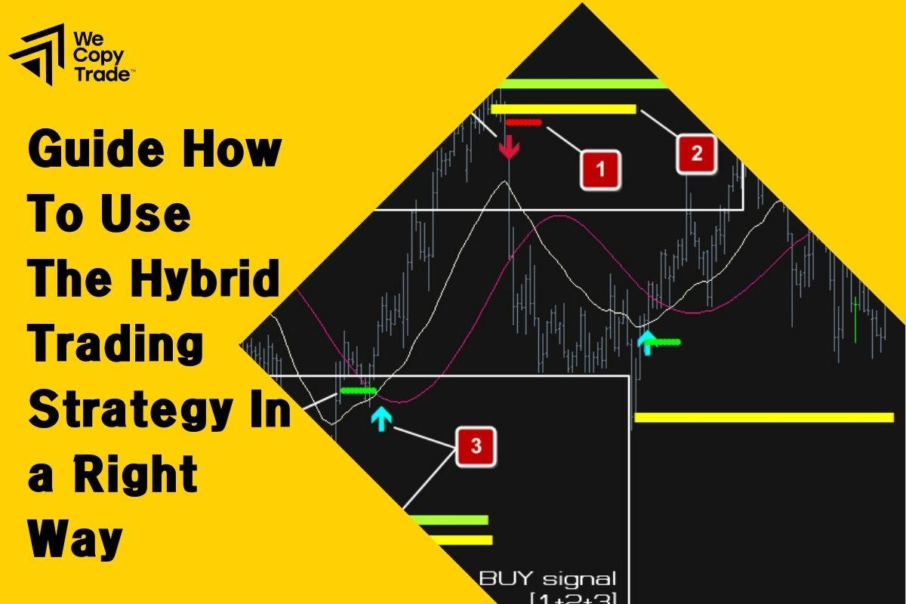

## Table of Contents

## What is a hybrid trading strategy?

A hybrid trading strategy is a way of buying and selling things like stocks or cryptocurrencies by mixing different methods. Instead of just using one way to decide when to buy or sell, a hybrid strategy uses a combination. This can include using computer programs that follow set rules, as well as human judgment based on experience and intuition. By combining these methods, traders hope to make better decisions and reduce the risks that come with relying on just one approach.

For example, a trader might use a computer program to analyze lots of data and spot patterns that suggest when to buy or sell. At the same time, the trader might also use their own knowledge and feelings about the market to make decisions. This mix of automatic and human decision-making can help the trader take advantage of the strengths of both. The computer can quickly process huge amounts of information, while the human can understand things that a computer might miss, like news events or changes in market mood.

## How do hybrid trading strategies differ from traditional trading strategies?

Hybrid trading strategies are different from traditional trading strategies because they mix different methods to make decisions about buying and selling. Traditional trading strategies often rely on just one method, like using technical analysis to look at charts and numbers, or fundamental analysis to study a company's financial health. In contrast, hybrid strategies combine these with other tools, like computer algorithms that can process lots of data quickly, and even human intuition based on experience and market feel.

This combination in hybrid strategies allows traders to use the best parts of different approaches. For example, while a traditional strategy might stick to technical analysis and miss out on important news events, a hybrid strategy can use algorithms to quickly react to new data while also allowing a human trader to make judgment calls based on market sentiment or unexpected news. This flexibility can help reduce the risks that come with sticking to one method and can potentially lead to better trading decisions and outcomes.

## What are the main components of a hybrid trading strategy?

A hybrid trading strategy mixes different ways to decide when to buy and sell things like stocks or cryptocurrencies. It combines computer programs, called algorithms, that can look at lots of information quickly, with human judgment. The algorithms help by finding patterns in data and making quick decisions based on rules set by the trader. At the same time, the human trader uses their experience and feelings about the market to make choices that the computer might not see.

The main parts of a hybrid strategy include technical analysis, which looks at charts and numbers to spot trends, and [fundamental analysis](/wiki/fundamental-analysis), which looks at a company's financial health. On top of these, hybrid strategies often use algorithms to process information faster than a human could. Finally, human intuition plays a big role, allowing traders to respond to news events or changes in market mood that might not be clear in the data. By using all these parts together, hybrid strategies aim to make better trading decisions and reduce the risks of relying on just one method.

## Can you explain the basic principles behind combining technical and fundamental analysis in hybrid strategies?

Combining technical and fundamental analysis in hybrid trading strategies is about using the strengths of both methods to make better trading decisions. Technical analysis looks at charts and numbers to find patterns and trends in how prices move. It helps traders figure out good times to buy or sell based on what has happened before. On the other hand, fundamental analysis looks at a company's financial health, like its earnings and debts, to decide if its stock is a good buy. By using both, traders can see not just where prices might be going, but also why they might be going there.

In a hybrid strategy, technical analysis can give quick signals for when to trade, while fundamental analysis provides a deeper understanding of a company's value. For example, if technical analysis shows a stock's price is going up, but fundamental analysis shows the company is not doing well financially, a trader might decide to wait before buying. This mix helps traders avoid buying into a short-term trend that might not last. By using both methods together, traders can make more informed decisions, balancing short-term opportunities with long-term value, and reducing the risk of relying on just one way of looking at the market.

## What are some common tools and indicators used in hybrid trading strategies?

In hybrid trading strategies, traders often use a mix of tools and indicators from both technical and fundamental analysis. For technical analysis, common tools include moving averages, which help smooth out price data to spot trends, and the Relative Strength Index (RSI), which shows if a stock might be overbought or oversold. Traders also use chart patterns like head and shoulders or triangles to predict future price movements. These technical indicators help traders find the best times to buy or sell based on what has happened before.

For fundamental analysis, traders look at financial statements like the income statement, balance sheet, and cash flow statement. They use ratios like the Price-to-Earnings (P/E) ratio to see if a stock is priced right compared to its earnings. Other important fundamental indicators include earnings per share (EPS) and the debt-to-equity ratio, which show how healthy a company's finances are. By combining these with technical indicators, traders get a fuller picture of both the short-term trends and the long-term value of a stock.

In addition to these, hybrid strategies often use algorithmic tools like automated trading systems and [machine learning](/wiki/machine-learning) algorithms. These tools can process lots of data quickly and make trades based on pre-set rules. They can help traders react faster to market changes and find patterns that might be hard for humans to see. Human judgment and intuition also play a key role, allowing traders to consider things like news events or changes in market sentiment that might not show up in the data. By using all these tools together, traders can make more informed and balanced decisions.

## How can a beginner start implementing a simple hybrid trading strategy?

A beginner can start implementing a simple hybrid trading strategy by first learning the basics of both technical and fundamental analysis. For technical analysis, start by understanding how to read stock charts and use simple indicators like moving averages. A moving average can help you see the overall trend of a stock's price. For fundamental analysis, look at a company's financial statements, like the income statement and balance sheet. Pay attention to key numbers like earnings per share (EPS) and the Price-to-Earnings (P/E) ratio. These will help you understand if a company is doing well financially and if its stock is a good buy.

Once you have a basic understanding of these two types of analysis, you can start combining them. For example, if you see a stock's price going up on the chart (technical analysis), check if the company's earnings are also growing (fundamental analysis). If both are positive, it might be a good time to buy. You can also use simple tools like a trading journal to keep track of your decisions and learn from them. Remember, as a beginner, it's important to start small and not risk too much money. Over time, as you get more comfortable, you can add more complex tools and indicators to your strategy.

## What are the risks associated with hybrid trading strategies?

Hybrid trading strategies can be risky because they mix different ways of making decisions. One risk is that the computer programs, or algorithms, might make mistakes. They can process a lot of information quickly, but if the rules they follow are not right, they might buy or sell at the wrong times. Also, the market can change in ways that the computer does not expect, leading to losses. Another risk is that human traders might let their feelings affect their decisions. Even though human judgment can be helpful, it can also lead to bad choices if a trader gets too excited or worried about the market.

Another risk comes from trying to balance technical and fundamental analysis. Sometimes, these two ways of looking at the market can give different signals. For example, the stock's price might look good on the chart, but the company's financial health might not be strong. Deciding which signal to follow can be hard and might lead to mistakes. Also, hybrid strategies can be complex, and beginners might find it hard to understand and use them correctly. This can make it more likely that they will make errors and lose money.

## How do you evaluate the performance of a hybrid trading strategy?

To evaluate the performance of a hybrid trading strategy, you need to look at how well it is doing over time. One way to do this is by checking the returns, or how much money the strategy is making. You can compare these returns to what you would get from just holding onto the stocks without trading. Another important thing to look at is how much risk the strategy is taking. You can measure this with something called the Sharpe ratio, which tells you if the returns are worth the risk. If the Sharpe ratio is high, the strategy is doing a good job of making money without taking too much risk.

Another way to evaluate the strategy is by looking at how often it wins and loses. This is called the win rate and the loss rate. A good strategy will have more wins than losses, but even more important is how big the wins and losses are. You want the wins to be bigger than the losses. Also, keeping a trading journal can help. Writing down why you made each trade and what happened can show you if the strategy is working well or if you need to make changes. By looking at all these things, you can tell if your hybrid trading strategy is successful or if you need to adjust it.

## What advanced techniques can be used to optimize hybrid trading strategies?

To make a hybrid trading strategy even better, you can use something called machine learning. This is a way for computers to learn from past trades and get better at [picking](/wiki/asset-class-picking) the right times to buy and sell. By looking at lots of old data, the computer can find patterns that might be hard for a person to see. It can then use these patterns to make smarter decisions. You can also use a technique called [backtesting](/wiki/backtesting), where you test your strategy on old data to see how it would have done in the past. This helps you find and fix any problems before you start using the strategy with real money.

Another advanced technique is called risk management. This means setting rules to limit how much money you can lose on any single trade. For example, you might decide to only risk a small part of your money on each trade, or you might set a stop-loss order to automatically sell a stock if its price drops too much. Using these rules can help keep your losses small and protect your money. By combining machine learning, backtesting, and good risk management, you can make your hybrid trading strategy work better and be safer to use.

## Can you provide examples of successful hybrid trading strategies used by professional traders?

One successful hybrid trading strategy used by professional traders is known as the "Trend Following with Fundamental Overlay" approach. In this strategy, traders use technical analysis to spot long-term trends in stock prices, often using moving averages to confirm the direction of the trend. Once they identify a trend, they then apply fundamental analysis to check if the company's financial health supports the trend. For example, if a stock's price is rising and its moving average is also going up, the trader might look at the company's earnings growth and debt levels. If the fundamentals are strong, the trader feels more confident in following the trend, buying the stock, and holding it until the trend reverses.

Another example is the "Algorithmic Trading with Human Intervention" strategy. Here, traders use computer algorithms to scan the market for trading opportunities based on pre-set rules. These algorithms can quickly analyze large amounts of data and execute trades based on technical indicators like the Relative Strength Index (RSI) or chart patterns. However, instead of letting the computer make all the decisions, human traders step in to review the trades suggested by the algorithm. They might choose to override the computer's decision if they see news events or changes in market sentiment that the algorithm might not have considered. This combination allows for quick, data-driven trades while still benefiting from human judgment to avoid potential pitfalls.

## How do market conditions affect the effectiveness of hybrid trading strategies?

Market conditions can really change how well hybrid trading strategies work. When the market is calm and moving slowly, hybrid strategies can do well. They use both computer programs and human judgment to find good times to buy and sell. The computer can look at lots of data to find patterns, and the human can make smart choices based on what they know about the market. In a calm market, this mix helps traders make good decisions without taking too much risk.

But when the market gets wild and prices start moving a lot, hybrid strategies can run into trouble. The computer programs might have a hard time keeping up with all the quick changes, and the human trader might get too excited or worried, making bad choices. Also, if the market is going down a lot, even a good strategy might lose money. So, it's important for traders using hybrid strategies to be ready to change their plans when the market gets tough.

## What future trends might impact the development of hybrid trading strategies?

In the future, new technology like [artificial intelligence](/wiki/ai-artificial-intelligence) (AI) could change how hybrid trading strategies work. AI can learn from lots of past data and find patterns that people might miss. This could make the computer part of the strategy even better at picking the right times to buy and sell. Also, more people might start using these strategies because they are easier to use with new apps and online tools. This means that even people who are new to trading could use hybrid strategies to make smart choices.

Another thing that might impact hybrid trading strategies is how the market changes. With more trading happening all over the world, the market can move very fast. This means that hybrid strategies will need to be quick and flexible to keep up. Traders might need to use more advanced tools to stay ahead. Also, as more people learn about these strategies, the market might change in ways that make them less effective. Traders will need to keep learning and changing their strategies to stay successful.

## How can you build a hybrid strategy by mixing a bull call spread with a short strangle?

A popular hybrid strategy in [algorithmic trading](/wiki/algorithmic-trading) is the combination of a bull call spread with a short strangle. This strategy leverages the strengths of both approaches to create a balanced and flexible trading method.

The bull call spread is a bullish strategy that generates profits from rising markets while simultaneously limiting risk. This is accomplished by purchasing a call option at a specific strike price and selling another call option at a higher strike price. This structure allows traders to benefit from upward price movements while capping potential losses. Mathematically, the payoff for a bull call spread can be expressed as:

$$
\text{Payoff} = \begin{cases} 
0, & \text{if } S \leq K_1 \\
S - K_1 - C_1 + C_2, & \text{if } K_1 < S < K_2 \\
K_2 - K_1 - C_1 + C_2, & \text{if } S \geq K_2 
\end{cases}
$$

where $S$ is the spot price, $K_1$ and $K_2$ are the strike prices of the bought and sold call options respectively, and $C_1$ and $C_2$ are the premiums paid for them.

Conversely, a short strangle is a non-directional strategy that profits from market stability. In this approach, a trader sells an out-of-the-money call and an out-of-the-money put option, collecting premiums from both. The short strangle benefits when the underlying asset remains within a specific range, not making substantial upward or downward movements. The risk associated with a short strangle is unlimited if the market moves significantly beyond the strike prices of the options. 

By integrating these strategies into a single hybrid approach, traders can capture potential profits from upward market movements while providing a buffer against high [volatility](/wiki/volatility-trading-strategies). This balance is achieved because the bull call spread benefits from upward market trends. In contrast, the short strangle offers resilience against small price oscillations, thus creating a versatile strategy capable of navigating various market conditions.

To implement this strategy efficiently, traders may utilize algorithmic platforms to automate the execution of trades, ensuring prompt responses to market fluctuations and mitigating human error.

## References & Further Reading

[1]: Aldridge, I. (2010). ["High-Frequency Trading: A Practical Guide to Algorithmic Strategies and Trading Systems."](https://www.ahmetbeyefendi.com/wp-content/uploads/2020/07/High-Frequency-Trading-Irene-Aldridge.pdf) Wiley.

[2]: Chan, E. P. (2009). ["Quantitative Trading: How to Build Your Own Algorithmic Trading Business."](https://github.com/ftvision/quant_trading_echan_book) Wiley.

[3]: Jansen, S. (2020). ["Machine Learning for Algorithmic Trading: Predictive Models to Extract Signals from Market and Alternative Data for Systematic Trading Strategies with Python."](https://github.com/stefan-jansen/machine-learning-for-trading) Packt Publishing.

[4]: Lopez de Prado, M. (2018). ["Advances in Financial Machine Learning."](https://books.google.com/books/about/Advances_in_Financial_Machine_Learning.html?id=oU9KDwAAQBAJ) Wiley.

[5]: Aronson, D. R. (2007). ["Evidence-Based Technical Analysis: Applying the Scientific Method and Statistical Inference to Trading Signals."](https://www.amazon.com/Evidence-Based-Technical-Analysis-Scientific-Statistical/dp/0470008741) Wiley.

[6]: Hull, J. C. (2015). ["Options, Futures, and Other Derivatives."](https://www.amazon.com/Options-Futures-Other-Derivatives-9th/dp/0133456315) Pearson.

[7]: Brorsen, B. W., & Irwin, S. H. (1987). ["Futures Funds and Commodity Index Funds: Performance, Evaluation, and Trading Strategies."](https://www.cambridge.org/core/journals/journal-of-financial-and-quantitative-analysis/article/abs/distribution-of-futures-prices-a-test-of-the-stable-paretian-and-mixture-of-normals-hypotheses/3CE84335A0B8A58ED13268BFF51F6B52) Journal of Futures Markets.