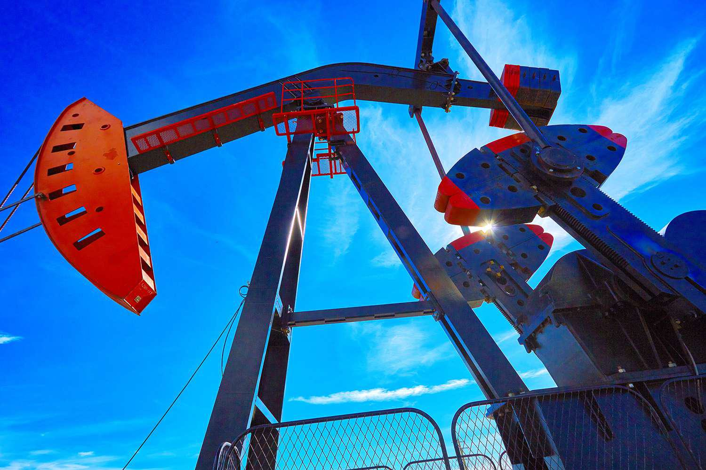

## Table of Contents

## What is hydraulic fracturing?

Hydraulic fracturing, often called fracking, is a way to get oil and gas out of the ground. It involves pumping a mix of water, sand, and chemicals into rocks deep underground. This mix creates cracks in the rocks, which lets the oil and gas trapped inside flow out more easily. People use big machines and long pipes to do this, and it can happen in many places around the world.

Fracking can help us get more energy, but it also has some problems. Some people worry that it can pollute water and air, and cause small earthquakes. Governments and companies try to make rules to keep it safe, but not everyone agrees on how safe it really is. It's a big topic that people talk about a lot when they discuss energy and the environment.

## How does the process of hydraulic fracturing work?

Hydraulic fracturing, or fracking, starts with drilling a deep hole into the ground. This hole can go down thousands of feet until it reaches the rock layers that hold oil or gas. Once the hole is drilled, workers send a long steel pipe down into the hole. This pipe goes all the way to the bottom and helps control where the fracking happens.

Next, a special mix of water, sand, and chemicals is pumped down the pipe at very high pressure. This high pressure makes the rock crack and create small spaces, or fractures. The sand in the mix helps keep these fractures open so the oil and gas can flow out. Once the fractures are made, the pressure is lowered, and the oil and gas start to come up the pipe to the surface. This process can be repeated in different parts of the well to get as much oil and gas as possible.

## What is the history of hydraulic fracturing?

The idea of hydraulic fracturing started a long time ago. In the 1860s, people in the United States used liquid to break rocks and get oil out of the ground. But it wasn't until the 1940s that a company called Halliburton made it into a bigger thing. They used a mix of water, sand, and chemicals to crack rocks and get more oil and gas. This was the start of modern fracking.

Over the years, fracking got better and more popular. In the 1970s and 1980s, new ways to drill sideways helped make fracking even better. This let people reach more oil and gas that was hard to get before. By the 2000s, fracking was used a lot in places like the United States and Canada. It helped these countries get a lot more energy, but it also made people worry about things like water pollution and earthquakes.

## What are the main applications of hydraulic fracturing?

The main use of hydraulic fracturing, or fracking, is to get oil and gas out of the ground. It helps reach oil and gas that are stuck in tight rock layers deep underground. By cracking these rocks, fracking lets the oil and gas flow out more easily. This has made it possible to get energy from places where it was hard to get before. Many countries, like the United States and Canada, use fracking a lot to meet their energy needs.

Fracking is also used to make wells work better. Sometimes, old wells that are not making much oil or gas anymore can start working again after fracking. This can help get more energy out of wells that were thought to be used up. Another use of fracking is in getting natural gas from coal beds. This is called coalbed methane extraction. It's another way fracking helps get more energy from the ground.

## What are the economic benefits of hydraulic fracturing?

Hydraulic fracturing, or fracking, brings a lot of money to the places where it happens. It creates jobs for people who work in drilling, building, and running the wells. These jobs help people earn money and support their families. Fracking also makes more oil and gas available, which can make energy cheaper for everyone. When energy is cheaper, it helps businesses grow and people spend less on their bills.

Fracking can also help a country be less dependent on other countries for energy. When a country can get more of its own oil and gas, it doesn't have to buy as much from other places. This can make the country's economy stronger and more stable. Plus, the money made from selling oil and gas can go back into the community, helping to build schools, roads, and other things that make life better for people.

## What environmental concerns are associated with hydraulic fracturing?

Hydraulic fracturing, or fracking, can harm the environment in different ways. One big worry is that it can pollute water. The chemicals used in fracking can leak into underground water sources, making them unsafe to drink. Also, the waste water from fracking, which can have harmful stuff in it, needs to be treated or stored carefully. If it's not handled right, it can spill and hurt rivers, lakes, and the land.

Another concern is that fracking can affect the air we breathe. The machines used in fracking release gases like methane, which can make the air dirty and add to climate change. Fracking can also cause small earthquakes. When the water and chemicals are pumped into the ground, it can make the earth move. These earthquakes might not be big, but they can still be a problem for people living nearby.

People are trying to find ways to make fracking safer for the environment. Governments and companies are working on rules to make sure water and air stay clean, and to reduce the chance of earthquakes. But not everyone agrees on how well these rules work, and some people think fracking is too risky for the environment.

## How does hydraulic fracturing impact local communities?

Hydraulic fracturing, or fracking, can change life in local communities a lot. It brings new jobs and money to the area. People can work in drilling, building, and running the wells. This means more money for families and more business for local shops and services. The money from fracking can also help pay for things like new schools, roads, and parks. But not everyone in the community is happy about fracking. Some people worry about the noise and traffic from the big machines and trucks. It can make life harder for people living close to the wells.

Fracking can also affect the health and safety of local people. Some worry that the chemicals used in fracking might get into the water they drink or the air they breathe. This can make people sick or cause other health problems. There's also the chance of small earthquakes from fracking, which can scare people and damage homes. These worries can make people in the community argue about whether fracking is a good thing or not. It's a big topic that can split a community into those who see the benefits and those who see the risks.

## What regulations govern hydraulic fracturing in different countries?

In the United States, fracking is mostly controlled by each state. Each state can make its own rules about how to do fracking safely. Some states have strict rules to protect water and air, while others have fewer rules. The federal government also has some rules, like making companies tell what chemicals they use in fracking. But most of the time, it's up to the states to decide how to keep fracking safe for people and the environment.

In Canada, fracking is also controlled by each province. Provinces like Alberta and British Columbia have their own rules to make sure fracking is done safely. These rules can be about how to handle waste water, what chemicals can be used, and how to check for problems like earthquakes. The Canadian government also has some rules to help protect the environment across the country, but the provinces have a big say in how fracking happens in their areas.

In Europe, different countries have different rules about fracking. Some countries, like France and Germany, have banned fracking because they worry about the environment. Other countries, like the United Kingdom, allow fracking but have strict rules to make sure it's safe. The European Union has some general rules to help protect the environment, but each country can decide if they want to allow fracking and how to control it.

## What are the latest technological advancements in hydraulic fracturing?

New technology is making fracking safer and more efficient. One big change is the use of better sensors and computers to watch what's happening underground. These tools help workers see where the oil and gas are and make sure the fracking is done right. They can also check for problems like leaks or earthquakes. Another new thing is using less water and chemicals in the fracking mix. This helps save water and makes it easier to handle the waste. Some companies are even trying to use other liquids, like propane, instead of water.

Another advancement is in how the wells are drilled. New drilling machines can go deeper and in different directions, which means more oil and gas can be reached. This is called horizontal drilling, and it's a big reason why fracking has become so popular. There are also new ways to recycle the water used in fracking. This helps use less fresh water and keeps the waste from hurting the environment. All these new technologies are helping make fracking better for both the economy and the environment.

## How does hydraulic fracturing affect water resources?

Hydraulic fracturing, or fracking, uses a lot of water. Each time they frack a well, they might use millions of gallons of water mixed with sand and chemicals. This can be a problem in places where water is already hard to find. If too much water is taken for fracking, it can make less water available for people, farms, and wildlife. Also, the water used in fracking can get polluted with chemicals and other harmful stuff. If this water leaks into underground water sources, it can make the water unsafe to drink.

Another worry is how to handle the waste water from fracking. This water has to be treated or stored carefully so it doesn't hurt the environment. If it's not handled right, it can spill and pollute rivers, lakes, and the ground. Governments and companies are trying to make rules to keep the water safe, but it's still a big challenge. People are working on new ways to use less water and recycle the waste water, but it's important to keep watching how fracking affects water resources.

## What are the health risks associated with hydraulic fracturing?

Hydraulic fracturing, or fracking, can make people worry about their health. The chemicals used in fracking can leak into the water people drink or the air they breathe. If this happens, it can cause health problems like headaches, dizziness, and skin rashes. Some studies also show that living near fracking sites might increase the chance of having breathing problems or even cancer, but scientists are still trying to learn more about this.

Another health risk from fracking is the noise and traffic from the big machines and trucks. This can make life stressful for people living close to the wells. Stress can lead to health issues like high blood pressure and heart problems. Also, the small earthquakes that can happen because of fracking might scare people and cause them to feel unsafe in their homes. Governments and companies are trying to make rules to keep people safe, but it's still important to keep studying how fracking affects health.

## What are the current debates and controversies surrounding hydraulic fracturing?

People argue a lot about hydraulic fracturing, or fracking. Some say it's good because it creates jobs and makes more energy available. This can help the economy grow and make energy cheaper for everyone. But others worry about the risks. They say fracking can pollute water and air, and cause small earthquakes. These problems can hurt people's health and the environment. It's hard to find a balance between getting the benefits of fracking and keeping people and the environment safe.

Another big debate is about the rules that control fracking. Some people think the rules are too strict and make it hard to get the energy we need. They want fewer rules so fracking can happen more easily. But others think the rules are not strict enough. They want stronger rules to make sure fracking is done safely and doesn't hurt water, air, or people's health. Governments and companies are trying to find the right rules, but it's a big challenge. People keep arguing about what's best for everyone.

## References & Further Reading

- Osborn, S. G., Vengosh, A., Warner, N. R., & Jackson, R. B. (2011). Methane contamination of drinking water accompanying gas-well drilling and hydraulic fracturing. *Proceedings of the National Academy of Sciences*, 108(20), 8172-8176. This study investigates the presence of methane in drinking water wells near shale gas extraction sites, highlighting significant environmental concerns associated with fracking processes.

- Intergovernmental Panel on Climate Change (IPCC). (2007). *Climate Change 2007: The Physical Science Basis*. Cambridge University Press. The IPCC report provides a comprehensive overview of the physical science behind climate change, offering insights applicable to understanding the broader environmental impacts of industrial practices like fracking and their influence on greenhouse gas emissions.

- Scanlon, B. R., Reedy, R. C., & Nicot, J. P. (2014). Will Water Scarcity in Semiarid Regions Limit Hydraulic Fracturing? *Environmental Research Letters*, 9(12), 124011. This paper addresses the water usage concerns linked to hydraulic fracturing, particularly in arid regions, assessing the sustainability of water resources against the demands of fracking operations.

- Ellsworth, W. L. (2013). Injection-Induced Earthquakes. *Science*, 341(6142), 1225942. Ellsworth examines the connection between fluid injection methods, such as those used in hydraulic fracturing, and the occurrence of earthquakes, presenting empirical data that underscores the geophysical risks inherent in fracking activities.

- Aldridge, I. (2013). *High-Frequency Trading: A Practical Guide to Algorithmic Strategies and Trading Systems*. John Wiley & Sons. This guide provides an in-depth exploration of algorithmic trading strategies, relevant for understanding how technological advancements in trading systems impact market dynamics, paralleling the transformative effects seen with fracking in energy markets.

