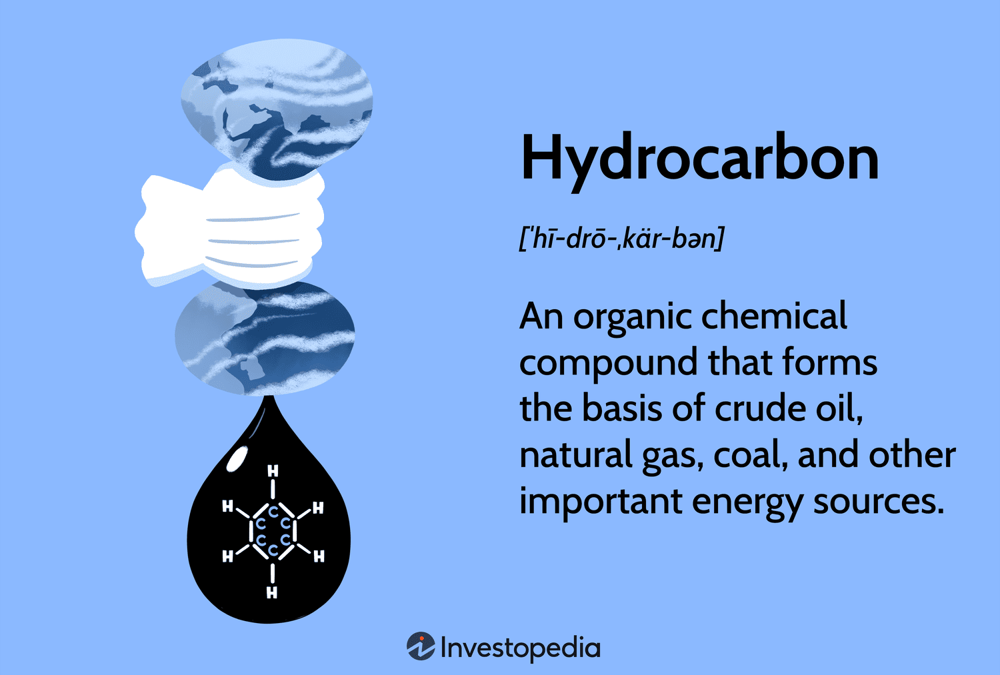

In the modern economic landscape, hydrocarbons and algorithmic trading have established themselves as essential components for energy production and financial optimization, respectively. Hydrocarbons, which primarily consist of carbon and hydrogen atoms, are critical chemical compounds that form the backbone of major fuel sources such as oil, natural gas, and coal. Their role extends beyond mere combustion for energy; hydrocarbons are also the building blocks for a multitude of chemical derivatives, including plastics and solvents, crucial to many industrial sectors.

Simultaneously, the rapid advancement of technology has heralded a new era of financial sophistication, with algorithmic trading becoming increasingly pervasive in various markets, including energy. Algorithmic trading utilizes complex algorithms to execute trades at speeds and efficiencies unattainable by human traders. This technological approach allows energy companies not only to maximize their profits but also to manage trading risks more effectively. By processing extensive datasets in real time and identifying profitable market trends, these algorithms optimize decision-making processes, thereby enhancing the companies' competitive edge.

The convergence of traditional fuel sources and contemporary trading techniques reflects the evolving nature of global energy dynamics. As the world continues to grapple with the environmental repercussions of hydrocarbon consumption, the integration of algorithmic trading offers a pathway for energy companies to innovate their operations. By balancing the economic advantages of hydrocarbons with the potential for algorithmic strategies to usher in efficiency and sustainability, the energy sector is presented with opportunities for adaptation in a rapidly changing world.

Understanding these intertwining elements provides valuable insights into how energy consumption and financial trading might evolve. As environmental concerns grow, and as the push towards carbon-neutral solutions intensifies, the interaction between these two domains will likely shape the trajectory of both industries. Consequently, these developments will play a critical role in informing the strategies employed by energy firms and financial institutions to remain viable and sustainable in the future.

## Table of Contents

## Chemical Uses of Hydrocarbons

Hydrocarbons, simple organic compounds made only of hydrogen and carbon atoms, serve as the foundation for the world's most vital energy resources, such as oil, gas, and coal. These compounds are primarily classified into alkanes, alkenes, and alkynes, distinguished by the nature of the bonds between carbon atoms; alkanes have single bonds, alkenes have at least one double bond, and alkynes have one or more triple bonds. The high energy density and combustible nature of hydrocarbons make them invaluable for energy production. When hydrocarbons combust in the presence of oxygen, they produce carbon dioxide, water, and a substantial amount of energy:

$$
\text{CxHy} + \text{O}_2 \rightarrow \text{CO}_2 + \text{H}_2\text{O} + \text{Energy}
$$

This reaction underpins their use as fuels in vehicles, power plants, and a variety of other applications, establishing hydrocarbons as a key element in the global energy supply chain.

Beyond their role as fuels, hydrocarbons are pivotal in creating derivatives integral to numerous industrial processes. Hydrocarbons serve as feedstock for the production of plastics, a major component of modern manufacturing and consumer goods. Polymers such as polyethylene and polypropylene are synthesized from simple hydrocarbons like ethylene and propylene through processes such as polymerization, which links small molecules into long chains to form complex structures.

Furthermore, hydrocarbons are essential in the production of solvents, lubricants, and petrochemical intermediates. Solvents derived from hydrocarbons, for example, are widely used in processes that require dissolving substances, including paints, cleaning [agents](/wiki/agents), and chemical syntheses. The diverse chemical behaviors of hydrocarbons allow for the synthesis of a broad array of chemical products, underscoring their importance in the energy and chemical industries.

In summary, hydrocarbons are not only paramount as fuel sources due to their combustion properties but also as foundational chemicals in industrial production. This underscores their versatile and indispensable role in both energy generation and the myriad processes that drive industrial innovation.

## Energy Companies and Hydrocarbons

Energy giants such as Saudi Aramco, Exxon Mobil, and Royal Dutch Shell play a critical role in the global hydrocarbon market. These companies are at the forefront of employing advanced technologies to extract hydrocarbons, like oil and natural gas, from beneath the Earth's surface. One such technology is hydraulic fracturing, or fracking, which involves injecting high-pressure fluid mixtures into subterranean rock formations to release hydrocarbons. In addition, sophisticated seismic surveys and 3D imaging allow for accurate identification of hydrocarbon-rich sites, maximizing extraction efficiency while minimizing surface disruption.

Hydrocarbon-derived fuels, such as gasoline, diesel, and jet fuel, are integral to powering vehicles, heating buildings, and fueling industrial operations. These energy sources facilitate modern mobility, contribute to electrical grid stability, and support various forms of manufacturing and industrial processes. For instance, gasoline alone accounts for a significant portion of global energy consumption, underpinning a vast array of transport networks from automobiles to aviation.

Despite their economic benefits, the extraction and use of hydrocarbons pose significant environmental concerns. The combustion of hydrocarbon fuels is a leading source of carbon dioxide (CO2) emissions, contributing to global warming and climate change. According to the U.S. Environmental Protection Agency, the combustion of fossil fuels such as oil and natural gas for electricity and heat is the largest single source of global CO2 emissions. Additionally, oil spills and the disruption of delicate ecosystems during extraction efforts can lead to long-term environmental damage, affecting biodiversity and water quality. 

Moreover, methane, a potent greenhouse gas, is often released during the extraction and transportation of natural gas. Methane has a global warming potential over 25 times greater than CO2 over a 100-year period, making its release a critical environmental concern. As such, there is significant research and development ongoing in capturing and reducing methane emissions in natural gas operations.

In response to these issues, there is an ongoing push towards diversifying energy portfolios with cleaner alternatives, while energy companies continue to explore innovative methods to mitigate environmental impacts. This includes investing in carbon capture and storage technologies and improving the efficiency of energy production and consumption processes. In summary, while hydrocarbons remain a cornerstone of global energy, their environmental footprint necessitates a balance between continued economic benefit and sustainable practices.

## Environmental Impact of Hydrocarbons

The extraction and consumption of hydrocarbons are significant contributors to environmental challenges, primarily through the exacerbation of global warming and climate change. When hydrocarbons, such as oil, natural gas, and coal, are burned, they release considerable amounts of carbon dioxide (CO₂) into the atmosphere. CO₂ is a major greenhouse gas responsible for trapping heat within the Earth's atmosphere, leading to temperature increases and altering climate patterns. 

In addition to air pollution, the processes involved in extracting hydrocarbons, such as drilling and mining, pose substantial ecological risks. Oil spills, which can occur during transportation and drilling operations, are particularly catastrophic to marine and coastal environments. These spills disrupt ecosystems, harm wildlife, and necessitate extensive clean-up efforts, which are often unable to fully restore the affected areas.

The problem is compounded by the cumulative environmental footprint of ongoing extraction activities, which can lead to habitat destruction and biodiversity loss. The resulting ecological imbalances can have far-reaching impacts, affecting water quality, soil fertility, and human health.

These environmental challenges have intensified the demand for cleaner and more sustainable energy alternatives. Increased awareness and regulatory pressures are driving innovation in renewable energy technologies, seeking to reduce dependency on hydrocarbons and mitigate their environmental impact. The pursuit of sustainable energy solutions is not only vital for protecting the environment but also crucial for ensuring energy security and economic stability in the long term.

## Algorithmic Trading in Energy Markets

Algorithmic trading, commonly referred to as algo trading, employs sophisticated algorithms to automate trading processes by executing orders at optimal times. In recent years, it has significantly transformed financial markets and continues to expand its influence, particularly within the energy sector. This technology leverages computational power to process large volumes of data, analyze market trends, and execute trades with precision, providing energy companies with an edge in optimizing financial returns and mitigating risks.

Energy companies, facing volatile market conditions and fluctuating energy prices, are increasingly utilizing [algorithmic trading](/wiki/algorithmic-trading) to enhance their financial strategies. By employing advanced algorithms, these companies can analyze historical and real-time data to identify patterns and predict price movements, thus maximizing profits and minimizing potential losses. For instance, these algorithms can be programmed to respond to market signals such as price dips or spikes, allowing for strategic buying or selling of energy commodities like oil, gas, and electricity.

The capability of the software to process vast datasets in real time is one of its most significant advantages. Through techniques such as [machine learning](/wiki/machine-learning) and complex pattern recognition, algorithmic trading systems efficiently manage extensive information inputs from global markets. This feature enables the identification of lucrative market opportunities, facilitating agile responses to market dynamics. This real-time data processing is essential for discerning short-lived trade opportunities that can be capitalized upon before market conditions change.

By automating trading strategies, energy companies can not only reduce human error but also operate on a 24/7 basis without the need for constant human oversight. This automation of trading strategies involves the use of predefined instructions, which can encompass parameters such as timing, price, and [volume](/wiki/volume-trading-strategy). As a result, firms can optimize their energy portfolios by precisely hedging against price fluctuations and matching supply with consumer demand patterns.

Moreover, algorithmic trading enables improved decision-making processes through [backtesting](/wiki/backtesting). By simulating trading strategies on historical data, companies can retrospectively evaluate their performance and adjust parameters to enhance future outcomes. This rigorous testing ensures that strategies are robust and likely to yield favorable results in live trading scenarios.

The significance of algorithmic trading stretches beyond mere profitability; it also serves as a tool for strategic management of resources and operational efficiency in the energy markets. As energy companies increasingly embrace this technology, they are better equipped to navigate the complexities of market environments, underscoring a shift toward greater reliance on data-driven decision-making frameworks.

## Future of Energy Industry with Algorithmic Trading

With the advent of renewable energy, algorithmic trading is set to significantly influence the future trajectory of energy companies. The inherent [volatility](/wiki/volatility-trading-strategies) in renewable energy sources, such as solar and wind, creates varying supply levels that require precise balancing with demand. Algorithmic trading, through its capability to rapidly process extensive datasets and execute trades with high precision, plays a vital role in achieving this balance. 

Algorithms are designed to analyze real-time data and identify market trends, allowing energy firms to make informed decisions about when to buy or sell energy assets. This proactive approach helps companies manage fluctuations in energy supply, which is crucial for maximizing the utility of renewable sources. For example, during peak production hours when solar energy might be abundant, algorithms can facilitate the sale of excess energy, while optimizing purchase strategies during low production periods.

The incorporation of [artificial intelligence](/wiki/ai-artificial-intelligence) (AI) into algorithmic trading further enhances its efficacy. AI algorithms, with their ability to learn and adapt over time, offer improved responsiveness in complex trading environments. This adaptability is particularly beneficial in managing the unpredictability of renewable energy outputs, helping firms adjust their strategies dynamically in response to market movements and environmental changes.

Moreover, this technological shift supports the pursuit of global carbon-neutral objectives. By optimizing energy trades and reducing wastage, algorithmic trading promotes sustainable energy management practices. Energy firms can leverage these innovations not only to improve their financial performance but also to contribute to global sustainability initiatives. The efficiency gains from integrating AI-enhanced algorithms can facilitate greater adoption of renewable energy, aligning economic growth with environmental conservation goals. 

As a result, algorithmic trading stands as a cornerstone for modernizing energy markets, ensuring that they are agile enough to meet future challenges while driving the transition toward a sustainable energy landscape.

## Conclusion

Hydrocarbons have long been the bedrock of global energy production, serving as the primary source for fuels like oil, gas, and coal. Their availability and energy-dense nature have made them indispensable to industrial growth and modern conveniences. However, their environmental costs, particularly in terms of carbon dioxide emissions and ecological disturbances, are undeniable. The urgent need to address these environmental impacts has never been more pressing.

Algorithmic trading is emerging as a transformative force in optimizing the operations of energy companies. By employing complex algorithms, these companies can execute trades with precision, mitigate risks, and enhance the efficiency of their energy portfolios. This technological advancement allows energy firms to adapt swiftly to market changes and capitalize on financial opportunities, creating a competitive edge in a rapidly evolving market.

As the energy sector continues to evolve with advancements in trading technology, the balance between economic benefits and environmental responsibilities becomes increasingly crucial. The integration of algorithmic trading in energy markets not only improves operational efficiency but also supports the transition to sustainable energy management. With algorithmic trading's adaptability and real-time data processing capabilities, energy companies can better navigate the inherent volatility of renewable energy sources, contributing significantly to the movement towards carbon neutrality.

Understanding and leveraging these emerging trends is essential for charting a sustainable and economically viable energy future. By balancing the continued use of hydrocarbons with innovative trading strategies and cleaner energy alternatives, the global energy sector can strive towards achieving both environmental sustainability and economic prosperity.

## References & Further Reading

[1]: Lopez de Prado, M. (2018). ["Advances in Financial Machine Learning."](https://www.amazon.com/Advances-Financial-Machine-Learning-Marcos/dp/1119482089) Wiley.

[2]: Jansen, S. (2020). ["Machine Learning for Algorithmic Trading."](https://github.com/stefan-jansen/machine-learning-for-trading) Packt Publishing.

[3]: Aronson, D. R. (2006). ["Evidence-Based Technical Analysis: Applying the Scientific Method and Statistical Inference to Trading Signals."](https://www.amazon.com/Evidence-Based-Technical-Analysis-Scientific-Statistical/dp/0470008741) Wiley.

[4]: Chan, E. P. (2008). ["Quantitative Trading: How to Build Your Own Algorithmic Trading Business."](https://github.com/ftvision/quant_trading_echan_book) Wiley.

[5]: Hyndman, R. J., & Athanasopoulos, G. (2018). ["Forecasting: Principles and Practice."](https://otexts.com/fpp2/) OTexts.

[6]: Herkenhoff, L., & Konieczka, J. (2014). ["Understanding Natural Gas and LNG Options."](https://www.energy.gov/sites/prod/files/2016/12/f34/Understanding%20Natural%20Gas%20and%20LNG%20Options.pdf) PennWell Books.

[7]: U.S. Environmental Protection Agency. ["Sources of Greenhouse Gas Emissions."](https://www.epa.gov/ghgemissions/sources-greenhouse-gas-emissions) 

[8]: International Energy Agency (2020). ["World Energy Outlook 2020."](https://www.iea.org/reports/world-energy-outlook-2020) International Energy Agency.