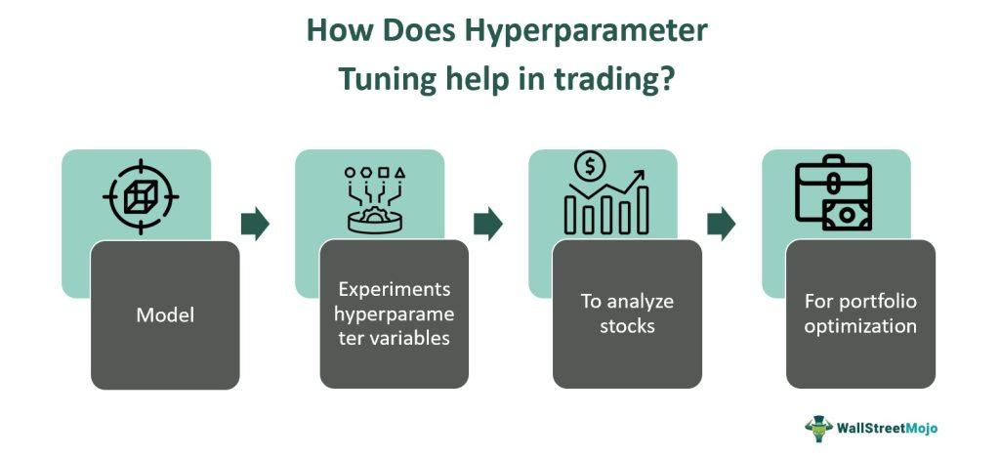

Hyper-parameter tuning refers to the process of finding the most appropriate hyper-parameters for a machine learning model to enhance its performance. In the context of algorithmic trading, this process is crucial because the optimal selection of hyper-parameters directly influences the accuracy and profitability of trading algorithms. Hyper-parameters are critical settings that govern the behavior of the learning process and the structure of the model but are not updated during the training. Examples include the learning rate, batch size, and the number of layers in a neural network. 

Optimal hyper-parameter selection is essential in algorithmic trading because it determines the capability of a model to adapt to market conditions, exploit opportunities, and reduce unwanted trades. An optimally tuned algorithm can better detect and react to trading signals, managing risks and maximizing returns. Failure to determine the best hyper-parameters can lead to models that either overfit, by being too sensitive to the noise in the training data, or underfit, by failing to capture underlying market patterns. Both scenarios lead to suboptimal trading performance, characterized by decreased profits and increased drawdowns.



The challenges involved in hyper-parameter tuning encompass the high dimensionality of the hyper-parameter space, computational expense, and the time required for each experiment. Approaches to tuning include exhaustive methods like grid search, where every possible hyper-parameter combination is evaluated, and more stochastic methods like random search, which randomly sample the search space. Advanced methodologies such as Bayesian optimization offer a more efficient alternative by modeling the hyper-parameter tuning process as an optimization problem, using probabilistic models to predict the performance of hyper-parameter settings. Each technique balances exploration and exploitation to find optimal configurations efficiently.

Improper tuning manifests as impaired performance in trading algorithms, potentially leading to significant financial losses, unreliable trading signals, and inconsistent execution. Tuning methodologies in machine learning strive to address these challenges by automating and optimizing the selection process, ultimately enhancing algorithmic outcomes. As the trading environment continues to evolve, effective hyper-parameter tuning remains a critical process for maintaining competitive edge and ensuring robust model performance.

## Table of Contents

## Understanding Hyper-Parameters in Algorithmic Trading

Hyper-parameters are pivotal components in [algorithmic trading](/wiki/algorithmic-trading) models, set prior to the actual training process, and play a crucial role in determining their performance and accuracy. They differ fundamentally from parameters, which are learned from the data during the training phase. Hyper-parameters are more akin to settings that guide the training process itself, influencing how parameters are extracted by controlling aspects of the model structure and optimization behavior.

In algorithmic trading, common hyper-parameters include the learning rate, batch size, and the number of layers in neural networks, among others. The learning rate, often denoted as $\alpha$, dictates the size of the steps taken during the optimization process. A small learning rate might lead to a more precise convergence at the expense of speed, while a large learning rate may speed up training but risk overshooting optimal solutions. Similarly, the batch size affects the speed and stability of the training process; smaller batch sizes may introduce noise, while larger ones can smooth out updates but require more computational resources.

Hyper-parameters significantly influence a model's ability to generalize from training data to unseen data in trading scenarios. Proper tuning can enhance the predictive accuracy of the model, thus aligning closely with market conditions and driving better trading decisions. Conversely, suboptimal settings can result in models that either fail to capture the underlying pattern in the data or overfit, leading to poor performance on live data.

The challenge in selecting the right hyper-parameters lies in their non-intuitive relation to model performance. Unlike parameters that can be directly derived from data, hyper-parameter tuning involves a trial-and-error process, complicated by the non-linear and interdependent nature of financial data. A comprehensive search across hyper-parameter spaces is often computationally expensive and time-consuming, with no guarantee of an optimal solution.

Tools and techniques for automating hyper-parameter selection have become increasingly sophisticated, leveraging advances in [machine learning](/wiki/machine-learning) to deal with the complexities involved in algorithmic trading. Despite their automation capabilities, these tools must be adeptly guided to ensure they are aligned with the specific goals and conditions of the trading model being optimized.

## Techniques for Hyper-Parameter Tuning

Hyper-parameter tuning is a crucial process in optimizing machine learning models, including those applied in algorithmic trading. It involves adjusting various hyper-parameters that are not directly learned from the data but significantly impact the model’s performance and accuracy. Several techniques are employed for hyper-parameter tuning, among which Grid Search, Random Search, and Bayesian Optimization are predominant.

### Grid Search

Grid Search is a systematic approach to hyper-parameter tuning that involves evaluating every possible combination of predefined hyper-parameter values. This exhaustive search method is beneficial for its simplicity and thoroughness, especially when the hyper-parameter space is limited. 

**Advantages:**
- **Exhaustive coverage:** Ensures that all possible combinations are considered, which increases the likelihood of finding the optimal configuration.
- **Simplicity:** Easy implementation and straight-forward to understand and deploy. 

**Limitations:**
- **Computational cost:** Can be highly time-consuming for large datasets and complex models due to the exponential growth of combinations.
- **Scalability issues:** Not feasible for high-dimensional hyper-parameter spaces where the number of combinations becomes prohibitively large.

In algorithmic trading, Grid Search can be applied to tune parameters such as the learning rate or the number of hidden layers in neural networks, ensuring the model captures the complexities of financial data efficiently.

### Random Search

Random Search, contrary to Grid Search, selects random combinations of hyper-parameters and evaluates them. This method offers more flexibility and can be more efficient due to fewer evaluations.

**Advantages:**
- **Efficiency:** By sampling at random, it often finds a reasonably good configuration faster than Grid Search, especially when only a small subset of the hyper-parameter space is critical.
- **Better performance in high-dimensional spaces:** More effective in exploring large or complex hyper-parameter spaces due to its random sampling nature.

**Limitations:**
- **Potentially misses optimal configurations:** Since it does not systematically examine each possibility, there's a risk of failing to explore the best parameter set.

For algorithmic trading applications, Random Search is particularly useful when the number of hyper-parameter combinations is high, such as tuning the [volatility](/wiki/volatility-trading-strategies) in mean reversion strategies or optimizing the decision threshold in classification models.

### Bayesian Optimization

Bayesian Optimization is an advanced approach to hyper-parameter tuning that models the performance of a set of hyper-parameters as a probabilistic function and strategically selects the next set of parameters to evaluate based on this model. 

**Advantages:**
- **Sample efficiency:** Requires fewer evaluations than Grid or Random searches because it uses past evaluation results to make informed decisions about subsequent trials.
- **Effective exploration-exploitation balance:** Leverages a probabilistic model to explore the parameter space while exploiting areas likely to yield better performance.

**Limitations:**
- **Implementation complexity:** More complex to implement and computationally intensive in terms of processing the probabilistic models.
- **Model assumptions:** Performance relies heavily on the assumptions of the surrogate model, which may not accurately reflect real-world scenarios if the assumptions are violated.

Bayesian Optimization is especially effective in trading algorithms where computational resources are limited, allowing traders to find optimal hyper-parameters more quickly. It can be used for complex strategies like portfolio optimization or estimating parameters in derivatives pricing models.

In summary, the choice of hyper-parameter tuning technique largely depends on the specific requirements of the trading model, computational resources, and the complexity of the hyper-parameter space. Each of the discussed methodologies—Grid Search, Random Search, and Bayesian Optimization—offers distinct advantages and limitations, making them suitable for different scenarios in algorithmic trading.

## Application of Hyper-Parameter Tuning in Trading Algorithms

Implementing hyper-parameter tuning in trading algorithms is a systematic approach crucial for optimizing the performance of predictive models within trading systems. Here is a step-by-step guide to effectively apply hyper-parameter tuning in algorithmic trading:

### Step-by-Step Implementation Guide

1. **Define the Objective Function:**
   Identify an objective function that accurately reflects the trading strategy's goals, such as maximizing the Sharpe ratio or minimizing drawdown. This function guides the tuning process.

2. **Select Appropriate Hyper-Parameters:**
   Choose relevant hyper-parameters to tune, such as the learning rate, batch size, or [momentum](/wiki/momentum) in machine learning models. These parameters significantly influence the convergence and accuracy of the model.

3. **Choose a Tuning Technique:**
   Select a tuning method based on the complexity and dimensionality of the problem. Common techniques are Grid Search, Random Search, and more sophisticated methods like Bayesian Optimization. Each has unique advantages and limitations depending on the specifics of the trading model and computational resources.

4. **Implement the Tuning Algorithm:**
   Utilize libraries like Scikit-learn or Optuna to set up the tuning process. These libraries offer comprehensive tools to automate the search for optimal hyper-parameter settings efficiently. For instance, Optuna provides a flexible, lightweight framework for Bayesian Optimization.

   ```python
   import optuna
   def objective(trial):
       learning_rate = trial.suggest_loguniform('learning_rate', 1e-5, 1e-1)
       batch_size = trial.suggest_categorical('batch_size', [16, 32, 64, 128])
       # Define and train model here using the hyper-parameters
       accuracy = train_and_evaluate_model(learning_rate, batch_size)
       return accuracy

   study = optuna.create_study(direction='maximize')
   study.optimize(objective, n_trials=100)
   ```

5. **Conduct Backtesting:**
   Once optimal hyper-parameters are affirmed, apply them in [backtesting](/wiki/backtesting) historical data. This ensures the refined model can perform well in past market conditions, providing an indication of robustness.

6. **Perform Forward Testing:**
   Forward testing, or paper trading, is a critical step to validate the tuning's effectiveness in real-time market conditions. This helps in mitigating overfitting to historical data by observing how well the model generalizes to new data.

### Case Studies and Practical Applications

In real-world scenarios, various case studies have showcased the substantial benefits of hyper-parameter tuning. In algorithmic trading firms, models tuned using advanced techniques like Bayesian Optimization have often outperformed those with static parameters, demonstrating improved profitability and reduced risk.

### Tools and Libraries for Tuning

Python libraries play a pivotal role in simplifying the hyper-parameter tuning process. Scikit-learn provides accessible interfaces for Grid and Random Search, whereas Optuna offers state-of-the-art support for Bayesian methods. These libraries allow traders and developers to focus on strategic implementations rather than computational intricacies.

### Backtesting and Forward Testing

Backtesting is indispensable for affirming the tuned parameters' viability, while forward testing further substantiates performance in live market conditions. Combining both ensures that trading algorithms remain adaptive and robust across varying market dynamics. 

The successful integration of hyper-parameter tuning not only enhances algorithmic trading strategies but also fortifies decision-making frameworks by aligning predictive models with strategic financial goals. This systematic approach ensures that models are not only statistically sound but strategically viable in ever-evolving financial markets.

## Common Pitfalls and Best Practices

Hyper-parameter tuning is crucial for optimizing the performance of trading algorithms. However, several common pitfalls can hamper this process. One frequent mistake is the lack of a structured approach, where practitioners arbitrarily adjust hyper-parameters without a systematic plan. This trial-and-error method often leads to suboptimal results, causing models to perform poorly when confronted with real-world data.

To ensure effective tuning and enhanced model performance, adopting best practices is essential. One such practice is the implementation of a structured search strategy. Techniques like grid search and random search provide systematic approaches to exploring the hyper-parameter space, ensuring a comprehensive evaluation of possible configurations. Meanwhile, employing automated tools such as Optuna can facilitate more sophisticated tuning approaches, like Bayesian optimization, which can effectively identify optimal hyper-parameter sets with reduced computational effort.

Overfitting is another significant concern during hyper-parameter tuning. This occurs when a model learns the training data too well, capturing noise instead of the underlying patterns, resulting in poor generalization to new data. To prevent overfitting, techniques such as cross-validation are invaluable. By dividing the dataset into multiple training and validation sets, cross-validation provides a more reliable performance estimate. Additionally, regularization methods, such as L1 (Lasso) and L2 (Ridge) penalties, can discourage overly complex models by adding a cost to large coefficient values.

Handling high dimensionality and large datasets presents additional challenges in hyper-parameter tuning. As the dimensionality increases, the search space for tuning exponentially expands, often referred to as the "curse of dimensionality." A practical tip to manage this is to employ dimensionality reduction techniques like Principal Component Analysis (PCA) before tuning. By reducing the number of input variables, PCA helps in curtailing the search space, making the tuning process more manageable.

Continuous improvement and monitoring are imperative for maintaining optimized models. This involves regularly revisiting the tuned hyper-parameters as market conditions or data characteristics change. Implementing an automated monitoring system can alert traders to shifts in algorithm performance, prompting timely retuning when necessary. Moreover, continuous integration and deployment (CI/CD) pipelines can be utilized to automate the retraining and redeployment of models with updated hyper-parameters, ensuring that trading strategies remain robust and competitive in dynamic markets.

In conclusion, by avoiding common mistakes, adhering to best practices, and employing systematic approaches to manage complexity, traders can significantly enhance the effectiveness of hyper-parameter tuning in algorithmic trading.

## Future Trends in Hyper-Parameter Tuning and Algorithmic Trading

Emerging trends in hyper-parameter tuning and algorithmic trading are being shaped by advancements in [artificial intelligence](/wiki/ai-artificial-intelligence) and machine learning. These advancements are enhancing the efficiency and effectiveness of parameter optimization, central to building robust trading strategies. The fusion of [deep learning](/wiki/deep-learning) algorithms with trading models is leading to a more nuanced understanding of market dynamics and enabling traders to design more adaptive strategies.

Automated hyper-parameter tuning presents a promising direction for revolutionizing algorithmic trading. Traditional methods like grid and random search have certain limitations in scaling and efficiency; however, techniques such as Bayesian Optimization and genetic algorithms are gaining traction. These methods enable more intelligent exploration of the hyper-parameter space by leveraging probabilistic models and evolutionary biology concepts, respectively, to find optimal configurations with fewer evaluations. For instance, Bayesian Optimization employs models to predict the performance of unseen hyper-parameter settings and updates these predictions iteratively to focus on promising areas.

As these technologies progress, future developments in parameter optimization are expected to make tuning an integral part of the algorithm development lifecycle. We anticipate greater emphasis on [reinforcement learning](/wiki/reinforcement-learning), where [agents](/wiki/agents) learn optimal trading actions through interaction with the environment, iteratively refining their strategies. This approach inherently involves continuous hyper-parameter tuning to adapt to evolving market conditions, mirroring the requirements of real-world trading.

To adapt to these advancements, traders and developers are integrating AI-driven analytics and machine learning frameworks more deeply into their systems. Python libraries such as Scikit-learn, TensorFlow, and Optuna are increasingly utilized for their comprehensive tools for machine learning and optimization tasks, offering simpler interfaces for automated hyper-parameter tuning. Furthermore, the use of cloud-based platforms is becoming widespread. These platforms provide the computational power necessary for scaling complex models and experimentation, facilitating the processing of large datasets requisite in financial markets.

Strategically, engaging with these technological advancements can lead to improved trading outcomes by allowing for more adaptive strategies that can react in real-time to market changes. Continued monitoring and refinement, leveraging machine learning insights, will be crucial as the market environment and technology coexist and evolve. The fusion of these elements represents a dynamic shift in how trading strategies are conceived and optimized, necessitating ongoing research and adaptation in algorithmic approaches.

## Conclusion

In this exploration, we have underscored the pivotal role of hyper-parameter tuning in optimizing the performance of trading algorithms. Effective tuning significantly influences the efficiency, accuracy, and overall success of algorithmic trading models. Hyper-parameters, such as learning rates and batch sizes, directly impact a model’s ability to learn and adapt to market conditions, and selecting optimal values is crucial for maximizing trading outcomes.

The integration of well-tuned hyper-parameters into trading models can lead to substantial improvements in predictive performance and financial returns. The methodologies and techniques reviewed, including Grid Search, Random Search, and Bayesian Optimization, offer diverse strategies for finding optimal hyper-parameter settings. These methods help mitigate the challenges posed by high-dimensional parameter spaces and ensure robust model performance across various market scenarios.

Traders and developers are encouraged to prioritize hyper-parameter tuning during algorithm development and implementation. This focus not only enhances the performance of current trading systems but also builds resilience against the uncertainties of market behavior. Furthermore, as technology advances, automated tuning processes are expected to revolutionize algorithmic trading, offering new levels of efficiency and precision.

Finally, ongoing research and exploration in hyper-parameter tuning are essential. There is vast potential for innovation in tuning techniques, driven by advancements in artificial intelligence and machine learning. Traders, developers, and researchers are invited to contribute to this dynamic field, ensuring that algorithmic trading remains at the forefront of technological progress and continues to deliver optimal trading strategies.

## References & Further Reading

[1]: Bergstra, J., Bardenet, R., Bengio, Y., & Kégl, B. (2011). ["Algorithms for Hyper-Parameter Optimization."](https://papers.nips.cc/paper/4443-algorithms-for-hyper-parameter-optimization) Advances in Neural Information Processing Systems 24.

[2]: ["Advances in Financial Machine Learning"](https://www.amazon.com/Advances-Financial-Machine-Learning-Marcos/dp/1119482089) by Marcos Lopez de Prado

[3]: ["Evidence-Based Technical Analysis: Applying the Scientific Method and Statistical Inference to Trading Signals"](https://www.amazon.com/Evidence-Based-Technical-Analysis-Scientific-Statistical/dp/0470008741) by David Aronson

[4]: ["Machine Learning for Algorithmic Trading"](https://github.com/stefan-jansen/machine-learning-for-trading) by Stefan Jansen

[5]: ["Quantitative Trading: How to Build Your Own Algorithmic Trading Business"](https://books.google.com/books/about/Quantitative_Trading.html?id=j70yEAAAQBAJ) by Ernest P. Chan