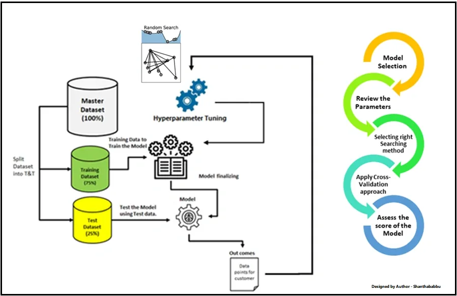

## Table of Contents

## What are hyper-parameters in machine learning?

Hyper-parameters in machine learning are settings that you choose before you start training your model. They are different from the model's parameters, which the model learns on its own during training. Think of hyper-parameters as the knobs and dials you set on your machine learning model to make it work better. For example, in a neural network, the learning rate is a hyper-parameter that controls how much the model changes with each step of training.

Choosing the right hyper-parameters is important because they can greatly affect how well your model performs. If you set them wrong, your model might not learn well or might take too long to train. To find the best hyper-parameters, people often try different settings and see which ones work best. This process is called hyper-parameter tuning. It's a bit like trying different recipes until you find the one that makes the best cake.

## Why is hyper-parameter tuning important?

Hyper-parameter tuning is important because it helps make your machine learning model work better. When you set the right hyper-parameters, your model can learn faster and make more accurate predictions. It's like tuning a guitar; if the strings are set just right, the guitar sounds great. If they're not, it might sound off. In the same way, if your hyper-parameters are not tuned well, your model might not perform as well as it could.

Finding the best hyper-parameters can be tricky, but it's worth the effort. By trying different settings, you can see which ones help your model learn the best. This process can take time, but it's like trying different keys to find the one that unlocks the door to better performance. Without tuning, you might miss out on making your model as good as it can be, and that could mean less accurate predictions or longer training times.

## What are the common methods for hyper-parameter tuning?

One common method for hyper-parameter tuning is called grid search. In grid search, you make a list of different values for each hyper-parameter you want to tune. Then, you try every possible combination of these values. It's like trying every possible recipe to find the best one. Grid search is simple to understand and use, but it can take a long time if you have a lot of hyper-parameters or if you're trying a lot of different values.

Another method is called random search. Instead of trying every possible combination like grid search, random search picks random combinations of hyper-parameters. It's like throwing darts at a board and seeing which one hits the bullseye. Random search can be faster than grid search and sometimes finds good hyper-parameters just as well, especially if you're trying a lot of different values.

A third method is called Bayesian optimization. This method is a bit smarter because it uses what it learns from past tries to pick the next set of hyper-parameters to test. It's like a detective trying to solve a puzzle by using clues from previous attempts. Bayesian optimization can find good hyper-parameters faster than grid search or random search, but it can be more complicated to set up and use.

## How does grid search work for hyper-parameter tuning?

Grid search is a way to find the best settings for your [machine learning](/wiki/machine-learning) model. Imagine you have a few knobs to turn on your model, like the learning rate or the number of layers in a [neural network](/wiki/neural-network). With grid search, you make a list of different values for each knob. Then, you try every possible combination of these values. It's like trying every possible recipe to find the best one. You train your model with each combination and see which one works the best.

Grid search is easy to understand and use, but it can take a long time if you have a lot of knobs or if you're trying a lot of different values. For example, if you have three knobs and you try five different values for each, you'll need to try 5 times 5 times 5, which is 125 different combinations. That can be a lot of work! But if you have the time and the computer power, grid search can help you find the best settings for your model.

## What is random search and how does it differ from grid search?

Random search is another way to find the best settings for your machine learning model. Instead of trying every possible combination like grid search, random search picks random combinations of settings. It's like throwing darts at a board and seeing which one hits the bullseye. You tell the computer how many random combinations to try, and it picks them at random. Then, it trains your model with each combination and sees which one works the best.

The big difference between random search and grid search is how they choose the settings to try. Grid search tries every possible combination, which can take a long time if you have a lot of settings or if you're trying a lot of different values. Random search, on the other hand, can be faster because it doesn't try every combination. Sometimes, random search can find good settings just as well as grid search, especially if you're trying a lot of different values. So, if you're short on time, random search might be a better choice.

## What are the advantages and disadvantages of using grid search and random search?

Grid search is easy to understand and use. It tries every possible combination of settings, so you're sure to find the best one if you have enough time. But that's also its biggest problem: it can take a long time if you have a lot of settings or if you're trying a lot of different values. If you don't have a lot of time or computer power, grid search might not be the best choice.

Random search is faster because it picks random combinations of settings instead of trying every possible one. It's like throwing darts at a board and seeing which one hits the bullseye. Sometimes, random search can find good settings just as well as grid search, especially if you're trying a lot of different values. The downside is that it might miss the very best setting because it's not trying every combination. But if you're short on time, random search can be a good way to find good settings quickly.

## How can Bayesian optimization be used for hyper-parameter tuning?

Bayesian optimization is a smart way to find the best settings for your machine learning model. It's like a detective trying to solve a puzzle by using clues from previous attempts. Instead of trying every possible combination or [picking](/wiki/asset-class-picking) them at random, Bayesian optimization uses what it learns from past tries to pick the next set of settings to test. It builds a model of how the settings affect the performance of your machine learning model and uses that model to guess which settings might work best next. This makes it more likely to find good settings faster than grid search or random search.

The big advantage of Bayesian optimization is that it can find good settings quicker than other methods. It's especially helpful when trying out different settings takes a long time, like when you're training a big neural network. But it can be more complicated to set up and use than grid search or random search. You need to understand how it works and how to use it properly. Still, if you're willing to put in the effort, Bayesian optimization can be a powerful tool for making your machine learning model work better.

## What is the role of cross-validation in hyper-parameter tuning?

Cross-validation is a way to check how well your machine learning model works with different settings. When you're trying to find the best settings, you want to make sure your model will work well not just on the data you're using now, but also on new data. Cross-validation helps you do this by splitting your data into different parts, training your model on some parts, and testing it on the others. This way, you can see how well your model works with different settings on different parts of your data.

Using cross-validation during hyper-parameter tuning means you can be more confident that the settings you choose will work well. You try different settings and use cross-validation to see how each one does. The settings that do the best across all the different parts of your data are likely to be the best ones to use. This helps you avoid picking settings that might work well on just one part of your data but not on others.

## How do you implement hyper-parameter tuning in popular machine learning libraries like scikit-learn?

In scikit-learn, you can use grid search, random search, and even Bayesian optimization to find the best settings for your machine learning model. For grid search, you use the `GridSearchCV` class. You make a list of different values for each setting you want to try, and then you tell `GridSearchCV` to try every possible combination of these values. It will use cross-validation to check how well each combination works and pick the best one. Random search is similar, but you use the `RandomizedSearchCV` class instead. You tell it how many random combinations to try, and it will pick them at random and use cross-validation to find the best one.

For Bayesian optimization, you can use a library like `scikit-optimize` which works well with scikit-learn. You use the `BayesSearchCV` class from `scikit-optimize` to set up your search. You give it a list of values for each setting, and it will use what it learns from past tries to pick the next set of settings to test. This can help you find good settings faster than grid search or random search. No matter which method you choose, scikit-learn makes it easy to try different settings and find the best ones for your model.

## What advanced techniques exist for hyper-parameter tuning, such as genetic algorithms or gradient-based optimization?

Genetic algorithms are a fancy way to find the best settings for your machine learning model. They work by creating a bunch of different settings, kind of like a population of creatures. Each creature has its own set of settings, and the algorithm checks how well each one does. Then, it picks the best ones and makes new creatures by mixing their settings together, like parents having kids. Sometimes, it even adds small changes to the settings, like mutations in nature. Over time, the population gets better and better, and you end up with a set of settings that work really well. Genetic algorithms can be good for finding settings when you have a lot of different ones to try, but they can take a while to run.

Another advanced technique is gradient-based optimization. This method is like trying to find the lowest point in a valley. You start with some settings and then use math to figure out which way to go to make your model work better. You take small steps in that direction, and then you use math again to figure out the next step. You keep doing this until you can't get any better. Gradient-based optimization can be really fast and find good settings quickly, but it can also get stuck if the valley has a lot of bumps and turns. It's often used in [deep learning](/wiki/deep-learning) to tune things like the learning rate, but it might not work as well for other kinds of settings.

## How can you measure the effectiveness of hyper-parameter tuning?

You can measure the effectiveness of hyper-parameter tuning by looking at how much better your machine learning model performs after you've tried different settings. One way to do this is by comparing the model's accuracy, precision, recall, or other performance metrics before and after tuning. If the model does better after tuning, then you know the new settings are working. You can also use cross-validation to make sure the improvement is real and not just because of the specific data you're using. If the model performs better across different parts of your data, then the tuning has been effective.

Another way to measure effectiveness is by looking at how much time and resources you saved. Sometimes, tuning can make your model train faster or use less computer power. If you can get the same or better performance with less time and resources, then the tuning was worth it. It's like finding a shortcut that gets you to the same place faster. By comparing the time and resources used before and after tuning, you can see if the effort paid off.

## What are some best practices and common pitfalls to avoid when tuning hyper-parameters?

When tuning hyper-parameters, it's good to start with a small search space and then expand it if needed. This saves time and helps you find good settings faster. Using cross-validation is also important because it makes sure your settings work well on different parts of your data. Another good practice is to use a validation set to check your model's performance, so you don't accidentally overfit to your test data. Lastly, keep track of the settings you've tried and how well they worked, so you can learn from your past attempts and make better choices next time.

A common pitfall to avoid is spending too much time on tuning without seeing much improvement. Sometimes, the settings you start with are already pretty good, and spending a lot of time trying to make them perfect might not be worth it. Another mistake is overfitting to your validation set, which can happen if you keep tweaking your settings based on the validation results. This can make your model work great on the validation data but not so well on new data. Finally, be careful not to ignore domain knowledge; sometimes, understanding your problem can help you choose better settings than just relying on automatic tuning methods.

## References & Further Reading

[1]: Bergstra, J., Bardenet, R., Bengio, Y., & Kégl, B. (2011). ["Algorithms for Hyper-Parameter Optimization."](https://papers.nips.cc/paper/4443-algorithms-for-hyper-parameter-optimization) Advances in Neural Information Processing Systems 24.

[2]: ["Advances in Financial Machine Learning"](https://www.amazon.com/Advances-Financial-Machine-Learning-Marcos/dp/1119482089) by Marcos Lopez de Prado

[3]: ["Evidence-Based Technical Analysis: Applying the Scientific Method and Statistical Inference to Trading Signals"](https://www.amazon.com/Evidence-Based-Technical-Analysis-Scientific-Statistical/dp/0470008741) by David Aronson

[4]: ["Machine Learning for Algorithmic Trading"](https://github.com/stefan-jansen/machine-learning-for-trading) by Stefan Jansen

[5]: ["Quantitative Trading: How to Build Your Own Algorithmic Trading Business"](https://books.google.com/books/about/Quantitative_Trading.html?id=j70yEAAAQBAJ) by Ernest P. Chan