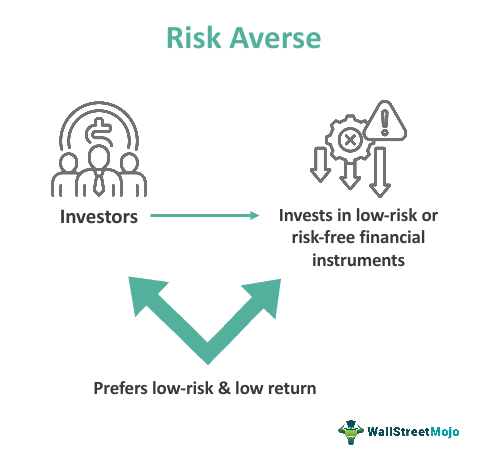

In today's fast-paced financial landscape, algorithmic trading has emerged as a dominant force in market operations, leveraging computing power and sophisticated models to execute trades at speeds and volumes unattainable by human traders. At the heart of optimizing these trading strategies lies the application of complex economic theories designed to anticipate and respond to market dynamics. One such theory is Hyperbolic Absolute Risk Aversion (HARA), a utility function framework that provides insights into how investors' risk preferences evolve with changes in wealth levels.

HARA captures the intuitive notion that risk aversion tends to decrease as an individual becomes wealthier. This property is particularly relevant to algorithmic trading, where understanding variations in risk tolerance can lead to better predictions and decision-making processes. The HARA utility function is typically expressed mathematically as:



$$
U(W) = \frac{(A + BW)^{1-\gamma}}{1-\gamma}
$$

where $U(W)$ represents the utility as a function of wealth $W$, $A$, $B$, and $\gamma$ are parameters determining the specific shape of the utility curve. This formula allows for flexible modeling across a spectrum of investor behaviors by adjusting the parameters.

In an era where automation and machine learning are becoming increasingly prevalent, integrating economic theories like HARA with technology offers unique opportunities. It enables the design of algorithms that are not only reactive to market conditions but also proactive in managing risk based on a deep understanding of investor psychology. Such models can improve both the efficiency and effectiveness of trading strategies by aligning them more closely with the actual behavior of traders under varying market conditions.

Additionally, the mathematical modeling of risk preferences using HARA provides a structured method for embedding these insights directly into algorithmic systems. This integration can enhance the sophistication of risk assessment tools and contribute to the development of more robust trading algorithms capable of navigating complex market environments. As markets continue to evolve, the fusion of hyperbolic utility theories and algorithmic trading will play a crucial role in enhancing portfolio management and achieving better alignment with investor goals.

## Table of Contents

## Understanding Hyperbolic Absolute Risk Aversion

Hyperbolic Absolute Risk Aversion (HARA) is a prominent utility function model designed to elucidate the dynamics between individuals' risk tolerance and their wealth levels. It operates on the premise that an individual's risk aversion decreases as their wealth increases, thus illustrating a linear relationship between these two variables. The concept originated from the von Neumann-Morgenstern utility theory, a foundational framework for understanding consumer preferences under uncertainty.

The HARA utility function is mathematically expressed to represent various risk preferences across different wealth levels. It is typically defined as:

$$
U(W) = \frac{1 - \gamma}{a} \left( b + \frac{W}{1-\gamma} \right)^{a}
$$

In this function, $W$ represents wealth, and $a$, $b$, and $\gamma$ are parameters that define specific risk preferences. The parameter $\gamma$ specifically regulates the degree of risk aversion. If $\gamma = 1$, the HARA utility becomes logarithmic, indicating constant absolute risk aversion. Conversely, values of $\gamma \neq 1$ indicate changing levels of risk aversion as wealth changes.

HARA is closely tied to the von Neumann-Morgenstern framework by assuming that individuals possess similar utility functions. This assumption is potent in explaining the consistent investment behaviors seen in diverse investor portfolios, particularly when managing risky and risk-free assets. Investors, guided by HARA, opt for portfolios that align with their changing risk appetites, which often increase as their financial resources grow.

The significance of HARA in financial modeling is substantial. It offers a realistic and flexible approximation of investor behavior by accommodating a spectrum of risk aversion scenarios. This adaptability is crucial for creating models that predict economic behavior and inform investment choices. The utility function's versatility extends its application to various financial contexts, allowing for the design of sophisticated tools in risk management and portfolio optimization.

In economic theory, the HARA model is vital for understanding how wealth influences decision-making processes and preference structures under risk. The model's capacity to simulate realistic behavior patterns is invaluable for financial analysts and economists who aim to predict market trends and make informed economic forecasts. By reflecting investors' risk-taking behaviors across different wealth segments, HARA provides insights that are pivotal for both theoretical explorations and practical implementations in investment strategy development.

## Role of Risk Aversion in Economic Theory

Risk aversion is a fundamental concept in economic theory, playing a crucial role in determining how investors allocate their resources between risky and risk-free assets. Generally, risk aversion can be classified into three types: decreasing, constant, and increasing. Each type impacts investment decisions and economic forecasts differently.

Decreasing absolute risk aversion (DARA) is a condition where an individual's risk aversion decreases as their wealth increases. This behavior is often considered realistic in financial contexts, as wealthier individuals tend to be more willing to undertake risky investments. The Hyperbolic Absolute Risk Aversion (HARA) utility function effectively models DARA by providing a flexible approach to incorporating variable risk preferences based on wealth changes. The HARA utility function can be expressed mathematically as:

$$
U(W) = \frac{1 - e^{-\lambda(W - W_0)}}{\lambda}
$$

where $U(W)$ is the utility of wealth $W$, $\lambda$ is a parameter that dictates risk aversion, and $W_0$ is a baseline wealth level.

Constant absolute risk aversion (CARA), on the other hand, is characterized by an individual's risk aversion remaining unchanged irrespective of wealth variations. This is seldom seen in real-world scenarios as it implies that risk tolerance is independent of wealth levels, leading to less realistic modeling outcomes.

Increasing absolute risk aversion (IARA) signifies that risk aversion increases with additional wealth, an uncommon behavior in economic models since it suggests that wealthier investors become more risk-averse, countering typical investment strategies seen in practice.

Integrating HARA with other economic models can enhance their predictive accuracy. For example, combining HARA with the Capital Asset Pricing Model (CAPM) can lead to more refined assessments of market behavior. CAPM traditionally assesses the relationship between risk and expected return in a market portfolio, but incorporating HARA allows for a more realistic portrayal of investor behavior by accounting for varying risk preferences:

$$
E(R_i) = R_f + \beta_i (E(R_m) - R_f)
$$

where $E(R_i)$ is the expected return on the investment, $R_f$ is the risk-free rate, $\beta_i$ is the beta of the investment, and $E(R_m)$ is the expected market return. By integrating HARA, the model more accurately reflects the nuanced decision-making processes of investors with fluctuating risk aversion.

In summary, understanding and applying various forms of risk aversion is vital in economic theories and investment strategies. The adaptable nature of HARA in modeling risk preferences makes it valuable for developing realistic financial models, particularly when used alongside other theories like CAPM to enhance market predictions and investment decisions.

## Algorithmic Trading and Economic Theories

Algorithmic trading, characterized by its use of sophisticated mathematical models and computational techniques, aims to automate the execution of trading strategies with high efficiency and precision. By integrating economic theories such as Hyperbolic Absolute Risk Aversion (HARA), these models can be refined to account for varying levels of risk tolerance among traders, ultimately enhancing their effectiveness in dynamic market environments.

HARA's utility function, which expresses an investor's risk aversion as a function of their wealth, is particularly useful in [algorithmic trading](/wiki/algorithmic-trading). The mathematical foundation of HARA allows trading algorithms to simulate realistic investor behavior, where risk aversion diminishes as wealth increases. This property can be instrumental in forecasting market trends, as historical data can be analyzed to predict how investors with different wealth levels might react to market changes.

In practical scenarios, algorithms that leverage HARA have demonstrated significant improvements in returns and risk management. For example, suppose a trading algorithm incorporates HARA to adjust its portfolio allocations in response to changing market conditions. In that case, it can systematically rebalance assets between risky equities and safer bonds based on the relative changes in investors’ wealth levels. This dynamic adjustment helps the algorithm cater to diverse risk appetites and optimize performance.

The potential for blending economic theories like HARA into algorithmic trading is not only limited to better risk management. It can also foster innovation in developing new trading strategies. By systematically incorporating HARA into trading algorithms, firms can gain insights into market dynamics that might otherwise remain obscured. Such models can simulate scenarios where shifts in market conditions prompt different collective behaviors from investors, providing a strategic advantage in making informed trading decisions.

To illustrate, consider an algorithm that uses Python to compute utility values based on HARA. By adjusting asset allocations within a portfolio according to these utility values, the algorithm can maximize utility while minimizing risk:

```python
def hara_utility(wealth, a, b, c):
    """
    Compute the HARA utility value for a given level of wealth.

    Parameters:
    wealth (float): current wealth level
    a, b, c (float): HARA parameters where b > 0, c ≥ 0, a is constant

    Returns:
    float: utility value
    """
    return ((wealth + c) ** (1 - a) - 1) / (1 - a) if a != 1 else b * math.log(wealth + c)

# Example usage:
params = {'a': 0.5, 'b': 0.9, 'c': 100}
utility_value = hara_utility(5000, **params)
```

In conclusion, the integration of HARA and other economic theories in algorithmic trading holds promising prospects. By aligning trading algorithms with economic behaviors such as risk aversion, traders can anticipate market movements more accurately. This fusion of economic theory and modern technology continues to push the boundaries of financial innovation, offering new opportunities for optimizing trading strategies and enhancing market efficiencies.

## Practical Applications and Challenges

Hyperbolic Absolute Risk Aversion (HARA) utility functions are utilized in algorithmic trading for their ability to model investor risk preferences that vary with wealth levels. This adaptability provides algorithms with a nuanced understanding of how risk tolerance shifts, potentially leading to more sophisticated and responsive trading strategies.

### Real-World Applications of HARA in Algorithmic Trading

In practice, HARA utility functions are integrated into trading algorithms to enhance decision-making by dynamically adjusting risk exposure based on the current wealth state of the portfolio. A key example involves portfolio optimization where HARA aids in determining the optimal asset allocation under varying market conditions.

Consider a scenario in algorithmic trading where a trading strategy must decide between a risky asset $R$ and a risk-free asset $F$. The utility function $U(w)$ representing a HARA preference can be expressed as:

$$
U(w) = \frac{1-\gamma}{\gamma} + \frac{w^{1-\gamma}}{1-\gamma}
$$

where $w$ represents wealth and $\gamma$ denotes the risk aversion parameter. By varying $\gamma$, the model adjusts the degree of risk aversion, tailoring asset allocation to investor preferences effectively.

Algorithmic systems use these utility functions to simulate varying market conditions and investor states, which informs sophisticated trade execution strategies. Quantitative analysts, or quants, implement these models in environments such as Python, where libraries like SciPy and NumPy allow for efficient computation and simulation.

### Example Python Implementation of HARA Utility

```python
import numpy as np

def hara_utility(wealth, gamma):
    if gamma == 1:
        return np.log(wealth)
    return ((1 - gamma) * wealth**(1-gamma) + (1 - gamma)) / gamma

# Sample computation
wealth_levels = np.array([100, 200, 300, 400, 500])
gamma = 0.5
utilities = hara_utility(wealth_levels, gamma)
print(utilities)
```

### Challenges in Aligning Models with Market Behavior

Despite the theoretical utility of HARA, several challenges hinder its application in live markets. One primary issue is the assumption that risk preferences remain constant, aside from wealth changes. However, empirical evidence suggests investors’ risk tolerance may also be influenced by psychological factors and external economic environments.

Moreover, market [volatility](/wiki/volatility-trading-strategies) and sudden economic shifts pose a significant risk to strategies purely based on theoretical models. For example, during unexpected market downturns, the predictive power of a HARA model might be insufficient when not paired with real-time data analytics and sentiment analysis.

### Overcoming Challenges with Technological Advancements

As trading platforms evolve, integrating [machine learning](/wiki/machine-learning) and [artificial intelligence](/wiki/ai-artificial-intelligence) can enhance models based on HARA by incorporating real-time data and adjusting to behavioral insights. Neural networks and [deep learning](/wiki/deep-learning) models, for example, can be trained to recognize patterns that precede market shifts, thus providing an additional layer of predictive capability to HARA-based strategies.

Furthermore, advancements in data science enable better handling of large datasets and more accurate modeling of investor behavior. Real-time analytics and big data technologies allow for continuous calibration of algorithms, ensuring they remain responsive to market dynamics and investor sentiment, thereby mitigating some of the unpredictability inherent in financial markets.

In conclusion, while HARA offers a simplified model for capturing investor behavior, complexities in market behavior and human psychology necessitate continuous adaptation and enhancement of algorithms through technological innovation. With ongoing research and advancements in data processing techniques, these challenges can be addressed, resulting in more robust and adaptive trading models.

## Conclusion

The integration of hyperbolic utility functions, such as the Hyperbolic Absolute Risk Aversion (HARA), into economic theory and algorithmic trading offers a robust framework for understanding and optimizing market dynamics. HARA's adaptable nature provides a simplified yet effective model for capturing the nuances of investor behavior, where risk tolerance evolves with wealth. This adaptability facilitates the development of trading algorithms that can better predict and respond to market fluctuations, enhancing both strategy formulation and execution.

Despite its utility, HARA is not without limitations. The model, while simplified, may overlook the complex interplay of factors influencing market behavior, such as behavioral biases and external economic shocks. Nevertheless, ongoing research and advancements in computational technologies continue to refine HARA's application, expanding its potential to address these complexities. For instance, the integration of machine learning and artificial intelligence with HARA-based models promises to enhance predictive accuracy and risk management in algorithmic trading.

As the financial landscape evolves, the interaction between economic theories like HARA and algorithmic trading is expected to play a pivotal role in advancing market efficiencies and improving portfolio management strategies. The ability to model and anticipate investor behavior with precision will be essential in navigating the ever-changing market environment.

Practitioners and scholars are encouraged to balance theoretical insights with practical considerations, ensuring that algorithmic models are robust against the unpredictable nature of financial markets. By leveraging the foundational aspects of HARA and other economic theories, traders can develop sophisticated algorithms capable of achieving consistent returns. This synthesis of theory and practice represents a significant step toward the future of finance, where informed decision-making drives market success.

## References & Further Reading

[1]: ["Advances in Financial Machine Learning"](https://www.amazon.com/Advances-Financial-Machine-Learning-Marcos/dp/1119482089) by Marcos Lopez de Prado

[2]: Prasdad, N. (2008). ["Generalized Hyperbolic Distribution and Algorithmic Trading."](https://link.springer.com/article/10.1007/s10614-023-10457-5) Springer.

[3]: Ingersoll, Jonathan E. (1987). ["Theory of Financial Decision Making."](https://archive.org/details/theoryoffinancia1987inge) Rowman & Littlefield.

[4]: Cochrane, J. H. (2005). ["Asset Pricing."](http://www.zhufumin.com/wp-content/uploads/2013/11/Asset-Pricing-Cochrane-2005.pdf) Princeton University Press.

[5]: Chan, Ernest P. (2008). ["Quantitative Trading: How to Build Your Own Algorithmic Trading Business."](https://github.com/ftvision/quant_trading_echan_book) Wiley Trading.

[6]: Lintner, J. (1965). ["The Valuation of Risk Assets and the Selection of Risky Investments in Stock Portfolios and Capital Budgets."](https://www.jstor.org/stable/1924119) The Review of Economics and Statistics, 47, 13-37.

[7]: Sharpe, William F. (1964). ["Capital Asset Prices: A Theory of Market Equilibrium Under Conditions of Risk."](https://onlinelibrary.wiley.com/doi/full/10.1111/j.1540-6261.1964.tb02865.x) The Journal of Finance, 19(3), 425-442.