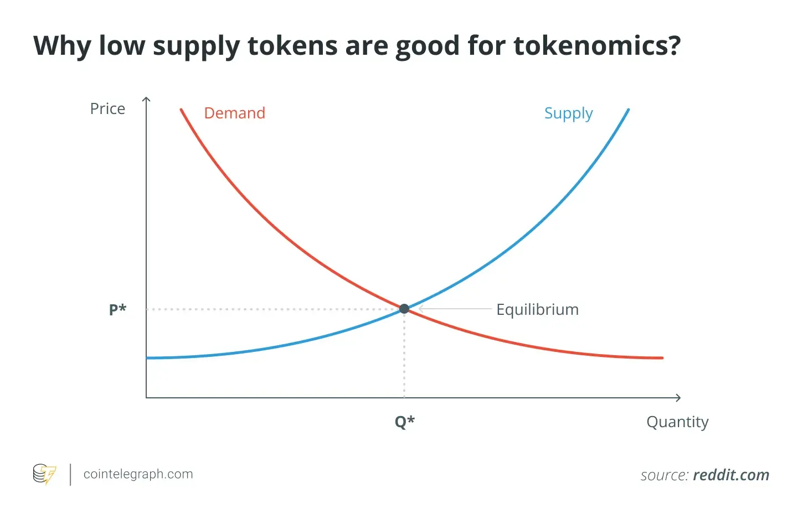

## Table of Contents

## What is hyperdeflation?

Hyperdeflation is when prices of things drop really fast. It's the opposite of hyperinflation, where prices go up a lot. When hyperdeflation happens, people might stop spending money because they think prices will be even lower later. This can make the economy slow down because businesses sell less and might have to let workers go.

This situation can be bad for the economy. If businesses are selling less, they might lower prices even more to try to sell their stuff. But if everyone is waiting for prices to drop further, it can lead to a cycle where prices keep falling and the economy gets worse. Governments and central banks might try to stop hyperdeflation by making more money available or lowering interest rates to encourage people to spend.

## How does hyperdeflation differ from deflation?

Deflation is when prices go down over time, but it happens slowly. It's not too bad for the economy if it's just a little bit. People might feel like they can buy more with their money, but businesses might sell less because people wait for even lower prices.

Hyperdeflation is much worse. It's when prices fall very fast, and it can hurt the economy a lot. When prices drop quickly, people stop spending because they think prices will be even lower soon. This can make businesses struggle and even close down, causing more people to lose their jobs. Governments and banks might need to step in to try to stop it from getting worse.

## What are the main causes of hyperdeflation?

Hyperdeflation can start when people suddenly stop spending a lot of money. This might happen if they're scared about the future, like during a big economic crisis. When people don't spend, businesses have to lower their prices a lot to sell anything. If this keeps happening, prices can fall really fast, and that's hyperdeflation.

Another cause can be when there's too much debt in the economy. If lots of people and businesses owe a lot of money, they might start selling things to pay off their debts. This can make prices drop quickly. Also, if banks are worried about loans not being paid back, they might stop lending money. Without loans, businesses can't grow, and people can't buy big things, which makes the economy slow down even more and can lead to hyperdeflation.

## What are the economic implications of hyperdeflation?

Hyperdeflation can make the economy really sick. When prices fall fast, people hold onto their money because they think things will be cheaper later. This means businesses sell less stuff, and they might have to cut prices even more to get rid of what they have. If this keeps going, businesses might go out of business, and workers lose their jobs. This makes the economy even worse because people have less money to spend.

Governments and banks try to stop hyperdeflation by making more money available or lowering the cost of borrowing money. They hope this will get people spending again. But fixing hyperdeflation can be hard and take a long time. If it's not stopped, it can lead to a long period where the economy doesn't grow, and people struggle to make ends meet.

## How does hyperdeflation affect consumer behavior?

When hyperdeflation happens, people start to act differently with their money. They see prices dropping fast, so they think, "Why buy something now when it will be cheaper next week?" This makes them hold onto their money and wait for even lower prices. As a result, they spend less on things they might have bought before, like new clothes or going out to eat.

This change in how people spend money can make the economy worse. Businesses see that fewer people are buying things, so they have to lower their prices even more to sell anything. But if everyone is waiting for prices to drop further, businesses might not be able to make enough money to stay open. This can lead to more job losses, and when people lose their jobs, they have even less money to spend, making the cycle of hyperdeflation worse.

## What are the effects of hyperdeflation on businesses?

When hyperdeflation hits, businesses have a really tough time. They see that people are not buying as much because they are waiting for prices to go down even more. To sell anything at all, businesses have to keep lowering their prices. But this means they make less money from each sale. If prices keep falling and falling, businesses might not be able to cover their costs like rent, supplies, and paying their workers. This can force some businesses to close down, which means more people lose their jobs.

Losing jobs makes the problem even worse. When people are out of work, they have less money to spend, so they buy even less. This makes businesses struggle even more. It can turn into a bad cycle where businesses keep lowering prices, people keep waiting to buy, and the economy keeps getting worse. To try to stop this, governments and banks might step in to help, but it can be hard to fix and might take a long time.

## Can hyperdeflation lead to a depression? How?

Hyperdeflation can lead to a depression if it goes on for a long time. When prices keep falling fast, people stop spending money because they think things will be even cheaper later. This makes businesses sell less, so they have to cut prices even more. But if businesses keep selling less and less, they might not make enough money to stay open. When businesses close, workers lose their jobs, and with no job, people have even less money to spend. This cycle can make the economy very sick, and if it gets bad enough, it can turn into a depression.

A depression is when the economy is really bad for a long time. During a depression, lots of people are out of work, businesses are closing down, and it's hard for people to buy what they need. Hyperdeflation can make this happen because it stops people from spending and businesses from making money. Governments and banks try to stop hyperdeflation by making more money available or making it cheaper to borrow, but fixing a depression can be really hard and take a long time. If hyperdeflation is not stopped quickly, it can push the economy into a deep depression.

## What historical examples of hyperdeflation exist?

One big example of hyperdeflation happened in the United States during the Great Depression in the 1930s. After the stock market crashed in 1929, people got scared and stopped spending money. Prices started to fall really fast because businesses had to lower their prices to sell anything. This made the economy even worse because people kept waiting for prices to drop more, and businesses kept losing money. It turned into a bad cycle that lasted for years and made the Great Depression even harder on people.

Another example of hyperdeflation was in Japan during the 1990s and early 2000s. After a big economic bubble burst, prices started to fall. People in Japan saw prices going down and decided to wait to buy things, hoping they would get even cheaper. This made businesses struggle because they couldn't sell enough to make money. The government and the central bank tried to help by making more money available and lowering interest rates, but it took a long time for the economy to start getting better.

## How do governments and central banks respond to hyperdeflation?

When hyperdeflation happens, governments and central banks try to stop it by making more money available. They do this by lowering interest rates, which makes it cheaper for people and businesses to borrow money. When borrowing is cheaper, people might spend more and businesses might invest in new projects. This can help get the economy moving again and stop prices from falling so fast.

Governments might also spend more money themselves on things like building roads or helping people who lost their jobs. This is called fiscal policy. By spending more, the government hopes to create jobs and get people to spend money again. It's a way to boost the economy and make sure prices don't keep dropping. Fixing hyperdeflation can be hard and take a long time, but these steps can help.

## What are the long-term consequences of hyperdeflation on an economy?

If hyperdeflation lasts a long time, it can make the economy very sick. People keep waiting to buy things because they think prices will be even lower later. This means businesses sell less and less, so they have to keep lowering prices. If this goes on, businesses might not make enough money to stay open, and they might have to close down. When businesses close, workers lose their jobs, and with no job, people have even less money to spend. This cycle can make the economy worse and worse, leading to a depression where lots of people are out of work and struggling.

In the long run, hyperdeflation can make people lose trust in the economy. They might be scared to spend money or invest in new things because they don't know if prices will keep falling. This can slow down the economy for years because people and businesses are not spending or growing. Governments and banks try to fix this by making more money available and helping people who lost their jobs, but it can take a long time to get the economy healthy again. If hyperdeflation is not stopped quickly, it can have big, lasting effects on how well the economy works.

## How can hyperdeflation be prevented or mitigated?

To prevent or mitigate hyperdeflation, governments and central banks need to act fast. They can lower interest rates to make borrowing money cheaper. When borrowing is cheaper, people might spend more, and businesses might invest in new things. This can help stop prices from falling so fast. Governments can also spend more money themselves on things like building roads or helping people who lost their jobs. By spending more, the government hopes to create jobs and get people spending money again, which can help the economy.

If hyperdeflation has already started, it's important to stop it from getting worse. Central banks can use something called quantitative easing, which means they make more money available in the economy. This can help businesses and people have more money to spend. Governments might also give money directly to people, so they have more to spend on things. All these steps can help slow down the falling prices and get the economy moving again. But fixing hyperdeflation can take a long time and needs careful planning.

## What are the current theories and models used to study hyperdeflation?

Economists use different theories and models to study hyperdeflation. One important theory is the debt-deflation theory, which says that too much debt can cause prices to fall fast. When people and businesses owe a lot of money, they might start selling things to pay off their debts. This makes prices drop quickly, and if everyone is trying to pay off debts at the same time, it can lead to hyperdeflation. Economists also look at how people's behavior changes when prices fall. They use models to see what happens when people stop spending because they think prices will be even lower later.

Another model used to study hyperdeflation is the [liquidity](/wiki/liquidity-risk-premium) trap model. This model says that when interest rates are very low, people might still not spend or invest because they are scared about the future. Even if the central bank makes more money available, it might not help because people just hold onto their money instead of spending it. This can make the economy slow down even more. Economists use these models to try to understand how hyperdeflation starts and how to stop it from getting worse.

## References & Further Reading

[1]: Bernanke, B. S. (2000). ["Essays on the Great Depression."](https://archive.org/details/essaysongreatdep0000bern) Princeton University Press.

[2]: Koo, R. C. (2003). ["The Holy Grail of Macroeconomics: Lessons from Japan's Great Recession."](https://onlinelibrary.wiley.com/doi/book/10.1002/9781119199618) Wiley.

[3]: Shirai, S. (2000). ["The Impact of the Japanese Asset Price Bubble on East Asia's Asset Prices"](https://www.academia.edu/35847708/The_Japanese_Asset_Price_Bubble_Evolvement_and_Consequences). Asian Development Bank Institute.

[4]: ["Algorithmic Trading and DMA: An Introduction to Direct Access Trading Strategies"](https://www.amazon.com/Algorithmic-Trading-DMA-introduction-strategies/dp/0956399207) by Barry Johnson

[5]: Biais, B., Foucault, T., & Moinas, S. (2015). ["Equilibrium High-Frequency Trading"](https://www.sciencedirect.com/science/article/abs/pii/S0304405X15000288), Econometrica, 83(2), 761-812.

[6]: ["Flash Boys: A Wall Street Revolt"](https://en.wikipedia.org/wiki/Flash_Boys) by Michael Lewis