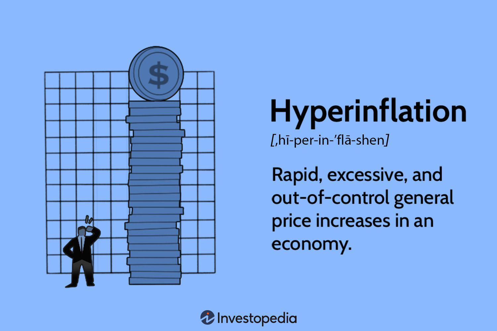

In today's rapidly evolving financial landscape, understanding complex economic concepts such as hyperdeflation and deflation is crucial. These phenomena, characterized by a decrease in the general price levels of goods and services, hold significant implications for economic stability and investment strategies. Hyperdeflation refers to an extreme and rapid decrease in price levels, which can lead to severe economic disruptions. On the other hand, deflation typically involves a more gradual reduction in prices and can result in prolonged periods of economic stagnation if not managed effectively.

This article aims to explore the definitions, examples, and economic trends associated with hyperdeflation and deflation. By examining historical instances and contemporary scenarios, we will identify patterns and analyze their implications on various economic sectors, particularly focusing on algorithmic trading. Algorithmic trading, which utilizes computer algorithms to execute trades at high speeds and volumes, has become an integral part of modern financial markets. Understanding how economic trends like hyperdeflation and deflation influence algorithmic trading is essential for investors and policymakers alike.

Real-world examples, such as Japan's deflationary period and the cryptocurrency markets' hyperdeflationary tendencies, provide valuable insights into how these economic trends manifest and interact with algorithmic trading dynamics. By comprehensively analyzing these scenarios, we can better understand the intricacies of modern markets and develop strategies to navigate potential challenges. Through this exploration, we aim to underscore the importance of ongoing research and adaptation in managing and leveraging the complex relationship between economic phenomena and trading practices.

## Table of Contents

## Understanding Hyperdeflation and Deflation

Hyperdeflation is characterized by an extreme and rapid decrease in price levels across an economy, leading to significant increases in the purchasing power of money. It is a rare economic phenomenon that contrasts sharply with the more familiar concept of deflation, which involves a general decline in the prices of goods and services, though at a much less dramatic pace.

Historically, hyperdeflation has seldom been documented. However, with the advent of digital currencies, new examples have surfaced, particularly concerning cryptocurrencies like Bitcoin. The volatile nature of cryptocurrencies means their value can fluctuate dramatically within short periods. For instance, there have been instances where Bitcoin's price has decreased sharply, only to recover later. Such rapid and extreme value changes in digital currencies can sometimes exhibit characteristics similar to hyperdeflation, illustrating how quickly the purchasing power can alter within these markets.

The core difference between hyperdeflation and deflation lies in both the magnitude and the speed of price changes. While deflation is typically gradual and occurs over a sustained period, hyperdeflation happens at an accelerated pace. For deflation, the general decrease in prices can be beneficial in some contexts, as it might lead to lower costs for consumers, stimulating spending. However, if deflation persists, it can lead to reduced economic activity, as consumers may delay purchases in anticipation of lower prices, leading to reduced investment from businesses.

Mathematically, deflation can be represented by a negative inflation rate. If $I$ is the inflation rate, deflation and hyperdeflation can be depicted as:

- Deflation: $I < 0$, and its absolute value is typically small.
- Hyperdeflation: $I \ll -1$, indicating a substantial and swift decrease in price levels.

The implications of hyperdeflation are profound, as it can lead to severe economic disruptions, impacting consumer confidence and causing instability within financial markets. Despite its rarity, it underscores the necessity for policymakers to monitor economic indicators closely and react accordingly to prevent or mitigate potential adverse effects.

## Economic Trends and Implications

Economic trends significantly influence deflationary dynamics, impacting consumer behavior and broader economic activities. Historically, prominent deflationary episodes include the Great Depression and Japan's Lost Decade, each with distinct economic repercussions.

During the Great Depression (1929-1939), deflation was marked by sharp declines in prices and severe economic contraction. This deflationary spiral exacerbated unemployment and diminished consumer confidence, leading to a vicious cycle of further spending reduction and investment pullbacks [Bernanke, 2000]. The downturn was characterized by falling aggregate demand, as consumers and businesses alike hoarded cash, expecting continued price drops. This behavior, known as the "paradox of thrift," results in reduced economic activity and prolonged recessions.

Japan's Lost Decade (1991-2001) is another illustrative case of prolonged deflation. Following the bursting of its asset price bubble, Japan experienced persistent deflation, which stifled economic growth. Deflation during this period led to stagnant wages and declining consumer spending, as individuals postponed purchases in anticipation of lower future prices [Koo, 2003]. The Bank of Japan's hesitancy in adopting aggressive monetary policies further entrenched deflationary expectations, deeply impacting economic recovery efforts.

In both instances, the deflationary trends led to noticeable shifts in consumer behavior, where reduced spending and delayed investment decisions became prevalent. Businesses faced declining revenues, prompting cost-cutting measures such as layoffs and wage reductions, further inhibiting demand and perpetuating the deflationary cycle.

Contemporary economic trends suggest potential triggers for deflation similar to historical models. Rapid technological advancements, particularly automation and digitization, can contribute to cost reductions and productivity improvements, potentially leading to lower price levels. As technology progresses, production costs decrease, possibly translating into deflationary pressures if demand does not increase correspondingly.

Additionally, global economic shifts, such as demographic changes and international trade dynamics, play roles in shaping deflationary tendencies. Aging populations in developed economies, for instance, may lead to shrinking workforces and subdued consumer demand, pressing down on inflation rates. Similarly, global trade shifts, characterized by increased competition and supply chain efficiencies, can also exert downward pressure on prices.

In summary, understanding past deflationary events and current economic trends is crucial for anticipating their potential impacts on consumer behavior and investment activities. Mechanisms such as reduced spending, postponed investments, and prolonged economic stagnation highlight the enduring challenges posed by deflation. Continuous monitoring of technological and economic changes worldwide is vital in predicting and responding to future deflationary scenarios.

## Examples of Hyperdeflation and Deflation

Hyperdeflation, though a rare phenomenon, has garnered attention particularly with the advent of digital currencies, such as Bitcoin. The extreme decrease in price levels characterizing hyperdeflation, often driven by technological advancements and limited supply, is evident in certain [cryptocurrency](/wiki/cryptocurrency) markets. Bitcoin, for instance, is designed with a deflationary model in mind due to its capped supply of 21 million coins. Each halving event, which occurs approximately every four years, decreases the reward for mining new blocks by 50%, thereby reducing the rate of new Bitcoin creation. This reduction in supply growth while demand may remain constant or increase leads to potential hyperdeflation. These dynamics illustrate a scenario where the value of Bitcoin could increase significantly in a short period, representing hyperdeflationary conditions.

Deflation scenarios are more traditionally associated with economic downturns experienced by nation-states or regions. For instance, Japan's Lost Decade (1991-2001) is a prominent example of deflation where persistent price declines led to economic stagnation. In this period, excess savings and a lack of consumer spending turned expectations toward continuing deflationary trends, trapping the economy in a deflationary spiral. This occurrence mirrored the deflationary concerns during the Great Depression in the 1930s, where drastic declines in demand, coupled with plummeting prices and wages, eroded economic growth.

Additionally, currency appreciation can lead to deflationary pressures as observed in Switzerland and Japan when their currencies experienced significant appreciations. Such appreciation increases the purchasing power of the currency, making imports cheaper while stunting export competitiveness, potentially leading to decreased economic output and prices.

Speculative examples of hyperdeflation in the future may involve a broader adoption of cryptocurrencies or other digital assets integrated into everyday transactions. As more goods and services can be traded through these hyperdeflationary currencies with fixed or extremely limited supplies, traditional economic models could face unprecedented shifts. Theoretical perspectives also suggest that rapid technological advancements, such as blockchain and [artificial intelligence](/wiki/ai-artificial-intelligence), could accelerate deflationary pressures by drastically reducing transaction costs and improving efficiency.

Understanding these dynamics is crucial for predicting economic patterns and preparing for possible future scenarios that challenge existing economic frameworks, particularly as digital currencies gain widespread acceptance.

## Algorithmic Trading: An Overview

Algorithmic trading refers to the use of computer algorithms to automate trading decisions and execute orders in financial markets. This form of trading is instrumental in modern financial markets, accounting for a significant share of trading [volume](/wiki/volume-trading-strategy) on major exchanges. Algorithmic trading systems are designed to monitor market conditions and execute trades at optimal times, often with high speed and precision that human traders cannot match.

High-frequency trading ([HFT](/wiki/high-frequency-trading-strategies)) is a prominent strategy within [algorithmic trading](/wiki/algorithmic-trading), characterized by the rapid execution of orders, sometimes in milliseconds or microseconds. This requires sophisticated infrastructure and access to high-speed data feeds to capture and act on market movements faster than competitors. HFT strategies often exploit small price discrepancies, [liquidity](/wiki/liquidity-risk-premium) imbalances, or latency arbitrages.

Machine learning is another critical technology employed in algorithmic trading. Algorithms rely on [machine learning](/wiki/machine-learning) to identify patterns and trends from large datasets, which can provide predictive insights for trading strategies. Machine learning models, such as neural networks and [reinforcement learning](/wiki/reinforcement-learning) algorithms, can adapt to changing market conditions and optimize trading decisions based on historical and real-time data.

The advantages of algorithmic trading are numerous. It enhances market efficiency by facilitating large volumes of transactions quickly and accurately. This can lead to tighter bid-ask spreads and improved liquidity. Algorithmic trading also minimizes the emotional and psychological biases that often affect human traders, leading to more disciplined and systematic trading processes.

However, algorithmic trading is not without risks. In volatile markets, algorithms can exacerbate price swings by executing trades based on pre-defined rules without considering the broader market context. This was evident during the "Flash Crash" of 2010 when automated trading systems contributed to a sudden and significant drop in the stock market. Additionally, in deflationary markets, liquidity can dry up, and price predictability may diminish, posing challenges for algorithmic strategies that rely heavily on market stability.

In conclusion, while algorithmic trading offers significant benefits by enhancing efficiency and speed, it also introduces risks that must be carefully managed, particularly in volatile and deflationary environments. The continuous evolution of technology and the sophistication of algorithms remain pivotal to navigating these challenges.

## The Intersection of Deflation and Algorithmic Trading

Deflation poses unique challenges and opportunities for algorithmic trading systems by influencing liquidity, [volatility](/wiki/volatility-trading-strategies), and market dynamics. In deflationary periods, the general decline in prices can lead to a reduction in spending, thereby contracting the overall economic activity. This contraction influences traders and investors as they become more risk-averse, preferring to hold onto cash or invest in safer assets.

Algorithmic trading, which relies on leveraging mathematical models and computer algorithms to execute trades at high speeds, can be significantly affected by these shifts. The reduction in economic activity can cause a liquidity squeeze, where the ease of converting assets into cash without impacting their price diminishes. This reduced liquidity can make it more difficult for algorithms that rely on high-frequency trading strategies to find sufficient activity to capitalize on short-term price discrepancies. Consequently, liquidity constraints can also lead to increased volatility as price changes become more abrupt when large trades occur in a less liquid market.

During deflationary conditions, algorithmic trading systems may benefit from increased market efficiency since prices tend to move towards more accurate valuations in the absence of inflation-driven distortions. Algorithms designed to exploit price inefficiencies might find new opportunities as assets adjust to their true value in a deflated market.

However, algorithmic systems face heightened risks during these times. Liquidity traps are a prominent risk, wherein markets are unable to clear because investors favor holding cash or safe assets, expecting further price declines. This behavior can exacerbate economic unpredictability, posing challenges for algorithms that depend on stable trend projections and statistical anomalies.

Moreover, deflation can result in increased correlations among asset classes as all prices tend to move downward together, driven by broad economic factors rather than asset-specific news. This heightened correlation reduces diversification benefits, which algorithms might otherwise exploit. Algorithmic strategies that employ diversification as a risk management tool need to adapt to these consolidated correlations to maintain effective risk control.

In summary, while deflationary periods can offer opportunities for reassessment and adjusted trading strategies, they also require algorithmic systems to carefully manage liquidity risks and adapt to changing market dynamics. Advanced modeling, perhaps with enhanced capabilities for predictive analytics, can help algorithmic systems adapt to the complexities introduced by deflationary environments.

## Case Studies and Examples

Japan's deflationary period, often identified with the "Lost Decade" spanning the 1990s, offers critical insights into how sustained deflation affects economies and financial markets. Following the collapse of its asset price bubble in the early 1990s, Japan experienced significant economic stagnation marked by persistently falling prices. This period serves as a case study for understanding both traditional economic impacts and modern trading adaptations.

During the deflationary decade, consumer spending and investment sharply decreased. The Bank of Japan's attempts to combat deflation by lowering interest rates were largely unsuccessful. The low-interest environment and declining prices reduced incentives for both borrowing and spending, creating a deflationary spiral.

In this context, algorithmic trading strategies played an interesting role. While Japan's deflationary context didn't foster high-frequency trading (HFT) on the scale seen in today's global markets, it did prompt innovative approaches. For instance, traders began leveraging technology to improve efficiencies across slower-moving, less volatile markets. Algorithms focusing on [arbitrage](/wiki/arbitrage) and trend-following became valuable by identifying small price discrepancies and capitalizing on short-term price trends.

Examples of algorithmic adaptations include:

1. **Market-making Algorithms**: In deflationary conditions where liquidity can be limited, market-making algorithms became crucial. They profited by maintaining bid-ask spreads, even in the face of low market volatility. The consistent provision of liquidity helped sustain market operations during prolonged deflation.

2. **Arbitrage**: Algorithms designed to exploit arbitrage opportunities thrived as asset prices diverged from their intrinsic values. Despite the lack of volatility, small inconsistencies between stock prices on various exchanges presented profitable opportunities without the need for significant price movements.

3. **Portfolio Rebalancing**: Automated systems were developed for continuously rebalancing portfolios to preserve returns in a deflationary environment. These systems were adept at quickly adjusting asset allocations to respond to ongoing price decreases, preserving capital and maintaining returns in difficult market conditions.

4. **Sentiment Analysis**: Basic forms of sentiment analysis based on news and public data were implemented to predict further deflationary trends and adjust holdings accordingly. Although in nascent stages, these tools paved the way for more sophisticated machine learning applications used today.

The lesson from Japan's experience is that, even in deflationary times, algorithmic trading can be adapted to provide value. Adaptations honed under such conditions are now staples of the trading community and have evolved with technology advancements. While deflation posed challenges, it also catalyzed innovation—demonstrating that necessity indeed drives change.

Considering these historical learnings, modern traders and financial institutions can prepare for potential reappearances of deflation by leveraging technology to maintain liquidity, identify trends, and exploit arbitrage opportunities. Furthermore, continued advancement in algorithmic trading coupled with improved data analytics capabilities promises to enhance the resilience and adaptability of financial markets facing deflationary pressures in the future.

## Future Outlook: Hyperdeflation, Deflation, and Algorithmic Trading

In examining future scenarios involving hyperdeflation and deflation, current economic trends suggest notable possibilities. Hyperdeflation, though rare, could arise from widespread adoption of digital currencies like cryptocurrencies. These currencies have a capped supply, notably Bitcoin, which may lead to extreme deflationary pressures. Hyperdeflation could also emerge if technological advancements drastically reduce production costs, leading to abrupt and significant drops in price levels.

Algorithmic trading is likely to evolve to adapt to such economic conditions. Algorithms could incorporate more dynamic models that account for extreme volatility and rapid shifts in asset prices associated with hyperdeflation. Adaptive learning techniques, such as reinforcement learning, could become integral to trading strategies, allowing systems to respond to real-time market data with increased precision and speed.

In deflationary conditions, algorithmic trading may pivot towards strategies that focus on pairs trading and [statistical arbitrage](/wiki/statistical-arbitrage), which capitalize on the price movements between relative assets. Deflation often leads to market inefficiencies that algorithms could exploit, making advanced statistical methodologies and machine learning algorithms paramount.

Moreover, regulatory and technological advancements are expected to significantly influence the future landscape of economy and trading. Enhanced regulation could aim to mitigate risks associated with high-frequency and algorithmic trading, including market manipulation and systemic risk. This may involve introducing rules that govern the speed and volume of transactions or mandating more transparent reporting requirements.

Technological innovations, especially in artificial intelligence and quantum computing, could offer new dimensions to algorithmic trading. Quantum computing, with its extraordinary processing power, could revolutionize data analysis and decision-making processes in trading, enabling the handling of unprecedented volumes of data and complex calculations at unparalleled speeds.

Overall, the interaction between hyperdeflation, deflation, and algorithmic trading will depend on how these systems navigate new economic realities. Their success will rely on integrating cutting-edge technologies with robust regulatory frameworks to ensure stability and efficiency in financial markets. As these trends unfold, continuous innovation and adaptation will be crucial for algorithmic trading to remain resilient and effective.

## Conclusion

The exploration of hyperdeflation, deflation, and algorithmic trading reveals intricate links between economic trends and modern trading methodologies. Hyperdeflation, characterized by severe and rapid declines in price levels, often emerges in contexts such as digital currencies, where speculative behavior and technological advancements provoke extreme market dynamics. Traditional deflation, often a slower and more persistent decrease in prices, has historically impacted economies during periods of financial distress.

Algorithmic trading stands as a pivotal component of contemporary financial markets, leveraging advanced technologies such as high-frequency trading and machine learning to navigate complex economic environments. The relationship between deflationary conditions and algorithmic trading is multifaceted, with deflation influencing market liquidity, volatility, and the overall dynamics of financial systems.

Given the unpredictable nature of economic phenomena and their influence on trading systems, continuous research and adaptation are vital. As economic trends evolve, so too must the strategies employed within algorithmic trading frameworks to mitigate risks and capitalize on emerging opportunities. This adaptability not only ensures the resilience of trading practices but also enhances the understanding of economic patterns, paving the way for more robust and responsive financial systems in the future.

## References & Further Reading

[1]: Bernanke, B. S. (2000). ["Essays on the Great Depression."](https://archive.org/details/essaysongreatdep0000bern) Princeton University Press.

[2]: Koo, R. C. (2003). ["The Holy Grail of Macroeconomics: Lessons from Japan's Great Recession."](https://onlinelibrary.wiley.com/doi/book/10.1002/9781119199618) Wiley.

[3]: Shirai, S. (2000). ["The Impact of the Japanese Asset Price Bubble on East Asia's Asset Prices"](https://www.academia.edu/35847708/The_Japanese_Asset_Price_Bubble_Evolvement_and_Consequences). Asian Development Bank Institute.

[4]: ["Algorithmic Trading and DMA: An Introduction to Direct Access Trading Strategies"](https://www.amazon.com/Algorithmic-Trading-DMA-introduction-strategies/dp/0956399207) by Barry Johnson

[5]: Biais, B., Foucault, T., & Moinas, S. (2015). ["Equilibrium High-Frequency Trading"](https://www.sciencedirect.com/science/article/abs/pii/S0304405X15000288), Econometrica, 83(2), 761-812.

[6]: ["Flash Boys: A Wall Street Revolt"](https://en.wikipedia.org/wiki/Flash_Boys) by Michael Lewis