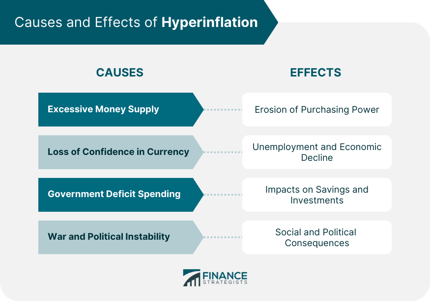

## Table of Contents

## What is hyperinflation?

Hyperinflation is when the prices of things like food and clothes go up really fast, and money becomes worth less and less. It happens when a country's government prints too much money or when there are big problems in the economy. People start to see that their money can't buy as much as before, and they rush to spend it before prices go up even more.

This can make life very hard for people. Their savings might become worthless, and it can be tough to buy even basic things. Hyperinflation has happened in places like Germany after World War I and Zimbabwe in the 2000s. It's a big problem that can shake up a whole country's economy and make it hard for people to trust their money.

## How does hyperinflation differ from regular inflation?

Regular inflation is when prices go up slowly over time. It's normal and happens in most economies. A little bit of inflation is expected and can even be good for the economy because it encourages people to spend money rather than save it, which can help businesses grow. Central banks, like the Federal Reserve in the U.S., try to keep inflation at a steady, low level, often around 2% a year.

Hyperinflation is much more extreme. It's when prices start to skyrocket very quickly, sometimes doubling in just a few months or even weeks. This happens when there's a big problem, like a government printing too much money or a major economic crisis. Hyperinflation can destroy savings, make money almost worthless, and cause big problems for people and businesses. It's not common, but when it happens, it can shake up an entire country's economy.

## What are the common causes of hyperinflation?

Hyperinflation often happens when a country's government prints too much money. They might do this to pay for things like wars or big debts. When there's too much money floating around, each bit of money becomes worth less. People start to see that their money can't buy as much as before, so they spend it quickly before prices go up even more. This makes prices rise even faster, and it can turn into a vicious cycle.

Another cause of hyperinflation is when there's a big drop in confidence in a country's money. This can happen if people think the government is not doing a good job or if there's a lot of political trouble. When people don't trust their money, they might start using other things to buy stuff, like foreign money or gold. This makes their own money even less valuable and can lead to hyperinflation.

Sometimes, hyperinflation can also be caused by big economic problems, like when a country can't sell its goods to other countries anymore, or if it loses a lot of its money because of a financial crisis. When these things happen, it can make it hard for the country to keep its economy stable, and prices can start to go up very fast.

## Can hyperinflation be triggered by political instability?

Yes, political instability can trigger hyperinflation. When people don't trust their government, they might start to worry about the money the government prints. If the government seems weak or there's a lot of fighting over who should be in charge, people might think the money isn't safe. They might start using other things to buy stuff, like foreign money or gold. This makes their own money worth less and less, and prices can start to go up very fast.

This loss of trust can make the problem worse. People might rush to spend their money before it becomes worth even less. This rush to spend can make prices go up even faster, creating a cycle that's hard to stop. So, political instability can shake up the economy and lead to hyperinflation if it makes people lose faith in their money.

## What are the economic effects of hyperinflation on a country?

Hyperinflation can mess up a country's economy in big ways. It makes money worth less and less, so people's savings can become almost worthless. This means people can't buy the things they need, like food and clothes. Businesses also have a hard time. They might find it tough to plan for the future or even keep their doors open because prices are changing so fast. This can lead to fewer jobs and more people out of work, which makes the economy even weaker.

The government also faces big problems during hyperinflation. It can be hard for them to collect taxes because money loses value so quickly. This means they might not have enough money to pay for important things like schools and hospitals. The government might print even more money to try to fix things, but this just makes the hyperinflation worse. People might start using other things to buy stuff, like foreign money or gold, which shows they don't trust their own money anymore. This loss of trust can make the whole situation even harder to fix.

In the end, hyperinflation can shake up a whole country. It can make life very hard for people, hurt businesses, and make it tough for the government to do its job. It can take a long time for a country to recover from hyperinflation, and it often needs big changes to fix the problems that caused it in the first place.

## How does hyperinflation impact the everyday life of citizens?

Hyperinflation can make life really hard for people. When prices go up very fast, it means that the money people have saved up becomes worth less and less. This makes it tough for them to buy things they need, like food, clothes, and medicine. People might have to spend all their money as soon as they get it, just to keep up with the rising prices. It can be really stressful and make it hard to plan for the future because no one knows how much things will cost tomorrow.

Families also feel the strain. If parents lose their jobs because businesses can't keep up with the fast-changing prices, it can be hard to put food on the table. Kids might have to stop going to school because their families can't afford it anymore. People might start using other things to buy stuff, like foreign money or gold, because they don't trust their own money. This loss of trust can make everyday life even tougher and can shake up the whole community.

## What historical examples of hyperinflation can we learn from?

One big example of hyperinflation happened in Germany after World War I. It started in 1921 and got really bad by 1923. The German government had to pay a lot of money because they lost the war, so they started printing more money to pay their bills. This made prices go up really fast. People had to [carry](/wiki/carry-trading) around bags of money just to buy a loaf of bread. It made life very hard for everyone, and it helped lead to a lot of political problems later on.

Another example is from Zimbabwe in the 2000s. Hyperinflation there started to get really bad around 2007 and 2008. The government was printing too much money and having big problems running the country. Prices were going up so fast that people had to use billions of dollars to buy simple things like eggs or milk. It made life very hard for people, and many lost their savings. It took a long time for Zimbabwe to start fixing things after the hyperinflation ended.

These examples show us how hyperinflation can mess up a country and make life really hard for people. It's important for governments to be careful with how they handle money and to try to keep the economy stable so that something like hyperinflation doesn't happen.

## What are the warning signs that a country might be heading towards hyperinflation?

One big warning sign that a country might be heading towards hyperinflation is when the government starts printing a lot more money. This can happen if the government needs to pay for things like wars or big debts. When there's too much money around, each bit of money becomes worth less, and prices start to go up really fast. People might see that their money can't buy as much as before, so they start spending it quickly before prices go up even more. This can make the problem worse and lead to hyperinflation.

Another warning sign is when people start losing trust in their country's money. This can happen if there's a lot of political trouble or if people think the government is not doing a good job. When people don't trust their money, they might start using other things to buy stuff, like foreign money or gold. This makes their own money even less valuable and can push the country towards hyperinflation. If people are rushing to spend their money and prices are going up faster and faster, it's a big sign that hyperinflation might be on the way.

## How can governments and central banks prevent or mitigate hyperinflation?

Governments and central banks can help prevent hyperinflation by being careful with how much money they print. If the government needs to pay for things like wars or big debts, they shouldn't just print more money. Instead, they can try to find other ways to get money, like raising taxes or borrowing from other countries. Central banks can also keep an eye on how fast prices are going up and try to keep them steady. If prices start to go up too fast, the central bank can raise interest rates to make it more expensive to borrow money. This can slow down spending and help keep prices from going up too quickly.

If hyperinflation does start to happen, governments and central banks can take steps to stop it. One way is to stop printing so much money and try to get people to trust their money again. The government might need to make big changes to show people they are serious about fixing the economy. They can also work with other countries to get help and advice on how to fix things. Central banks can use tools like changing interest rates or even switching to a different kind of money, like a foreign currency, to help bring prices back under control. By working together and making smart choices, governments and central banks can help prevent or stop hyperinflation from making life too hard for people.

## What investment strategies are effective during periods of hyperinflation?

During times of hyperinflation, it's smart to put your money into things that keep their value even when prices are going up really fast. One good choice is to invest in stuff like gold or other precious metals. These things usually stay valuable no matter what's happening with money. Another option is to buy things that people always need, like food or energy. Companies that make these things can do well even when prices are going crazy because people still need to buy them.

Another strategy is to look at foreign investments. If you can, putting your money into a different country's money or stocks can help protect it. If your own country's money is losing value fast, a different country's money might stay strong. Also, think about real estate. Buying land or buildings can be a good way to keep your money safe because property often keeps its value better than money during hyperinflation. By choosing these kinds of investments, you can help make sure your money doesn't lose all its value when prices are going up too fast.

## How can individuals and businesses prepare for and survive hyperinflation?

Individuals and businesses can prepare for hyperinflation by putting their money into things that keep their value even when prices are going up fast. For individuals, this means investing in things like gold or other precious metals, which usually stay valuable no matter what's happening with money. They can also buy things that people always need, like food or energy, because these things will still be in demand. Businesses should think about investing in assets that can hold their value, like real estate or foreign currencies, to protect their money from losing value quickly. It's also a good idea for both individuals and businesses to pay off any debts quickly, because the money they owe will be worth less as hyperinflation gets worse.

Surviving hyperinflation means being ready to change how you spend and save money. Individuals should try to spend their money as soon as they get it, because waiting could mean the money won't buy as much later. They should also look for ways to earn money in foreign currencies, which might stay strong while their own money loses value. Businesses need to be flexible and ready to change prices often to keep up with how fast things are costing more. They should also think about using other ways to trade, like bartering, if money becomes too unreliable. By staying alert and making smart choices about money, individuals and businesses can better handle the challenges that come with hyperinflation.

## What are the long-term consequences of hyperinflation on an economy's recovery?

Hyperinflation can make it really hard for a country to get better and grow again. It can take a long time for the economy to recover because people and businesses lose trust in their money. When money loses its value so quickly, people's savings can become worthless, and businesses might go out of business because they can't keep up with fast-changing prices. This can lead to fewer jobs and more people out of work, which makes the economy even weaker. The government might also have a hard time paying for important things like schools and hospitals because they can't collect enough taxes. All these problems can make it tough for the country to get back on its feet.

In the long run, fixing the problems caused by hyperinflation often needs big changes. The government might need to make new rules about money and how it's used to help people trust it again. They might also need help from other countries to get their economy going again. It's important for the government to be careful with how much money they print and to keep the economy stable. By making these changes and working hard, a country can slowly start to recover from hyperinflation. But it's a long and tough road, and it takes a lot of effort to make things better for everyone.

## How can one prepare trading strategies for hyperinflation?

Developing effective trading strategies during hyperinflation requires adaptable algorithmic models to manage heightened market [volatility](/wiki/volatility-trading-strategies). Hyper-volatility characterized by erratic price movements can challenge traditional trading systems, which often assume relatively stable market conditions. Therefore, these models must adjust rapidly to fluctuations, incorporating mechanisms that can sustain performance in unpredictable environments.

Investment strategies during hyperinflation should pivot towards commodities. Commodities like gold, silver, and oil usually act as a hedge against inflation, maintaining value when fiat currencies devalue sharply. Including commodities in [algorithmic trading](/wiki/algorithmic-trading) portfolios can reduce risks associated with currency devaluation during hyperinflation.

Cross-currency analysis is essential for protecting assets from extreme devaluation. This analysis involves comparing and trading multiple currencies to maintain asset value despite hyperinflationary pressures. Algorithmically, this can be implemented by creating a multi-currency trading system that assesses currency strength and volatility, dynamically reallocating assets to stronger currencies.

The formula for calculating the cross-rate, which is vital in a multi-currency strategy, is:

$$
\text{Cross Rate} = \frac{\text{Exchange Rate of Currency A to USD}}{\text{Exchange Rate of Currency B to USD}}
$$

In Python, a basic implementation of cross-currency analysis might look like this:

```python
def cross_rate(currency_a_usd, currency_b_usd):
    return currency_a_usd / currency_b_usd

# Example rates
currency_a_usd = 1.3  # Currency A to USD
currency_b_usd = 0.9  # Currency B to USD

rate = cross_rate(currency_a_usd, currency_b_usd)
print(f"Cross rate of Currency A to Currency B: {rate}")
```

Infrastructure and regulatory frameworks are crucial for supporting robust algorithmic trading. Robust infrastructure ensures that trading systems can operate efficiently even under strain, such as during high-frequency trades typical in volatile markets. It involves reliable data feeds, low-latency platforms, and strong risk management software. Regulatory frameworks must adapt to allow swift responses to market changes while ensuring trader and market protection. Effective regulations accommodate rapid technological advancements in trading systems without compromising market integrity.

Well-prepared trading strategies for hyperinflation leverage flexible algorithmic systems, diversify into stable value-retaining assets, and prioritize strong infrastructural and regulatory support to manage inherent market uncertainties successfully.

## References & Further Reading

[1]: Hanke, S. H., & Krus, N. (2012). ["World Hyperinflations."](https://www.cato.org/working-paper/world-hyperinflations) Cato Institute.

[2]: Sargent, T. J. (1983). ["The Ends of Four Big Inflations."](https://www.nber.org/system/files/chapters/c11452/c11452.pdf) University of Chicago Press.

[3]: Hanke, S. H., & Kwok, A. K. F. (2009). ["On the Measurement of Zimbabwe's Hyperinflation."](https://www.cato.org/sites/cato.org/files/serials/files/cato-journal/2009/5/cj29n2-8.pdf) Cato Journal.

[4]: ["Advances in Financial Machine Learning"](https://www.amazon.com/Advances-Financial-Machine-Learning-Marcos/dp/1119482089) by Marcos Lopez de Prado.

[5]: ["Quantitative Trading: How to Build Your Own Algorithmic Trading Business"](https://github.com/LucindaYa/quant-resources/blob/master/Quantitative%20Trading%20How%20to%20Build%20Your%20Own%20Algorithmic%20Trading%20Business.pdf) by Ernest P. Chan.

[6]: ["Machine Learning for Algorithmic Trading"](https://github.com/stefan-jansen/machine-learning-for-trading) by Stefan Jansen.

[7]: ["Evidence-Based Technical Analysis: Applying the Scientific Method and Statistical Inference to Trading Signals"](https://www.amazon.com/Evidence-Based-Technical-Analysis-Scientific-Statistical/dp/0470008741) by David Aronson.