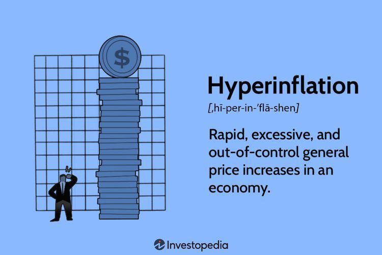

The global economy often grapples with inflation and, in more severe instances, hyperinflation. Hyperinflation is characterized by extraordinarily rapid and often uncontrollable price increases, destabilizing economic structures and severely affecting consumer prices, savings, and investment strategies. This phenomenon can erode the value of currency to the point where traditional economic transactions become challenging, if not impossible. The necessity for financial preparation during such periods is vital, as it helps cushion the blow of these precipitous economic downswings. 

Strategically, individuals and institutions that adopt diversified financial portfolios are better positioned to withstand the adverse effects of hyperinflation. Commodities, real estate, and specialized financial instruments like Treasury Inflation-Protected Securities (TIPS) provide some defense by retaining value when fiat currency rapidly loses it. Furthermore, algorithmic trading presents both opportunities and challenges under hyperinflationary pressures due to its dependency on market stability and rapid decision-making capabilities. Nevertheless, algorithmic trading systems can adapt by incorporating high-frequency data and sentiment analysis, which aid in managing and anticipating volatile market conditions.



This article examines the pervasive economic effects of hyperinflation, strategic financial preparation methods, and the intricate role of algorithmic trading systems harnessed to manage these erratic conditions. Understanding these elements is crucial for developing resilience in economic frameworks, enabling both individuals and institutions to navigate the turbulent waters of hyperinflation effectively.

## Table of Contents

## Understanding Hyperinflation

Hyperinflation refers to excessive and uncontrollable price increases, marked by inflation rates typically exceeding 50% per month. This extreme economic condition significantly erodes the purchasing power of the affected currency, leading to a situation where goods and services effectively become unaffordable for the average consumer.

The primary cause of hyperinflation is an excessive increase in the money supply that is not supported by corresponding economic growth. When a country prints more currency without a commensurate increase in the production of goods and services, the result is too much money chasing too few goods. This imbalance causes prices to skyrocket as consumers compete to purchase the limited available resources.

Demand-pull inflation is another [factor](/wiki/factor-investing) that can escalate into hyperinflation if unmanaged. This occurs when demand for goods and services outweighs their supply, often due to increased consumer spending or significant government spending. In such scenarios, prices begin to rise. If the monetary authorities fail to intervene, these rising prices can spiral out of control, leading to hyperinflation.

Historically, hyperinflation has caused severe economic disruptions in various countries. Notable examples include Germany in the early 1920s, where the Weimar Republic experienced hyperinflation due to post-war reparations, and Zimbabwe in the late 2000s, driven by economic mismanagement and political instability. These historical instances demonstrate how hyperinflation can devastate an economy, disrupt social structures, and lead to a loss of confidence in the nation’s currency.

## Economic Effects of Hyperinflation

Hyperinflation dramatically erodes the purchasing power of money, compelling consumers to expend significantly more currency for the acquisition of progressively fewer goods and services. This phenomenon occurs as the value of money diminishes rapidly, disrupting standard economic activities and leading to substantial societal consequences. Consumers, facing diminishing returns on their currency's value, often engage in accelerated spending to obtain necessary goods before prices escalate further. This behavioural shift tends to intensify demand-pull inflation, exacerbating the hyperinflationary cycle.

The economic consequences extend beyond personal financial strain, manifesting as widespread hoarding and resultant shortages of essential commodities, including food. With hyperinflation, scarcity becomes a frequent occurrence as individuals and businesses stockpile supplies in anticipation of further price increases. This hoarding behavior disrupts the normal flow of goods and services, culminating in significant supply chain challenges and exacerbating economic instability.

Financial institutions, including banks, may face collapse under hyperinflationary pressures. This collapse often stems from plummeting public confidence and a substantial decrease in deposit volumes as consumers and investors lose faith in the stability of financial systems. With money losing its value rapidly, individuals might withdraw their savings, preferring to convert them into more stable or tangible assets, thereby depriving banks of the necessary capital to sustain operations.

Moreover, hyperinflation severely impacts governmental fiscal capabilities. Tax revenues decline dramatically as inflation-adjusted income shrinks, impairing the government's ability to finance essential public services and maintain economic infrastructure. With depreciating currencies, the real value of tax collections falls, hindering budgetary allocations for infrastructure, healthcare, and education. This reduction in public spending exacerbates the overall economic deterioration, creating a feedback loop that undermines both societal welfare and economic stability.

Managing the myriad effects of hyperinflation requires nuanced fiscal policies and timely intervention to restore economic balance and safeguard the integrity of financial systems. The historical instances of hyperinflation underscore the importance of stringent monetary controls and the development of resilient economic structures to withstand such episodes.

## Financial Preparation Amid Hyperinflation

Diversifying financial portfolios is a strategic approach to mitigate the impact of hyperinflation, a phenomenon characterized by rapidly increasing prices that erode the purchasing power of money. One effective method to counteract these effects is by investing in commodities and real estate. Commodities, such as gold, silver, and oil, often serve as a hedge against inflation due to their intrinsic value and limited supply. Real estate also tends to preserve value over time, as property prices can increase in response to inflationary pressures, thereby offering a potential hedge.

Additionally, Treasury Inflation-Protected Securities (TIPS) are instrumental in minimizing inflation-related losses. Issued by the U.S. Department of the Treasury, TIPS are designed to protect investors from inflation. These securities adjust their principal value in response to changes in the Consumer Price Index (CPI), ensuring that investors receive a real rate of return regardless of inflationary conditions. This adjustment mechanism provides a robust safeguard against the eroding effects of inflation on investment capital.

Mutual funds and Exchange-Traded Funds (ETFs) specializing in inflation swaps offer another layer of protection within investment portfolios. Inflation swaps are a type of derivative contract that enable investors to exchange inflation-linked payments. By engaging in such financial instruments, these funds can provide exposure to inflation-protection strategies without requiring individual investors to directly manage derivative contracts. This approach allows investors to gain indirect exposure to inflation-indexed assets and benefit from professional management and diversification within the funds.

In conclusion, financial preparation amid hyperinflation requires a strategic mix of diversified investments. By incorporating commodities, real estate, TIPS, and funds focused on inflation swaps, investors can construct a resilient portfolio capable of withstanding the negative impacts of hyperinflation. These strategies collectively enhance the ability of portfolios to maintain real value in the face of severe inflationary environments.

## Algorithmic Trading and Hyperinflation

Algorithmic trading, a method that uses pre-programmed software to make high-speed trading decisions, thrives in environments of stability due to its reliance on quantitative models and rapid execution. However, hyperinflation challenges these systems due to severe market [volatility](/wiki/volatility-trading-strategies) and unpredictability. To maintain efficacy in hyperinflationary conditions, [algorithmic trading](/wiki/algorithmic-trading) systems must adapt by incorporating strategies that address these financial anomalies.

Adapting trading models to hyperinflation necessitates handling extreme volatility and rapidly changing market conditions. Traditional models, often built on the premise of moderate fluctuations, may falter under hyperinflation, necessitating robust recalibration. This can include implementing volatility-dependent algorithms capable of dynamically adjusting parameters such as stop-loss thresholds and trade sizes in response to real-time volatility metrics.

Currency diversification becomes critical for preserving capital amidst fluctuating currency values. During hyperinflation, a currency can lose value rapidly, leading to substantial losses if investments remain unhedged. Algorithmic trading systems can mitigate these risks by incorporating strategies that spread investments across a basket of currencies. For example, employing the Python library [forex](/wiki/forex-system)-python can enable real-time currency conversions, aiding in risk assessment and diversification strategies:

```python
from forex_python.converter import CurrencyRates

def diversify_currency(investments, target_currencies):
    c = CurrencyRates()
    diversified_investments = {}
    for currency in target_currencies:
        rate = c.get_rate('USD', currency)
        diversified_investments[currency] = investments['USD'] * rate
    return diversified_investments

# Example usage
investments = {'USD': 1000}
target_currencies = ['EUR', 'GBP', 'JPY']
diversified_investments = diversify_currency(investments, target_currencies)
```

Additionally, sentiment analysis and access to real-time data enable algorithmic systems to better anticipate and respond to economic shifts during hyperinflation. By analyzing market sentiment through natural language processing (NLP) techniques, traders can glean insights from news articles, social media, and other data sources. Integrating sentiment scores into trading algorithms can provide predictive capabilities regarding market direction, allowing for proactive adjustments to trading strategies.

In summary, the ability of algorithmic trading systems to adapt in hyperinflationary contexts depends on innovations in handling volatility, effective currency diversification techniques, and enhanced sentiment analysis. These adaptations not only preserve capital but also exploit opportunities within unstable markets, highlighting the interplay between cutting-edge technology and financial resilience.

## Real-World Examples of Hyperinflation

Yugoslavia, Hungary, and Zimbabwe serve as illustrative cases where hyperinflation resulted in devastating economic impacts, each with unique circumstances but sharing a common outcome of severe financial destabilization.

Yugoslavia experienced hyperinflation in the late 1980s and early 1990s, primarily due to political instability and government mismanagement. The annual inflation rate in Yugoslavia reached an astronomical 313 million percent in January 1994[^1^]. The economic collapse was exacerbated by the breakup of the Socialist Federal Republic of Yugoslavia, which disrupted trade and eroded economic unity. In an attempt to cope with the worthless currency, many citizens resorted to bartering and using foreign currencies for transactions, illustrating the severe loss of confidence in the national monetary system.

Hungary endured one of the most extreme episodes of hyperinflation in history following World War II. The rate of inflation peaked in July 1946, with prices doubling approximately every 15 hours[^2^]. This catastrophic level of inflation stemmed from the destructive outcomes of the war, including infrastructure devastation and a crippled economy. The Hungarian government issued the pengő, a currency that became effectively worthless, necessitating the introduction of a new currency, the forint, to stabilize the economy.

Zimbabwe's hyperinflation episode in the late 2000s is another noteworthy example, characterized by an inflation rate estimated at 89.7 sextillion percent per month in mid-November 2008[^3^]. This crisis was fueled by political turmoil, economic mismanagement, and land reform policies that drastically reduced agricultural production. The hyperinflationary environment rendered the Zimbabwean dollar effectively worthless, leading to the adoption of foreign currencies like the U.S. dollar and the South African rand for stability. The economic meltdown resulted in significant shortages of basic goods and services and prompted mass emigration as residents sought better opportunities abroad.

These historical instances underscore the catastrophic effects of hyperinflation on national economies, highlighting the urgent need for sound economic policies and stable political environments to prevent such occurrences.

[^1^]: Hanke, S. H., & Krus, N. (2012). World Hyperinflations. Cato Institute. 
[^2^]: Sargent, T. J. (1983). The Ends of Four Big Inflations. University of Chicago Press.
[^3^]: Hanke, S. H., & Kwok, A. K. F. (2009). On the Measurement of Zimbabwe's Hyperinflation. Cato Journal.

## Preparing Trading Strategies for Hyperinflation

Developing effective trading strategies during hyperinflation requires adaptable algorithmic models to manage heightened market volatility. Hyper-volatility characterized by erratic price movements can challenge traditional trading systems, which often assume relatively stable market conditions. Therefore, these models must adjust rapidly to fluctuations, incorporating mechanisms that can sustain performance in unpredictable environments.

Investment strategies during hyperinflation should pivot towards commodities. Commodities like gold, silver, and oil usually act as a hedge against inflation, maintaining value when fiat currencies devalue sharply. Including commodities in algorithmic trading portfolios can reduce risks associated with currency devaluation during hyperinflation.

Cross-currency analysis is essential for protecting assets from extreme devaluation. This analysis involves comparing and trading multiple currencies to maintain asset value despite hyperinflationary pressures. Algorithmically, this can be implemented by creating a multi-currency trading system that assesses currency strength and volatility, dynamically reallocating assets to stronger currencies.

The formula for calculating the cross-rate, which is vital in a multi-currency strategy, is:

$$
\text{Cross Rate} = \frac{\text{Exchange Rate of Currency A to USD}}{\text{Exchange Rate of Currency B to USD}}
$$

In Python, a basic implementation of cross-currency analysis might look like this:

```python
def cross_rate(currency_a_usd, currency_b_usd):
    return currency_a_usd / currency_b_usd

# Example rates
currency_a_usd = 1.3  # Currency A to USD
currency_b_usd = 0.9  # Currency B to USD

rate = cross_rate(currency_a_usd, currency_b_usd)
print(f"Cross rate of Currency A to Currency B: {rate}")
```

Infrastructure and regulatory frameworks are crucial for supporting robust algorithmic trading. Robust infrastructure ensures that trading systems can operate efficiently even under strain, such as during high-frequency trades typical in volatile markets. It involves reliable data feeds, low-latency platforms, and strong risk management software. Regulatory frameworks must adapt to allow swift responses to market changes while ensuring trader and market protection. Effective regulations accommodate rapid technological advancements in trading systems without compromising market integrity.

Well-prepared trading strategies for hyperinflation leverage flexible algorithmic systems, diversify into stable value-retaining assets, and prioritize strong infrastructural and regulatory support to manage inherent market uncertainties successfully.

## Conclusion

Hyperinflation poses significant economic challenges, undermining the stability of national currencies and eroding the purchasing power of money. The rapid increase in prices disrupts economic structures, leading to severe consequences such as hoarding, resource shortages, and financial instability. However, strategic financial preparation and innovation in trading practices can help mitigate these adverse effects. 

Algorithmic trading presents potential solutions for managing the volatility associated with hyperinflation. By leveraging advanced algorithms capable of executing high-speed trades, investors can capitalize on fluctuations in currency values and commodity prices. These algorithms are designed to operate in stable environments but can be adapted to handle the extreme volatility inherent in hyperinflationary conditions. Techniques such as sentiment analysis and real-time data monitoring assist in adjusting trading strategies quickly, providing a critical edge in unpredictable markets.

It is crucial to understand the relationship between hyperinflation effects and financial strategies for fostering economic resilience. Diversifying investment portfolios to include commodities, real estate, and Treasury Inflation-Protected Securities (TIPS) can hedge against inflation. Moreover, exploring cross-currency analysis can prevent severe capital losses due to currency devaluation.

Continuing adaptation and innovation in financial practices are essential to navigating hyperinflationary challenges effectively. As financial markets evolve, the incorporation of sophisticated trading strategies, alongside robust infrastructure and regulatory frameworks, becomes vital. These efforts ensure that investors remain agile and prepared to weather the impacts of hyperinflation, ultimately contributing to sustained economic stability.

## References & Further Reading

[1]: Hanke, S. H., & Krus, N. (2012). ["World Hyperinflations."](https://www.cato.org/working-paper/world-hyperinflations) Cato Institute.

[2]: Sargent, T. J. (1983). ["The Ends of Four Big Inflations."](https://www.nber.org/system/files/chapters/c11452/c11452.pdf) University of Chicago Press.

[3]: Hanke, S. H., & Kwok, A. K. F. (2009). ["On the Measurement of Zimbabwe's Hyperinflation."](https://www.cato.org/sites/cato.org/files/serials/files/cato-journal/2009/5/cj29n2-8.pdf) Cato Journal.

[4]: ["Advances in Financial Machine Learning"](https://www.amazon.com/Advances-Financial-Machine-Learning-Marcos/dp/1119482089) by Marcos Lopez de Prado.

[5]: ["Quantitative Trading: How to Build Your Own Algorithmic Trading Business"](https://github.com/LucindaYa/quant-resources/blob/master/Quantitative%20Trading%20How%20to%20Build%20Your%20Own%20Algorithmic%20Trading%20Business.pdf) by Ernest P. Chan.

[6]: ["Machine Learning for Algorithmic Trading"](https://github.com/stefan-jansen/machine-learning-for-trading) by Stefan Jansen.

[7]: ["Evidence-Based Technical Analysis: Applying the Scientific Method and Statistical Inference to Trading Signals"](https://www.amazon.com/Evidence-Based-Technical-Analysis-Scientific-Statistical/dp/0470008741) by David Aronson.