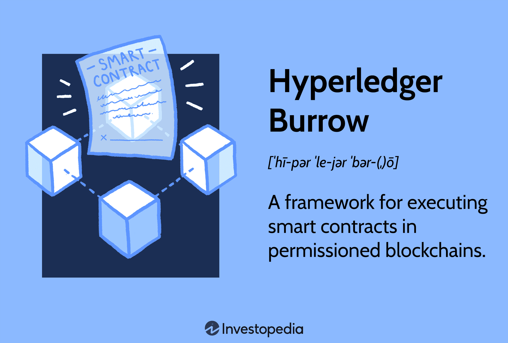

The intersection of blockchain technology and financial trading is an area of growing interest and importance, as both fields undergo rapid evolution and adoption. Blockchain technology, with its decentralized and immutable ledger system, provides unparalleled transparency and security in digital transactions, making it an attractive innovation for multiple industries, particularly finance. One compelling project in this space is Hyperledger Burrow, a modular blockchain client that highlights the integration of blockchain in executing smart contracts. These smart contracts are self-executing agreements with the terms of the contract directly written into code, offering the ability to automate and streamline complex processes with efficiency and accuracy.

Algorithmic trading, which involves the use of complex algorithms to execute trades at high speeds and volumes, thrives on the need for efficient and rapid execution of financial transactions. The integration of blockchain technology into algorithmic trading platforms can play a pivotal role by enhancing security and speed, thus improving the trading process. By leveraging blockchain, trading systems can potentially benefit from an immutable and transparent process that reduces the risk of fraud and errors in transaction recording.



This article explores how Hyperledger Burrow, despite its project being sunsetted, can be leveraged specifically in algorithmic trading. By examining its architecture and features, the potential for contributing to the reliability and efficiency of trading systems becomes evident. Through these insights, we aim to shed light on the future possibilities where blockchain meets financial trading, potentially transforming the sector towards greater innovation and integrity.

## Table of Contents

## Understanding Hyperledger Burrow

Hyperledger Burrow was a modular blockchain client primarily focused on the execution of smart contracts. As part of the Hyperledger project, Burrow was designed to operate on permissioned blockchains, which are blockchains where access and information are restricted to specified users, thus providing a controlled and secure environment. This was particularly useful for enterprises that required efficient yet secure means to handle transactions.

One of the core features of Hyperledger Burrow was its use of a Byzantine Fault Tolerant (BFT) consensus mechanism. This mechanism played a critical role in ensuring the security and scalability of the blockchain. The BFT consensus model is designed to overcome the challenges of Byzantine Faults, which refer to failures in a system where components may fail and produce misleading information to different parts of the system. By effectively managing these faults, BFT consensus mechanisms improve the reliability and robustness of blockchain networks.

Burrow’s architecture was tailored to support enterprise needs, offering a closed blockchain environment suitable for commercial applications. This modular design enabled businesses to implement and execute complex smart contracts seamlessly within their platforms. These smart contracts are self-executing contracts with the terms of the agreement directly written into code. They facilitate the automatic execution of transactions once predetermined conditions are met, thus eliminating the need for intermediaries.

In essence, Hyperledger Burrow provided a framework that combined the transparency and efficiency of blockchain technology with the required privacy and control of enterprise applications, making it an important tool for businesses seeking to incorporate blockchain into their operations. Despite being sunsetted in 2022, Burrow’s innovations around permissioned blockchain environments and BFT consensus continue to influence developments in blockchain technology.

## Significance in Algorithmic Trading

Algorithmic trading, a dominant force in modern financial markets, employs sophisticated algorithms to execute trades at high velocities and vast volumes. The integration of blockchain technology, particularly platforms like Hyperledger Burrow, presents notable enhancements to this trading paradigm. 

Blockchain's inherent transparency and immutability serve as significant assets in trade verification processes. Every transaction recorded on a blockchain is verifiable and permanent, reducing the opportunity for errors or fraudulent activities. This robust verification mechanism ensures accuracy in trade execution and settlement, fostering trust among market participants.

Hyperledger Burrow, with its focus on smart contracts, offers a unique advantage in [algorithmic trading](/wiki/algorithmic-trading) systems. It facilitates the reduction of fraudulent activities by automating the execution of trades and ensuring that all conditions and triggers are met before execution. This mechanization leads to secure, swift transactions devoid of human intervention, thus minimizing the potential for manual errors or manipulations.

Moreover, the permissioned nature of Hyperledger Burrow is crucial for protecting sensitive trade data. Within a permissioned network, access is controlled and restricted to authorized entities. This feature is particularly beneficial for trading applications requiring confidentiality and security. Sensitive information, such as proprietary trading algorithms and strategies, can remain private while still harnessing the benefits of a decentralized ledger system.

In summary, the combination of blockchain's transparency and the controlled access provided by a platform like Hyperledger Burrow enhances the integrity of algorithmic trading processes. This integration supports a secure, efficient, and reliable trading environment, reinforcing confidence in the financial trading ecosystem.

## How Hyperledger Burrow Facilitates Algo Trading

Hyperledger Burrow facilitates algorithmic trading by streamlining the execution of contracts and minimizing delays in trade settlements. The key advantage of Burrow in this context lies in its ability to automate contract execution. This automation significantly reduces the time it takes to settle trades, which is crucial for algorithmic trading that relies on millisecond-level execution speeds.

Smart contracts running on Hyperledger Burrow can autonomously execute pre-defined trading strategies with high accuracy. These contracts are self-executing with the terms of the agreement directly written into code. This feature allows for the seamless execution of trading strategies without the need for human intervention, ensuring precision and consistency in executing trades. For example, a Python implementation of such a smart contract could involve logic that triggers buy or sell orders based on real-time market data inputs:

```python
def trade_strategy(market_data):
    if market_data['price'] < BUY_THRESHOLD:
        execute_trade('buy', market_data['volume'])
    elif market_data['price'] > SELL_THRESHOLD:
        execute_trade('sell', market_data['volume'])

def execute_trade(action, volume):
    # Implement trade execution logic here
    pass
```

Moreover, Hyperledger Burrow operates as a decentralized ledger, which means every transaction is recorded permanently and is tamper-proof. This characteristic ensures the integrity of trading records, which is essential for maintaining trust in the financial markets. Transparency in transaction records helps in verifying trades, thereby reducing the risk of disputes and errors.

In addition to enhancing transparency, this decentralized approach substantially mitigates the need for middlemen such as clearinghouses and brokers. By reducing reliance on these intermediaries, Burrow can lower transaction costs, which is a significant benefit for high-frequency trading operations. The removal of middlemen also reduces the associated time delays, thereby improving the overall speed and efficiency of trading systems enabled by blockchain technology.

Through these mechanisms, Hyperledger Burrow significantly enhances the operational efficiencies of algorithmic trading, marrying the robustness of blockchain technology with the rigorous demands of modern financial markets.

## Challenges and Limitations

Blockchain integration in trading presents certain challenges and limitations that need careful consideration. Despite its potential, the transition from traditional trading systems to blockchain-based models involves substantial technological shifts. Traditional systems have been optimized over decades for speed and efficiency in high-frequency trading environments. In contrast, blockchain technology, while offering transparency and security, often contends with latency and scalability issues. The decentralized nature of blockchain requires consensus protocols, which can introduce delays in transaction processing, affecting the rapid execution required in algorithmic trading.

Hyperledger Burrow, a modular blockchain client known for supporting smart contracts, was anticipated to address some of these challenges. However, it was sunsetted in 2022, hindering its adoption in novel applications. The cessation of Burrow means that potential users must look for alternative blockchain solutions or develop new systems inspired by its architecture, potentially slowing the pace at which blockchain technology is integrated into trading systems.

Another significant hurdle in adopting blockchain for trading is ensuring compatibility with existing systems. Traditional trading platforms have a well-established infrastructure and a plethora of proprietary systems and protocols. Seamlessly integrating blockchain solutions requires overcoming technical barriers, such as data interoperability and system integration. Ensuring that new blockchain systems can communicate effectively with legacy systems is crucial to maintaining operational continuity and reliability.

Moreover, managing regulatory compliance remains a formidable challenge. Financial markets are heavily regulated to prevent fraud and protect investors. Blockchain's decentralized nature can complicate regulatory oversight and data control, raising concerns among financial regulators. Ensuring that blockchain platforms comply with existing financial regulations and can adapt to new rules is essential for broader adoption in trading.

While pioneering, the integration of blockchain like Hyperledger Burrow in trading reveals these complex challenges, underscoring the need for ongoing research and development to advance blockchain solutions that can efficiently meet the demands of modern trading ecosystems.

## Future Prospects

Advancements in blockchain technology hold considerable promise for addressing lingering issues of latency and scalability, making it increasingly viable for adoption in algorithmic trading. The evolution of Layer 2 solutions, such as state channels and sidechains, can significantly enhance transaction throughput and reduce latency, which are critical factors in high-frequency trading environments. As these technologies mature, there is potential for integrating the smart contract principles pioneered by Hyperledger Burrow into contemporary trading ecosystems.

Emerging blockchain frameworks are focusing on interoperability and customization, which could see Burrow's smart contract execution model adopted within newer, more flexible platforms. The adaptability of blockchain is underlined by projects like Polkadot and Cosmos, which aim to connect disparate blockchain networks. These initiatives, through their interoperability features, may incorporate Burrow's efficient contract management to enable seamless trade execution across various financial platforms.

Research and development in blockchain continue to yield enhanced compliance and security protocols. Regulatory technologies (RegTech) integrated with blockchain can improve the transparency and traceability necessary for meeting stringent financial regulations. Furthermore, advancements in cryptographic methods such as zero-knowledge proofs and homomorphic encryption bolster data privacy and security, while ensuring compliance with evolving data protection regulations.

The interest from financial industries in blockchain solutions continues to grow, driven by the need for faster, more secure, and efficient transaction systems. Institutions are increasingly exploring blockchain's potential for reducing counterparty risk and improving trade settlement times. As the demand for such innovations rises, there is a likelihood that the foundational work of projects like Burrow could inspire new iterations or revivals, tailored to meet the specific demands of modern trading systems.

In conclusion, the future prospects of blockchain in algorithmic trading rest on continued technological advances, which promise to refine efficiency and expand the integration of blockchain into traditional financial systems. By building upon the groundwork laid by projects like Hyperledger Burrow, the financial industry is poised to develop robust blockchain platforms that further streamline and secure trading operations.

## Conclusion

Hyperledger Burrow, despite being sunsetted, demonstrated significant potential in the realm of financial applications, particularly through its integration of blockchain technology and smart contracts. These features foster exceptional transparency, speed, and security in digital transactions, which are essential in the fast-paced environment of algorithmic trading.

The transparency and immutability of blockchain can significantly enhance the verification process of financial trades, effectively reducing opportunities for fraud. Furthermore, blockchain's decentralized nature ensures that all recorded trades are permanent and tamper-proof, thereby providing a more secure trading environment. This characteristic is invaluable for algorithmic trading, where transactions occur at high speeds and volumes. The ability of blockchain to handle these transactions efficiently while maintaining data integrity is a considerable advantage.

The groundwork laid by Hyperledger Burrow offers a viable foundation for future developments in blockchain platforms tailored for trading. Concepts such as automated contract execution and the elimination of middlemen, which Burrow facilitated, are crucial in reducing transaction costs and improving trading efficiency. Going forward, advancements in blockchain technology could further resolve existing challenges like latency and scalability, making blockchain even more suitable for modern trading ecosystems.

The potential convergence of blockchain and financial trading presents a transformative opportunity for financial systems. By fostering greater transparency and efficiency, blockchain can reshape trading operations, possibly leading to more robust and secure financial systems. As interest from the financial industry continues to grow, future iterations of projects akin to Hyperledger Burrow could emerge, potentially revolutionizing the backdrop of algorithmic trading and financial transactions.

## References & Further Reading

[1]: Monrat, A. A., Schelén, O., & Andersson, M. (2019). ["A Survey of Blockchain from the Perspectives of Applications, Challenges, and Opportunities."](https://ieeexplore.ieee.org/document/8805074) IEEE Access.

[2]: Szabo, N. (1997). ["Formalizing and Securing Relationships on Public Networks."](https://firstmonday.org/ojs/index.php/fm/article/view/548) First Monday, 2(9).

[3]: Mougayar, W., & Buterin, V. (2016). ["The Business Blockchain: Promise, Practice, and Application of the Next Internet Technology."](https://books.google.com/books/about/The_Business_Blockchain.html?id=CEsPDAAAQBAJ) Wiley.

[4]: Orcutt, M. (2019). ["Once Hailed as Unhackable, Blockchains Are Now Getting Hacked."](https://www.technologyreview.com/2019/02/19/239592/once-hailed-as-unhackable-blockchains-are-now-getting-hacked/) MIT Technology Review.

[5]: Buterin, V. (2014). ["A Next-Generation Smart Contract and Decentralized Application Platform."](https://ethereum.org/content/whitepaper/whitepaper-pdf/Ethereum_Whitepaper_-_Buterin_2014.pdf) Ethereum White Paper.