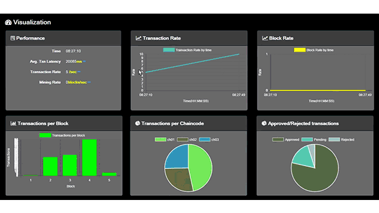

The rise of blockchain technology has significantly transformed a wide array of industries by offering decentralized and secure solutions. This shift has driven the adoption and development of various tools and platforms tailored to capitalize on the blockchain's potential. Among these tools, Hyperledger Composer distinguishes itself with unique features and capabilities that cater specifically to the demands of blockchain development. Designed to support both novices and seasoned developers, Hyperledger Composer serves as an instrumental resource in creating sophisticated and efficient blockchain applications.

Over the years, blockchain's influence has extended well beyond its initial financial sector foothold, revolutionizing supply chain management, healthcare, and more. While blockchain's intrinsic qualities of immutability, transparency, and security have been universally recognized, the development process often remained complex. Hyperledger Composer aims to overcome these challenges by providing a framework that simplifies blockchain application development. Its integration with Hyperledger Fabric is particularly noteworthy, as it enhances the ability to deploy scalable solutions efficiently, which is essential for handling complex business processes seamlessly.



One of the most exciting areas where Hyperledger Composer has shown potential is in algorithmic trading. Here, the demand for secure, high-speed, and transparent operations is paramount. By leveraging its capabilities, developers and businesses can create systems that not only meet these stringent requirements but also offer decentralization benefits, reducing the risks commonly associated with centralized financial operations. This application underscores the toolset's value in sectors where accuracy and speed are critical.

In this article, we explore Hyperledger Composer’s impact and implementation in blockchain development, its core components, and why it continues to be an invaluable asset, despite being deprecated. By examining use cases across various domains, we illustrate how this toolset contributes to the successful deployment of enterprise-level blockchain projects, reaffirming the central role that modern development tools play in today's technology ecosystem. Through Hyperledger Composer, businesses are enabled to harness the full potential of blockchain technologies, ensuring advanced, reliable, and efficient solutions.

## Table of Contents

## What is Hyperledger Composer?

Hyperledger Composer is an open-source toolbox crafted for the facilitation and simplification of blockchain application development. As a significant part of the broader Hyperledger project hosted by The Linux Foundation, Hyperledger Composer aims to simplify and streamline the deployment of blockchain networks. 

By rendering business-centric abstractions and an integrated development environment, Hyperledger Composer allows developers to connect new blockchain technologies to existing enterprise systems effectively. This feature ensures that organizations can integrate blockchain solutions seamlessly with their current infrastructure and business processes, enhancing the overall utility of blockchain technologies in practical applications.

Despite its deprecated status as of August 2020, Hyperledger Composer continues to influence the sphere of blockchain application development significantly. This influence is largely attributed to its domain-specific build capabilities that allow businesses to model their network using common language concepts such as assets, participants, transactions, and business logic. By offering these features, Hyperledger Composer aids in bridging the often complex gap between technical blockchain frameworks and practical business operations.

The intuitive and user-friendly nature of Hyperledger Composer empowers not only developers but also non-developers to contribute meaningfully to blockchain project development. This inclusive approach opens up opportunities for a broader range of professionals to participate in and leverage blockchain technology for enterprise solutions, thus democratizing blockchain application development. 

By abstracting the complexities of blockchain development, Hyperledger Composer has enabled a faster, more accessible pathway for organizations looking to implement blockchain solutions, ensuring that the promise of blockchain can be realized across various industry verticals.

## Understanding Blockchain Development with Composer

Hyperledger Composer streamlines blockchain development through its distinctive business network modeling tools and domain-specific language. By utilizing a high-level language, it empowers both business users and developers to articulate assets, transactions, and participant interactions without delving into complex programming constructs.

At the core of Hyperledger Composer's functionality is its ability to simplify the definition and operation of blockchain components. Developers can use Composer to establish models that define assets, their properties, and the transactions permitted within a network. This level of abstraction ensures that business objectives are clearly represented, promoting better alignment between technical and non-technical stakeholders.

The architecture of Composer is designed to facilitate rapid prototyping and the easy customization of blockchain applications. Its modular design allows developers to quickly test different models and iterate on their designs, adapting to the fast-paced needs of modern enterprises. This flexibility makes it a powerful tool for companies seeking to quickly adapt blockchain solutions to evolving business conditions.

Composer Playground, an intuitive web-based interface, plays a crucial role in making blockchain development more accessible. This interface supports real-time testing and collaboration, enabling multiple users to work on blockchain models simultaneously. The immediate feedback loop provided by the Playground enhances the development experience, reducing the time from conceptualization to deployment.

Moreover, Hyperledger Composer supports the automatic generation of REST APIs. This feature is particularly beneficial for enterprises, as it facilitates seamless integration between new blockchain applications and existing systems. The ability to create REST APIs ensures that businesses can enhance their infrastructure incrementally, without the need for extensive system overhauls. This not only accelerates the development process but also reduces the learning curve associated with adopting blockchain technology.

In summary, Hyperledger Composer is pivotal in making the development and deployment of blockchain applications more accessible and efficient. Its blend of modeling tools, user-friendly interfaces, and integration capabilities are integral in bridging the gap between business processes and blockchain technology, making it an invaluable asset for innovative enterprise solutions.

## Integrating Hyperledger Composer with Hyperledger Fabric

Hyperledger Fabric is a permissioned blockchain network, renowned for its robustness in developing scalable enterprise-grade applications. It is characterized by its modular architecture, which allows for customization regarding consensus mechanisms and membership services. Hyperledger Composer enhances the capabilities of Fabric by providing an abstraction layer that allows for the modeling and deployment of comprehensive business networks. This combination optimizes blockchain application development for enterprises by allowing business stakeholders to contribute without deep coding expertise.

The integration process with Hyperledger Fabric involves defining the business logic within Composer. Composer's modeling capabilities create a Business Network Definition (BND), encompassing assets, participants, and transaction logic. This business logic is then deployed as smart contracts—a set of executable code that runs on the Fabric network. These contracts are encapsulated within chaincode, which is the execution unit in Hyperledger Fabric. This structured flow ensures that business requirements are directly translated into executable blockchain logic, reducing the chance of misinterpretation.

In practical terms, here is a simplified example using Hyperledger Composer to define a business logic for a car dealership network:

```javascript
// Define the asset: Car
asset Car identified by vin {
  o String vin
  o String make
  o String model
  o DateTime registrationDate
}

// Define the participant: Dealer
participant Dealer identified by dealerId {
  o String dealerId
  o String dealerName
}

// Define a transaction: SellCar
transaction SellCar {
  --> Car car
  --> Dealer newOwner
}

// Updating the car owner in the transaction logic
function onSellCar(tx) {
  tx.car.owner = tx.newOwner;
  emit(new TransferEvent({car: tx.car}));
}
```

This integration allows developers to leverage Fabric’s powerful transactional capabilities, such as endorsement policies and pluggable consensus, while maintaining the flexibility afforded by Composer's intuitive modeling tools. Fabric's transactional model ensures that even complex transactions with multiple inputs and outputs can be processed rapidly and with assured integrity.

Organizations benefit from this synergy as it provides a robust framework for achieving business objectives with blockchain technology. By leveraging the combined power of Hyperledger Fabric and Composer, enterprises can ensure secure, efficient, and scalable implementations of blockchain solutions. This form of integration attracts those seeking to implement comprehensive blockchain projects, as the duo provides a seamless pathway from business concepts to blockchain deployment. Despite Composer's deprecated status, its ability to bridge business and technology layers continues to deliver value, particularly in environments where rapid, adaptable, and collaborative blockchain networks are essential.

## Algorithmic Trading and Blockchain Technology

Algorithmic trading has transformed the financial landscape by enabling trades to be executed at high speeds using sophisticated mathematical models. This automation relies on algorithms to analyze market data and make decisions about buying or selling assets. The introduction of blockchain technology into this field presents opportunities to enhance transparency, security, and efficiency in financial trading.

Blockchain technology, with its decentralized and immutable ledger, ensures that every transaction is recorded and visible to all participants in the network. This transparency reduces the risk of errors and fraud, a significant concern in traditional trading systems. Additionally, the security offered by blockchain's cryptographic features mitigates the potential for unauthorized access and manipulation of trading data, which is critical for maintaining trust in high-frequency and institutional trading environments.

Hyperledger Composer, a tool for modeling and automating business networks on blockchain, is particularly well-suited for [algorithmic trading](/wiki/algorithmic-trading) applications. It allows developers to model complex trading systems and define trading logic through the creation of smart contracts. These smart contracts can execute trades automatically based on predefined rules, reducing the need for manual intervention.

For example, consider a trading algorithm that automatically buys a stock when its price drops below a certain threshold and sells it when the price rises above another threshold. Using Hyperledger Composer, one can create a smart contract to automate this process. Here is a simple conceptual Python example of such logic:

```python
class TradingAlgorithm:
    def __init__(self, buy_threshold, sell_threshold):
        self.buy_threshold = buy_threshold
        self.sell_threshold = sell_threshold

    def execute_trade(self, current_price):
        if current_price < self.buy_threshold:
            return "Buy"
        elif current_price > self.sell_threshold:
            return "Sell"
        else:
            return "Hold"

# Example usage
trading_algo = TradingAlgorithm(buy_threshold=100, sell_threshold=150)
trade_decision = trading_algo.execute_trade(current_price=120)
print(trade_decision)  # Output: Hold
```

Integrating blockchain into algorithmic trading systems introduces decentralized trust, minimizing the risks associated with centralized control and potential conflicts of interest. This decentralization is beneficial for reducing the possibility of fraud and manipulation, which are major concerns in high-speed trading environments.

Moreover, the use of blockchain in algorithmic trading enables the creation of a more reliable and auditable trail of transactions. This feature is particularly valuable for compliance and regulatory purposes, where transparency and traceability are crucial.

The integration of blockchain technology using Hyperledger Composer in algorithmic trading environments can significantly enhance the robustness and trustworthiness of trading operations. This advancement holds promise for further innovations in the financial sector, as it opens new pathways for secure, efficient, and transparent trading practices essential for contemporary financial markets.

## Advantages and Special Considerations

Hyperledger Composer offers distinct advantages that make it an attractive choice for blockchain application development. One of its primary benefits is the streamlined deployment pathway it provides, offering developers a more accessible entry point than traditional environments. This ease of use allows projects to go from conception to implementation more swiftly, providing a competitive edge in rapidly evolving sectors. The modular architecture of Composer permits the reuse of components, which not only speeds up development times but also plays a crucial role in reducing overall costs for enterprises. This reusability empowers businesses to leverage pre-existing models and templates, facilitating a more efficient allocation of resources.

Even though Hyperledger Composer has been officially deprecated, projects that still utilize it benefit from a stable and robust ecosystem. Documentation and community forums continue to offer substantial support. This ongoing community engagement ensures that existing projects maintain operational stability and receive necessary updates and troubleshooting advice, contributing to the longevity and reliability of Composer-driven implementations.

When using Composer, certain considerations must be taken into account. Regular testing remains indispensable to ensuring the integrity and performance of blockchain applications. Moreover, businesses must remain mindful of the eventual requirement to transition to alternative or more contemporary tools for new projects, bearing in mind the current status of Composer. Adopting a strategic approach in planning this transition can mitigate disruption and ensure continuity in development processes.

Despite its deprecation, Hyperledger Composer remains a viable choice for rapidly deploying permissioned blockchain networks, particularly in controlled, enterprise-focused settings. Its integration with business systems and rapid prototyping capabilities provide organizations with a powerful tool to meet specific business objectives while enjoying the structured control offered by permissioned networks. The combination of these elements in Composer allows organizations to harness blockchain technology effectively, delivering meaningful outcomes without undue complexity or delay.

## Conclusion

Hyperledger Composer has played a pivotal role in bridging the gap between technical and business domains within the field of blockchain application development. By offering an accessible and user-friendly platform, it has emerged as a preferred choice for those endeavoring to implement enterprise-grade blockchain solutions. Its features allow both developers and business professionals to collaborate effectively, thereby simplifying the complexities generally associated with blockchain technology.

The seamless integration of Hyperledger Composer with Hyperledger Fabric has been instrumental in expanding its utility across diverse industries, notably in areas such as algorithmic trading. Here, its capabilities in modeling complex systems and automating smart contracts can be applied to improve transparency, security, and efficiency. These advantages underline Hyperledger Composer's potential in enhancing industry operations through innovative blockchain applications.

Despite being deprecated, Hyperledger Composer remains a valuable asset for businesses that have integrated its features into their operations. The stability and support provided by existing documentation and community forums ensure sustained functionality for ongoing projects. While newer tools may eventually replace it, businesses can still leverage Composer's existing projects for permissioned blockchain networks.

Looking to the future, it is anticipated that developments in blockchain technology will build upon the groundwork laid by Composer, paving the way for more sophisticated solutions. As new technologies continue to evolve, the foundational principles established by Composer are likely to inspire more innovative and efficient applications in the wider blockchain ecosystem.

## References & Further Reading

[1]: Swan, M. (2015). ["Blockchain: Blueprint for a New Economy"](https://books.google.com/books/about/Blockchain.html?id=RHJmBgAAQBAJ). O'Reilly Media.

[2]: Giesbertz, J., & Owens, B. (2018). ["Mastering Hyperledger Fabric"](https://www.amazon.com/Mastering-Hyperledger-Fabric-Master-Kubernetes-ebook/dp/B084KZP9M7). Packt Publishing.

[3]: ["Hyperledger Composer Documentation"](https://hyperledger.github.io/composer/latest/introduction/introduction.html), Hyperledger Project.

[4]: Buterin, V. (2013). ["Ethereum: A Next-Generation Smart Contract and Decentralized Application Platform"](https://ethereum.org/content/whitepaper/whitepaper-pdf/Ethereum_Whitepaper_-_Buterin_2014.pdf).

[5]: Narayanan, A., Bonneau, J., Felten, E., Miller, A., & Goldfeder, S. (2016). ["Bitcoin and Cryptocurrency Technologies: A Comprehensive Introduction"](https://press.princeton.edu/books/hardcover/9780691171692/bitcoin-and-cryptocurrency-technologies). Princeton University Press.

[6]: "Algorithmic Trading & DMA: An introduction to direct access trading strategies" by Barry Johnson.