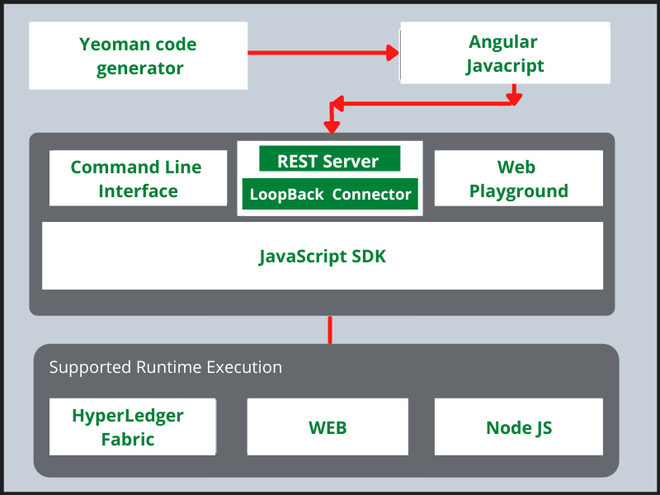

## Table of Contents

## What is Hyperledger Composer?

Hyperledger Composer is a tool that helps people build blockchain applications more easily. It is part of the Hyperledger project, which is a group of open-source blockchain technologies. Composer makes it simpler to create, test, and deploy blockchain solutions without needing to know all the complicated details of how blockchains work. It uses a visual interface and simple programming languages, so even people who are not experts in blockchain can use it.

With Hyperledger Composer, you can define the different parts of your blockchain application, like the data it will store, the rules it will follow, and the ways people can interact with it. This is done through something called a business network definition. Once you have set up your business network, you can use Composer to run it on different blockchain platforms that are part of Hyperledger, like Hyperledger Fabric. This makes it flexible and useful for many different kinds of businesses and applications.

## What are the main components of Hyperledger Composer?

Hyperledger Composer has several main parts that help you build a blockchain application. The first part is the Business Network Definition, which is like a blueprint for your blockchain. It includes four things: the Model File, which describes the data your blockchain will store; the Script File, which has the rules or logic your blockchain will follow; the Access Control File, which decides who can do what on the blockchain; and the Query File, which helps you find information on the blockchain.

The second part is the Playground, a tool that lets you create, test, and deploy your Business Network Definition easily. It has a visual interface where you can see and change your blockchain setup without writing a lot of code. The third part is the Command Line Interface (CLI), which is useful if you prefer to work with commands instead of a visual tool. It helps you manage and deploy your blockchain application from the command line.

The last part is the REST Server, which helps your blockchain talk to other applications. It turns the blockchain data into a format that other software can understand and use. Together, these parts make it easier for people to build and use blockchain applications without needing to be experts in blockchain technology.

## How does Hyperledger Composer simplify blockchain application development?

Hyperledger Composer makes it easier to build blockchain applications by providing tools that take away a lot of the hard work. It uses a simple way to describe what your blockchain will do, called a Business Network Definition. This definition includes things like what data you will store, what rules your blockchain will follow, who can do what, and how to find information. Instead of writing complicated code, you can use a visual tool called the Playground to set all this up. It's like drawing a picture of your blockchain instead of writing a long book about it.

Once you have your Business Network Definition ready, Hyperledger Composer helps you test it and make it work on different blockchain platforms, like Hyperledger Fabric. You can use the Playground to try out your blockchain and see if it works the way you want. If you like working with commands, there's also a Command Line Interface that lets you do everything from the command line. And if you need your blockchain to work with other software, the REST Server can help by turning your blockchain data into a format that other programs can understand. This way, Hyperledger Composer makes building blockchain applications simpler and faster for everyone.

## What programming languages can be used with Hyperledger Composer?

Hyperledger Composer mainly uses JavaScript for writing the rules or logic of your blockchain. This means you can use JavaScript to tell your blockchain what to do when certain things happen. It's a popular language that many people know, so it makes it easier for more people to work with Hyperledger Composer.

Besides JavaScript, you can also use other languages to interact with your blockchain through the REST Server. For example, if you want to connect your blockchain to a website or an app, you can use languages like Python, Java, or even Node.js. This makes Hyperledger Composer flexible because it can work with different kinds of software and programming languages.

## How do you set up a development environment for Hyperledger Composer?

To set up a development environment for Hyperledger Composer, you first need to make sure your computer has the right tools. You'll need Node.js and npm (Node Package Manager) installed. Node.js is a program that lets you run JavaScript on your computer, and npm helps you install other tools you'll need. Once you have those, you can use npm to install Hyperledger Composer itself. You do this by opening a command line window and typing a command to install the Composer CLI (Command Line Interface). This will give you the tools to create and manage your blockchain applications.

After installing the Composer CLI, you'll want to set up the Hyperledger Composer Playground. The Playground is a web-based tool that makes it easy to create, test, and deploy your blockchain applications. You can run the Playground locally on your computer or use an online version. To run it locally, you'll need to install Docker, which is a tool that helps you run other programs easily. Once Docker is set up, you can start the Playground with a simple command. Now you're ready to start building your blockchain applications with Hyperledger Composer.

## What is a business network in the context of Hyperledger Composer?

In Hyperledger Composer, a business network is like a set of rules and data that helps different people and organizations work together on a blockchain. It's a way to describe how everyone involved will share information and do business. Think of it as a map that shows who can do what, what information is important, and how things should work together.

A business network in Hyperledger Composer is made up of different parts that you can define easily. You can say what kind of data, like contracts or products, will be stored on the blockchain. You can also set rules about what happens when certain things happen, like when a contract is signed. Plus, you can decide who gets to see or change the data. All these parts together make up the business network, which can then be used to build a working blockchain application.

## How can you define and deploy a business network using Hyperledger Composer?

To define a business network using Hyperledger Composer, you start by creating a Business Network Definition. This is like drawing a map of how your blockchain will work. You use simple files to describe what data you want to store, like contracts or products, and what rules should apply, like what happens when someone signs a contract. You also set up who can do what on the blockchain, making sure only the right people can see or change the data. All these parts together make up your business network, and you can create and test it using the Hyperledger Composer Playground, a tool that makes it easy to see and change your setup without writing a lot of code.

Once your Business Network Definition is ready, you can deploy it to a blockchain platform like Hyperledger Fabric. This means you take your map and turn it into a real, working blockchain application. You use the Hyperledger Composer CLI, which is a set of commands you type into your computer, to deploy your business network. After deployment, your blockchain is ready to use, and people can start interacting with it according to the rules you set up. If you need your blockchain to talk to other software, you can use the REST Server to make that happen easily.

## What are the roles of participants, assets, and transactions in Hyperledger Composer?

In Hyperledger Composer, participants are the people or organizations that use the blockchain. They can be buyers, sellers, or any other role you define. Each participant has an identity and can do certain things on the blockchain, like making deals or checking information. You decide what each participant can do by setting up rules in the business network. This helps keep the blockchain safe and makes sure everyone follows the rules.

Assets are the things that participants care about on the blockchain, like contracts, products, or money. They are the important pieces of data that get stored and moved around. You can describe what each asset looks like and how it can be changed. When participants want to do something with an asset, like buying a product, they use transactions. Transactions are the actions that happen on the blockchain, like buying, selling, or updating information. They follow the rules you set up, making sure everything happens the right way.

## How does Hyperledger Composer handle identity and access management?

In Hyperledger Composer, identity and access management is handled through a system that makes sure only the right people can do certain things on the blockchain. You set up different roles for the people or organizations, called participants, who will use the blockchain. Each participant gets an identity, which is like a special key that lets them into the blockchain. You can decide what each participant is allowed to do by writing rules in the Access Control File, which is part of the Business Network Definition. This file says who can see or change the data on the blockchain, making sure everything stays safe and secure.

For example, if you have a business network for buying and selling products, you might have participants like buyers and sellers. You can set rules so that only buyers can see the list of products for sale, and only sellers can add new products to the list. When someone tries to do something on the blockchain, like buying a product, the system checks their identity and the rules you set up to see if they are allowed to do it. If they are, the transaction goes through; if not, it gets stopped. This way, Hyperledger Composer helps keep the blockchain safe and makes sure everyone follows the rules you set.

## What are some common use cases for applications built with Hyperledger Composer?

One common use case for applications built with Hyperledger Composer is supply chain management. Companies can use it to track products as they move from the factory to the store. Each step of the journey, like when a product is made, shipped, or received, can be recorded on the blockchain. This helps everyone involved see where the product is and makes sure it's handled correctly. It's especially useful for things like food, where knowing where it came from is important for safety and quality.

Another use case is for managing contracts and agreements. Businesses can use Hyperledger Composer to create smart contracts, which are agreements that automatically do what they say when certain things happen. For example, if someone pays for a service, the smart contract can automatically release the service to them. This makes things faster and less likely to have mistakes because everything is done by the rules set in the blockchain.

A third use case is in healthcare, where Hyperledger Composer can help manage patient records securely. Hospitals and doctors can share information about patients on the blockchain, making sure only the right people can see it. This can help improve patient care because everyone has the latest information, and it keeps the data safe and private.

## How does Hyperledger Composer integrate with other Hyperledger projects like Fabric?

Hyperledger Composer makes it easy to work with other Hyperledger projects, like Hyperledger Fabric. Composer lets you create a business network, which is like a set of rules and data for your blockchain. Once you have your business network ready, you can use Composer to put it onto a Hyperledger Fabric blockchain. This means you can use all the strong security and smart contract features of Fabric with the easy-to-use tools of Composer. It's like building a house with easy-to-use Lego blocks and then putting it on a strong foundation.

When you want to use Hyperledger Composer with Fabric, you first set up your business network in Composer. Then, you use Composer's tools to turn that network into something Fabric can understand and run. This way, you can take advantage of Fabric's ability to handle different kinds of data and keep things safe, while still using Composer's simple way of setting up rules and managing who can do what. It makes building blockchain applications faster and easier, even if you're not an expert in how blockchains work.

## What are the limitations and future developments planned for Hyperledger Composer?

Hyperledger Composer has some limitations that people should know about. One big limit is that it only works with Hyperledger Fabric and not with other blockchain platforms. This can be a problem if you want to use a different blockchain. Also, Composer is not as good at handling very big and complex blockchain networks. If your business needs to deal with a lot of data and many users, you might find that Composer struggles to keep up. Lastly, since Composer is a tool that makes things easier, it might not give you all the control you need if you want to do something very specific or advanced with your blockchain.

For the future, the team behind Hyperledger Composer is working on making it better. They want to make it work with more blockchain platforms, not just Fabric. This would make Composer more useful for more people. They are also trying to make it better at handling big and complex networks, so it can work well for big businesses with lots of data. Another thing they are thinking about is adding more ways to control and customize the blockchain, so people can do more advanced things if they need to. These changes will help make Hyperledger Composer even easier to use and more powerful for building blockchain applications.

## References & Further Reading

[1]: Swan, M. (2015). ["Blockchain: Blueprint for a New Economy"](https://books.google.com/books/about/Blockchain.html?id=RHJmBgAAQBAJ). O'Reilly Media.

[2]: Giesbertz, J., & Owens, B. (2018). ["Mastering Hyperledger Fabric"](https://www.amazon.com/Mastering-Hyperledger-Fabric-Master-Kubernetes-ebook/dp/B084KZP9M7). Packt Publishing.

[3]: ["Hyperledger Composer Documentation"](https://hyperledger.github.io/composer/latest/introduction/introduction.html), Hyperledger Project.

[4]: Buterin, V. (2013). ["Ethereum: A Next-Generation Smart Contract and Decentralized Application Platform"](https://ethereum.org/content/whitepaper/whitepaper-pdf/Ethereum_Whitepaper_-_Buterin_2014.pdf).

[5]: Narayanan, A., Bonneau, J., Felten, E., Miller, A., & Goldfeder, S. (2016). ["Bitcoin and Cryptocurrency Technologies: A Comprehensive Introduction"](https://press.princeton.edu/books/hardcover/9780691171692/bitcoin-and-cryptocurrency-technologies). Princeton University Press.

[6]: "Algorithmic Trading & DMA: An introduction to direct access trading strategies" by Barry Johnson.