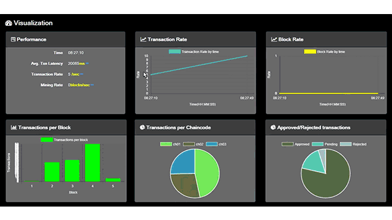

The integration of blockchain technology with algorithmic trading is revolutionizing the financial landscape, offering both new opportunities and complexities. At the core of this transformation are distributed ledger technologies, such as those developed under the Hyperledger umbrella. Hyperledger is crucial in advancing blockchain applications, providing foundational tools that enable robust, secure, and transparent transaction systems. Tools like Hyperledger Explorer play a significant role in this ecosystem, enabling users to gain insights into blockchain networks and make informed decisions by visualizing activities and monitoring real-time data streams.

The article aims to highlight the dual benefits brought by this technological synergy. On one hand, blockchain explorers contribute to enhanced transparency and traceability, essential for maintaining integrity within decentralized transactions. On the other hand, the integration of Hyperledger blockchain solutions with algorithmic trading systems opens up new possibilities for optimizing trading strategies and achieving operational efficiencies.



Understanding these advanced concepts allows businesses to harness blockchain's transformative power effectively. By leveraging blockchain technology, enterprises can improve the accuracy and reliability of trading data, thus enhancing decision-making processes. Moreover, the combination of blockchain's immutable data structures and algorithmic trading's precision-based execution provides a competitive edge in the fast-paced digital economy.

For blockchain enthusiasts, gaining insights into how these technologies intersect is vital. Similarly, for experts in algorithmic trading, exploring how distributed ledger technologies can improve trading systems is crucial to maintaining competitiveness. The convergence of these fields signifies an evolution in digital finance, promising improvements in transparency, security, and efficiency.

## Table of Contents

## Understanding Distributed Ledgers and Hyperledger

Distributed ledgers are databases that are decentralized, allowing information to be stored across multiple nodes or computing devices. This architecture provides enhanced transparency and security because each node in the network maintains and updates the ledger independently, and an immutable record of transactions is formed through consensus. Traditional centralized databases are susceptible to single points of failure and manipulation, but distributed ledgers mitigate these risks by ensuring that no single authority controls the entire database.

Hyperledger, an open-source umbrella project hosted by The Linux Foundation, is designed to advance cross-industry blockchain technologies. The project's goal is to enable the creation of enterprise-grade blockchain applications through its diverse portfolio of frameworks and tools. 

Hyperledger Fabric is one of the key components, known for its modular architecture that allows developers to create custom blockchain networks tailored to specific business needs. Fabric employs a permissioned network approach, which provides controlled access to sensitive information by allowing only verified participants to join the network. This is particularly advantageous for enterprises seeking to safeguard data privacy while harnessing the transparency of blockchain technology.

Another notable framework under the Hyperledger umbrella is Sawtooth, which offers a robust platform for building, deploying, and running distributed ledgers. Sawtooth's architecture is distinct for its ability to support consensus mechanisms other than the widely-used proof of work, including the innovative Proof of Elapsed Time (PoET), which emphasizes energy efficiency.

The modularity inherent in both Fabric and Sawtooth permits businesses to configure and optimize their blockchain implementations to meet various operational requirements. This capability is critical for tailoring blockchains to specific applications, such as supply chain tracking, digital identity verification, or financial services.

Hyperledger's versatility has made it increasingly attractive to enterprises interested in integrating blockchain into their operations. Its frameworks not only provide the building blocks for developing scalable solutions but also support interoperability with existing systems, ensuring seamless integration into current business processes. By leveraging Hyperledger, companies can harness blockchain's potential to enhance data integrity, streamline transactions, and reduce costs associated with intermediaries.

In summary, distributed ledgers like those supported by Hyperledger provide a decentralized, secure, and transparent way of managing data across multiple nodes. By utilizing Hyperledger's flexible tools and modular components, enterprises can design blockchain networks tailored to their specific needs, thereby unlocking new opportunities for efficiency and innovation.

## Key Features of Hyperledger Explorer

Hyperledger Explorer is a versatile web-based tool designed to visualize blockchain activities within Hyperledger Fabric deployments. It serves as a comprehensive real-time dashboard that allows users to monitor transactions, blocks, and smart contracts, which are critical components of any blockchain environment. This feature makes Hyperledger Explorer an essential tool for developers and network administrators who need to maintain and manage blockchain applications effectively.

One of the primary attractions of Hyperledger Explorer is its user-friendly interface. This design ensures that users, regardless of their technical expertise, can navigate through the tool's features with ease. The intuitive interface simplifies the complex process of blockchain data visualization, thereby streamlining operational workflows.

Another significant feature of Hyperledger Explorer is its support for APIs that facilitate integration with other software systems. This capability ensures seamless data flow and interaction within the broader ecosystem where Hyperledger Fabric operates. By leveraging these APIs, developers can build custom applications that draw on real-time blockchain data to drive business solutions.

Real-time blockchain data monitoring is crucial for maintaining the accuracy and integrity of the blockchain networks. Hyperledger Explorer excels in this area, connecting users to live blockchain data, thereby empowering them to make informed operational decisions. The tool's ability to handle multiple channels further enhances its utility, as it can process and relay extensive volumes of data across various blockchain network segments.

Hyperledger Explorer also offers a degree of customization, allowing users to adjust settings to meet specific operational requirements. This customization enhances the tool's adaptability to different business needs, making it highly valuable for organizations that require tailored blockchain solutions.

Advanced visualization capabilities are a hallmark of Hyperledger Explorer. Through sophisticated data representation techniques, users can extract meaningful insights from complex blockchain data. For instance, the tool enables users to view transaction flow visualizations and block details, aiding in the comprehensive analysis of blockchain operations.

The real-time updates provided by Hyperledger Explorer are vital for effective decision-making in blockchain environments. They ensure that users have access to the most current data, which is critical for maintaining the transparency and efficiency of blockchain operations. Thus, Hyperledger Explorer not only aids in real-time decision-making but also contributes to the overall integrity and reliability of the blockchain infrastructure it supports.

## Algorithmic Trading with Blockchain Technology

Algorithmic trading has revolutionized financial markets by implementing computer algorithms that execute trades based on predefined criteria. This approach optimizes trading efficiency through speed and precision, making it vital for modern trading strategies. The integration of blockchain technology into [algorithmic trading](/wiki/algorithmic-trading) presents significant enhancements by providing secure, transparent, and tamper-proof data streams, thereby addressing critical issues of fraud and data integrity.

Blockchains, as decentralized and immutable ledgers, offer a robust framework for storing and verifying transactional data. This capability is crucial in trading environments where the accuracy of data and the reliability of transaction records are paramount. By employing blockchain solutions, traders can effectively minimize fraud risks, as any alteration to the transaction history is preventable and easily detectable. Moreover, the cryptographic nature of blockchain ensures that data accuracy is maintained, providing an additional layer of trust and reliability.

The advantages of blockchain in algorithmic trading extend to enhancing auditability and compliance. Every transaction recorded on the blockchain is traceable and immutable, offering a transparent audit trail that can satisfy regulatory requirements. This characteristic improves the tracking of trade executions and settlements, enabling better compliance with financial regulations. The integration of blockchain facilitates real-time data validation and verification, ensuring that all trading activities are consistently aligned with the requisite legal frameworks.

For example, in a hypothetical blockchain-enabled trading system, each executed trade is recorded on a blockchain network. This record includes details such as the time of execution, price, and quantity, which are accessible to all authorized participants in real-time. Python code can be used to interact with blockchain APIs, fetching transaction data for further analysis. Here's a simple illustration of how such interaction might be structured:

```python
import requests

# Blockchain API endpoint
api_endpoint = "https://api.blockchainnetwork.com/transaction"

# Function to fetch transaction data
def get_transaction_data(transaction_id):
    response = requests.get(f"{api_endpoint}/{transaction_id}")
    if response.status_code == 200:
        return response.json()
    else:
        return None

transaction_data = get_transaction_data("sample_transaction_id")
print(transaction_data)
```

Such integration of blockchain data with algorithmic trading platforms also enhances performance and risk management. By ensuring that the data driving trading algorithms are secure and accurate, traders can fine-tune their models for better predictive accuracy and more informed decision-making. The incorporation of blockchain technology into these systems allows for real-time processing of high-quality data, which is essential for managing [volatility](/wiki/volatility-trading-strategies) and reducing exposure to unforeseen market risks.

In summary, blockchain technology not only bolsters the security and integrity of data used in algorithmic trading but also opens avenues for improved compliance, auditability, and overall risk management. As the technological landscape evolves, these synergistic benefits continue to shape the future of algorithmic trading, enabling traders to leverage blockchain for superior trading performance and strategic advantages.

## Integrating Hyperledger Blockchain and Algo Trading Systems

The integration of Hyperledger blockchain into algorithmic trading systems is a promising yet intricate endeavor that necessitates meticulous planning and execution. Hyperledger's modular architecture is particularly beneficial in this context, as it allows for the incorporation of blockchain technology into trading algorithms, enhancing both security and transparency.

The first step in this integration involves setting up the necessary network parameters. Hyperledger's configurable consensus mechanisms and permissioned nature ensure that only authorized entities can participate in the network, thereby bolstering security. For algorithmic trading systems, this means that sensitive trading data can be securely stored and transferred within a distributed ledger, reducing the risk of unauthorized access and data breaches.

Secure data transfer and its integrity are essential for the seamless operation of trading algorithms. Hyperledger provides APIs that facilitate the interaction between blockchain networks and trading systems, ensuring that data exchange is both efficient and secure. These APIs enable trading algorithms to fetch real-time data from the blockchain network, which is crucial for making timely trading decisions.

Additionally, adapting trading algorithms to leverage blockchain data involves modifying existing algorithms to interface with blockchain nodes and smart contracts. This might require rewriting certain components of the algorithm to process and analyze blockchain data effectively. Python, being a versatile programming language, can be employed to write scripts that interact with Hyperledger's APIs, thereby achieving seamless integration.

Here is a simple example in Python that demonstrates how Hyperledger's API can be used to pull blockchain transaction data, which can then be processed by an algorithm for trading purposes:

```python
import requests

def fetch_blockchain_data(api_endpoint):
    response = requests.get(api_endpoint)
    if response.status_code == 200:
        return response.json()
    else:
        raise Exception("Failed to fetch data")

def process_data(data):
    # Placeholder for data processing logic
    # Example: Extract trade signals based on transaction data
    pass

api_endpoint = 'https://hyperledger-api.example.com/transactions'
transaction_data = fetch_blockchain_data(api_endpoint)
process_data(transaction_data)
```

Incorporating blockchain data into trading practices has been successfully demonstrated in various real-life case studies. These cases underscore the tangible benefits of merging blockchain with algorithmic trading systems, highlighting improvements in trade execution and data integrity. For instance, the integration of blockchain has led to enhanced auditability and reduced settlement times, providing a competitive edge in high-frequency trading environments.

Overall, integrating Hyperledger blockchain with algo trading systems represents a significant advancement in the financial domain, offering unprecedented levels of security and operational efficiency. The challenges associated with this integration are outweighed by the potential benefits, which include improved data integrity, reduced transaction costs, and enhanced regulatory compliance.

## Future Trends and Conclusion

As blockchain and algorithmic trading technologies progress, new opportunities for innovation become apparent, promising to reshape the financial landscape. One of the most significant trends involves the increasing adoption of blockchain technology to enhance transparency and regulatory compliance in trading operations. Blockchain's inherent characteristics, such as immutability and distributed consensus, provide a reliable infrastructure for ensuring data integrity and auditability, which are critical for regulatory adherence.

Hyperledger, as part of the broader blockchain ecosystem, is continually evolving, with ongoing developments in its tools and platforms. The modular architecture and open-source nature of Hyperledger projects allow for the creation of tailored blockchain solutions, supporting more sophisticated and secure trading systems. These advancements enable organizations to build systems that not only meet current operational needs but also adapt to future regulatory and market changes.

By integrating distributed ledger technologies like Hyperledger into their operations, organizations can expect several benefits. Enhanced data accuracy and auditability lead to more informed and faster decision-making processes. Additionally, the reduction of transaction costs through automated smart contracts and the elimination of intermediaries can improve operational efficiencies. This strategic advantage is critical in the competitive financial markets, where speed and precision are paramount.

In conclusion, the integration of distributed ledger technologies, such as Hyperledger, with algorithmic trading systems is transformative for the financial industry. It offers a pathway to achieving unprecedented levels of transparency, efficiency, and compliance. Organizations that successfully leverage these technologies will not only enhance their trading capabilities but also secure a competitive edge in the rapidly evolving digital economy. As these technologies continue to evolve, they are expected to drive further innovations, shaping the future of trading and financial systems globally.

## References & Further Reading

[1]: ["Understanding Hyperledger Fabric"](https://medium.com/blockchain-hacks/understanding-hyperledger-fabric-a-comprehensive-overview-b84c783834c5), Hyperledger Project.

[2]: ["Blockchain Technology for Algorithmic Trading: The Future of Finance?"](https://www.researchgate.net/publication/380353743_The_Impact_of_Blockchain_Technology_on_Financial_Markets_and_Its_Future_Trends_An_Economic_Perspective_Based_on_Data_Analysis), Hindawi.

[3]: ["The Linux Foundation's Hyperledger Project"](https://www.hyperledger.org/), The Linux Foundation.

[4]: Androulaki, E., Barger, A., Bortnikov, V., Cachin, C., Christidis, K., et al. (2018). ["Hyperledger Fabric: A Distributed Operating System for Permissioned Blockchains."](https://arxiv.org/abs/1801.10228), arXiv:1801.10228.

[5]: Swan, M. (2015). ["Blockchain: Blueprint for a New Economy."](https://dl.acm.org/doi/book/10.5555/3006358) O'Reilly Media.