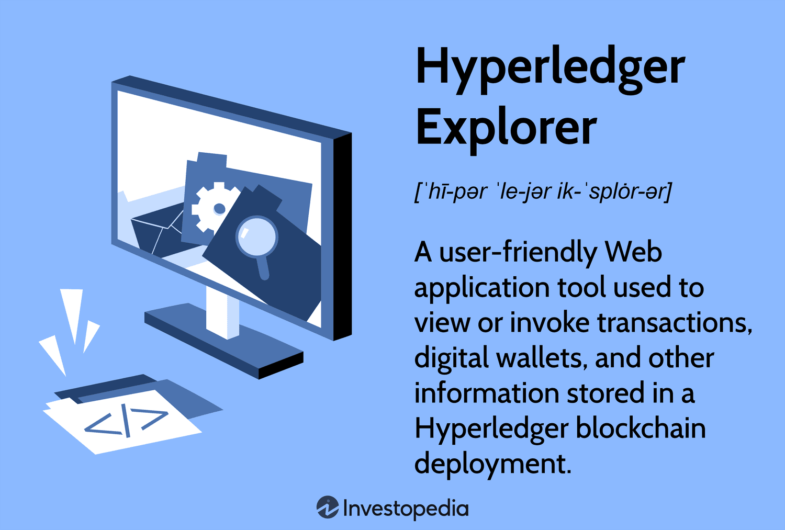

## Table of Contents

## What is Hyperledger Explorer?

Hyperledger Explorer is a tool that helps you look at what's happening in a blockchain network. It's like a window that lets you see all the transactions, blocks, and other important details without having to understand the complicated technical stuff behind it. This tool is especially useful for people who want to check the blockchain's activities, like business owners, developers, and regulators.

The main job of Hyperledger Explorer is to make the blockchain's information easy to understand and access. It shows you things like who is participating in the network, what transactions have happened, and how the network is performing. By using Hyperledger Explorer, you can keep an eye on the blockchain and make sure everything is running smoothly and transparently.

## What are the main components of Hyperledger Explorer?

Hyperledger Explorer has several important parts that work together to help you understand what's going on in a blockchain network. The first part is the user interface, which is like a dashboard that shows you all the information in a simple way. You can see things like blocks, transactions, and network participants. The user interface makes it easy for you to navigate and find the information you need without getting lost in technical details.

Another key part is the data processing layer. This part takes the raw data from the blockchain and turns it into something that the user interface can show you. It collects data from the blockchain network and organizes it so that you can see it clearly. This layer is important because it makes sure that the information you see is accurate and up-to-date.

Lastly, there's the integration with the blockchain network itself. Hyperledger Explorer connects directly to the blockchain nodes to get the latest information. This connection is what allows the tool to give you real-time updates on what's happening in the network. By working together, these components make Hyperledger Explorer a powerful tool for anyone who needs to keep an eye on a blockchain.

## How does Hyperledger Explorer interact with a blockchain network?

Hyperledger Explorer connects to a blockchain network by talking to the nodes in that network. Nodes are like the computers that keep the blockchain running. When Hyperledger Explorer wants to show you what's happening, it asks these nodes for the latest information. This way, it can give you real-time updates on things like new blocks, transactions, and who is participating in the network.

Once Hyperledger Explorer gets the information from the nodes, it uses a special part called the data processing layer. This part takes the raw data from the blockchain and makes it easier to understand. It organizes the data so that the user interface can show it to you in a simple way. This means you can see all the important details without needing to know the complicated technical stuff behind the blockchain.

## What types of data can Hyperledger Explorer display?

Hyperledger Explorer can show you a lot of different things about a blockchain network. It can display information about the blocks, which are like the pages of the blockchain's ledger. You can see details like the block number, the time it was created, and the transactions it contains. It also shows you data about the transactions themselves, like who sent what to whom, and how much was sent. This helps you keep track of all the activity happening on the blockchain.

Another type of data you can see is information about the network participants. Hyperledger Explorer can show you who is involved in the network, like the organizations or individuals that are running the nodes. It can also tell you about the status of these participants, whether they are active or not. This is useful for understanding who is helping to keep the blockchain running smoothly.

Lastly, Hyperledger Explorer can display performance metrics of the blockchain network. This includes things like how quickly transactions are being processed, the overall health of the network, and any issues that might be happening. By looking at these metrics, you can get a good idea of how well the blockchain is performing and if there are any areas that need improvement.

## How can Hyperledger Explorer be installed and configured?

To install Hyperledger Explorer, you first need to make sure your computer has the right software. You'll need things like Node.js, npm, and PostgreSQL. Once you have these, you can download the Hyperledger Explorer code from its GitHub page. After downloading, open a command line tool, go to the folder where you put the code, and run a command like 'npm install' to get all the extra pieces you need. Then, you can start setting it up by running another command like 'npm start' to see if everything works.

Configuring Hyperledger Explorer involves setting up a connection to your blockchain network. You'll need to edit a file called 'config.json' to tell Explorer where to find your blockchain nodes. In this file, you put in details like the network's address and the port it uses. You might also need to set up a database to store the blockchain data that Explorer will show you. Once you've made these changes, you can restart Explorer, and it should start pulling in data from your blockchain network. If everything is set up right, you'll be able to see all the blocks, transactions, and other details on the Explorer's user interface.

## What are the system requirements for running Hyperledger Explorer?

To run Hyperledger Explorer, your computer needs to have certain software installed. You'll need Node.js, which helps run the Explorer's code, and npm, which is used to manage the code's extra pieces. You also need PostgreSQL, a type of database that stores the blockchain data Explorer will show you. Make sure your computer has enough space and memory to handle these programs smoothly.

Once you have these basics, you should check that your computer meets the minimum hardware requirements. Usually, you'll need a decent amount of RAM, at least 4GB, and some free disk space, around 10GB or more, depending on how big your blockchain is. A good internet connection is also helpful because Explorer needs to talk to the blockchain nodes to get the latest information. If your computer can handle these requirements, you should be able to install and use Hyperledger Explorer without any problems.

## Can Hyperledger Explorer be integrated with other Hyperledger projects?

Yes, Hyperledger Explorer can be integrated with other Hyperledger projects. For example, it works well with Hyperledger Fabric, which is a popular blockchain platform. When you connect Explorer to Fabric, it can show you all the details about what's happening in your Fabric network, like blocks and transactions. This makes it easier to keep an eye on your blockchain and see how it's performing.

Another project it can work with is Hyperledger Besu, which is used for Ethereum-based networks. By integrating Explorer with Besu, you can monitor the Ethereum blockchain and see things like smart contract interactions. This integration helps you understand the activity on your Ethereum network and makes sure everything is running smoothly. So, Hyperledger Explorer is flexible and can be used with different Hyperledger projects to help you manage and monitor your blockchain networks.

## How does Hyperledger Explorer ensure data privacy and security?

Hyperledger Explorer takes care of data privacy and security by only showing the information that is meant to be public. It connects to the blockchain nodes in a way that respects the rules set by the network. This means it doesn't try to see or show anything that should be private. For example, if a transaction or a part of the blockchain is supposed to be confidential, Explorer won't display it. This helps keep sensitive information safe and makes sure only the right people can see what they need to.

Another way Hyperledger Explorer ensures security is by using strong connections to the blockchain nodes. It uses secure methods to talk to the nodes, making sure that the data it gets and shows is not tampered with. This secure connection helps prevent hackers from messing with the information. By following these practices, Hyperledger Explorer helps keep the blockchain data private and secure, so you can trust the information you see on the dashboard.

## What are the common use cases for Hyperledger Explorer in enterprise environments?

In enterprise environments, Hyperledger Explorer is often used to keep an eye on blockchain networks. Companies use it to check that everything is working as it should. For example, a business might use Explorer to see all the transactions happening on their supply chain blockchain. This helps them make sure that goods are moving correctly and that there are no delays or mistakes. It's like having a clear window into the blockchain, so they can quickly spot any issues and fix them before they become big problems.

Another common use is for auditing and compliance. Companies need to follow rules and laws, and Hyperledger Explorer helps them do that by showing all the details of what's happening on the blockchain. This makes it easier for them to prove that they are doing things the right way. For example, a bank might use Explorer to show regulators that their transactions are secure and follow the rules. By using Hyperledger Explorer, businesses can make sure they are transparent and trustworthy, which is important for keeping their customers and partners happy.

## How can Hyperledger Explorer's functionality be extended or customized?

Hyperledger Explorer's functionality can be extended or customized by changing its code. If you know how to code, you can add new features or change how it looks. For example, you might want to add a new graph to show more details about the blockchain's performance. Or, you might want to change the colors and layout of the dashboard to make it easier for your team to use. By making these changes, you can make Hyperledger Explorer work better for your specific needs.

Another way to customize Hyperledger Explorer is by using its APIs. APIs are like tools that let different software talk to each other. You can use these APIs to connect Hyperledger Explorer to other systems your company uses. For example, you could link it to your company's reporting software so that blockchain data automatically goes into your reports. This makes it easier to use the information from the blockchain in other parts of your business. By using APIs, you can make Hyperledger Explorer more useful and save time.

## What are the performance considerations when using Hyperledger Explorer with large blockchain networks?

When using Hyperledger Explorer with large blockchain networks, you need to think about how fast it can handle all the data. Big blockchains have a lot of transactions and blocks, so Explorer has to work hard to keep up. If your computer doesn't have enough power or memory, it might slow down or even stop working. That's why it's important to make sure your computer is strong enough to handle the load. You might need more RAM or a faster processor to keep everything running smoothly.

Another thing to consider is how often the data updates. With a large blockchain, new blocks and transactions are added all the time. Hyperledger Explorer needs to keep pulling in this new information without getting overwhelmed. If it can't keep up, you might not see the latest data right away. To help with this, you can set up the Explorer to update less often or use a more powerful server to handle the data flow. By thinking about these performance issues, you can make sure Hyperledger Explorer works well even with a big blockchain network.

## How does Hyperledger Explorer compare to other blockchain explorers in terms of features and capabilities?

Hyperledger Explorer is a tool that lets you look at what's happening in a blockchain network. It's made to work well with different Hyperledger projects like Fabric and Besu. One thing that makes it special is how it can be changed and added to, so you can make it fit your needs. For example, you can change how it looks or add new ways to see the data. It's also good at showing you things like blocks, transactions, and who's in the network, all in a way that's easy to understand. This makes it useful for businesses that want to keep an eye on their blockchain and make sure everything is running smoothly.

Compared to other blockchain explorers, Hyperledger Explorer has some unique features but also some limitations. For example, explorers like Etherscan are great for Ethereum networks and have a lot of extra tools like wallet tracking and smart contract analysis. Hyperledger Explorer doesn't have these specific tools, but it's very flexible and can be used with different types of blockchains. It's also good at showing data in real-time and can be set up to work with your own private blockchain, which might be more important for some businesses. So, while it might not have all the bells and whistles of some other explorers, its ability to be customized and integrated with various Hyperledger projects makes it a strong choice for certain use cases.

## References & Further Reading

[1]: ["Understanding Hyperledger Fabric"](https://medium.com/blockchain-hacks/understanding-hyperledger-fabric-a-comprehensive-overview-b84c783834c5), Hyperledger Project.

[2]: ["Blockchain Technology for Algorithmic Trading: The Future of Finance?"](https://www.researchgate.net/publication/380353743_The_Impact_of_Blockchain_Technology_on_Financial_Markets_and_Its_Future_Trends_An_Economic_Perspective_Based_on_Data_Analysis), Hindawi.

[3]: ["The Linux Foundation's Hyperledger Project"](https://www.hyperledger.org/), The Linux Foundation.

[4]: Androulaki, E., Barger, A., Bortnikov, V., Cachin, C., Christidis, K., et al. (2018). ["Hyperledger Fabric: A Distributed Operating System for Permissioned Blockchains."](https://arxiv.org/abs/1801.10228), arXiv:1801.10228.

[5]: Swan, M. (2015). ["Blockchain: Blueprint for a New Economy."](https://dl.acm.org/doi/book/10.5555/3006358) O'Reilly Media.