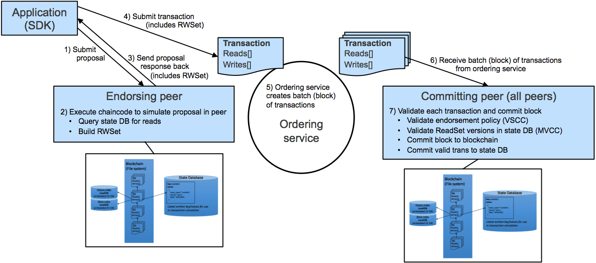

Blockchain technology has emerged as a transformative force in modern business solutions, offering a decentralized, transparent, and secure framework for data and transaction management. By leveraging distributed ledger technology, blockchain allows multiple parties to have access to a synchronized copy of a digital ledger, reducing opportunities for fraud and error. This attribute makes it particularly valuable in industries where data integrity and transparency are paramount, such as supply chain management, healthcare, and finance.

Hyperledger Fabric stands out as a notable example of an enterprise-grade, open-source distributed ledger platform. Developed under the auspices of the Linux Foundation, Hyperledger Fabric is designed to meet the diverse requirements of enterprise environments. It features a modular architecture, enabling businesses to plug in their preferred components, such as consensus algorithms and membership services, to tailor the blockchain framework to specific needs. Its permissioned network model ensures that all participating nodes have known identities, enhancing trust and security within the network.

Algorithmic trading, or algo trading, involves the use of computer algorithms to automate and optimize trading decisions and executions in financial markets. By employing pre-programmed trading instructions, algo trading can operate at speeds and efficiencies that are beyond human capabilities, allowing traders to capitalize on market opportunities in milliseconds. It plays a critical role in modern finance by ensuring liquidity, minimizing market impact, and executing trades with precision.

This article examines the intersection of Fabric 2.0 blockchain technology and algorithmic trading. It aims to explore how advancements in Hyperledger Fabric contribute to the efficacy and security of algo trading platforms. The exploration of this integration seeks to demonstrate the potential of blockchain to transform algorithmic trading practices, ensuring secure, efficient, and transparent transaction processes. Ultimately, the article highlights the growing importance of adopting these technologies to stay competitive in today's fast-evolving financial markets.

## Table of Contents

## Understanding Hyperledger Fabric 2.0

Hyperledger Fabric 2.0 represents a significant advancement in blockchain technology, particularly suited for enterprise solutions. Developed under the auspices of the Linux Foundation, Hyperledger Fabric is part of the Hyperledger project, an umbrella initiative designed to foster cross-industry blockchain technologies. Since its inception, Fabric has been developed collaboratively by a consortium of organizations, showcasing a commitment to open-source innovation and shared technological advancement.

**History and Development**

Hyperledger Fabric began its development journey with a goal to offer a robust, decentralized platform that could be easily adopted by businesses for a variety of applications ranging from supply chain management to finance. Initially released in 2015, Fabric was designed to address limitations found in popular blockchain platforms like Bitcoin and Ethereum, particularly those involving scalability and privacy. Fabric 1.0, released in 2017, introduced the notion of a permissioned blockchain facilitating greater control over data distribution and access.

**Features of Fabric 2.0**

Hyperledger Fabric 2.0 introduces several enhancements that build on its predecessor’s capabilities, particularly focusing on achieving high throughput and efficient transaction processing. One of the pivotal features is its enhanced smart contract functionality, which now allows for decentralized governance. Through a more collaborative and consensus-driven approach, organizations can agree on the terms and logic of the smart contracts before they are executed on the network. This ensures more reliability and security.

Other notable improvements include optimizations for processing transactions, reducing latency, and supporting a larger number of concurrent users. Fabric 2.0 supports a new lifecycle for smart contracts, which promotes a decentralized process allowing multiple stakeholders to reach consensus before a smart contract is deployed.

**Modular Architecture**

A defining characteristic of Hyperledger Fabric is its modular architecture, which offers significant benefits for enterprise blockchain solutions. This modular design provides flexibility in terms of consensus mechanisms, ledger storage, and membership services, allowing organizations to tailor the platform to meet specific business needs. For instance, developers can plug in their preferred consensus algorithm, making it possible to adjust the trust model as business requirements evolve.

The architecture allows components, such as consensus and membership services, to be swapped or updated independently. This decoupling not only enhances scalability but also simplifies the process of implementing upgrades and ensuring compatibility with legacy systems.

**Benefits for Enterprises**

The modular nature of Hyperledger Fabric enhances its appeal to enterprises by offering them the ability to customize the blockchain network according to their governance models and privacy needs. With its permissioned setup and support for confidential transactions via private data channels, Fabric allows enterprise users to manage data accessibility effectively, ensuring that sensitive information is shared only with authorized parties.

Moreover, the open-source framework of Hyperledger Fabric encourages innovation while reducing the cost associated with blockchain development. Organizations leveraging Fabric gain from the collective enhancements made by an active community of developers who continuously work to optimize the platform for diverse industry applications.

In summary, Hyperledger Fabric 2.0 builds upon a solid foundation, introducing advanced features and a more flexible architecture to meet the dynamic needs of modern enterprises. By providing a platform that emphasizes modularity, privacy, and enhanced transaction processing capabilities, Fabric 2.0 positions itself as a leading choice for businesses looking to integrate blockchain technology into their operations.

## Key Developments in Fabric 2.0

Hyperledger Fabric 2.0 represents a significant evolution in enterprise blockchain technology, introducing several key developments that enhance its capability and efficiency. One of the foremost improvements is in transaction processing speed. In previous versions, transaction endorsement, ordering, and validation were stages that could potentially result in bottlenecks. Fabric 2.0 refines this process, enabling more efficient handling of the transaction lifecycle, which in turn supports faster transaction throughput. This improvement is particularly beneficial for applications demanding high-frequency transaction processing, such as financial services and supply chain management.

Another pivotal enhancement in Fabric 2.0 is the improved mechanism for data sharing. The platform now supports more sophisticated data privacy and confidentiality controls. By allowing data to be shared only amongst authorized entities, Fabric 2.0 ensures compliance with regulatory requirements and secures sensitive information. Organizations can implement detailed data access policies, empowering them to maintain control over data distribution while still taking advantage of blockchain's distributed nature.

Decentralized governance of smart contracts is also a noteworthy advancement in Fabric 2.0. Unlike its predecessors, Fabric 2.0 introduces decentralized mechanisms for managing and updating smart contracts, allowing multiple stakeholders to participate in governance. This decentralization ensures that all changes to smart contracts are agreed upon by the network participants, enhancing trust and reducing the risk of unilateral modifications. This feature is crucial in environments where contracts must adapt to changing conditions without compromising on security or consensus.

The external keycode launcher is another vital addition to Hyperledger Fabric 2.0, with meaningful implications for blockchain developers. This feature enables the execution of chaincode in external environments, providing developers with greater flexibility and options for programming languages and environments beyond the native platform. By decoupling chaincode execution from peer nodes, developers can utilize established tools and frameworks, improving code portability and fostering innovation. This capability is especially significant for developers accustomed to languages like Python or Java, which can now be seamlessly integrated into Fabric's ecosystem.

In summary, Hyperledger Fabric 2.0 offers robust improvements that address previous limitations of blockchain technology. These developments not only enhance performance and security but also offer flexibility and decentralized control, making Fabric 2.0 a compelling choice for organizations seeking to leverage blockchain for complex, high-stakes applications.

## Algo Trading: A Brief Overview

Algorithmic trading, often referred to as algo trading, is a method of executing orders using automated, pre-programmed trading instructions accounting for variables such as time, price, and [volume](/wiki/volume-trading-strategy). This type of trading is predominantly employed in financial markets, including stock exchanges, commodities, and [forex](/wiki/forex-system), allowing for the efficient processing of trades at speeds unattainable by human traders.

The primary advantage of [algorithmic trading](/wiki/algorithmic-trading) lies in its speed and efficiency. Algorithms can analyze vast datasets in real time and execute trades at lightning-fast speeds, far surpassing the capabilities of manual trading. This ability to swiftly capitalize on market inefficiencies or instantaneous price discrepancies offers traders a competitive edge. Furthermore, algorithmic trading can perform tasks with [high frequency](/wiki/high-frequency-trading) and precision, minimizing human errors resulting from emotional and cognitive biases.

One significant aspect of algorithmic trading is the ability to back-test strategies on historical data, thereby optimizing trading instructions and increasing the probability of favorable outcomes. This data-driven assessment ensures that strategies are robust before being deployed in live markets.

Incorporating a secure and efficient blockchain platform like Hyperledger Fabric 2.0 into algo trading can enhance these benefits. Blockchain technology offers an immutable and transparent ledger, crucial for ensuring the integrity and security of financial transactions. With blockchain, transaction records are encrypted and distributed across a network, reducing the risk of fraud and unauthorized alterations. Hyperledger Fabric, with a permissioned architecture, provides an added layer of security by limiting access to authorized participants only.

By integrating blockchain technology with algorithmic trading, traders can achieve greater transparency and traceability in their transactions. This integration can also facilitate smoother settlement processes, reducing the time and fees associated with traditional clearing and settlement operations. Additionally, a blockchain-backed system can enhance compliance with regulatory requirements by providing a comprehensive and tamper-proof record of all trading activities.

In summary, algorithmic trading leverages complex algorithms to enhance efficiency and accuracy in executing trades. When augmented by blockchain technology, it ensures higher security, transparency, and streamlined operations, offering a powerful tool for traders in the fast-paced financial markets.

## Integrating Hyperledger Fabric 2.0 with Algo Trading

Integrating Hyperledger Fabric 2.0 with algorithmic trading systems offers significant opportunities for enhancing the security, efficiency, and reliability of financial transactions. Hyperledger Fabric, a permissioned blockchain platform, provides distinct advantages for systems requiring high levels of privacy and security, which are crucial components of algo trading.

Using a permissioned blockchain like Hyperledger Fabric ensures that only authorized participants can join the network, maintain the ledger, and validate transactions. This level of control is critical in financial markets where sensitive data needs to be protected against unauthorized access and tampering. The secure environment provided by Fabric enables financial institutions to maintain confidentiality while still benefiting from the transparency and immutability typical of blockchain technology.

Hyperledger Fabric 2.0 enhances the efficiency of algorithmic trading strategies through several mechanisms. Its modular architecture allows integration with existing IT systems, ensuring seamless incorporation without the need for extensive overhauls. This aspect is particularly beneficial in trading environments where rapid adaptation to evolving market conditions is necessary.

An example use case of integrating Hyperledger Fabric 2.0 with algo trading is the execution of complex financial instruments that require multi-party collaboration, such as derivatives. Since these instruments often involve sensitive negotiations and confidential data, Hyperledger Fabric's permissioned nature ensures secure transactions. Additionally, its decentralized consensus mechanism reduces the risk of single points of failure, enhancing system robustness and reliability.

Another use case can be found in cross-border trading, where regulatory compliance is paramount. Hyperledger Fabric's smart contract capabilities allow for automatic enforcement of policies between international parties, ensuring that all trades comply with local and international regulations. This feature reduces the human error [factor](/wiki/factor-investing) and ensures adherence to complex trading rules.

In terms of enhancing security, Hyperledger Fabric 2.0 supports the use of external identity providers for authentication, adding an additional layer of security to trading systems. This capability allows financial institutions to leverage existing identity and access management solutions, strengthening the overall security posture of trading platforms.

Furthermore, the integration of Hyperledger Fabric 2.0 provides increased transparency in audit trailing. Algorithmic trading often faces scrutiny due to the opacity of automated decision-making processes. By using Fabric's blockchain, every transaction is recorded immutably, offering an audit trail that can be accessed by authorized parties for verification and compliance purposes.

Overall, the integration of Hyperledger Fabric 2.0 with algorithmic trading systems can significantly improve the security and efficiency of financial markets. It enables the secure exchange of information and value between trusted parties, leveraging the precision of algorithms with the robustness of a well-architected blockchain platform.

## Challenges and Considerations

Integrating Hyperledger Fabric with algorithmic trading systems presents several challenges that stakeholders must address for smooth operation. One prominent challenge is the complexity of Hyperledger Fabric’s architecture. As a modular blockchain framework, it requires precise configuration and customization to meet specific trading scenarios. For algorithmic trading systems that demand rapid development and swift adaptability to market changes, this complexity can be a substantial roadblock.

Another criticism often levied at Hyperledger Fabric involves performance issues, particularly when compared to other blockchain platforms. The transaction throughput of Fabric may not always match the high-speed requirements of algo trading, which often requires processing thousands of transactions per second. This limitation can hinder its application, especially in high-frequency trading environments where every millisecond counts.

Moreover, data privacy is both a feature and a concern within Hyperledger Fabric. Permissions allow for secure information transactions, but they also necessitate rigorous privacy protocols, which might slow down the system and complicate the interaction between trading algorithms and the blockchain.

To mitigate these challenges, several solutions can be implemented:

1. **Enhanced Network Configuration and Optimization**: By leveraging Fabric’s modular nature, developers can fine-tune network parameters to align with trading needs. This may involve customizing the consensus mechanism or optimizing smart contract execution to improve transaction speeds.

2. **Parallel Processing and Sharding**: Adopting techniques like parallel processing and sharding can boost transaction throughput by dividing the network workload. This approach can be crucial when dealing with the volume of data typical in algo trading.

3. **Incorporating Off-Chain Solutions**: Implementing off-chain processing for certain non-critical operations can alleviate the workload on Hyperledger Fabric, ensuring only essential transactions are processed on-chain. This can dramatically enhance speed and efficiency for algorithmic trading systems.

4. **Efficient Privacy Algorithms**: Implementing advanced cryptographic techniques and privacy-preserving algorithms ensures that data confidentiality is maintained without significantly compromising performance. Techniques such as zero-knowledge proofs could be explored for this purpose.

By addressing these challenges, Hyperledger Fabric can become a viable backbone for algorithmic trading, offering the security and efficiency traders require. However, it demands tailored solutions and constant innovation to integrate seamlessly within the fast-paced trading infrastructure.

## Conclusion

Hyperledger Fabric 2.0 represents a notable advancement in the integration of blockchain technology into enterprise applications, particularly in financial services. Throughout the article, we examined Hyperledger Fabric 2.0's unique features, such as its modular architecture and enhanced transaction processing capabilities, which are essential aspects that cater to the scalability and flexibility needs of complex business environments like algorithmic trading.

Algorithmic trading relies heavily on speed and precision, where milliseconds can determine profit or loss. Hyperledger Fabric 2.0's decentralized governance model and improved data-sharing mechanisms offer the secure, efficient, and transparent transaction processes that are imperative for algo trading systems. With its permissioned nature, Fabric 2.0 ensures that sensitive financial transactions are conducted within a trusted environment, protecting the integrity and confidentiality of trading operations.

The integration of Hyperledger Fabric 2.0 in algorithmic trading is poised to transform the landscape by providing a robust, scalable, and secure framework that supports rapid trade execution and reliable communication between trading parties. This transition to a blockchain-based system can reduce operational costs and mitigate risks associated with traditional trading platforms.

Despite challenges such as performance concerns and implementation complexities, the benefits of adopting Fabric 2.0 outweigh these hurdles. Solutions like optimizing network configurations and enhancing peer node processes can be explored to address these issues effectively.

In summary, Hyperledger Fabric 2.0 offers promising enhancements to algorithmic trading, paving the way for a new era of digital financial markets. As businesses continue exploring these technologies, further advancements and widespread adoption will likely lead to more efficient and resilient financial systems. Encouraging continuous exploration and innovation in this field is crucial as blockchain technology matures, promising a transformative impact on global trading practices.

## Additional Resources

For those interested in expanding their understanding of Hyperledger Fabric and algorithmic trading, there are numerous resources and educational opportunities available. 

### Further Reading on Hyperledger Fabric and Algorithmic Trading

1. **Hyperledger Fabric Documentation**: The official [Hyperledger Fabric documentation](https://hyperledger-fabric.readthedocs.io/en/release-2.0/) is an essential starting point. It provides comprehensive coverage of its features, components, and deployment architectures.

2. **Research Papers and Articles**: Platforms like IEEE Xplore and arXiv are repositories for research papers on blockchain technology and algorithmic trading. Searching for recent publications can yield contemporary insights and advances.

3. **Books**: Titles such as "Mastering Blockchain" by Imran Bashir and "Algorithmic Trading: Winning Strategies and Their Rationale" by Ernest P. Chan offer in-depth theoretical and practical knowledge.

4. **Online Blogs and Community Discussions**: Websites like Medium, LinkedIn Pulse, and the Hyperledger forums provide continuous updates, case studies, and community discussions surrounding both Hyperledger Fabric and algo trading.

### Certifications and Training Programs

1. **Linux Foundation's Hyperledger Fabric Fundamentals**: Offered by the Linux Foundation, this course provides a comprehensive overview of Blockchain Technologies and Hyperledger Fabric specifically. More details can be found on [edX](https://www.edx.org/course/blockchain-for-business-an-introduction-to-hyperledger).

2. **Certified Blockchain Solutions Architect (CBSA)**: This certification, provided by Blockchain Training Alliance, focuses on designing and architecting blockchain-based solutions, including those built on Hyperledger.

3. **Algo Trading Workshops and Bootcamps**: Various institutions and platforms such as Coursera, Udemy, and QuantInsti offer both beginner and advanced courses on algorithmic trading strategies.

4. **Master of Financial Engineering Programs**: Top universities worldwide offer MFE programs that include algorithmic trading components, imparting both theoretical models and practical applications in finance.

5. **Online Courses on Blockchain and Algorithmic Trading**: Platforms like Coursera, Udemy, and Khan Academy offer courses such as "Blockchain Basics" and "Algorithmic Trading in Python", providing flexibility to learn at one's own pace.

By utilizing these resources, individuals can enhance their expertise in both hyperledger technologies and financial trading strategies, thus equipping themselves with the skills required to navigate and innovate within these dynamic fields.

## References & Further Reading

[1]: Cachin, C., & Vukolić, M. (2017). ["Blockchain Consensus Protocols in the Wild."](https://arxiv.org/abs/1707.01873) arXiv:1707.01873.

[2]: IBM Blockchain Platform. ["What is Hyperledger Fabric?"](https://www.ibm.com/topics/hyperledger) IBM.

[3]: Nakamoto, S. (2008). ["Bitcoin: A Peer-to-Peer Electronic Cash System."](https://nakamotoinstitute.org/library/bitcoin/) 

[4]: Chan, E. (2013). ["Algorithmic Trading: Winning Strategies and Their Rationale."](https://github.com/leoncuhk/awesome-quant-ai) John Wiley & Sons.

[5]: Bashir, I. (2018). ["Mastering Blockchain."](https://books.google.com/books/about/Mastering_Blockchain.html?id=3ZlUDwAAQBAJ) Packt Publishing.

[6]: Linux Foundation. ["Blockchain for Business - An Introduction to Hyperledger Technologies."](https://www.youtube.com/watch?v=Maro49m7wRM) edX.

[7]: Lopez de Prado, M. (2018). ["Advances in Financial Machine Learning."](https://www.amazon.com/Advances-Financial-Machine-Learning-Marcos/dp/1119482089) John Wiley & Sons.