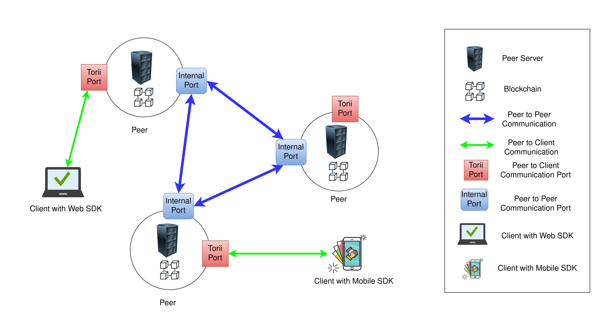

## Table of Contents

## What is Hyperledger Iroha?

Hyperledger Iroha is a blockchain platform designed to be simple and easy to use. It was created to help developers build applications that need a secure and reliable way to keep track of data. Iroha is part of the Hyperledger project, which is supported by the Linux Foundation. This platform is great for businesses and organizations that want to use blockchain technology without dealing with the complicated parts of other blockchain systems.

One of the main features of Hyperledger Iroha is its focus on mobile applications. It has tools that make it easier for developers to create apps that can work on smartphones and tablets. Iroha also has built-in commands for common tasks, like creating accounts and managing digital assets, which makes it faster to develop applications. This makes it a good choice for companies looking to quickly build and deploy blockchain solutions.

In addition, Hyperledger Iroha is known for its strong focus on security and reliability. It uses a consensus algorithm called Sumeragi, which helps make sure that all the data on the blockchain is accurate and safe. This is important for businesses that need to trust the information they are working with. Overall, Hyperledger Iroha is a user-friendly blockchain platform that offers a lot of benefits for developers and organizations looking to use blockchain technology.

## Who developed Hyperledger Iroha?

Hyperledger Iroha was developed by Soramitsu, a company that focuses on creating blockchain and distributed ledger technology solutions. Soramitsu is based in Japan and works on projects that aim to make financial services and other systems more efficient and secure. They started working on Iroha to provide a simple and easy-to-use blockchain platform that could be used by businesses and developers.

The development of Hyperledger Iroha was also supported by the Hyperledger project, which is hosted by the Linux Foundation. This collaboration helped bring together a community of developers and experts who contributed to making Iroha a reliable and user-friendly platform. Together, Soramitsu and the Hyperledger community have worked to ensure that Iroha meets the needs of businesses looking to use blockchain technology without the complexity of other systems.

## What are the main features of Hyperledger Iroha?

Hyperledger Iroha is a blockchain platform that is easy to use and good for making apps, especially for mobile devices. It has tools that help developers build apps quickly. Iroha comes with built-in commands for common tasks like creating accounts and managing digital assets. This makes it easier for businesses to use blockchain technology without dealing with complicated stuff.

Another important feature of Hyperledger Iroha is its focus on security and reliability. It uses a special way to make sure all the data on the blockchain is correct and safe, called the Sumeragi consensus algorithm. This is important for businesses that need to trust the information they are working with. Iroha is part of the Hyperledger project, which means it has a community of developers and experts helping to make it better.

Overall, Hyperledger Iroha is a user-friendly blockchain platform that offers many benefits. It's great for companies looking to quickly build and use blockchain solutions. With its focus on mobile apps, easy-to-use tools, and strong security, Iroha is a good choice for businesses wanting to use blockchain technology.

## How does Hyperledger Iroha differ from other blockchain platforms?

Hyperledger Iroha stands out from other blockchain platforms because it is designed to be simple and easy to use. While many blockchain systems can be complex and hard to understand, Iroha focuses on making things easier for developers. It comes with built-in commands for common tasks like creating accounts and managing digital assets. This means developers can build applications faster without having to write a lot of code from scratch. Iroha is especially good for making mobile apps, which is not something all blockchain platforms focus on.

Another way Hyperledger Iroha differs is its strong focus on security and reliability. It uses a special method called the Sumeragi consensus algorithm to make sure all the data on the blockchain is accurate and safe. This is important for businesses that need to trust the information they are working with. Many other blockchain platforms might not have such a strong emphasis on security or might use different methods to achieve it. Iroha's approach makes it a good choice for companies looking for a secure and reliable blockchain solution without the complexity of other systems.

## What programming languages can be used with Hyperledger Iroha?

Hyperledger Iroha is designed to be easy to use, and it supports several programming languages that developers can use to build applications. The main language for working with Iroha is C++, which is used for the core development of the platform. This means if you want to get into the deep parts of Iroha, you'll need to know C++. 

But Iroha also supports other languages to make it easier for more developers to use it. For example, you can use Python and JavaScript to interact with Iroha. These languages are popular and easier to learn than C++, so they help more people build apps with Iroha. This way, whether you're a beginner or an expert, you can find a language that works for you when using Hyperledger Iroha.

## Can you explain the architecture of Hyperledger Iroha?

Hyperledger Iroha's architecture is designed to be simple and easy to understand. At its core, Iroha uses a system called a distributed ledger, which is like a shared notebook where everyone can see and add information. This ledger is managed by a network of computers, called nodes, that work together to keep the data safe and accurate. The main part of Iroha's architecture is the core system, written in C++, which handles the basic functions like creating accounts, managing digital assets, and processing transactions. This core system is what makes Iroha work smoothly and securely.

Another important part of Iroha's architecture is the way it handles consensus, or how it makes sure everyone agrees on the data. Iroha uses a method called the Sumeragi consensus algorithm. This algorithm helps the nodes in the network agree on the order of transactions and make sure the data is correct. It's like having a group of friends deciding on a plan and making sure everyone is on the same page. This consensus method is what keeps Iroha reliable and secure, making it a good choice for businesses that need to trust their data.

Overall, Hyperledger Iroha's architecture is built to be user-friendly and efficient. It combines a simple core system with a strong consensus method to create a blockchain platform that is easy to use and secure. This makes it a great option for developers and businesses looking to use blockchain technology without dealing with the complexity of other systems.

## What are the use cases for Hyperledger Iroha?

Hyperledger Iroha is great for businesses that want to use blockchain technology without dealing with complicated stuff. It's especially good for making apps that need to keep track of data securely. For example, banks and financial companies can use Iroha to manage digital money and keep records of transactions. This helps them make sure all their data is correct and safe. Iroha is also useful for supply chain management, where companies need to track products from the factory to the store. By using Iroha, they can see where their products are at any time and make sure everything is moving smoothly.

Another use case for Hyperledger Iroha is in identity management. Many organizations need to keep track of who is who, and Iroha can help them do that securely. For example, a company can use Iroha to manage employee IDs and make sure only the right people can access certain information. This is important for keeping data private and secure. Iroha is also good for creating loyalty programs, where businesses can reward customers for buying their products. By using Iroha, they can keep track of points and rewards easily and make sure everything is fair and transparent.

## How does Hyperledger Iroha ensure security and privacy?

Hyperledger Iroha works hard to keep data safe and private. It uses a special way called the Sumeragi consensus algorithm to make sure all the data on the blockchain is correct and secure. This method helps the computers in the network agree on the order of transactions and keeps the data accurate. By using Sumeragi, Iroha makes sure that no one can change the data without everyone knowing, which is important for businesses that need to trust their information.

Iroha also has strong privacy features. It lets businesses set up rules about who can see and change data. This means that only the right people can access certain information, keeping it private and secure. For example, a company can use Iroha to manage employee IDs and make sure only authorized people can see sensitive data. This helps keep personal information safe and makes sure that only the people who need to know can see it.

## What is the consensus mechanism used in Hyperledger Iroha?

Hyperledger Iroha uses a consensus mechanism called the Sumeragi algorithm to make sure all the data on its blockchain is correct and safe. This algorithm helps the computers in the network, called nodes, agree on the order of transactions. It's like having a group of friends decide on a plan and making sure everyone is on the same page. By using Sumeragi, Iroha ensures that no one can change the data without everyone knowing, which is important for businesses that need to trust their information.

Sumeragi works by having nodes vote on transactions. Once a majority of nodes agree on a transaction, it gets added to the blockchain. This process makes sure that the data stays accurate and secure. It's a bit like taking a vote where everyone has to agree before moving forward. This way, Hyperledger Iroha keeps the data reliable and helps businesses use blockchain technology without worrying about the complicated parts.

## How can one get started with developing on Hyperledger Iroha?

To get started with developing on Hyperledger Iroha, you first need to set up your development environment. You'll need to download and install the Iroha software from their official website. It's a good idea to use a computer that runs on Linux, as Iroha works well with it. Once you have Iroha installed, you can start learning about its basic features. There are many tutorials and guides on the Hyperledger website that can help you understand how to use Iroha. These resources will show you how to create accounts, manage digital assets, and process transactions.

After setting up and learning the basics, you can start building your own applications. Iroha supports several programming languages like C++, Python, and JavaScript, so you can choose the one you're most comfortable with. If you're new to blockchain development, starting with Python or JavaScript might be easier. You can use the Iroha libraries and tools to connect your app to the blockchain and start testing it. The Hyperledger community is also a great place to ask questions and get help if you run into any problems. With practice and the right resources, you'll be able to create secure and reliable blockchain applications using Hyperledger Iroha.

## What are the performance benchmarks of Hyperledger Iroha?

Hyperledger Iroha is designed to be fast and efficient, which is important for businesses that need quick and reliable data processing. In performance tests, Iroha can handle around 1,500 transactions per second. This means it can process a lot of data quickly, which is good for applications that need to work in real-time. The speed of Iroha comes from its simple design and the Sumeragi consensus algorithm, which helps keep the data accurate without slowing things down.

The performance of Hyperledger Iroha also depends on the setup of the network. With more computers, or nodes, working together, Iroha can handle even more transactions. But adding too many nodes can make things slower because it takes more time for everyone to agree on the data. So, businesses need to find the right balance to get the best performance out of Iroha. Overall, Iroha's performance is strong enough for many business needs, making it a good choice for companies looking to use blockchain technology.

## What are the future developments and roadmaps for Hyperledger Iroha?

The future of Hyperledger Iroha looks promising as the team behind it continues to work on making the platform even better. They are focusing on improving the performance and scalability of Iroha. This means they want to make it handle more transactions faster and work well with bigger networks. They are also looking into adding new features that will help developers build even more types of applications. The goal is to keep Iroha simple and easy to use while making it more powerful and versatile.

Another important part of the roadmap for Hyperledger Iroha is enhancing its integration with other technologies. The team wants to make it easier for Iroha to work with other blockchain platforms and systems. This will help businesses use Iroha in more ways and connect it with their existing technology. They are also working on improving the tools and resources available for developers, so it's easier for more people to start building with Iroha. Overall, the future developments aim to make Hyperledger Iroha a more robust and user-friendly platform for businesses and developers alike.

## References & Further Reading

[1]: Androulaki, E., Barger, A., Bortnikov, V., Cachin, C., Christidis, K., De Caro, A., ... & Muralidharan, S. (2018). ["Hyperledger Fabric: A Distributed Operating System for Permissioned Blockchains."](https://dl.acm.org/doi/pdf/10.1145/3190508.3190538) Proceedings of the Thirteenth EuroSys Conference.

[2]: Cachin, C. (2016). ["Architecture of the Hyperledger blockchain fabric."](https://www.semanticscholar.org/paper/Architecture-of-the-Hyperledger-Blockchain-Fabric-Cachin/f852c5f3fe649f8a17ded391df0796677a59927f) Workshop on Distributed Cryptocurrencies and Consensus Ledgers (DCCL).

[3]: Haerder, T., & Reuter, A. (1983). ["Principles of Transaction-Oriented Database Recovery."](https://dl.acm.org/doi/10.1145/289.291) ACM Computing Surveys (CSUR).

[4]: Saito, K., & Yamada, H. (2017). ["What’s So Unique about Hyperledger Fabric?"](https://www.semanticscholar.org/paper/What%E2%80%99s-So-Different-about-Blockchain-%E2%80%94-Blockchain-a-Saito-Yamada/799f4c01d6a0810107db78d120aba50534d9aab8) In Proceedings of the International Workshop on Blockchain Oriented Software Engineering (IWBOSE).

[5]: Narayanan, A., Bonneau, J., Felten, E., Miller, A., & Goldfeder, S. (2016). ["Bitcoin and Cryptocurrency Technologies."](https://press.princeton.edu/books/hardcover/9780691171692/bitcoin-and-cryptocurrency-technologies) Princeton University Press.