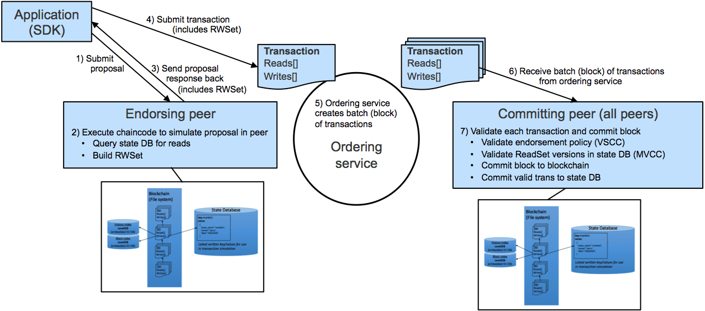

Distributed ledger technology and blockchain have significantly transformed the way transactions are processed and recorded. Their key feature lies in creating an immutable, transparent, and decentralized system that enhances trust and security across various industries. Hyperledger Iroha, a notable project within the Hyperledger umbrella hosted by The Linux Foundation, exemplifies these transformations by providing a user-friendly blockchain framework known for its simplicity and ease of integration. This makes it particularly versatile and appealing to a wide range of sectors that seek to leverage blockchain technology.

Hyperledger Iroha is distinct for its straightforward design, which facilitates seamless integration into existing systems without requiring extensive modifications or technical know-how. This accessibility allows businesses and developers to adopt blockchain solutions efficiently, optimizing operations and processes across diverse applications. One significant area where Hyperledger Iroha demonstrates its utility is in algorithmic trading, a domain that demands high efficiency, transparency, and security.



Algorithmic trading involves using complex algorithms to automate and execute trading strategies at speeds and frequencies that far exceed human capabilities. The implementation of Hyperledger Iroha in this field can provide notable enhancements by ensuring transactions are recorded on a transparent and tamper-proof ledger. This facilitates trust among market participants and reduces the risk of fraudulent activities or errors. Furthermore, blockchain technology inherently supports the rapid processing and retrieval of large volumes of data, a fundamental requirement for executing timely trades based on real-time market information.

By adopting distributed ledger technology like Hyperledger Iroha, the algorithmic trading landscape can benefit from increased reliability, reduced costs, and improved compliance processes. This article will explore how Hyperledger Iroha acts as a cornerstone in developing robust algo trading systems, highlighting its contributions to enhancing market efficiency and security. We will examine the tangible benefits of integrating blockchain solutions in algorithmic trading and consider the potential for future growth and innovation in this dynamic space. Through an examination of real-world applications and upcoming advancements, the article aims to provide a clear and comprehensive insight into this rapidly evolving field.

## Table of Contents

## Understanding Distributed Ledger Technology and Blockchain

Distributed ledger technology (DLT) represents a foundational innovation in managing and recording digital data across a decentralized network of computers. Unlike traditional centralized databases, DLT ensures that data is replicated, shared, and synchronized across multiple sites, providing a coherent and consistent data structure resistant to unauthorized alterations. This decentralized architecture is particularly beneficial for maintaining data integrity and security.

Blockchain is one of the most well-known types of distributed ledger technology. It is fundamentally a chain of blocks, where each block contains a list of transactions securely linked to the previous one using cryptographic hashing. The structure ensures data immutability and traceability, as altering any block retroactively would require consent from a majority of the network, which is computationally infeasible.

The decentralized nature of blockchain provides a high level of trust among participants. Each participant in the network has access to the entire blockchain, ensuring transparency and reducing the potential for fraudulent activities. Moreover, this setup removes the dependency on a single intermediary, streamlining processes and potentially lowering costs associated with transaction verification and settlement.

Blockchain's potential extends far beyond its initial application in [cryptocurrency](/wiki/cryptocurrency). In supply chain management, blockchain can enhance tracking and verification of goods, ensuring authenticity and compliance. In healthcare, it can securely manage patient records, ensuring privacy and interoperability among different systems without exposing sensitive information to unauthorized entities. Similarly, in finance, blockchain can improve the security and speed of transactions, offering a more resilient and responsive infrastructure for handling a plethora of financial operations.

Understanding distributed ledger technology and blockchain's mechanics provides a vital backdrop to appreciating platforms like Hyperledger Iroha. Such platforms leverage the benefits of DLT to offer streamlined, secure, and efficient solutions across various industries, thus broadening the scope and impact of blockchain technology beyond its original confines.

## What is Hyperledger Iroha?

Hyperledger Iroha is an open-source blockchain framework tailored for end-users and businesses seeking straightforward integration of blockchain technology into their existing systems. As a part of the Hyperledger project, Hyperledger Iroha contributes to the advancement of cross-industry blockchain solutions. The framework distinguishes itself with a modular architecture that is particularly optimized for mobile application development, ensuring that blockchain implementations can be efficiently executed on various platforms.

A prominent feature of Hyperledger Iroha is its utilization of an advanced Byzantine Fault Tolerance (BFT) consensus algorithm. This consensus mechanism enhances the reliability and security of the network by allowing the system to reach agreement among nodes despite potential faulty or malicious actors. The BFT consensus algorithm ensures that transactions can be verified and validated with high integrity, crucial for maintaining trust in distributed systems.

Moreover, Hyperledger Iroha is equipped with a rich permission model, granting the ability to finely customize access controls and permissions within the blockchain network. This feature ensures that users can define who can read, write, or manage specific data, providing flexibility and security tailored to specific business requirements. Additionally, multi-signature support in Iroha provides an added layer of security for transactions, requiring multiple parties to authorize a transaction before it is executed. This is particularly useful in scenarios where collaboration and consensus among various stakeholders are necessary.

The framework also supports efficient queries for data retrieval, enabling users to access and extract information swiftly and effectively. This is a critical aspect for applications that require real-time data processing and decision-making capabilities. Hyperledger Iroha’s focus on simplicity and minimalism ensures that these sophisticated blockchain functionalities are accessible and deployable across diverse sectors, facilitating widespread adoption and innovation in blockchain technology.

## Algorithmic Trading: An Overview

Algorithmic trading involves the use of sophisticated algorithms to automate trading strategies, enabling the execution of trades at high speed and frequency. This method has gained immense popularity in financial markets due to its capacity to process vast amounts of data and execute transactions at speeds unattainable by human traders.

At its core, [algorithmic trading](/wiki/algorithmic-trading) leverages predefined criteria to assess multiple markets and assets concurrently. Algorithms are tasked with identifying market inefficiencies, price trends, patterns, and opportunities that human traders might overlook. This capability leads to more informed and timely trading decisions. For instance, algorithms can exploit [arbitrage](/wiki/arbitrage) opportunities by identifying price discrepancies for the same asset across different markets and executing simultaneous buys and sells to lock in profits.

The rise of technology in trading has significantly democratized access to financial markets. With algorithmic trading, efficiency and cost-effectiveness have become central features, reducing the dependency on manual interventions and allowing traders to operate at scale. High-frequency trading ([HFT](/wiki/high-frequency-trading-strategies)), a subset of algorithmic trading, exemplifies these advantages by executing numerous orders in fractions of a second, capitalizing on minute price changes.

Understanding the mechanics and benefits of algorithmic trading is critical for comprehending its transformative impact on modern financial markets. Traders can develop and deploy algorithms using programming languages like Python, which offers libraries such as NumPy for numerical data processing and pandas for financial data management. These tools facilitate the creation and [backtesting](/wiki/backtesting) of trading strategies, thereby enhancing their effectiveness and reliability.

In summary, algorithmic trading has reshaped the trading landscape by automating decision-making processes and optimizing execution speed and precision. Its growing influence underscores the need for robust technological infrastructure and innovative approaches in today's fast-paced financial environment.

## Hyperledger Iroha's Role in Algorithmic Trading

Hyperledger Iroha plays a significant role in enhancing algorithmic trading by leveraging its robust blockchain framework, which emphasizes security, transparency, and efficiency. The key attributes of Hyperledger Iroha that make it suitable for algorithmic trading are its immutability and transparency, real-time data processing abilities, rich permission models, and multi-signature support.

The immutability and transparency of transactions recorded on Hyperledger Iroha provide a dependable foundation for parties involved in trading. Each transaction is securely time-stamped and stored in an immutable sequence, ensuring data integrity and authenticity. This transparent record-keeping allows all participants in the trading process to verify and audit transactions without the risk of data tampering, fostering trust among stakeholders.

Hyperledger Iroha's framework supports real-time capabilities, which are crucial for the fast-paced environment of algorithmic trading. Trading algorithms rely on immediate access to current market data to execute trades swiftly and effectively. Iroha's architecture ensures low-latency data retrieval and processing, enabling trading algorithms to adapt to market fluctuations and seize opportunities as they arise.

Furthermore, Hyperledger Iroha provides a rich permission model and multi-signature support that enhance the security of sensitive trading strategies and data. The permission model allows organizations to define fine-grained access controls for different participants, ensuring that only authorized individuals can perform specific actions within the system. Multi-signature transactions enhance security by requiring multiple stakeholders to sign off on a transaction before execution, thereby reducing the risk of fraud and unauthorized access.

The adoption of Hyperledger Iroha’s distributed ledger in algorithmic trading can result in significant reductions in transaction costs and human error. By automating processes through blockchain technology, trading operations become more efficient and less reliant on intermediaries, lowering costs and expediting trade settlements. Additionally, the system's decentralized nature offers increased market access by eliminating single points of failure and providing a platform that supports continuous operation, even in the face of disruptions.

Overall, Hyperledger Iroha provides a substantial foundation for algorithmic trading platforms, offering the security, transparency, and operational efficiency needed for modern financial markets.

## The Benefits of Blockchain in Algo Trading

Blockchain technology has multiple benefits for algorithmic trading, primarily revolving around enhanced transparency, efficiency, and security.

Increased transparency is one of the hallmark advantages, providing traders with the capacity to audit trades efficiently. Blockchain’s immutable ledger ensures that all transactions are recorded permanently and unalterably, allowing for comprehensive traceback and verification of trading activities. This capability significantly reduces risks associated with discrepancies, fostering an environment of trust and integrity crucial for high-stakes financial markets.

Moreover, blockchain technology reduces dependency on intermediaries like clearinghouses or brokers, which traditionally facilitate and validate trades. By eliminating these middlemen, blockchain can lower costs and decrease settlement times, as transactions occur directly between parties. This facilitation of peer-to-peer transactions results in a more streamlined and cost-effective trading process. An example of Python code that might simulate such trade verification using hash functions could look like this:

```python
import hashlib

def verify_transaction(transaction_details: str, previous_hash: str) -> str:
    data_to_hash = transaction_details + previous_hash
    return hashlib.sha256(data_to_hash.encode()).hexdigest()

transaction = "BUY 100 shares of XYZ"
previous_transaction_hash = "a3f5...d8c9"

current_hash = verify_transaction(transaction, previous_transaction_hash)
print(f"Transaction Hash: {current_hash}")
```

Furthermore, blockchain enhances compliance and regulatory reporting processes. With its ability to provide a permanent record of all transactions, blockchain simplifies the auditing requirements often imposed by regulatory bodies, ensuring timely and accurate disclosure of financial activities.

Additionally, the decentralized nature of blockchain ensures high availability and resilience. This is particularly critical in trading environments that operate around the clock and require continuous operations. Since blockchain networks are distributed across many nodes, the failure or compromise of a single node does not impact the overall network, making it robust against disruptions and attacks.

Smart contracts further extend blockchain's functionality in algorithmic trading by automating additional trading operations. Beyond mere execution of trades, smart contracts can manage the conditions under which trades are conducted, handle post-trade settlements, and even manage portfolio rebalancing automatically. The use of smart contracts enhances operational efficiency, reducing the possibility of human error and enabling traders to react promptly to market conditions.

In summary, the integration of blockchain technology in algorithmic trading presents a formidable suite of benefits that enhance transparency, reduce costs, ensure data integrity, and promote automation, all of which are vital for maintaining a competitive edge in finance.

## Case Studies and Real-World Applications

Financial institutions and fintech startups are actively leveraging blockchain technology to enhance the efficiency and transparency of algorithmic trading systems. Hyperledger Iroha, with its advanced features and open-source framework, provides a robust platform for such integrations, allowing for the development of innovative trading solutions.

One notable example is the collaboration between a major European bank and a technology firm to create a blockchain-based trading system using Hyperledger Iroha. This partnership aimed to achieve enhanced transparency and data integrity across multi-party trading operations. By using Hyperledger Iroha, the participants were able to secure a transparent audit trail for transactions, ensuring data consistency and providing regulatory compliance. The platform's rich permission model facilitated secure access control, reducing the risk of unauthorized transactions and maintaining the confidentiality of trading strategies.

Another significant case study involves a fintech startup that sought to streamline its trading infrastructure. By integrating Hyperledger Iroha, the startup achieved reduced trading latency, which is critical in high-frequency trading scenarios. The adoption of Iroha's advanced Byzantine Fault Tolerance (BFT) consensus mechanism enabled a reliable and tamper-proof record of transactions even in environments with untrusted nodes. This implementation improved execution speed and reliability, providing a tangible competitive advantage in fast-paced financial markets.

Additionally, a consortium of banks and financial institutions embarked on developing a proprietary trading solution leveraging Hyperledger Iroha's capabilities. The goal was to establish a decentralized trading platform, allowing seamless interoperability across different institutions. The initiative succeeded in minimizing settlement times and transaction costs by leveraging the efficient query system of Iroha, which facilitated real-time data access and analysis.

These real-world applications underscore the transformative potential of Hyperledger Iroha in algorithmic trading. By offering a secure and efficient blockchain foundation, Iroha enables companies to not only enhance their trading operations but also to innovate new mechanisms for financial transactions. As more organizations recognize the value of blockchain technology, further adoption of systems like Hyperledger Iroha is expected to revolutionize traditional trading practices, drive industry standards, and foster new business models.

## Challenges and Future Prospects

Despite its advantages, the adoption of blockchain technology in algorithmic trading encounters several challenges. One of the predominant issues is scalability. As trading volumes increase, the blockchain network must handle a higher number of transactions per second without compromising speed or efficiency. Current blockchain architectures, while secure, often experience limitations in throughput due to consensus protocols, which can be a bottleneck in high-frequency trading environments. According to research, optimizing these protocols or leveraging technologies like sharding could offer solutions to these scalability constraints.

Regulatory compliance also presents a significant hurdle. The financial sector is heavily regulated, and integrating blockchain into trading systems necessitates adherence to various local and international laws. Ensuring compliance involves rigorous auditing and reporting, which can be complicated by the decentralized and immutable nature of blockchain. Collaborations between industry stakeholders and regulatory bodies are essential to forge acceptable standards that align with existing legal frameworks while accommodating the unique characteristics of blockchain.

Interoperability among different blockchain platforms is another critical challenge. For widespread adoption, it is crucial that various systems can work seamlessly together, allowing for smooth data exchange and transaction processing across different networks. Efforts to develop standardized protocols and interfaces are ongoing, as industry leaders recognize the necessity of interoperable solutions to facilitate broader blockchain integration.

Looking toward the future, advancements in consensus algorithms hold promise for enhancing blockchain's role in trading. Innovations such as optimized versions of Byzantine Fault Tolerance (BFT) or developments in Proof of Stake (PoS) mechanisms could offer improved security and efficiency. These advancements would enable blockchains to better support the demands of algorithmic trading, providing faster and more secure transaction processing.

Emerging trends like the integration of [artificial intelligence](/wiki/ai-artificial-intelligence) (AI) with blockchain have the potential to revolutionize the trading landscape. AI can enhance trading algorithms by analyzing vast datasets to identify patterns and make predictions, while blockchain ensures data integrity and security. Combining these technologies could lead to more sophisticated trading strategies and automated decision-making processes, offering a competitive edge in the market.

In conclusion, while challenges such as scalability, compliance, and interoperability exist, the prospects for integrating Hyperledger Iroha and blockchain in algorithmic trading are promising. Continued technological advancements and collaborations will likely address these challenges, paving the way for innovative trading solutions that leverage the full potential of blockchain technology.

## Conclusion

Hyperledger Iroha provides a robust platform for the integration of blockchain technology into algorithmic trading. One of the significant benefits offered by Hyperledger Iroha is enhanced transparency. By utilizing a distributed ledger, every transaction is recorded immutably and can be audited, thus ensuring clarity and mitigating risks associated with opaque trading practices. This level of transparency is invaluable in an industry where trust and reliability are paramount for participants.

Efficiency is another core advantage. The architecture of Hyperledger Iroha facilitates rapid execution and processing of trades. Its modular design allows for scalability, which is essential for handling the high-frequency trading operations characteristic of algorithmic trading systems. The ability to efficiently execute trades without intermediaries reduces both costs and the time required for settlement, providing a competitive edge to financial institutions that adopt this technology.

The improved security framework offered by Hyperledger Iroha cannot be understated. Through features like multi-signature transactions and rich permission settings, the platform secures sensitive trading data and strategies. This robust security ensures that only authorized parties can execute trades or access critical information, further protecting the integrity of trading operations.

As algorithmic trading persistently advances, the role of blockchain technologies like Hyperledger Iroha is anticipated to be transformative. The synergistic potential when combining algorithmic trading with blockchain can pave the way for more innovative solutions in the trading landscape. This ongoing exploration and adoption of blockchain technologies are poised to lead to substantial growth within the industry, undeniably altering existing trading paradigms.

Traders and financial institutions aiming to effectively navigate the complexities of modern financial markets could benefit greatly from an understanding and application of these advancements. By leveraging the innovations presented by distributed ledger technologies such as Hyperledger Iroha, they are well-equipped to remain competitive and secure in an ever-evolving market environment.

## References & Further Reading

[1]: Androulaki, E., Barger, A., Bortnikov, V., Cachin, C., Christidis, K., De Caro, A., ... & Muralidharan, S. (2018). ["Hyperledger Fabric: A Distributed Operating System for Permissioned Blockchains."](https://dl.acm.org/doi/pdf/10.1145/3190508.3190538) Proceedings of the Thirteenth EuroSys Conference.

[2]: Cachin, C. (2016). ["Architecture of the Hyperledger blockchain fabric."](https://www.semanticscholar.org/paper/Architecture-of-the-Hyperledger-Blockchain-Fabric-Cachin/f852c5f3fe649f8a17ded391df0796677a59927f) Workshop on Distributed Cryptocurrencies and Consensus Ledgers (DCCL).

[3]: Haerder, T., & Reuter, A. (1983). ["Principles of Transaction-Oriented Database Recovery."](https://dl.acm.org/doi/10.1145/289.291) ACM Computing Surveys (CSUR).

[4]: Saito, K., & Yamada, H. (2017). ["What’s So Unique about Hyperledger Fabric?"](https://www.semanticscholar.org/paper/What%E2%80%99s-So-Different-about-Blockchain-%E2%80%94-Blockchain-a-Saito-Yamada/799f4c01d6a0810107db78d120aba50534d9aab8) In Proceedings of the International Workshop on Blockchain Oriented Software Engineering (IWBOSE).

[5]: Narayanan, A., Bonneau, J., Felten, E., Miller, A., & Goldfeder, S. (2016). ["Bitcoin and Cryptocurrency Technologies."](https://press.princeton.edu/books/hardcover/9780691171692/bitcoin-and-cryptocurrency-technologies) Princeton University Press.