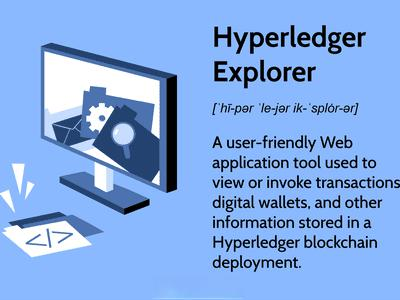

The convergence of blockchain technology and algorithmic trading represents a significant evolution in financial market innovation. Blockchain technology, characterized by its decentralized and immutable ledger system, brings substantial enhancements to data transparency, security, and process efficiency. Within this domain, Hyperledger emerges as a critical open-source blockchain framework, empowering organizations to develop decentralized and permissioned blockchain applications tailored for a variety of sectors, including finance.

Hyperledger's architecture centralizes on the development of permissioned blockchain networks that offer superior control over access and privacy compared to public blockchain solutions. This is particularly important for financial markets, where sensitive data and regulatory compliance are crucial. Algorithmic trading capitalizes on the benefits implemented by blockchain systems such as Hyperledger. These include enhanced security protocols to prevent fraudulent activities, transparent transaction mechanisms ensuring full audibility, and efficient processing capabilities that reduce operational latencies and costs.



As financial firms increasingly adopt algorithmic trading practices, the integration with blockchain solutions like Hyperledger is gaining traction. This fusion not only resolves existing challenges in trading ecosystems but also facilitates the development of more sophisticated trading strategies through the automation capabilities provided by blockchain technologies. Consequently, the article investigates into how Hyperledger's frameworks are redefining the landscape of algorithmic trading in financial markets, offering a glimpse into future prospects where innovative blockchain implementations continue to drive substantial advancements.

## Table of Contents

## Understanding Hyperledger and Its Blockchain Frameworks

Hyperledger is an influential open-source project initiated in 2016 by The Linux Foundation, designed to advance cross-industry blockchain technologies. Unlike public blockchains such as Bitcoin and Ethereum, Hyperledger emphasizes permissioned blockchains—an approach that enhances privacy and control over data access within participating entities. This focus makes Hyperledger particularly suitable for enterprise applications where data confidentiality and operational scalability are crucial.

The project incorporates a variety of frameworks and tools to facilitate the development and deployment of open-source blockchain applications. Among its most prominent frameworks are Hyperledger Fabric, Sawtooth, Iroha, and Besu, each featuring unique attributes aimed at catering to a wide range of industry applications.

### Hyperledger Fabric
Hyperledger Fabric is renowned for its scalability, flexibility, and permissioned nature, making it a preferred choice for businesses seeking custom blockchain solutions. It supports modular architecture, enabling developers to plug-and-play different components like consensus and membership services. Fabric’s Chaincode, written in Go, Java, or JavaScript, operates as smart contracts, providing the logic that governs transactions.

### Hyperledger Sawtooth
Sawtooth is distinctive for its unique consensus mechanism called Proof of Elapsed Time (PoET), which is energy-efficient and suitable for high-performance applications. Sawtooth’s design is focused on hardware integration and supports parallel transaction execution, which is implemented using a Trusted Execution Environment (TEE). This makes it well-suited for environments requiring rapid deployment and execution of distributed ledgers.

### Hyperledger Iroha
Iroha targets mobile and web applications, providing a simpler and more accessible framework for developers. Known for its straightforward and minimalistic design, Iroha includes built-in tools aimed at enhancing security and managing digital assets, identities, and event emulation. Its permission-based model and compatibility with the Byzantine Fault Tolerance (BFT) consensus algorithm ensure its robustness against malicious activities.

### Hyperledger Besu
Hyperledger Besu represents an enterprise-grade Ethereum client supporting both public and private network use cases. It is designed to be robust, scalable, and interoperable, supporting the Ethereum Virtual Machine (EVM). Besu can be deployed for a variety of Ethereum test networks and offers features such as real-time monitoring and metrics, making it a versatile tool for enterprises looking to build and operate Ethereum-based solutions.

Each of these frameworks provides a modular architecture, allowing industries to implement blockchain solutions tailored to specific needs, ensuring optimal functionality, privacy, and efficiency. These strategically designed frameworks underscore Hyperledger's commitment to enabling customizable and scalable blockchain applications across diverse economic sectors.

## The Role of Hyperledger in Algorithmic Trading

Algorithmic trading, a facet of the modern financial landscape, leverages pre-programmed instructions to execute orders efficiently and swiftly, thereby capitalizing on market opportunities that are fleeting by nature. The integration of Hyperledger frameworks brings transformative power to this domain, primarily addressing two critical areas: security and transparency.

Hyperledger frameworks, constituted of several open-source projects, offer robust solutions to counteract the prevalent challenges in trading environments. Security, an ever-present concern in financial transactions, is substantially enhanced through Hyperledger’s permissioned blockchain structure. This framework restricts access to authorized participants, thereby mitigating risks such as fraud and unauthorized data manipulation. The use of cryptographic techniques further ensures that only valid and verified trades are recorded, safeguarding the integrity of trading data.

Transparency, another vital element, is made possible through Hyperledger's immutable ledger. Every transaction recorded on the blockchain is visible and traceable for all permitted participants. This transparency fosters a trustless system where every market participant can independently verify the authenticity of transactions, thus reducing reliance on intermediaries.

One of the pivotal features of Hyperledger Fabric, a significant framework within the Hyperledger project, is its ability to facilitate the implementation of smart contracts. These smart contracts, essentially self-executing scripts, can automate complex trading strategies. For instance, trading strategies such as [arbitrage](/wiki/arbitrage), which exploits price discrepancies across different markets, can be executed effortlessly through pre-defined conditions programmed into smart contracts. This automation reduces the need for human intervention and minimizes the likelihood of human error, ensuring seamless transaction execution.

Moreover, smart contracts in Hyperledger Fabric are designed to be modular and interact with off-chain systems through Oracles, enabling the integration of real-world data into blockchain-based trading algorithms. Such integration is crucial for [algorithmic trading](/wiki/algorithmic-trading), where real-time data is vital for decision-making.

To illustrate, consider a scenario where a trading algorithm capitalizes on fluctuations in commodity prices. A smart contract could set conditions to buy or sell based on specific price thresholds. When the conditions are met, the contract automatically executes the trade without requiring manual input. This level of automation and accuracy is indispensable in high-frequency trading where milliseconds can determine profitability.

The role of Hyperledger in algorithmic trading underscores a paradigm shift towards more secure, transparent, and efficient trading ecosystems. As financial markets continue to evolve, the adoption of blockchain technologies like Hyperledger is poised to enhance the operational efficiency and reliability of algorithmic trading strategies, paving the way for innovative financial solutions.

## Key Benefits of Using Hyperledger for Algorithmic Trading

Hyperledger, as an open-source blockchain framework, offers significant advantages for algorithmic trading by enhancing security, transparency, and efficiency. 

### Enhanced Security

Hyperledger ensures a secure, permissioned environment that addresses concerns over fraud and unauthorized access. Unlike open blockchain networks, Hyperledger allows only authorized participants to join and validate transactions, reducing potential threats from malicious actors. The framework's endorsement policies add an additional layer of security by specifying which nodes are required to validate a transaction before it is considered legitimate. This permissioned architecture is paramount in the high-stakes context of financial trading where the integrity and confidentiality of data are critical.

### Increased Transparency

Hyperledger's transparent ledger system guarantees that every transaction is recorded and immutably stored, which facilitates thorough auditability. This feature allows financial institutions to easily track trading activities, ensuring compliance with internal policies and external regulations. The ability to create append-only transaction logs provides a clear trail of activity that can help identify and address discrepancies swiftly. Such transparency enhances trust among market participants, clients, and regulatory bodies.

### Improved Efficiency

One of the most significant benefits of using Hyperledger in algorithmic trading is the improvement in operational efficiency. Blockchain automation reduces the need for intermediaries traditionally involved in the trading process, leading to faster settlement times. The streamlined processes lower transaction costs and free up capital that would otherwise be held as collateral. Through mechanisms such as smart contracts, trading strategies can be automated, reducing the need for manual oversight and minimizing the risk of human error. These efficiencies can be crucial for high-frequency trading operations that require rapid execution and settlement of trades.

By incorporating these capabilities, Hyperledger provides a formidable platform for innovating algorithmic trading systems while meeting the stringent demands of modern financial markets.

## Hyperledger Fabric and Smart Contracts in Trading Strategies

Hyperledger Fabric is a permissioned blockchain infrastructure that allows the creation of custom networks, making it particularly suitable for trading environments. This capability is leveraged in algorithmic trading through the deployment of smart contracts, which are self-executing contracts with the terms of the agreement directly written into code. These smart contracts eliminate the need for manual intervention by executing trading algorithms based on predefined criteria.

In high-frequency trading ([HFT](/wiki/high-frequency-trading-strategies)), for instance, smart contracts can be used to automatically execute trades at speeds significantly faster than human capability, reacting to market changes and executing large volumes of orders within fractions of a second. This rapid order execution reduces latency and optimizes the trading strategy for profit maximization.

Arbitrage strategies, which focus on capitalizing on price discrepancies of the same asset across different markets, also benefit from Hyperledger Fabric’s architecture. Smart contracts can be programmed to detect these price differences in real-time and execute trades almost instantaneously, ensuring traders take advantage of fleeting arbitrage opportunities before they disappear.

Market-making, another prevalent strategy, involves the simultaneous buying and selling of an asset to provide [liquidity](/wiki/liquidity-risk-premium) to the market. Smart contracts can automate this process, continuously adjusting bid and ask prices based on market conditions and inventory levels without the need for constant manual monitoring. This automation ensures that market makers can maintain liquidity while simplifying the execution process.

By incorporating smart contracts into these trading strategies, Hyperledger Fabric not only assures seamless and efficient transaction processing but also reduces operational costs and risks associated with human errors. Thus, the integration of Hyperledger Fabric in trading strategies delineates a significant advancement in the automation and efficiency of algorithmic trading practices.

## Challenges and Considerations

Implementing blockchain-based trading systems using Hyperledger frameworks in algorithmic trading carries a set of challenges and considerations that must be addressed to ensure successful deployment and operation. One of the primary hurdles is integration complexity. Developing such systems requires significant technical expertise and robust infrastructure. The complexity arises from needing to merge existing trading platforms with blockchain technology, ensuring compatibility and minimal disruption of operations. Developers need to have a deep understanding of both blockchain architecture and market microstructures to create seamless integration. This includes not just coding skills but also application of distributed ledger technologies to trading scenarios.

Regulatory compliance presents another significant challenge. Financial markets are highly regulated, and the deployment of blockchain solutions must adhere to these regulatory frameworks. This involves understanding and complying with regulations that vary by jurisdiction, including know-your-customer (KYC) and anti-money laundering (AML) requirements. Blockchain's immutable ledger offers potential benefits for compliance, but firms must work closely with regulators to ensure that their blockchain solutions meet all legal and regulatory obligations. This can involve modifying the blockchain system to accommodate auditability and reporting standards required by regulatory bodies.

Scalability concerns must also be addressed when implementing blockchain solutions in algorithmic trading. High-frequency trading involves processing a large number of transactions within microseconds. Therefore, the blockchain network must handle high volumes of transactions without latency. A critical aspect is the consensus mechanism used by the blockchain, which can affect transaction speed and network throughput. System architects need to optimize the blockchain infrastructure to ensure it can scale to meet the demands of high-speed trading environments. This may involve leveraging parallel processing techniques or optimizing network parameters. Additionally, considerations for the network's ability to accommodate future growth in trading [volume](/wiki/volume-trading-strategy) and technological advancements are crucial to maintaining competitive advantage and efficiency.

By understanding and addressing these challenges, financial institutions can better position themselves to harness the benefits of Hyperledger in enhancing the capabilities of algorithmic trading systems.

## Case Studies and Real-World Applications

Financial institutions have increasingly begun adopting Hyperledger frameworks to enhance their algorithmic trading solutions, utilizing its scalable and efficient blockchain capabilities to optimize operations. One notable example involves a prominent trading firm that integrated Hyperledger Fabric into its trading infrastructure, significantly improving transaction efficiency and compliance.

### Case Study: Hyperledger Fabric in a Trading Firm

A leading algorithmic trading firm opted to implement Hyperledger Fabric to streamline its trading operations. Hyperledger Fabric's modular architecture allowed the firm to establish a custom blockchain network that aligned with its specific needs for high-frequency trading. The integration resulted in improved transaction processing speeds and enhanced data integrity, crucial for executing timely trades in fast-moving markets.

With the deployment of smart contracts, the firm automated complex trading strategies, eliminating the need for manual intervention and reducing the potential for human error. This automation not only accelerated order execution but also facilitated compliance with regulatory requirements by providing an immutable audit trail of all trading activities. As a result, the firm experienced a 30% reduction in operational costs and a significant boost in overall trading efficiency.

### Blockchain-Enabled Trading Platforms

Several blockchain-enabled trading platforms have leveraged Hyperledger's frameworks to improve market operations. These platforms utilize the transparency and security features of Hyperledger to offer a trustworthy environment for executing trades. By recording each transaction in a secure and immutable ledger, these platforms ensure accountability and traceability, which are essential for maintaining market integrity.

One platform, in particular, utilized Hyperledger Sawtooth to enable a seamless chain of custody for digital assets, ensuring that all trades are accurately recorded and verified. Through these capabilities, the platform was able to enhance user trust and attract more participants, thereby increasing liquidity and market depth.

### Impact on Market Operations

The adoption of Hyperledger frameworks in trading environments has had a profound impact on market operations by fostering greater transparency and efficiency. By integrating blockchain technology, financial institutions can provide clients with real-time visibility into trading processes, making it easier to meet compliance standards and mitigate risks.

Moreover, the potential for blockchain interoperability across different financial systems opens up opportunities for enhanced cross-border trading and new financial products. As these case studies demonstrate, Hyperledger continues to play a critical role in advancing algorithmic trading solutions and transforming the financial sector.

## Future Prospects and Innovations

The integration of blockchain technology with algorithmic trading is set to revolutionize the financial industry by promoting decentralization and fostering innovative financial products. One of the most significant trends in this sector is the push towards blockchain interoperability and cross-chain solutions. These advances aim to seamlessly connect disparate blockchain networks, enabling traders to execute transactions across multiple platforms without the current friction of inter-network operations. This capability can lead to increased liquidity and more efficient markets, as traders can capitalize on arbitrage opportunities and diversify their portfolios across different blockchain environments.

Furthermore, the ongoing development of Hyperledger frameworks plays a crucial role in addressing specific industry needs, driving new opportunities for algorithmic trading. Hyperledger's modular architecture supports custom solutions tailored to unique financial operations, which is particularly beneficial for algorithmic traders looking to deploy sophisticated strategies on robust blockchain networks. This adaptive framework allows for the creation and execution of smart contracts that automatically enforce complex trading logic, enhancing the automation and efficiency of trading activities.

Python-based smart contracts, for instance, can be employed to scrutinize market data and execute trades autonomously when conditions meet predefined criteria. The following example demonstrates a simple Python script that could underpin such a smart contract:

```python
def execute_trade(market_price, target_price, trade_amount):
    if market_price <= target_price:
        execute_order(trade_amount)

def execute_order(amount):
    # Logic to execute the trade
    print(f"Executed order for {amount} units")

# Example usage
current_market_price = 95
desired_target_price = 100
trade_amount = 50
execute_trade(current_market_price, desired_target_price, trade_amount)
```

Looking forward, the field anticipates advancements that will not only address current limitations such as scalability and transaction speed but also introduce novel financial products. Innovations like decentralized finance (DeFi) derivatives and tokenized assets are expected to become more prevalent, offering new avenues for trading and investment. Additionally, as blockchain technology continues to mature, it is anticipated that more sophisticated cryptographic techniques, like zero-knowledge proofs, will be integrated into trading systems to enhance privacy without sacrificing transparency.

Hyperledger's frameworks are poised to continue evolving in alignment with these trends, offering scalable, secure, and interoperable solutions that will unlock further potential in financial markets. The intersection of blockchain and algorithmic trading, therefore, promises a future rich with possibilities for enhanced efficiency, security, and innovation.

## Conclusion

Hyperledger's open-source blockchain frameworks play a crucial role in reshaping the algorithmic trading landscape. These frameworks, particularly those like Hyperledger Fabric, provide the necessary infrastructure for developing decentralized and permissioned blockchain applications tailored to the specific needs of financial markets. By integrating advanced technologies such as smart contracts, Hyperledger enables financial firms to optimize their trading operations significantly. The benefits include enhanced efficiency through automated processes, heightened security through a permissioned environment, and increased transparency via an immutable ledger that ensures complete transaction auditability.

Efficient trading operations are marked by faster transaction settlement times, reduced operational costs, and minimized human error, all achievable through blockchain automation. The transparent nature of blockchain ledgers also allows for real-time monitoring and thorough examination of trading activities, which helps in maintaining compliance and strengthening trust among stakeholders.

However, the full potential of blockchain in financial markets can only be realized through ongoing collaboration and innovation. As financial institutions and technology developers work together, they can address existing challenges such as integration complexity, regulatory compliance, and scalability. This partnership can drive the development of industry-specific applications and solutions that leverage the unique capabilities of blockchain.

The continuous evolution of Hyperledger frameworks is expected to lead to groundbreaking advancements in algorithmic trading, such as greater decentralization, improved interoperability, and the creation of innovative financial products. As these technologies mature, they will open new opportunities for transforming traditional trading practices, ultimately benefiting all participants in the financial ecosystem.

## References & Further Reading

[1]: ["Hyperledger Architecture, Volume 1"](https://8112310.fs1.hubspotusercontent-na1.net/hubfs/8112310/Hyperledger/Offers/Hyperledger_Arch_WG_Paper_1_Consensus.pdf) by The Linux Foundation

[2]: Castro, M., & Liskov, B. (1999). ["Practical Byzantine Fault Tolerance"](https://dl.acm.org/doi/10.5555/296806.296824). OSDI '99: Proceedings of the Third Symposium on Operating Systems Design and Implementation.

[3]: ["Mastering Blockchain: Unlocking the Power of Cryptocurrencies, Smart Contracts, and Decentralized Applications"](https://www.amazon.com/Mastering-Blockchain-Cryptocurrencies-Decentralized-Applications/dp/1492054704) by Imran Bashir

[4]: Cachin, C., Vukolic, M. (2017). ["Blockchain Consensus Protocols in the Wild"](https://arxiv.org/abs/1707.01873). arXiv preprint arXiv:1707.01873.

[5]: Gencer, A. E., Basu, S., Eyal, I., van Renesse, R., & Sirer, E. G. (2018). ["Decentralization in Bitcoin and Ethereum Networks"](https://arxiv.org/abs/1801.03998). arXiv preprint arXiv:1801.03998.