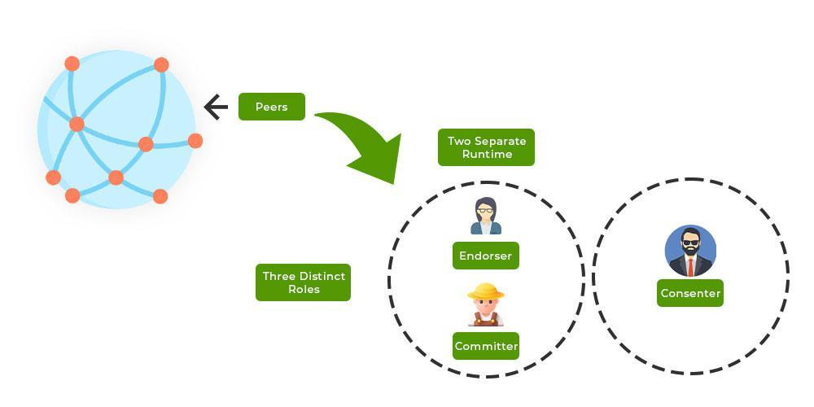

## Table of Contents

## What is Hyperledger and its purpose?

Hyperledger is a type of technology that helps businesses work together more easily and safely. It's like a big, shared notebook where companies can write down information and everyone can see it, but no one can change what others have written. This technology is called a blockchain, and Hyperledger is a special kind of blockchain that is made just for businesses.

The main purpose of Hyperledger is to help companies trust each other more when they work together. Because the information in the shared notebook is very hard to change or cheat, companies can be sure that the information is true. This makes it easier for them to do things like keep track of products as they move from one place to another, or to make sure that everyone follows the rules in a business deal. Hyperledger helps businesses save time and money, and it makes their work more open and fair.

## How does Hyperledger differ from other blockchain platforms like Ethereum or Bitcoin?

Hyperledger is different from Ethereum and Bitcoin because it is made for businesses, not for public use like the others. Ethereum and Bitcoin are like big, open markets where anyone can come and use them to send money or run special programs called smart contracts. Hyperledger, on the other hand, is like a private club where only the members can use it, and they can set their own rules about who can join and what they can do. This makes Hyperledger more secure and controlled, which is what businesses often need.

Another big difference is that Hyperledger does not have its own money like Bitcoin or Ethereum. Those platforms use their own special coins to pay for using the network. Hyperledger doesn't need this because it's not meant for people to trade or invest in; it's just for businesses to share information safely. This means companies using Hyperledger don't have to worry about the value of a [cryptocurrency](/wiki/cryptocurrency) going up and down, which can be a big problem for businesses trying to plan their budgets.

## What are the key components of the Hyperledger ecosystem?

The Hyperledger ecosystem has several important parts that work together to help businesses. One key part is Hyperledger Fabric, which is like the main tool that businesses use to set up their private blockchain. It lets them decide who can join the network and what they can do, making it very flexible and secure. Another part is Hyperledger Sawtooth, which is good for businesses that want to start with blockchain but don't want to change their whole system at once. It's easy to use and can handle a lot of information quickly.

Another important part is Hyperledger Indy, which helps with something called digital identity. It lets people and businesses prove who they are online in a safe way, without needing to share too much personal information. Hyperledger Besu is also part of the ecosystem, and it's special because it can work with Ethereum, which is useful if a business wants to use both private and public blockchains. All these parts together make Hyperledger a powerful tool for businesses to work together safely and efficiently.

## Can you explain the different Hyperledger projects and their specific uses?

Hyperledger has many different projects, each designed for specific needs. Hyperledger Fabric is one of the most popular ones. It's like a building block that businesses can use to create their own private blockchain. They can decide who gets to join and what rules everyone has to follow. This makes it very secure and flexible, perfect for companies that need to share information safely with each other. Hyperledger Sawtooth is another project that's good for businesses that want to start using blockchain without changing their whole system. It's easy to use and can handle a lot of information quickly, which is great for things like tracking products as they move from one place to another.

Hyperledger Indy is all about digital identity. It helps people and businesses prove who they are online without sharing too much personal information. This is really important for things like online banking or signing documents digitally. Hyperledger Besu is special because it can work with Ethereum, which is a public blockchain. This means businesses can use both private and public blockchains at the same time, which can be very useful if they want to connect with a wider network. Each of these projects helps businesses in different ways, making Hyperledger a powerful tool for working together safely and efficiently.

Hyperledger also includes other projects like Hyperledger Iroha, which is designed to be simple and easy to use, making it good for mobile apps and other small-scale projects. Hyperledger Burrow focuses on smart contracts, which are like digital agreements that automatically do what they're supposed to do when certain conditions are met. This can be useful for things like automatically paying for a service once it's delivered. All these projects together make Hyperledger a versatile ecosystem that can meet a wide range of business needs.

## How can someone get started with Hyperledger? What are the prerequisites?

To get started with Hyperledger, you first need to understand some basic things about blockchain technology. You don't need to be an expert, but knowing what a blockchain is and how it works can help a lot. You'll also need a computer that can run the software, and it's good to have some basic programming skills, especially in languages like JavaScript or Python. There are many free online courses and tutorials that can teach you these things if you're new to them.

Once you have the basics down, you can start by choosing a Hyperledger project that fits what you want to do. For example, if you're interested in setting up a private blockchain for your business, you might want to try Hyperledger Fabric. There are lots of guides and tutorials on the Hyperledger website that can walk you through how to set it up and use it. Joining the Hyperledger community can also be really helpful. They have forums and groups where you can ask questions and learn from others who are using Hyperledger too.

## What programming languages are supported by Hyperledger projects?

Hyperledger projects support many different programming languages, which makes them easy to use for lots of people. For example, Hyperledger Fabric can be used with languages like Go, Java, and Node.js. This means if you know how to program in any of these languages, you can start working with Hyperledger Fabric right away. Hyperledger Sawtooth also supports many languages, including Python and JavaScript, which are popular and easy to learn.

Some other Hyperledger projects have their own favorite languages. Hyperledger Iroha, for instance, uses C++ and JavaScript, which are good for making things run fast and work well on different devices. Hyperledger Besu, which can work with Ethereum, uses Java, making it a good choice for people who already know how to program in Java. No matter which Hyperledger project you choose, there's a good chance it supports a language you're already familiar with, making it easier to get started.

## How does Hyperledger ensure security and privacy in its blockchain solutions?

Hyperledger keeps information safe and private by using special rules that only let certain people see and change the data. It's like a private club where only members can go inside. Each company can decide who gets to join their club and what they can do once they're in. This means that sensitive business information stays safe because only trusted people can see it. Hyperledger also uses strong ways to check that people are who they say they are, making sure that no one can pretend to be someone else and mess with the information.

Another way Hyperledger keeps things secure is by using something called "channels." Channels are like private rooms within the blockchain where only certain members can go. This means that different groups within the same network can share information with each other without everyone else seeing it. This is really helpful for businesses that need to work together on some things but keep other things secret. By using these special rules and private rooms, Hyperledger makes sure that companies can trust each other and keep their information safe.

## What are some real-world applications of Hyperledger?

Hyperledger is used in many different ways by businesses around the world. One common use is for tracking products as they move from one place to another. For example, a big company that makes food might use Hyperledger to keep an eye on their products all the way from the farm to the store. This helps them make sure the food is safe and fresh, and it also helps them find out quickly if there's a problem, like a recall. Another example is in banking, where banks use Hyperledger to share information about their customers safely. This can help them check if someone is trying to do something wrong, like using the same money in different places at the same time.

Another way Hyperledger is used is in healthcare. Hospitals and doctors can use it to share patient information securely. This means that if a patient goes to a different hospital, their new doctor can see their old records without waiting for paper copies to arrive. This can help doctors make better decisions about how to treat their patients. Hyperledger is also used in supply chain management, where companies use it to keep track of their goods as they move around the world. This helps them make sure everything is where it's supposed to be and that it arrives on time.

## How does Hyperledger handle scalability and performance?

Hyperledger is designed to handle a lot of information and work quickly, which is important for big businesses. It does this by letting companies set up their own rules about how the blockchain works. For example, Hyperledger Fabric lets businesses decide who can join the network and what they can do. This means the system can be made to fit exactly what the business needs, making it faster and able to handle more information. Also, Hyperledger Sawtooth uses something called "parallel transaction processing," which means it can work on many things at the same time, making it even faster.

Another way Hyperledger helps with scalability and performance is by using special ways to keep the network running smoothly. For example, Hyperledger Fabric uses something called "channels" to let different groups within the same network work together without slowing each other down. This means that even if one part of the network is busy, it won't affect the other parts. By letting businesses customize their blockchain and using smart ways to manage the network, Hyperledger makes sure it can handle a lot of work and keep things moving quickly.

## What are the governance models used in Hyperledger projects?

Hyperledger projects use different ways to make decisions and keep things running smoothly. They have a group called the Technical Steering Committee (TSC) that helps guide the projects. The TSC is made up of people who know a lot about the technology and they work together to make sure the projects are going in the right direction. They also have rules about how to make changes to the projects, like adding new features or fixing problems. This helps keep everything organized and fair.

Another important part of Hyperledger's governance is the community. Anyone can join the Hyperledger community and share their ideas or help with the projects. They have meetings and discussions where people can talk about what they think should happen next. This way, everyone has a chance to be heard, and the projects can benefit from lots of different viewpoints. By working together and following clear rules, Hyperledger makes sure that their projects are successful and meet the needs of the businesses using them.

## How can enterprises integrate Hyperledger into their existing systems?

Enterprises can integrate Hyperledger into their existing systems by first understanding what they want to achieve with blockchain technology. They might want to track products, share information securely, or manage digital identities. Once they know their goals, they can choose the right Hyperledger project, like Hyperledger Fabric for a private blockchain or Hyperledger Indy for digital identity management. They can then set up the Hyperledger network alongside their current systems, making sure it connects well with their databases and other software. This might involve working with IT experts or using guides and tutorials from the Hyperledger community to make sure everything works smoothly.

After setting up the Hyperledger network, enterprises need to make sure their employees know how to use it. They can do this by providing training and support, so everyone understands how the new system works and how it fits with their daily tasks. Over time, they can keep improving the integration by listening to feedback and making adjustments. This way, Hyperledger becomes a helpful part of their business, making things more efficient and secure without causing big disruptions to their existing operations.

## What are the future developments and roadmaps for Hyperledger projects?

Hyperledger is always working on new things to make their projects even better. They want to make the technology easier to use, so more businesses can try it out. They're also looking at ways to make the blockchain faster and able to handle more information. This means businesses can use Hyperledger for even bigger projects without worrying about it slowing down. Another big focus is on making sure different Hyperledger projects can work together smoothly. This way, if a business is using more than one Hyperledger project, everything can still work well together.

In the future, Hyperledger plans to keep adding new features and tools to help businesses. They're thinking about things like better ways to manage digital identities and new ways to keep information private and secure. They also want to make it easier for businesses to connect their Hyperledger systems with other technologies they're using. By doing all this, Hyperledger hopes to stay a top choice for businesses looking to use blockchain technology to work together more safely and efficiently.

## References & Further Reading

[1]: ["Hyperledger Architecture, Volume 1"](https://8112310.fs1.hubspotusercontent-na1.net/hubfs/8112310/Hyperledger/Offers/Hyperledger_Arch_WG_Paper_1_Consensus.pdf) by The Linux Foundation

[2]: Castro, M., & Liskov, B. (1999). ["Practical Byzantine Fault Tolerance"](https://dl.acm.org/doi/10.5555/296806.296824). OSDI '99: Proceedings of the Third Symposium on Operating Systems Design and Implementation.

[3]: ["Mastering Blockchain: Unlocking the Power of Cryptocurrencies, Smart Contracts, and Decentralized Applications"](https://www.amazon.com/Mastering-Blockchain-Cryptocurrencies-Decentralized-Applications/dp/1492054704) by Imran Bashir

[4]: Cachin, C., Vukolic, M. (2017). ["Blockchain Consensus Protocols in the Wild"](https://arxiv.org/abs/1707.01873). arXiv preprint arXiv:1707.01873.

[5]: Gencer, A. E., Basu, S., Eyal, I., van Renesse, R., & Sirer, E. G. (2018). ["Decentralization in Bitcoin and Ethereum Networks"](https://arxiv.org/abs/1801.03998). arXiv preprint arXiv:1801.03998.