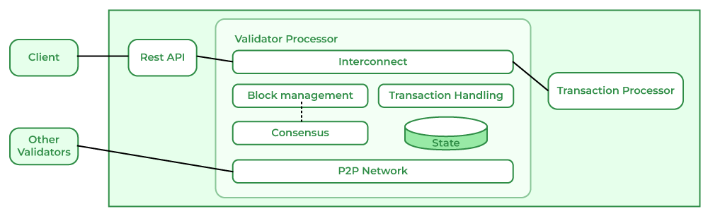

## Table of Contents

## What is Hyperledger Sawtooth?

Hyperledger Sawtooth is a type of software that helps create and manage blockchain networks. It was made by a company called Intel and is now part of the Hyperledger project, which is supported by the Linux Foundation. This software is special because it lets people build blockchain applications that can be used in many different areas, like finance, supply chain, and more. It's designed to be easy to use and flexible, so developers can change it to fit their needs.

One cool thing about Sawtooth is that it uses something called "parallel transaction processing." This means it can handle many transactions at the same time, making it faster and more efficient than some other blockchains. It also has a feature called "dynamic consensus," which lets the network change how it agrees on transactions without needing to stop and restart. This makes it easier to update and improve the network over time.

## Who developed Hyperledger Sawtooth?

Hyperledger Sawtooth was created by Intel. Intel is a big company that makes computer chips and other technology. They started working on Sawtooth to make a blockchain platform that could be used in many different industries. After developing it, Intel decided to share Sawtooth with the Hyperledger project, which is run by the Linux Foundation. This way, more people could use and help improve the software.

Sawtooth is special because it's easy to use and can be changed to fit different needs. It uses something called parallel transaction processing, which means it can handle many transactions at the same time. This makes it faster than some other blockchains. Sawtooth also has a feature called dynamic consensus, which lets the network change how it agrees on transactions without stopping. This makes it easier to update and improve the network over time.

## What are the main components of Hyperledger Sawtooth?

Hyperledger Sawtooth has several main parts that work together to make it a useful blockchain platform. The first part is the Transaction Processor. This is like the brain of Sawtooth. It takes in transactions, checks them to make sure they are correct, and then processes them. Each transaction processor is made for a specific job, like handling money transfers or tracking goods in a supply chain. Another important part is the Validator. Validators are like the guards of the network. They check the transactions to make sure they follow the rules and then add them to the blockchain. They also help keep the network safe and running smoothly.

Another key component is the Consensus Mechanism. This is how the network agrees on which transactions are valid and in what order they should be added to the blockchain. Sawtooth uses something called Proof of Elapsed Time (PoET), which is a way to choose validators fairly and efficiently. There's also the REST API, which is like a bridge that lets different parts of the network talk to each other. It helps developers build applications that can interact with the blockchain easily. Lastly, there's the Sawtooth Lake CLI, which is a set of tools that let users control and manage the blockchain from the command line. These components all work together to make Sawtooth a flexible and powerful blockchain platform.

## How does Hyperledger Sawtooth ensure security?

Hyperledger Sawtooth keeps its network safe in several ways. One way is through its validators, which are like guards that check every transaction to make sure it follows the rules. If a transaction doesn't meet the rules, the validators won't let it into the blockchain. This helps stop bad transactions from messing up the network. Sawtooth also uses something called "permissioned networks," which means only certain people can join and make changes. This makes it harder for someone to sneak in and cause trouble.

Another way Sawtooth stays secure is through its consensus mechanism, called Proof of Elapsed Time (PoET). This method helps choose validators fairly and makes it hard for anyone to cheat the system. PoET uses a special kind of timer that makes sure everyone has an equal chance to be a validator. This keeps the network honest and secure. Plus, Sawtooth has strong encryption to protect the data on the blockchain, making sure that only people with the right keys can see or change it.

## What is the role of the consensus algorithm in Sawtooth?

The consensus algorithm in Hyperledger Sawtooth is really important because it helps the network agree on which transactions are valid and in what order they should be added to the blockchain. Sawtooth uses a special consensus method called Proof of Elapsed Time (PoET). PoET works by giving each validator a fair chance to add a block to the blockchain. It uses a kind of timer that makes sure everyone has an equal shot at being chosen. This helps keep the network honest and stops people from cheating.

Another cool thing about Sawtooth's consensus algorithm is that it can change without stopping the network. This is called dynamic consensus. It means that if the network wants to switch to a different way of agreeing on transactions, it can do so without any big interruptions. This makes Sawtooth very flexible and easy to update, which is great for keeping the network running smoothly and securely over time.

## Can you explain the difference between PoET and Raft consensus in Sawtooth?

In Hyperledger Sawtooth, the Proof of Elapsed Time (PoET) and Raft are two different ways to help the network agree on transactions. PoET is like a fair lottery system. It gives each validator a special timer, and whoever's timer goes off first gets to add the next block to the blockchain. This makes sure everyone has an equal chance and helps keep the network honest. PoET is good for big networks because it can handle a lot of validators without slowing down.

On the other hand, Raft is more like a voting system. In Raft, validators take turns being the leader, and the leader decides the order of transactions. The other validators then vote to agree or disagree with the leader's choices. If most validators agree, the transactions get added to the blockchain. Raft is simpler and works well for smaller networks where everyone knows each other. It's easier to set up and manage, but it might not be as good for very large networks as PoET.

## How does Sawtooth handle smart contracts?

In Hyperledger Sawtooth, smart contracts are called "transaction families." These are special pieces of code that define what kinds of transactions can happen on the blockchain and how they should be processed. Each transaction family is like a set of rules that the network follows. For example, there might be a transaction family for handling money transfers or another for tracking goods in a supply chain. Developers can create their own transaction families to fit their specific needs, making Sawtooth very flexible.

When a user wants to do something on the blockchain, like send money or update a record, they create a transaction that follows the rules of a specific transaction family. This transaction is then sent to a transaction processor, which is a part of Sawtooth that knows how to handle that type of transaction. The transaction processor checks the transaction to make sure it's valid and then processes it according to the rules of the transaction family. This way, Sawtooth can handle many different kinds of smart contracts, all working together to keep the blockchain running smoothly.

## What programming languages are supported for writing transactions in Sawtooth?

Hyperledger Sawtooth lets you write transactions in different programming languages. The main one is Python, which is easy to learn and use. Many people like Python because it's simple and has lots of tools to help you code.

Besides Python, you can also use other languages like JavaScript, Go, and even C++. This makes Sawtooth flexible because you can pick the language you're most comfortable with or the one that's best for your project. No matter which language you choose, Sawtooth can handle it and process your transactions correctly.

## How does Sawtooth manage state and data?

In Hyperledger Sawtooth, state and data are managed through something called the Global State. Think of the Global State like a big notebook where all the important information about the blockchain is kept. Every time a transaction happens, like someone sending money or updating a record, the Global State gets updated to show the new information. This way, everyone on the network can see the latest state of things. The Global State is stored in a special way called a Merkle-Radix tree, which makes it easy to find and check information quickly.

Sawtooth also uses something called the Transaction Receipt to keep track of what happens with each transaction. When a transaction is processed, a receipt is created that shows all the details about what changed in the Global State. This helps keep everything clear and easy to follow. If someone wants to check what happened with a transaction, they can look at the receipt and see exactly how the state was updated. This makes Sawtooth very good at managing and keeping track of data on the blockchain.

## What are the scalability features of Hyperledger Sawtooth?

Hyperledger Sawtooth has some cool features that help it handle a lot of transactions at the same time. One of these features is called parallel transaction processing. This means that Sawtooth can work on many transactions all at once, instead of one by one. It's like having many chefs cooking different dishes in the kitchen at the same time, which makes everything faster. This is really helpful when a lot of people are using the blockchain and need their transactions to be processed quickly.

Another way Sawtooth stays scalable is by using something called dynamic consensus. This means the network can change how it agrees on transactions without needing to stop and start over. It's like being able to switch from one game to another without pausing. This makes it easier to update the network and keep it running smoothly, even as it grows bigger. With these features, Sawtooth can handle more users and transactions without slowing down, making it a good choice for big projects.

## How can Hyperledger Sawtooth be integrated with existing systems?

Hyperledger Sawtooth can be easily connected to the systems you already use. It has a special tool called a REST API that acts like a bridge. This bridge helps different parts of your system talk to each other. For example, if you have a program that needs to send information to the blockchain, the REST API can help make that happen smoothly. You can also use Sawtooth's software development kits (SDKs) which are like toolkits that help you write code to connect your systems to the blockchain. These SDKs support different programming languages, so you can use the one you're most comfortable with.

Another way to integrate Sawtooth with your existing systems is by using smart contracts, which Sawtooth calls transaction families. These are like sets of rules that tell the blockchain what to do with certain types of data. By creating transaction families that match the way your current systems work, you can make sure that the blockchain understands and processes your data correctly. This makes it easier to add blockchain technology to your business without having to change everything you already have.

## What are some real-world applications of Hyperledger Sawtooth?

Hyperledger Sawtooth is used in many different areas because it's flexible and can be changed to fit different needs. One real-world use is in supply chain management. Companies use Sawtooth to track products from the factory to the store. This helps them make sure everything is safe and on time. For example, a food company might use Sawtooth to keep an eye on where their food comes from and how it's handled, so they can quickly find and fix any problems.

Another use of Sawtooth is in the financial world. Banks and other financial companies use it to make their systems more secure and efficient. They can use Sawtooth to handle things like money transfers and keeping track of who owns what. This makes everything faster and less likely to be messed up by mistakes or fraud. For instance, a bank might use Sawtooth to make sure that when someone sends money, it goes to the right place quickly and safely.

Sawtooth is also used in healthcare to manage patient records and make sure they are kept private and secure. Hospitals and clinics can use it to share information with each other without worrying about it getting into the wrong hands. This helps doctors give better care because they can see all the important information about a patient in one place. For example, a hospital might use Sawtooth to keep track of a patient's medical history and share it with other doctors who need to know.

## References & Further Reading

[1]: "Hyperledger Sawtooth Documentation." [Hyperledger](https://www.lfdecentralizedtrust.org/hyperledger-sawtooth-1-0)

[2]: Cachin, C., & Vukolić, M. (2017). "Blockchain Consensus Protocols in the Wild." arXiv preprint arXiv:1707.01873. [Link](https://arxiv.org/abs/1707.01873)

[3]: "Architecture of a Distributed Ledger System: Blockchain." [IBM Blockchain](https://en.wikipedia.org/wiki/Blockchain)

[4]: Fletcher, G. (2019). "Exchange and Trading Blockchain Platforms: A Co-Investment View." The Journal of Business, Entrepreneurship & the Law. [Link](https://www.researchgate.net/publication/387223620_Mind_and_Machines_The_Psychology_of_Artificial_Intelligence)

[5]: Swan, M. (2015). "Blockchain: Blueprint for a New Economy." O'Reilly Media, Inc.

[6]: "Algorithmic Trading: Overview, History, and Types." [Investopedia](https://www.investopedia.com/top-cd-rates-today-dec-30-2024-last-chance-to-grab-5-50-for-6-months-8767573)

[7]: "Proof of Elapsed Time (PoET): A Blockchain Consensus Protocol." [Intel](https://umatechnology.org/windows-11-supported-processors-cpu-list-for-intel-and-amd/)

