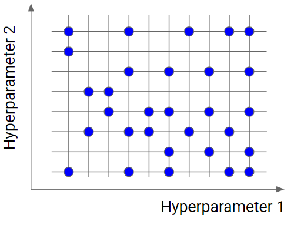

## Table of Contents

## What are hyperparameters in machine learning?

Hyperparameters in machine learning are settings that control the behavior of a model before it starts learning from the data. They are not learned from the data itself but are set by the user before training begins. Think of them as the knobs and dials you adjust to fine-tune how your model learns. For example, in a neural network, the learning rate is a hyperparameter that determines how much the model's weights are updated with each iteration. If the learning rate is too high, the model might overshoot the optimal solution; if it's too low, the model might take too long to converge or get stuck.

Choosing the right hyperparameters can significantly impact a model's performance. This process often involves trial and error or using methods like grid search, random search, or more advanced techniques like Bayesian optimization. For instance, when using grid search, you might try different combinations of hyperparameters to see which one gives the best results on a validation set. Here's a simple example of how you might use grid search in Python to find the best learning rate and number of estimators for a Random Forest model:

```python
from sklearn.model_selection import GridSearchCV
from sklearn.ensemble import RandomForestClassifier

param_grid = {
    'n_estimators': [10, 50, 100],
    'learning_rate': [0.01, 0.1, 1]
}

grid_search = GridSearchCV(RandomForestClassifier(), param_grid, cv=5)
grid_search.fit(X_train, y_train)

print("Best parameters:", grid_search.best_params_)
print("Best cross-validation score:", grid_search.best_score_)
```

By carefully selecting hyperparameters, you can improve your model's ability to generalize from the training data to new, unseen data, ultimately leading to better performance.

## Why is hyperparameter tuning important?

Hyperparameter tuning is important because it helps make your [machine learning](/wiki/machine-learning) model work better. When you set the right hyperparameters, your model can learn more effectively from the data. This means it can make better predictions or classifications. For example, if you're trying to predict house prices, good hyperparameters can help your model understand the relationship between house features and prices more accurately.

If you don't tune your hyperparameters, your model might not perform as well as it could. It might overfit, which means it learns the training data too well and doesn't work well on new data. Or it might underfit, which means it doesn't learn enough from the training data to make good predictions. By trying different hyperparameter settings, you can find the best balance that helps your model generalize well to new data. This process can be done using methods like grid search, where you test different combinations of hyperparameters to see which one gives the best results.

## What is the difference between a parameter and a hyperparameter?

Parameters and hyperparameters are both important in machine learning, but they are different. Parameters are what the model learns from the data. For example, in a linear regression model, the weights of the features are parameters. The model adjusts these weights during training to minimize the error between its predictions and the actual data. These parameters are learned automatically by the model as it processes the training data.

Hyperparameters, on the other hand, are set by the user before training begins. They control how the model learns. For example, in the same linear regression model, the learning rate is a hyperparameter that determines how quickly the model updates its weights. Unlike parameters, hyperparameters are not learned from the data; instead, you have to choose them. If you choose the wrong hyperparameters, your model might not learn well, so it's important to try different settings to find the best ones.

To illustrate the difference, consider a simple linear regression model. The parameters are the coefficients $$ \beta_0 $$ and $$ \beta_1 $$ in the equation $$ y = \beta_0 + \beta_1 x $$. These are learned from the data. The hyperparameters might include the learning rate and the number of iterations for the training process. These are set by you before training starts. Here's a simple example in Python to show how you might set a hyperparameter for a linear regression model:

```python
from sklearn.linear_model import SGDRegressor
from sklearn.datasets import make_regression
from sklearn.model_selection import train_test_split

# Generate some data
X, y = make_regression(n_samples=100, n_features=1, noise=0.1, random_state=42)
X_train, X_test, y_train, y_test = train_test_split(X, y, test_size=0.2, random_state=42)

# Set the learning rate (a hyperparameter)
learning_rate = 0.01

# Create and train the model
model = SGDRegressor(learning_rate='constant', eta0=learning_rate, max_iter=1000)
model.fit(X_train, y_train)

# The model's parameters (learned from the data)
print("Parameters:", model.coef_, model.intercept_)
```

## What is Random Search and how does it work for hyperparameter tuning?

Random Search is a method for finding the best hyperparameters for a machine learning model. Instead of trying every possible combination like Grid Search, Random Search picks random combinations of hyperparameters. This can be faster because it doesn't have to check every single option. For example, if you have three hyperparameters to tune, Random Search might try 10 different random combinations instead of trying all possible combinations, which could be a lot more.

Here's how Random Search works: You decide on a range of values for each hyperparameter you want to tune. Then, Random Search picks random values from these ranges and tries them out. It keeps track of which combination of hyperparameters gives the best results on a validation set. After trying enough random combinations, you can use the best set of hyperparameters found to train your final model. This method is often faster and can sometimes find better hyperparameters than Grid Search, especially when some hyperparameters are more important than others.

Here's a simple example of how you might use Random Search in Python to find the best learning rate and number of estimators for a Random Forest model:

```python
from sklearn.model_selection import RandomizedSearchCV
from sklearn.ensemble import RandomForestClassifier
import numpy as np

param_dist = {
    'n_estimators': np.arange(10, 101, 10),
    'learning_rate': [0.01, 0.1, 1]
}

random_search = RandomizedSearchCV(RandomForestClassifier(), param_dist, n_iter=10, cv=5)
random_search.fit(X_train, y_train)

print("Best parameters:", random_search.best_params_)
print("Best cross-validation score:", random_search.best_score_)
```

## How does Differentiable Hyperparameter Search improve upon traditional methods?

Differentiable Hyperparameter Search is a way to find the best hyperparameters that can be better than traditional methods like Grid Search or Random Search. Traditional methods try different combinations of hyperparameters one at a time and see which one works best. This can take a long time because they have to check many different settings. Differentiable Hyperparameter Search, on the other hand, uses math to figure out how to change the hyperparameters in a way that makes the model's performance better. It does this by calculating how sensitive the model's performance is to each hyperparameter. This means it can find good hyperparameters faster because it doesn't have to try as many different combinations.

To make this work, Differentiable Hyperparameter Search uses a technique called gradient descent. This is the same method used to train the model's parameters, but here it's applied to the hyperparameters. Imagine you're trying to find the best learning rate for your model. With traditional methods, you might try learning rates like 0.01, 0.1, and 1.0 to see which works best. But with Differentiable Hyperparameter Search, you can use the gradient of the model's performance with respect to the learning rate to figure out how to adjust it to get better results. This can make the process of finding the best hyperparameters much quicker and more efficient.

## What is the process of implementing Population Based Training for hyperparameter optimization?

Population Based Training (PBT) is a method for tuning hyperparameters that uses a group of models, or a "population," to explore different settings. Imagine you're trying to find the best way to train a model. Instead of trying one set of hyperparameters at a time, PBT starts with a bunch of models, each with its own set of hyperparameters. These models train together, and as they go, PBT lets the best-performing models share their hyperparameters with others. This sharing helps the whole group improve over time. If a model isn't doing well, PBT might change its hyperparameters or even replace it with a new model that starts with the hyperparameters of a better-performing one.

The process of implementing PBT involves setting up this population of models and then letting them train and evolve. You start by creating a group of models with different initial hyperparameters. As these models train, PBT periodically checks their performance. If a model is doing well, its hyperparameters might be used to update other models in the population. If a model is doing poorly, PBT might tweak its hyperparameters or replace it entirely. This back-and-forth continues until the models stop improving or reach a set number of training steps. By the end, you'll have a set of hyperparameters that have been tested and refined through this collaborative process, often leading to better performance than what you might get from tuning hyperparameters one at a time.

## Can you explain the concept of Dynamic Algorithm Configuration (DAC) in hyperparameter search?

Dynamic Algorithm Configuration (DAC) is a way to find the best hyperparameters for a machine learning model by changing them as the model learns. Instead of setting the hyperparameters at the start and leaving them the same, DAC lets the model adjust its hyperparameters while it's training. This can help the model learn better because it can adapt to what it's finding in the data. Imagine you're trying to solve a puzzle. If you start with one approach and it's not working, you might change your strategy. DAC does something similar, but for the hyperparameters of a machine learning model.

In DAC, the model starts with some initial hyperparameters, but these can change over time based on how well the model is doing. If the model sees that a certain set of hyperparameters isn't helping it learn well, it might switch to a different set. This is like trying different keys to unlock a door until you find the one that works. By allowing the hyperparameters to change dynamically, DAC can help the model find the best way to learn from the data more quickly and effectively.

## What are the advantages and disadvantages of using Random Search compared to grid search?

Random Search is often faster than Grid Search because it doesn't check every possible combination of hyperparameters. Instead, it picks random combinations to try. This can be a big advantage if you have a lot of hyperparameters to tune, because Grid Search might take too long to try all the options. Random Search can also sometimes find better hyperparameters than Grid Search, especially when some hyperparameters are more important than others. For example, if the learning rate is more important than the number of estimators in a Random Forest model, Random Search might find a good learning rate faster because it doesn't have to try every possible number of estimators first.

However, Random Search has some downsides. It might miss the best hyperparameters because it doesn't check every combination. If you're lucky, it might find good hyperparameters quickly, but if you're unlucky, it might not find them at all. Grid Search, on the other hand, is more thorough because it tries every combination you tell it to. This can be important if you need to be sure you've found the best possible hyperparameters. But Grid Search can be slower and might take more time and computing power, especially if you have many hyperparameters to tune.

## How can Differentiable Hyperparameter Search be applied to neural network architectures?

Differentiable Hyperparameter Search can help find the best settings for a [neural network](/wiki/neural-network) by using math to guide the search. Imagine you're trying to find the best learning rate and the number of layers in your neural network. Instead of trying different combinations one by one, Differentiable Hyperparameter Search uses something called gradient descent to figure out how to change these settings to make your network perform better. It does this by calculating how sensitive the network's performance is to each setting. This means you can find good settings faster because you don't have to try as many different combinations.

To use Differentiable Hyperparameter Search with a neural network, you start by setting up your network with some initial hyperparameters. Then, as the network trains, you use the gradients of the performance with respect to the hyperparameters to adjust them. For example, if you're tuning the learning rate $$ \alpha $$, you might update it using the gradient $$ \frac{\partial L}{\partial \alpha} $$, where $$ L $$ is the loss function of your network. This approach can be implemented using special libraries that allow you to backpropagate through the hyperparameters. By doing this, you can dynamically adjust the hyperparameters during training, which can lead to better performance and faster convergence compared to traditional methods like Grid Search or Random Search.

## What metrics should be considered when evaluating the performance of different hyperparameter search methods?

When evaluating the performance of different hyperparameter search methods, one key metric to consider is the time it takes to find the best hyperparameters. This is important because some methods, like Grid Search, can take a long time if you have many hyperparameters to tune. On the other hand, methods like Random Search or Differentiable Hyperparameter Search might find good hyperparameters faster. Another important metric is how well the model performs with the hyperparameters found. This can be measured using metrics like accuracy, precision, recall, or the loss function $$ L $$. For example, if you're using a Random Forest model, you might look at the accuracy on a validation set to see how well the hyperparameters work.

Another metric to consider is the computational resources used during the search. Some methods might need a lot of memory or processing power, which can be a problem if you're working with limited resources. It's also important to look at how consistent the results are. If you run the same hyperparameter search method multiple times, do you get similar results each time? This can tell you how reliable the method is. Finally, consider how easy it is to use the method. Some methods might require a lot of setup or special libraries, which can make them harder to use than others. By looking at these metrics, you can decide which hyperparameter search method is best for your needs.

## How do you choose the right hyperparameter search method for a specific machine learning problem?

Choosing the right hyperparameter search method depends on what you need for your machine learning problem. If you have a lot of hyperparameters to tune and not much time, Random Search might be a good choice because it's faster than Grid Search. Random Search picks random combinations of hyperparameters to try, which can sometimes find good settings quickly. On the other hand, if you need to be sure you've tried every possible combination, Grid Search might be better. It checks every combination you tell it to, which can be thorough but slow. If you're working with a neural network and want to use math to guide your search, Differentiable Hyperparameter Search could be useful. It uses gradient descent to adjust hyperparameters during training, which can be faster and more efficient.

Another thing to consider is how much computing power you have. Grid Search can use a lot of resources because it tries every combination, so if you're limited, Random Search or Differentiable Hyperparameter Search might be better. Also, think about how consistent you need your results to be. Random Search can be less reliable because it might not find the best hyperparameters every time, while Grid Search is more thorough. Finally, consider how easy the method is to use. Some methods might need special libraries or a lot of setup, which can make them harder to use. By thinking about these factors, you can pick the best hyperparameter search method for your specific problem.

## What are some advanced techniques for scaling hyperparameter search in large-scale machine learning systems?

When working with large-scale machine learning systems, one advanced technique for scaling hyperparameter search is using distributed computing. This means spreading the work of trying different hyperparameters across many computers or processors. By doing this, you can try more combinations at the same time, which can make the search faster. For example, you could use tools like Apache Spark or TensorFlow's distributed training to run many different hyperparameter settings in parallel. This can be especially helpful if you have a lot of data and a complex model, because it can take a long time to train the model with different hyperparameters.

Another technique is using Bayesian Optimization, which is smarter about which hyperparameters to try next. Instead of [picking](/wiki/asset-class-picking) random combinations or trying every possible setting, Bayesian Optimization uses past results to guess which new settings might work best. It does this by building a model of the hyperparameter space and using it to predict where the best hyperparameters might be. This can be more efficient than other methods because it focuses on the most promising areas of the search space. For example, you might use a library like Hyperopt or Optuna to implement Bayesian Optimization in your large-scale system.

## References & Further Reading

[1]: Bergstra, J., & Bengio, Y. (2012). ["Random Search for Hyper-Parameter Optimization."](https://dl.acm.org/doi/10.5555/2188385.2188395) Journal of Machine Learning Research, 13(Feb): 281-305.

[2]: Snoek, J., Larochelle, H., & Adams, R. P. (2012). ["Practical Bayesian Optimization of Machine Learning Algorithms."](https://arxiv.org/abs/1206.2944) Advances in Neural Information Processing Systems 25.

[3]: Feurer, M., & Hutter, F. (2019). ["Hyperparameter Optimization."](https://link.springer.com/content/pdf/10.1007/978-3-030-05318-5_1.pdf) In Automated Machine Learning (pp. 3-33). Springer, Cham. 

[4]: Li, L., Jamieson, K., DeSalvo, G., Rostamizadeh, A., & Talwalkar, A. (2017). ["Hyperband: A Novel Bandit-Based Approach to Hyperparameter Optimization."](https://jmlr.org/papers/volume18/16-558/16-558.pdf) Journal of Machine Learning Research, 18(185), 1-52.

[5]: Shahriari, B., Swersky, K., Wang, Z., Adams, R. P., & De Freitas, N. (2015). ["Taking the Human Out of the Loop: A Review of Bayesian Optimization."](https://ieeexplore.ieee.org/document/7352306) Proceedings of the IEEE, 104(1), 148-175.