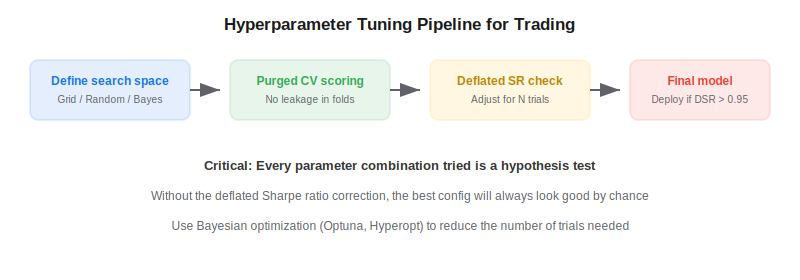
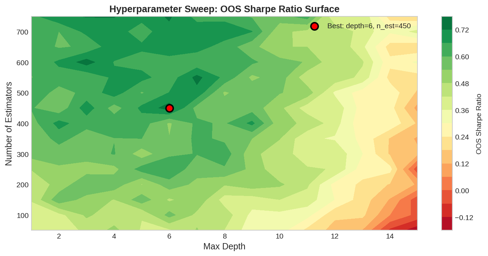

Hyperparameter tuning is the process of selecting the optimal configuration for a machine learning model — the number of trees, maximum depth, learning rate, regularization strength, and so on. In algorithmic trading, this process is especially dangerous because every configuration tested is an implicit hypothesis test: the more combinations you try, the more likely you are to find one that looks good by chance. Lopez de Prado (2018) provides a disciplined framework for tuning without falling into the multiple-testing trap.

## The Overfitting Risk

Standard hyperparameter tuning with grid search or random search evaluates hundreds of configurations and selects the best one. In finance, this is equivalent to backtesting hundreds of strategies and reporting only the winner — a recipe for overfitting. The best configuration on historical data is often just the one that best memorized noise.



## A Disciplined Tuning Pipeline

### Step 1: Define a Constrained Search Space

Keep the search space small and informed by domain knowledge. For random forests in trading:

| Parameter | Search Range | Rationale |
|---|---|---|
| n_estimators | [200, 500, 1000] | More trees rarely hurts; diminishing returns past 500 |
| max_depth | [3, 5, 7] | Shallow trees prevent overfitting to noise |
| min_samples_leaf | [10, 20, 50] | Ensures each leaf has statistical significance |
| max_features | ["sqrt", 0.3, 0.5] | Controls diversity across trees |

### Step 2: Use Purged Cross-Validation for Scoring

Never use standard k-fold or time-series split without purging. [Purged k-fold CV](https://paperswithbacktest.com/wiki/purged-k-fold-cross-validation) removes training samples that overlap with test labels, and [CPCV](https://paperswithbacktest.com/wiki/combinatorial-purged-cross-validation-cpcv) generates multiple backtest paths for more robust evaluation.

### Step 3: Apply the Deflated Sharpe Ratio

After finding the best configuration, compute the [deflated Sharpe ratio](https://paperswithbacktest.com/wiki/deflated-sharpe-ratio) to check whether its performance is statistically significant given the total number of configurations tested.

### Step 4: Use Bayesian Optimization to Reduce Trials

Bayesian optimization (via libraries like Optuna or Hyperopt) uses a probabilistic surrogate model to intelligently explore the search space, finding good configurations in far fewer trials than grid search. Fewer trials = less multiple-testing inflation.



## Python Implementation

```python
import optuna
from sklearn.ensemble import RandomForestClassifier
from sklearn.model_selection import cross_val_score
import numpy as np

def objective(trial):
    params = {
        "n_estimators": trial.suggest_categorical("n_estimators", [200, 500, 1000]),
        "max_depth": trial.suggest_int("max_depth", 3, 7),
        "min_samples_leaf": trial.suggest_int("min_samples_leaf", 10, 50),
        "max_features": trial.suggest_float("max_features", 0.2, 0.6),
    }
    clf = RandomForestClassifier(**params, random_state=42, n_jobs=-1)
    # Use purged CV in production — standard CV shown for simplicity
    scores = cross_val_score(clf, X_train, y_train, cv=5, scoring="f1")
    return scores.mean()

study = optuna.create_study(direction="maximize")
study.optimize(objective, n_trials=50, show_progress_bar=True)

# Check with deflated SR
best_sr = study.best_value
n_trials = len(study.trials)
# dsr = deflated_sharpe_ratio(best_sr, expected_max_sr(n_trials, T), T)
print(f"Best F1: {best_sr:.3f} from {n_trials} trials")
print(f"Best params: {study.best_params}")
```

## Key Principles

1. **Fewer trials = less inflation.** Bayesian optimization with 50 trials is far safer than grid search with 1,000.
2. **Always correct for multiple testing.** The DSR tells you whether the best result is real.
3. **Use purged validation.** Standard CV leaks information through overlapping labels.
4. **Prefer simpler models.** When two configurations score similarly, pick the one with fewer effective parameters.
5. **Log everything.** Record every configuration tested — this is the $N$ in your DSR calculation.

## Limitations and Risks

Bayesian optimization can still overfit if the surrogate model is too flexible or the search space is too large. The DSR correction assumes independent trials, which is not exactly true when parameter combinations are correlated. Despite these caveats, this pipeline is vastly better than uncorrected grid search.

## Conclusion

Hyperparameter tuning in trading is a balancing act between finding good configurations and not fooling yourself. The combination of Bayesian optimization (fewer trials), purged cross-validation (no leakage), and the deflated Sharpe ratio (multiple-testing correction) provides a principled approach. Every parameter choice is a bet — size it carefully.

---

**Explore further on PapersWithBacktest:**
- Browse [backtested strategies](https://paperswithbacktest.com/strategies) with Python code and performance metrics
- Access [clean historical market data](https://paperswithbacktest.com/datasets) for equities, crypto, and futures
- Take the [algo trading course](https://paperswithbacktest.com/course) — 60+ video lessons and notebooks
- Related wiki pages: [Deflated Sharpe Ratio](https://paperswithbacktest.com/wiki/deflated-sharpe-ratio) · [CPCV](https://paperswithbacktest.com/wiki/combinatorial-purged-cross-validation-cpcv) · [Backtesting Pitfalls](https://paperswithbacktest.com/wiki/backtesting-pitfalls-overfitting)
