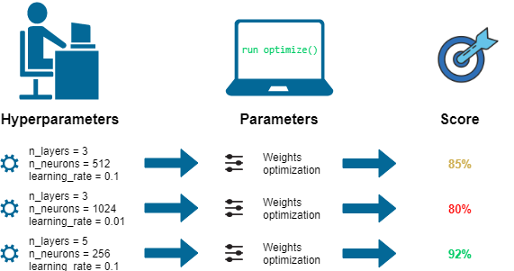

## Table of Contents

## What is a hyperparameter in machine learning?

In machine learning, a hyperparameter is a setting that you choose before you start training your model. It's not something the model learns by itself during training. Instead, you, as the person building the model, decide on these values. Hyperparameters can affect how well your model performs and how quickly it learns. For example, in a decision tree, the maximum depth of the tree is a hyperparameter that you set before training.

Choosing the right hyperparameters is important because they can make a big difference in how well your model works. If you set them poorly, your model might not learn well or might take too long to train. To find the best hyperparameters, people often use methods like grid search or random search. These methods try out different combinations of hyperparameters to see which ones give the best results. For example, you might try different learning rates in a neural network to see which one helps the model learn the best.

## How do hyperparameters differ from model parameters?

Hyperparameters are settings you choose before you start training your model. They are not learned by the model during training. For example, in a decision tree, you might set the maximum depth of the tree as a hyperparameter. This choice affects how the model learns, but the model itself doesn't change this value. Hyperparameters can be things like the learning rate in a neural network or the number of clusters in a clustering algorithm. You usually need to try different values to find the best ones for your model.

On the other hand, model parameters are values that the model learns during training. These are the internal settings that the model adjusts to fit the data. For example, in a linear regression model, the coefficients of the features are model parameters. The model changes these values to minimize the error between its predictions and the actual data. Unlike hyperparameters, model parameters are not set by you; they are learned by the model through the training process. 

In summary, hyperparameters are set by you before training and control the learning process, while model parameters are learned by the model during training and are used to make predictions. Finding the right hyperparameters can be tricky, and methods like grid search or random search are often used to try different combinations and see which ones work best.

## Why are hyperparameters important in machine learning models?

Hyperparameters are important in [machine learning](/wiki/machine-learning) models because they help control how the model learns from the data. When you set hyperparameters, you're deciding things like how fast the model should learn or how complex it should be. For example, in a [neural network](/wiki/neural-network), the learning rate is a hyperparameter that affects how quickly the model updates its weights. If the learning rate is too high, the model might learn too fast and miss important patterns. If it's too low, the model might take too long to learn or get stuck. By choosing the right hyperparameters, you can help the model learn better and make more accurate predictions.

Finding the best hyperparameters is a bit like trying different recipes to see which one tastes the best. You might use methods like grid search or random search to try out different combinations of hyperparameters. For example, you could try different values for the number of trees in a random forest or the maximum depth of a decision tree. By testing these different settings, you can find the ones that make your model perform the best. This process can take time, but it's worth it because the right hyperparameters can make a big difference in how well your model works.

## What are some common hyperparameters found in machine learning algorithms?

In machine learning, there are several common hyperparameters that you'll find in different algorithms. For example, the learning rate is a very important hyperparameter in algorithms like neural networks and gradient descent. It controls how big of a step the model takes when it's learning from the data. If the learning rate is too high, the model might overshoot the best solution and never find it. If it's too low, the model might take too long to learn or get stuck. Another common hyperparameter is the number of trees in a random forest. This decides how many decision trees the model will use to make predictions. More trees can make the model more accurate but also slower to train.

Other common hyperparameters include the maximum depth of a decision tree, which decides how complex the tree can be. A deeper tree can capture more details in the data but might also overfit. The regularization parameter, often called lambda $$(\lambda)$$, is another important hyperparameter. It helps prevent overfitting by adding a penalty to the model's complexity. In clustering algorithms like k-means, the number of clusters $$k$$ is a key hyperparameter. It decides how many groups the algorithm will try to find in the data. Choosing the right value for $$k$$ can be tricky, but it's important for getting good results.

In addition to these, there are hyperparameters like the batch size in neural networks, which decides how many examples the model looks at before updating its weights. A smaller batch size can make the model learn faster but might be more unstable. The number of epochs, which is how many times the model goes through the entire dataset, is another hyperparameter. More epochs can help the model learn better, but too many can lead to overfitting. By trying different values for these hyperparameters, you can find the best settings for your model and make it perform as well as possible.

## How can one choose the right hyperparameters for a model?

Choosing the right hyperparameters for a model can be a bit like finding the perfect recipe. You start by trying different values and seeing which ones make your model perform the best. One way to do this is by using a method called grid search. With grid search, you pick a few different values for each hyperparameter and try every combination. For example, if you're using a decision tree, you might try different values for the maximum depth and the minimum number of samples per leaf. You train the model with each combination and see which one gives the best results. This can take a lot of time, but it's a thorough way to find good hyperparameters.

Another way to choose hyperparameters is by using random search. Instead of trying every possible combination, random search picks random values for the hyperparameters. This can be faster than grid search because it doesn't try every combination, but it still gives you a good chance of finding good values. For example, if you're using a neural network, you might try different learning rates and batch sizes. Random search can be especially useful when you have a lot of hyperparameters to tune. Both grid search and random search can help you find the right hyperparameters, but sometimes you might need to use more advanced methods like Bayesian optimization, which uses past results to make smarter guesses about which hyperparameters to try next.

In practice, you might start with a simple method like grid search or random search and then move to more advanced methods if needed. It's also important to use a validation set to check how well your model is doing with different hyperparameters. This helps you avoid overfitting, where the model works well on the training data but not on new data. By trying different hyperparameters and checking their performance on a validation set, you can find the best settings for your model and make it work as well as possible.

## What is hyperparameter tuning and why is it necessary?

Hyperparameter tuning is the process of finding the best settings for your machine learning model before you start training it. These settings, called hyperparameters, are things like the learning rate in a neural network or the maximum depth of a decision tree. You can't learn these settings from the data; you have to choose them yourself. Tuning these hyperparameters is important because they can make a big difference in how well your model works. If you pick the wrong values, your model might not learn well or might take too long to train.

To find the best hyperparameters, you can use methods like grid search or random search. Grid search tries every possible combination of hyperparameters you choose. For example, if you're using a decision tree, you might try different values for the maximum depth and the minimum number of samples per leaf. Random search, on the other hand, picks random values for the hyperparameters. This can be faster than grid search because it doesn't try every combination, but it still gives you a good chance of finding good values. Both methods help you find the best settings for your model, but sometimes you might need to use more advanced methods like Bayesian optimization, which uses past results to make smarter guesses about which hyperparameters to try next.

## What are the different methods for hyperparameter optimization?

Hyperparameter optimization is the process of finding the best settings for your machine learning model. One common method is grid search. In grid search, you pick a few different values for each hyperparameter and try every combination. For example, if you're using a decision tree, you might try different values for the maximum depth and the minimum number of samples per leaf. You train the model with each combination and see which one gives the best results. This can take a lot of time, but it's a thorough way to find good hyperparameters. Another method is random search, which picks random values for the hyperparameters. This can be faster than grid search because it doesn't try every combination, but it still gives you a good chance of finding good values. Random search can be especially useful when you have a lot of hyperparameters to tune.

A more advanced method for hyperparameter optimization is Bayesian optimization. This method uses past results to make smarter guesses about which hyperparameters to try next. It's like learning from experience to make better choices. Bayesian optimization can be more efficient than grid search or random search because it focuses on the most promising areas of the hyperparameter space. For example, if you're using a neural network, Bayesian optimization might help you find the best learning rate and batch size more quickly than trying every possible combination. By using these different methods, you can find the best hyperparameters for your model and make it perform as well as possible.

## Can you explain grid search as a method for hyperparameter tuning?

Grid search is a way to find the best settings for your machine learning model. You pick a few different values for each setting, called hyperparameters, and try every combination. For example, if you're using a decision tree, you might try different values for the maximum depth and the minimum number of samples per leaf. You train the model with each combination and see which one gives the best results. This can take a lot of time, but it's a thorough way to find good hyperparameters.

Here's how you might do grid search in practice. Let's say you're using a decision tree and you want to find the best maximum depth and minimum number of samples per leaf. You could try maximum depths of 3, 5, and 7, and minimum samples per leaf of 1, 5, and 10. You would train the model with every combination of these values, like a maximum depth of 3 with a minimum of 1, then a maximum depth of 3 with a minimum of 5, and so on. After trying all the combinations, you pick the one that makes your model work the best. This way, you can be sure you've tried all the possible settings you chose and found the best one for your model.

## How does random search compare to grid search for hyperparameter tuning?

Random search and grid search are both ways to find the best settings for a machine learning model, but they work a bit differently. Grid search tries every possible combination of the settings you choose. For example, if you're using a decision tree, you might try different values for the maximum depth and the minimum number of samples per leaf. You train the model with each combination and see which one gives the best results. This can take a lot of time because you're trying every single combination, but it's a thorough way to find good settings.

Random search, on the other hand, picks random values for the settings. Instead of trying every combination, it tries a bunch of random ones. This can be faster than grid search because it doesn't try every combination, but it still gives you a good chance of finding good values. Random search can be especially useful when you have a lot of settings to tune. Both methods can help you find the best settings for your model, but random search might be quicker if you don't need to try every possible combination.

## What are Bayesian optimization techniques for hyperparameter tuning?

Bayesian optimization is a smart way to find the best settings for a machine learning model. Instead of trying every possible combination like grid search, or [picking](/wiki/asset-class-picking) random values like random search, Bayesian optimization uses past results to make better guesses about which settings to try next. It's like learning from experience to make smarter choices. For example, if you're using a neural network, Bayesian optimization might help you find the best learning rate and batch size more quickly than trying every possible combination. This method can be more efficient because it focuses on the most promising areas of the setting space.

To use Bayesian optimization, you need a way to guess how good a setting might be before you try it. This is called a surrogate model, and it uses a probability distribution to make these guesses. The most common way to do this is with a Gaussian process, which is a type of model that can tell you how likely different settings are to be good. Once you have the surrogate model, you use an acquisition function to decide which setting to try next. The acquisition function balances exploring new areas of the setting space with exploiting the areas that seem promising. By using these steps, Bayesian optimization can find the best settings for your model more quickly than other methods.

## How do automated hyperparameter tuning tools like AutoML work?

Automated hyperparameter tuning tools like AutoML help you find the best settings for your machine learning model without you having to do all the work. These tools use smart methods like grid search, random search, or Bayesian optimization to try different settings and see which ones work the best. For example, AutoML might start by trying a few random settings and then use Bayesian optimization to make better guesses about which settings to try next. This way, AutoML can find good settings for your model quickly and without you having to try every possible combination.

AutoML tools often come with pre-built models and settings that they know work well for different types of problems. They use these models and settings to start with and then fine-tune them to fit your specific data. This means you don't need to know a lot about machine learning to use AutoML. You just give it your data, and it does the rest, trying different settings and models until it finds the one that works the best. By using AutoML, you can save a lot of time and still get good results for your machine learning projects.

## What advanced strategies can experts use to fine-tune hyperparameters for optimal model performance?

Experts can use advanced strategies like Bayesian optimization to fine-tune hyperparameters for optimal model performance. Bayesian optimization is a smart way to find the best settings for a machine learning model. It uses past results to make better guesses about which settings to try next. This method is like learning from experience to make smarter choices. For example, if you're using a neural network, Bayesian optimization might help you find the best learning rate and batch size more quickly than trying every possible combination. It does this by using a surrogate model, often a Gaussian process, to guess how good a setting might be before trying it. Then, it uses an acquisition function to balance exploring new areas of the setting space with exploiting the areas that seem promising. By using these steps, Bayesian optimization can find the best settings for your model more quickly than other methods.

Another advanced strategy is to use ensemble methods for hyperparameter tuning. This involves training multiple models with different hyperparameters and then combining their predictions to get the best results. For example, you might train several decision trees with different maximum depths and minimum samples per leaf, and then use a method like bagging or boosting to combine their predictions. This can help you find the best settings for your model because it takes advantage of the strengths of different hyperparameter combinations. By trying different settings and combining the results, you can fine-tune your model to get the best performance possible.