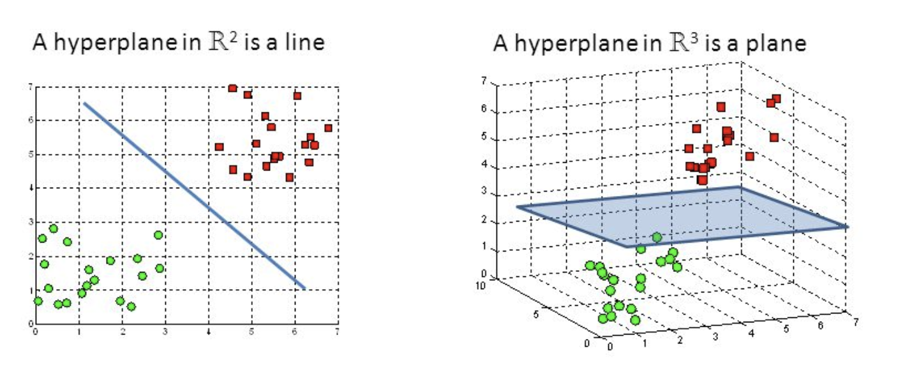

## Table of Contents

## What is a hyperplane in the context of machine learning?

In machine learning, a hyperplane is a decision boundary that separates different classes of data points in a high-dimensional space. Imagine you're trying to sort different types of fruit into two groups. If you only had two features, like weight and size, you could draw a line to separate the fruits. This line is like a hyperplane, but in two dimensions. In higher dimensions, with more features, this "line" becomes a hyperplane, which could be a plane in three dimensions or a more complex shape in even higher dimensions.

The concept of hyperplanes is especially important in algorithms like Support Vector Machines (SVMs). In an SVM, the goal is to find the hyperplane that best separates the classes of data with the widest possible margin. This margin is the distance between the hyperplane and the nearest data points from either side, called support vectors. The equation of a hyperplane in a d-dimensional space can be represented as $$w_1x_1 + w_2x_2 + ... + w_dx_d = b$$, where $$w_i$$ are the weights, $$x_i$$ are the features, and $$b$$ is the bias. This hyperplane helps the SVM classify new data points by determining which side of the hyperplane they fall on.

## How does a hyperplane relate to classification and regression tasks?

In classification tasks, a hyperplane acts like a dividing line that separates different groups of data. Imagine you're sorting apples and oranges based on their size and color. You could draw a line on a graph where apples fall on one side and oranges on the other. This line is a simple hyperplane in two dimensions. In higher dimensions, with more features like weight or sweetness, the hyperplane becomes more complex but still serves the same purpose: to split the data into different classes. For example, in a Support Vector Machine (SVM), the goal is to find the best hyperplane that maximizes the distance (margin) between the closest points of the two classes. This helps the SVM classify new data accurately by seeing which side of the hyperplane they land on.

In regression tasks, hyperplanes are used differently. Instead of separating classes, they help predict a continuous value. Think of trying to guess the price of a house based on its size and location. You could use a line (a hyperplane in two dimensions) to show how these features relate to the price. In more complex scenarios with many features, the hyperplane becomes a higher-dimensional surface that best fits the data points. The equation of this hyperplane could be something like $$y = w_1x_1 + w_2x_2 + b$$, where $$w_1$$ and $$w_2$$ are weights, $$x_1$$ and $$x_2$$ are features like size and location, and $$b$$ is a bias term. This equation helps predict the house price by plugging in the values of the features.

## Can you explain the role of a hyperplane in Support Vector Machines (SVM)?

In Support Vector Machines (SVM), a hyperplane is like a line that splits your data into different groups. Imagine you're sorting apples and oranges. You could draw a line on a piece of paper where apples go on one side and oranges on the other. This line is a simple hyperplane in two dimensions. When you have more features, like weight or color, the hyperplane becomes more complex but still does the same job: it separates the data into different classes. The goal of SVM is to find the best hyperplane that keeps the biggest gap (called the margin) between the closest points of the two classes. This makes the SVM good at sorting new data because it knows which side of the hyperplane the new data falls on.

The equation of a hyperplane in SVM can be written as $$w_1x_1 + w_2x_2 + ... + w_dx_d = b$$, where $$w_i$$ are weights, $$x_i$$ are features, and $$b$$ is the bias. These weights and the bias help the hyperplane find the best way to split the data. The points that are closest to the hyperplane are called support vectors, and they are really important because they help define where the hyperplane should be. By using these support vectors, SVM can create a strong and clear boundary between different classes, making it a powerful tool for classification tasks.

## What is the difference between a hyperplane in two-dimensional and higher-dimensional spaces?

In two-dimensional space, a hyperplane is just a line. Think of it like drawing a line on a piece of paper to separate two groups of dots. If you're sorting apples and oranges based on their size and weight, you could draw a line where apples are on one side and oranges on the other. This line is the hyperplane in 2D. The equation of this line can be written as $$y = mx + b$$, where $$m$$ is the slope and $$b$$ is the y-intercept. This simple line helps in sorting the data into two groups.

In higher-dimensional spaces, a hyperplane becomes more complex but still serves the same purpose: to separate different classes of data. For example, in three-dimensional space, a hyperplane is a flat plane that can split a cube into two parts. If you add more features like color or sweetness to your apples and oranges, the hyperplane becomes a plane or even a higher-dimensional surface. The equation of a hyperplane in a d-dimensional space is $$w_1x_1 + w_2x_2 + ... + w_dx_d = b$$, where $$w_i$$ are the weights, $$x_i$$ are the features, and $$b$$ is the bias. This equation helps find the best way to separate the data in higher dimensions, making it useful for more complex classification tasks.

## How is the optimal hyperplane determined in SVM?

In Support Vector Machines (SVM), finding the best hyperplane is all about creating the widest possible gap between the two groups of data. Imagine you're sorting apples and oranges with a line on a piece of paper. You want to draw the line so that it's as far away as possible from the closest apple and the closest orange. This gap is called the margin, and the points right next to the line are called support vectors. The goal is to make this margin as big as possible because a wider gap means the line (or hyperplane) is better at sorting new data correctly.

To find this best hyperplane, SVM uses math to figure out the right weights and bias for the equation $$w_1x_1 + w_2x_2 + ... + w_dx_d = b$$. The weights $$w_i$$ and the bias $$b$$ help the hyperplane find the best spot to split the data. The SVM looks at the support vectors to decide where to put the hyperplane, making sure it's as far away from them as possible. This way, the SVM can create a strong and clear boundary between different classes, making it good at sorting new data into the right groups.

## What are the mathematical properties of a hyperplane?

A hyperplane is like a flat surface that can split data into different groups. In two dimensions, it's just a line that can separate things like apples and oranges on a piece of paper. The equation for this line is $$y = mx + b$$, where $$m$$ is how steep the line is, and $$b$$ is where the line touches the y-axis. In three dimensions, a hyperplane becomes a flat plane, like a sheet of paper that can split a cube into two parts. The equation for a hyperplane in three dimensions is $$w_1x_1 + w_2x_2 + w_3x_3 = b$$, where $$w_1, w_2, w_3$$ are weights that show how important each feature is, and $$b$$ is a bias that shifts the plane around.

In higher dimensions, a hyperplane is still a flat surface, but it's harder to picture because it's in more than three dimensions. The equation for a hyperplane in a d-dimensional space is $$w_1x_1 + w_2x_2 + ... + w_dx_d = b$$. Here, $$w_i$$ are the weights for each feature $$x_i$$, and $$b$$ is the bias. The weights help the hyperplane figure out the best way to split the data, and the bias helps move the hyperplane to the right spot. The key thing about a hyperplane is that it's always one dimension less than the space it's in, so it can always separate the data into different groups.

## How does the concept of margin relate to hyperplanes in SVM?

In Support Vector Machines (SVM), the margin is the space between the hyperplane and the closest points from each class, called support vectors. Imagine you're sorting apples and oranges with a line on a piece of paper. You want the line to be as far away as possible from the closest apple and the closest orange. This space between the line and the closest points is the margin. The goal of SVM is to find the hyperplane that makes this margin as wide as possible because a bigger margin means the hyperplane is better at sorting new data correctly.

The equation of the hyperplane in SVM is $$w_1x_1 + w_2x_2 + ... + w_dx_d = b$$, where $$w_i$$ are the weights and $$b$$ is the bias. The weights and bias help the hyperplane find the best spot to split the data. The SVM looks at the support vectors to decide where to put the hyperplane, making sure it's as far away from them as possible. This way, the SVM can create a strong and clear boundary between different classes, making it good at sorting new data into the right groups.

## Can you discuss the impact of kernel functions on hyperplanes in SVM?

In Support Vector Machines (SVM), kernel functions help the hyperplane do a better job at sorting data when it's hard to separate with a straight line. Imagine you're trying to sort apples and oranges, but they're all mixed up and can't be split with a simple line. Kernel functions let the SVM move the data into a higher-dimensional space where it's easier to draw a line to separate the groups. This trick helps the hyperplane find a good way to sort the data, even if it's really mixed up in the original space.

The math behind this is pretty cool. A kernel function changes the way the SVM calculates the distance between points. Instead of using a simple straight line, it uses a more complex shape to measure distances. The equation for a hyperplane in a higher-dimensional space is still $$w_1x_1 + w_2x_2 + ... + w_dx_d = b$$, but the kernel function helps the SVM figure out the best weights $$w_i$$ and bias $$b$$ to make the hyperplane work well in the new space. This makes the SVM really good at sorting data that's hard to separate with a simple line.

## What are some common challenges when working with hyperplanes in high-dimensional spaces?

When working with hyperplanes in high-dimensional spaces, one common challenge is the curse of dimensionality. Imagine trying to sort apples and oranges, but now you're looking at many more features like weight, color, sweetness, and more. As the number of features grows, the space where the hyperplane lives gets bigger and more complex. This makes it harder to find the best hyperplane because there are so many more ways to draw the line that separates the data. The more dimensions you add, the more data you need to make sure the hyperplane is doing a good job at sorting everything correctly.

Another challenge is the risk of overfitting. In high-dimensional spaces, it's easy for the hyperplane to get too focused on the specific data points it's trained on, instead of finding a good general way to sort new data. This happens because the hyperplane can twist and turn in many ways to fit the training data perfectly, but it might not work well with new data. To avoid this, you might need to use techniques like regularization, which helps keep the hyperplane simpler and better at sorting new data. The equation for a hyperplane in a d-dimensional space is $$w_1x_1 + w_2x_2 + ... + w_dx_d = b$$, where the weights $$w_i$$ and the bias $$b$$ need to be carefully chosen to balance fitting the data well without overfitting.

## How can the concept of hyperplanes be applied to neural networks?

In neural networks, hyperplanes help the network make decisions by splitting the data into different groups. Imagine you're sorting apples and oranges with a [neural network](/wiki/neural-network). Each layer in the network can be thought of as trying to draw a line (or a hyperplane in higher dimensions) to separate the apples from the oranges. This line helps the network figure out which side a new piece of data falls on, and that helps it decide if it's an apple or an orange. The equation for a hyperplane in a neural network can be written as $$w_1x_1 + w_2x_2 + ... + w_dx_d = b$$, where $$w_i$$ are the weights the network learns, $$x_i$$ are the features of the data, and $$b$$ is the bias. These weights and the bias are adjusted during training to make the hyperplane better at sorting the data.

The concept of hyperplanes is especially important in the final layers of a neural network, where the network makes its final decision. For example, in a classification task, the last layer might use a hyperplane to decide if the input belongs to one class or another. The network learns to adjust the weights and bias so that the hyperplane splits the data in a way that minimizes errors. This process of adjusting the hyperplane helps the neural network become better at sorting new data correctly. By understanding how hyperplanes work, you can see how neural networks use them to make decisions and improve their performance over time.

## What advanced techniques exist for optimizing hyperplane placement in complex datasets?

When working with complex datasets, one advanced technique for optimizing hyperplane placement is using kernel functions in Support Vector Machines (SVM). Imagine you're trying to sort apples and oranges, but they're all mixed up and can't be split with a simple line. Kernel functions help by moving the data into a higher-dimensional space where it's easier to draw a line to separate the groups. This trick helps the hyperplane find a good way to sort the data, even if it's really mixed up in the original space. The equation for a hyperplane in a higher-dimensional space is still $$w_1x_1 + w_2x_2 + ... + w_dx_d = b$$, but the kernel function helps the SVM figure out the best weights $$w_i$$ and bias $$b$$ to make the hyperplane work well in the new space. This makes the SVM really good at sorting data that's hard to separate with a simple line.

Another technique is using regularization to prevent overfitting. In high-dimensional spaces, it's easy for the hyperplane to get too focused on the specific data points it's trained on, instead of finding a good general way to sort new data. Regularization helps by adding a penalty to the weights $$w_i$$ in the hyperplane equation $$w_1x_1 + w_2x_2 + ... + w_dx_d = b$$. This penalty encourages the hyperplane to be simpler and not twist and turn too much to fit the training data perfectly. By keeping the hyperplane simpler, it can work better with new data, making the sorting more accurate and reliable.

## Can you explain the theoretical foundations of hyperplanes in machine learning and their implications for algorithm design?

In [machine learning](/wiki/machine-learning), hyperplanes are like lines or flat surfaces that help split data into different groups. Imagine you're trying to sort apples and oranges. If you only look at two things, like size and weight, you can draw a line on a piece of paper to separate them. This line is a simple hyperplane in two dimensions. The equation for this line is $$y = mx + b$$, where $$m$$ is how steep the line is, and $$b$$ is where the line touches the y-axis. When you add more things to look at, like color or sweetness, the line turns into a flat plane or even a more complex shape in higher dimensions. The equation for a hyperplane in a d-dimensional space is $$w_1x_1 + w_2x_2 + ... + w_dx_d = b$$, where $$w_i$$ are the weights that show how important each feature is, and $$b$$ is the bias that shifts the plane around. The goal is to find the best hyperplane that can sort the data accurately.

The theoretical foundations of hyperplanes are important for designing algorithms like Support Vector Machines (SVM). In SVM, the hyperplane is used to create the widest possible gap, called the margin, between the closest points of the two groups. This gap helps the SVM sort new data correctly because it knows which side of the hyperplane the new data falls on. The math behind this involves figuring out the right weights and bias for the hyperplane equation. Kernel functions are a way to make hyperplanes work better with complex data by moving it into a higher-dimensional space where it's easier to separate. Regularization is another technique used to keep the hyperplane simple and prevent it from overfitting to the training data. These concepts help design algorithms that can handle complex datasets and make accurate predictions.