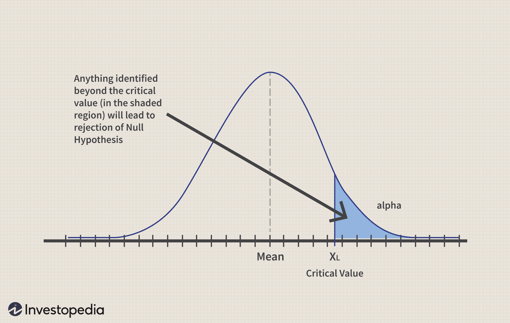

## Table of Contents

## What is hypothesis testing and why is it important in finance?

Hypothesis testing is a way to check if something we believe about data is true or not. It's like making a guess and then using data to see if that guess is right. For example, if you think a new investment strategy will make more money than an old one, you can use hypothesis testing to find out if your idea is supported by the data. You collect data, do some math, and then decide if your guess was good or if it needs to change.

In finance, hypothesis testing is very important because it helps people make better decisions with money. When you're dealing with investments, you want to know if a new way of doing things will really work better than what you're doing now. By using hypothesis testing, you can be more sure that your decisions are based on facts, not just feelings. This can help you avoid big mistakes and make smarter choices about where to put your money.

## Can you explain the basic steps involved in hypothesis testing?

The first step in hypothesis testing is to come up with a guess, or hypothesis, about what you think is true. This guess is usually about how two things are related, like whether a new investment strategy will make more money than an old one. You then set up two hypotheses: the null hypothesis, which says there's no real difference or effect, and the alternative hypothesis, which says there is a difference or effect. After setting up your hypotheses, you collect data to test them.

Once you have your data, you use it to calculate a test statistic, which is a number that helps you decide if your guess is right. You compare this test statistic to a critical value from a statistical table, or you might use a p-value, which tells you the chance of getting your results if the null hypothesis is true. If the test statistic is bigger than the critical value, or if the p-value is small enough, you reject the null hypothesis. This means your data supports your guess that there is a difference or effect. If not, you fail to reject the null hypothesis, meaning your data doesn't support your guess. Either way, you then interpret your results and decide what to do next based on what you've learned.

## What are the null and alternative hypotheses in the context of financial analysis?

In financial analysis, the null hypothesis is a statement that says there is no effect or no difference between what you're comparing. For example, if you're looking at two different investment strategies, the null hypothesis might say that these strategies perform the same. It's like saying, "There's nothing special happening here." You start with the null hypothesis because it's the baseline assumption, and you need strong evidence to move away from it.

The alternative hypothesis, on the other hand, is what you're trying to prove. It's your guess that there is an effect or a difference. Using the same example, the alternative hypothesis would say that one investment strategy performs better than the other. When you do hypothesis testing, you're trying to see if your data supports the alternative hypothesis enough to reject the null hypothesis. If you find strong evidence, you can say that your guess about the difference or effect is likely true.

## How do you choose the appropriate statistical test for hypothesis testing in finance?

Choosing the right statistical test for hypothesis testing in finance depends on what you're trying to find out and the type of data you have. If you're looking at the difference between two groups, like two investment strategies, you might use a t-test if your data is normally distributed and you're comparing means. If your data isn't normally distributed, you might choose a non-parametric test like the Mann-Whitney U test. For looking at relationships between variables, like how stock prices relate to interest rates, you might use a correlation test or regression analysis. The key is to match the test to your data and what you want to learn.

It's also important to think about how many groups you're comparing and whether your data is paired or independent. For example, if you want to compare more than two groups, like different sectors of the market, an ANOVA (Analysis of Variance) might be the right choice. If you're comparing the same group over time, like before and after a policy change, a paired t-test could be useful. Always consider the nature of your data and your research question to pick the test that will give you the most reliable results.

## What is the significance level and how does it affect hypothesis testing outcomes?

The significance level is like a rule you set before you start your test. It's a number that tells you how sure you want to be before you say your guess is right. In finance, people often use a significance level of 0.05, which means there's only a 5% chance that you're wrong if you say your guess is right. This number helps you decide if the results of your test are strong enough to believe in your guess.

When you do your test, you get a p-value, which is like a score that tells you how likely it is that your results happened just by chance. If your p-value is smaller than your significance level, you can say your results are "significant" and you can reject the null hypothesis. This means your data supports your guess. If the p-value is bigger than your significance level, you can't reject the null hypothesis, and you don't have enough evidence to say your guess is right. So, the significance level you choose can really change what you decide at the end of your test.

## Can you provide an example of hypothesis testing applied to stock market returns?

Imagine you're an investor looking at two different stocks, Stock A and Stock B. You think Stock A might give you better returns than Stock B over the next year. To check if this is true, you decide to use hypothesis testing. Your null hypothesis is that there's no difference in the returns between Stock A and Stock B. Your alternative hypothesis is that Stock A has higher returns than Stock B. You collect data on the yearly returns of both stocks over the past few years and use a t-test to compare the average returns.

After running the t-test, you get a p-value. Let's say you set your significance level at 0.05, meaning you want to be 95% sure before you believe your guess. If the p-value from your test is less than 0.05, you can reject the null hypothesis. This means the data supports your guess that Stock A has higher returns than Stock B. But if the p-value is more than 0.05, you can't reject the null hypothesis, and you don't have enough evidence to say Stock A is better. This helps you make a smarter choice about where to invest your money based on the data, not just a feeling.

## How do Type I and Type II errors impact financial decision-making?

Type I and Type II errors are mistakes you can make when you're testing a guess about something, like in finance. A Type I error happens when you think something is true when it's actually not. In finance, this could mean you think a new way of investing is better when it really isn't. If you make this mistake, you might put your money into a bad investment because you believed the wrong thing. This can lead to losing money or missing out on better chances.

A Type II error is the opposite. It happens when you think something isn't true when it actually is. In finance, this could mean you don't believe a new investment strategy is better when it really is. If you make this mistake, you might stick with an old way of investing even though a new way could make you more money. This can also cost you because you're not taking advantage of a good opportunity. Both types of errors can lead to bad financial decisions, so it's important to be careful and use good data when you're making choices about money.

## What are the common statistical distributions used in financial hypothesis testing?

In financial hypothesis testing, the normal distribution is one of the most common statistical distributions used. It's often used because many financial data, like stock returns, tend to follow a bell-shaped curve when you look at them over time. When you want to test if the average return of one investment is different from another, you might use a t-test, which assumes that the data follows a normal distribution. This helps you figure out if the differences you see are just random or if they mean something important.

Another common distribution is the log-normal distribution, which is useful when you're looking at things like stock prices or investment returns that can't be negative. The log-normal distribution is good for modeling these kinds of data because it takes into account that the data can only go up from zero. If you're testing hypotheses about these types of financial data, using a log-normal distribution can give you more accurate results. Both the normal and log-normal distributions help you make better decisions by giving you a way to understand and predict how your investments might behave.

## How can hypothesis testing be used to assess the performance of investment portfolios?

Hypothesis testing can help you figure out if your investment portfolio is doing better or worse than you expected. Let's say you have a portfolio and you think it should beat the market average. You can set up a test where your null hypothesis says your portfolio does the same as the market, and your alternative hypothesis says it does better. You gather data on how your portfolio and the market have done over time, and then use a statistical test, like a t-test, to see if the difference in performance is real or just by chance. If the test shows that your portfolio's performance is significantly different from the market's, you might decide to keep your strategy or make changes based on what you find.

Using hypothesis testing this way helps you make smarter choices about your investments. For example, if the test shows your portfolio isn't doing as well as you hoped, you might look for new investment ideas or change your strategy. On the other hand, if the test supports your guess that your portfolio is beating the market, you might feel more confident sticking with your current approach. By using data to check your guesses, you can avoid making big mistakes and make sure your money is working as hard as it can for you.

## What advanced techniques exist for hypothesis testing in time series financial data?

When you're looking at financial data over time, like stock prices or interest rates, you can use special methods to test your guesses. One common method is called the Augmented Dickey-Fuller (ADF) test. This test helps you figure out if your data has a trend that keeps going up or down, or if it's just moving around a certain point. If you find a trend, you might need to adjust your data before you can test other guesses about it. Another method is the Granger Causality test, which helps you see if one set of data, like stock prices, can help you predict another set, like company earnings. These tests are important because they help you understand how things change over time and make better guesses about the future.

Another advanced technique is the use of GARCH (Generalized Autoregressive Conditional Heteroskedasticity) models. These models are great for looking at how the ups and downs in your data change over time. For example, stock prices can be very calm one day and then jump around a lot the next. GARCH models help you understand and predict these changes, which is useful when you're testing guesses about how risky an investment might be. By using these advanced methods, you can get a better picture of what's happening with your financial data and make smarter decisions about your investments.

## How do you interpret the results of hypothesis testing in the context of financial risk management?

In financial risk management, hypothesis testing helps you understand if your guesses about risk are right. Let's say you want to know if a new way of investing is less risky than the old way. You set up a test where the null hypothesis says there's no difference in risk, and the alternative hypothesis says the new way is less risky. After you run the test and get a p-value, you compare it to your significance level. If the p-value is smaller than your significance level, you can say the new way is less risky. This helps you decide if you should switch to the new way or stick with the old one, based on real data instead of just a feeling.

Understanding the results of hypothesis testing also helps you manage risk better. If you find out that your guess about risk was wrong, you might need to change your investment strategy to protect your money. For example, if you thought a certain stock was less risky but the test shows it's not, you might decide to sell that stock and put your money into something safer. By using hypothesis testing, you can make smarter choices about how to handle risk, which is really important in finance because it helps you avoid big losses and keep your investments safe.

## What are the current trends and future directions in hypothesis testing for financial applications?

In finance, people are using more and more computer power to do hypothesis testing. They use something called [machine learning](/wiki/machine-learning) to look at big sets of data and find patterns that might be hard to see otherwise. This helps them make better guesses about things like stock prices or how risky an investment might be. Another trend is using real-time data, which means they can test their guesses as things are happening, not just after the fact. This can help them make quick decisions and adjust their strategies on the fly.

Looking to the future, hypothesis testing in finance might get even smarter with the help of [artificial intelligence](/wiki/ai-artificial-intelligence) (AI). AI could help find even more hidden patterns in data and make testing faster and more accurate. Also, as more people use blockchain and other new technologies, there might be new ways to test guesses about these things. This could help people understand and manage risks better in areas like [cryptocurrency](/wiki/cryptocurrency). Overall, the future of hypothesis testing in finance looks like it will be about using new tools and technologies to make better, quicker decisions.

## References & Further Reading

[1]: Cowles, A., & Jones, H. (1937). "Some A Posteriori Probabilities in Stock Market Action." *Econometrica*, 5(3), 280-294. [JSTOR Link](https://www.semanticscholar.org/paper/Some-A-Posteriori-Probabilities-in-Stock-Market-Cowles-Jones/55dcbec4f053826d92092a8f51e15951c3d1c0be)

[2]: "Python for Finance: Mastering Data-Driven Finance" by Yves Hilpisch. [O'Reilly Media](https://www.oreilly.com/library/view/python-for-finance/9781492024323/)

[3]: "Statistical Inference" by George Casella and Roger L. Berger. [Springer Texts](https://www.taylorfrancis.com/books/mono/10.1201/9781003456285/statistical-inference-roger-berger-george-casella)

[4]: Harvey, C. R., Liu, Y., & Zhu, H. (2016). "... and the Cross-Section of Expected Returns." *The Review of Financial Studies*, 29(1), 5-68. [Oxford Academic Link](https://academic.oup.com/rfs/article/29/1/5/1843824)

[5]: "The Econometrics of Financial Markets" by John Y. Campbell, Andrew W. Lo, and A. Craig MacKinlay. [Princeton University Press](https://archive.org/details/econometricsoffi0000camp)