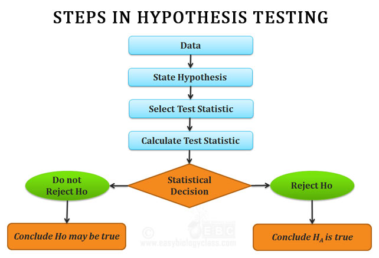

## Table of Contents

## What is hypothesis testing?

Hypothesis testing is a way to check if a belief or guess about something is true, using numbers and data. Imagine you think a new medicine helps people sleep better. You would use hypothesis testing to see if the evidence from your data supports this idea or not. You start with a null hypothesis, which says there's no effect or no difference, and an alternative hypothesis, which says there is an effect or a difference. Then, you collect data and use statistics to see if you can reject the null hypothesis.

In hypothesis testing, you look at the data to see if it's very unlikely that the null hypothesis is true. If it's very unlikely, you might decide to reject the null hypothesis and accept the alternative one. This is done using a p-value, which tells you how likely it is to get the data you have if the null hypothesis is true. If the p-value is small enough, usually less than 0.05, you reject the null hypothesis. This doesn't prove the alternative hypothesis is true, but it suggests that the data supports it more than the null hypothesis.

## Why is hypothesis testing important in statistics?

Hypothesis testing is important in statistics because it helps us make decisions based on data. Imagine you want to know if a new teaching method improves students' test scores. You can't just guess; you need to use data to check if your idea is right. Hypothesis testing gives you a way to do this. It tells you if the differences you see in your data are big enough to say that the new teaching method really works, or if those differences could just be due to chance.

This method is also important because it helps keep our conclusions honest. Without hypothesis testing, we might see a small difference in data and think it's a big deal, even if it's just random. By setting up a null hypothesis and using a p-value, hypothesis testing makes sure we only say something is true when the data strongly supports it. This way, we avoid making big claims without enough evidence, which is crucial in science and many other fields where decisions need to be based on solid data.

## What are the basic steps involved in hypothesis testing?

Hypothesis testing starts with making a guess about something, like whether a new diet helps people lose weight. You set up two guesses: the null hypothesis, which says the diet doesn't help, and the alternative hypothesis, which says it does. Next, you collect data to test these guesses. You might weigh people before and after they try the diet to see if there's a change.

After collecting the data, you use [statistics](/wiki/bayesian-statistics) to see if the data supports your guesses. You calculate a p-value, which tells you how likely it is to see your data if the null hypothesis is true. If the p-value is small, usually less than 0.05, you can reject the null hypothesis. This means the data suggests the diet might help people lose weight. If the p-value is big, you can't reject the null hypothesis, and you don't have enough evidence to say the diet works.

Finally, you make a decision based on the p-value. If you reject the null hypothesis, you might say the diet seems to work, but you can't be completely sure. If you can't reject the null hypothesis, you say there's not enough evidence to say the diet helps. Either way, you've used data to make a decision about your guess, which is the core of hypothesis testing.

## What is a null hypothesis and an alternative hypothesis?

A null hypothesis is a statement that says there's no effect or no difference. It's like saying, "Nothing special is happening here." For example, if you're testing a new medicine, the null hypothesis would say that the medicine doesn't make a difference in how people feel. It's the starting point for your test, and you'll use data to see if you can prove it wrong.

An alternative hypothesis is the opposite of the null hypothesis. It says there is an effect or a difference. Using the medicine example, the alternative hypothesis would say that the medicine does make people feel better. When you do your test, you're looking to see if the data supports this idea more than the null hypothesis. If the data strongly suggests that the medicine works, you might reject the null hypothesis and go with the alternative one.

## How do you choose the right statistical test for hypothesis testing?

Choosing the right statistical test for hypothesis testing depends on what you're trying to find out and the kind of data you have. First, think about what you want to know. Are you comparing two groups, like people who took a new medicine and those who didn't? Or are you looking to see if one thing, like age, affects another thing, like how fast someone can run? Next, look at your data. Is it numbers, like test scores, or is it categories, like yes or no answers? If you have numbers, you might use a t-test to compare two groups or an ANOVA if you're comparing more than two. For categories, you might use a chi-square test.

Sometimes, you also need to think about if your data is normally distributed or not. If it's not, you might need to use a non-parametric test, like the Mann-Whitney U test instead of a t-test. Also, consider if you're looking at the same group of people before and after something happens, like a diet. In that case, a paired t-test could be the right choice. The key is to match the test to your question and data type, so your results make sense and help you answer your question correctly.

## What is the significance level and how do you set it?

The significance level, often called alpha, is like a rule you set before you start testing your hypothesis. It's a number, usually 0.05, that you use to decide if the results from your data are important enough to say that your guess might be right. Think of it like a line in the sand. If the chance of your results happening by accident is less than this number, you can say your results are significant, and you might reject the null hypothesis.

You set the significance level before you start your test. It's a choice you make based on how sure you want to be. If you set it at 0.05, that means you're okay with being wrong 5 times out of 100. Sometimes, if you want to be really sure, you might set it lower, like 0.01. But if you're okay with a little more risk, you might set it higher, like 0.10. The key is to pick a level that matches how important it is to be right in your situation.

## What is a p-value and how is it interpreted in hypothesis testing?

A p-value is a number that helps you decide if your data supports your guess in hypothesis testing. It tells you how likely it is to get the results you have if the null hypothesis, which says there's no effect or difference, is true. If the p-value is small, it means your results would be very unlikely if the null hypothesis was right. Usually, if the p-value is less than 0.05, you say it's significant.

When you interpret a p-value, you're checking if it's smaller than your significance level, which you set before you start testing. If the p-value is smaller than your significance level, you can reject the null hypothesis. This doesn't mean your alternative hypothesis, which says there is an effect or difference, is definitely true. It just means the data supports it more than the null hypothesis. If the p-value is bigger than your significance level, you don't have enough evidence to reject the null hypothesis, so you stick with it.

## Can you explain Type I and Type II errors in the context of hypothesis testing?

In hypothesis testing, a Type I error happens when you think you've found something important, but you're actually wrong. It's like saying a new medicine works when it really doesn't. This mistake happens when you reject the null hypothesis, which says there's no effect, even though the null hypothesis is actually true. The chance of making a Type I error is what you set as your significance level, usually 0.05. That means if you set it at 0.05, you're okay with being wrong 5 times out of 100.

A Type II error is the opposite. It happens when you miss something important that's actually there. It's like saying a new medicine doesn't work when it actually does. This mistake happens when you fail to reject the null hypothesis, even though the null hypothesis is false and there really is an effect. The chance of making a Type II error is called beta, and the power of a test, which is 1 minus beta, tells you how good the test is at finding an effect when it's there. Both types of errors are important to think about because they help you understand the risks of being wrong when you make decisions based on your data.

## How do you calculate the test statistic and what does it represent?

The test statistic is a number you calculate from your data to help you decide if your guess about something is right or wrong. To find it, you use a formula that depends on the type of test you're doing. For example, if you're using a t-test to compare the average scores of two groups, you take the difference between the two group averages, divide it by the standard deviation of the scores, and then adjust for the number of people in each group. This number tells you how far away your data is from what you'd expect if there was no real difference between the groups.

The test statistic represents how strong the evidence is against the null hypothesis, which says there's no effect or difference. If the test statistic is big, it means your data is very different from what you'd expect if the null hypothesis was true. You then compare this number to a critical value from a table or use it to find a p-value. If the test statistic is bigger than the critical value, or if the p-value is small enough, you can say the data supports your guess and reject the null hypothesis. If not, you stick with the null hypothesis because the data isn't strong enough to say there's an effect or difference.

## What is the difference between one-tailed and two-tailed tests?

A one-tailed test is used when you want to check if something is bigger or smaller than another thing, but not both. Imagine you're testing a new fertilizer and you want to know if it makes plants grow taller. You only care if the plants get taller, not if they get shorter. So, you use a one-tailed test to see if the fertilizer makes a difference in one direction. If your data shows the plants are taller and the difference is big enough, you can say the fertilizer works.

A two-tailed test is different because it looks for any difference, whether it's bigger or smaller. Using the same fertilizer example, a two-tailed test would check if the fertilizer makes plants grow taller or shorter. You're interested in any change, not just one direction. If your data shows a big enough difference in either direction, you can say the fertilizer has an effect. Two-tailed tests are more common because they don't assume which way the effect will go, making them useful when you're not sure what to expect.

## How do you interpret the results of a hypothesis test?

When you do a hypothesis test, you're trying to see if your data supports your guess about something. You start by setting up a null hypothesis, which says there's no effect or difference, and an alternative hypothesis, which says there is an effect or difference. After you collect your data and calculate a test statistic, you use this number to find a p-value. The p-value tells you how likely it is to get your results if the null hypothesis is true. If the p-value is smaller than your significance level, which you set before starting the test, you can reject the null hypothesis. This means your data supports the idea that there's an effect or difference.

Interpreting the results of a hypothesis test also means thinking about what it all means for your guess. If you reject the null hypothesis, it doesn't mean your alternative hypothesis is definitely true, but it does suggest that the data leans more towards your guess being right. For example, if you were testing a new medicine and you reject the null hypothesis, it suggests the medicine might work, but you can't be completely sure. If you can't reject the null hypothesis, it means you don't have enough evidence to say there's an effect or difference. This doesn't mean your guess is wrong; it just means you need more or better data to support it.

## Can you provide an advanced example of hypothesis testing using real-world data?

Imagine a company wants to know if a new training program helps employees work faster. They split their employees into two groups: one group gets the new training and the other group doesn't. After a few months, they measure how long it takes each employee to finish a task. The null hypothesis says the training doesn't make a difference, and the alternative hypothesis says it does. They decide to use a t-test to compare the average times of the two groups. The test gives them a p-value of 0.03, which is less than their significance level of 0.05. This means they can reject the null hypothesis and say the training seems to help employees work faster.

But there's more to think about. The company also checks the effect size, which tells them how big the difference is between the two groups. They find that the training cuts down the time to finish tasks by about 10 minutes on average. This is a pretty big deal because it could save the company a lot of time and money. They also look at the confidence interval, which shows them a range where the true difference in times might be. The interval goes from 5 to 15 minutes, so they're pretty sure the training makes a real difference. Even though they can't say for sure that the training is the only reason for the faster times, the data strongly suggests it's helping.

## What are common statistical tests used in algorithmic trading?

In [algorithmic trading](/wiki/algorithmic-trading), statistical tests play a crucial role in validating trading strategies and ensuring robust decision-making. Several statistical tests are commonly employed due to their efficacy in handling different types of data and hypotheses. Among them, the t-test, chi-square test, and ANOVA (Analysis of Variance) serve as foundational tools for traders.

### T-Test

The t-test is widely used to determine if there is a significant difference between the means of two datasets, which can be samples or groups within a dataset. In the context of algo trading, a t-test might be deployed to compare the mean returns of two different trading strategies over a specific period. The formula for the t-test is:

$$
t = \frac{\bar{X}_1 - \bar{X}_2}{\sqrt{\frac{s_1^2}{N_1} + \frac{s_2^2}{N_2}}}
$$

where $\bar{X}_1$ and $\bar{X}_2$ are the sample means, $s_1^2$ and $s_2^2$ are the sample variances, and $N_1$ and $N_2$ are the sample sizes.

For instance, if a trader wants to see if a new trading algorithm outperforms an existing one, the t-test can be used on the historical returns of both algorithms.

### Chi-Square Test

The chi-square test is an excellent option for hypotheses about categorical data. In trading, it can be used to test the independence between different categorical variables, such as market sentiment and trading signals.

The formula for the chi-square statistic is:

$$
\chi^2 = \sum \frac{(O_i - E_i)^2}{E_i}
$$

where $O_i$ is the observed frequency and $E_i$ is the expected frequency under the null hypothesis.

In practice, a chi-square test can help identify whether certain market conditions significantly affect trading signal generation, thus aiding in refining the strategy based on observed patterns.

### Analysis of Variance (ANOVA)

ANOVA is used to compare means among three or more groups. It is particularly useful in evaluating the performance of multiple trading strategies simultaneously. ANOVA assesses whether there is a statistically significant difference in mean returns among different trading strategies.

In algorithmic trading, a one-way ANOVA can be applied to compare the effectiveness of various algorithms across different market conditions. This can help in identifying which strategy performs optimally over different time periods or under varying market volatilities.

### Practical Application

To implement these statistical tests in a practical trading scenario, consider the following Python code snippets:

```python
import numpy as np
from scipy import stats

# Sample data for t-test
strategy1_returns = np.random.normal(0.05, 0.01, 100)
strategy2_returns = np.random.normal(0.03, 0.01, 100)

# Conducting a t-test
t_stat, p_value = stats.ttest_ind(strategy1_returns, strategy2_returns)
print(f"T-statistic: {t_stat}, P-value: {p_value}")

# Chi-square test example
observed = np.array([[10, 20, 30], [6, 9, 17]])
chi2_stat, chi2_p, _, _ = stats.chi2_contingency(observed)
print(f"Chi-square Statistic: {chi2_stat}, P-value: {chi2_p}")

# ANOVA example
strategy_a_returns = np.random.normal(0.05, 0.01, 100)
strategy_b_returns = np.random.normal(0.04, 0.01, 100)
strategy_c_returns = np.random.normal(0.06, 0.01, 100)

anova_stat, anova_p_value = stats.f_oneway(strategy_a_returns, strategy_b_returns, strategy_c_returns)
print(f"ANOVA Statistic: {anova_stat}, P-value: {anova_p_value}")
```

Employing these statistical tests appropriately allows algorithmic traders to validate and enhance their trading strategies by rigorously testing assumptions and optimizing their algorithms based on empirical data. With the right analytical approach, traders can better navigate complex market dynamics and improve their trading outcomes.

## References & Further Reading

[1]: Bergstra, J., Bardenet, R., Bengio, Y., & Kégl, B. (2011). ["Algorithms for Hyper-Parameter Optimization."](https://papers.nips.cc/paper/4443-algorithms-for-hyper-parameter-optimization) Advances in Neural Information Processing Systems 24.

[2]: ["Advances in Financial Machine Learning"](https://www.amazon.com/Advances-Financial-Machine-Learning-Marcos/dp/1119482089) by Marcos Lopez de Prado

[3]: ["Evidence-Based Technical Analysis: Applying the Scientific Method and Statistical Inference to Trading Signals"](https://www.amazon.com/Evidence-Based-Technical-Analysis-Scientific-Statistical/dp/0470008741) by David Aronson

[4]: ["Machine Learning for Algorithmic Trading"](https://github.com/stefan-jansen/machine-learning-for-trading) by Stefan Jansen

[5]: ["Quantitative Trading: How to Build Your Own Algorithmic Trading Business"](https://www.amazon.com/Quantitative-Trading-Build-Algorithmic-Business/dp/1119800064) by Ernest P. Chan