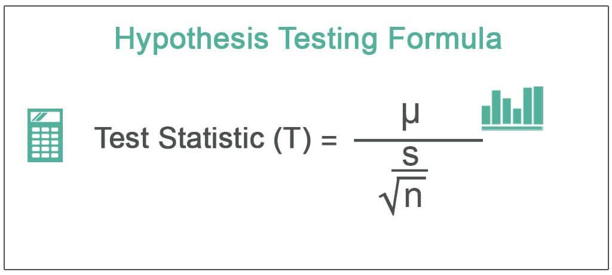

In the fast-paced world of algorithmic trading, making astute, data-driven decisions is essential to gaining a competitive edge. Traders are increasingly turning to robust statistical tools to enhance their decision-making processes, thereby optimizing trading strategies and minimizing risk. One such powerful tool is hypothesis testing, a method that enables traders to infer patterns from sample data and draw reliable conclusions about market behaviors.

Understanding and applying hypothesis testing can be a game-changer for those involved in algorithmic trading. It provides a structured approach for evaluating trading algorithms by testing assumptions against observed market phenomena. This process leads to more informed predictions and improves the ability to adjust trading models responsively.



This article presents a comprehensive guide tailored to the application of hypothesis testing within the domain of algorithmic trading. We will cover the foundational aspects of hypothesis testing, including null and alternative hypotheses, significance levels, and p-values — critical components that allow for statistical soundness in evaluating trading strategies. Each of these elements will be dissected to show how they align with the goals of designing and refining trading algorithms.

Whether you are a seasoned trader or stepping into algorithmic trading for the first time, mastering hypothesis testing can significantly enhance your statistical toolkit. The skills and methods discussed here will empower you to harness the potential of statistical analysis, ensuring that your trading decisions are grounded in tested, rigorous methodologies. Through this guide, we aim to provide you with the knowledge needed to implement hypothesis testing effectively, contributing to the accuracy and viability of your algorithmic trading strategies.

## Table of Contents

## Understanding Hypothesis Testing

Hypothesis testing is a statistical technique used to evaluate and make inferences about a population by analyzing sample data. It is pivotal in algorithmic trading, where traders rely on statistical methods to validate strategies and predict market trends.

At the heart of hypothesis testing are two contrasting assertions: the null hypothesis (H₀) and the alternative hypothesis (Hₐ). The null hypothesis suggests that there is no effect or no difference in the context of the study – it is the presumption of the status quo. Conversely, the alternative hypothesis proposes that there is an effect or a difference.

For instance, if a trader wants to assess whether a new trading algorithm improves returns compared to an existing one, the null hypothesis could assert that both algorithms yield equivalent returns, while the alternative hypothesis would claim an improvement with the new algorithm.

An essential element of hypothesis testing is the significance level, denoted as alpha (α). This threshold represents the probability of rejecting the null hypothesis when it is true. Commonly, α is set at 0.05, allowing a 5% risk of committing a Type I error, which involves rejecting a true null hypothesis erroneously. This threshold choice reflects a balance between caution and willingness to take risks, which can significantly influence trading decisions.

P-value is another critical component. It signifies the probability of observing results as extreme as, or more extreme than, the observed data, assuming the null hypothesis is true. A low p-value (typically less than or equal to α) indicates that the observed data would be improbable under the null hypothesis, leading to its rejection in favor of the alternative hypothesis.

For example, assuming a p-value of 0.03 is obtained in testing whether a trading algorithm outperforms a benchmark, the null hypothesis is rejected at α = 0.05, indicating the algorithm's superiority.

In practice, hypothesis testing allows traders to make data-driven decisions regarding their strategies. By rigorously testing hypotheses, traders can assess the validity of their approaches, striving to confirm patterns or advantages that could enhance their trading. This statistical foundation aids in refining strategies, optimizing trading decisions, and ultimately, improving trading outcomes.

Understanding these basic elements establishes the groundwork for effective statistical analysis in [algorithmic trading](/wiki/algorithmic-trading). With a solid grasp of null and alternative hypotheses, significance levels, and p-values, traders can better navigate the complexities of market data and test their trading strategies, ensuring informed and robust decision-making.

## Steps in Hypothesis Testing

Hypothesis testing is a critical method in statistical analysis that enables traders to make informed decisions based on data derived from financial markets. The process can be broken down into the following actionable steps that traders can apply to validate their trading theories and strategies.

### Step 1: Formulate the Null and Alternative Hypotheses
The first step involves defining two competing hypotheses: the null hypothesis (H0) and the alternative hypothesis (H1). The null hypothesis represents the default position, suggesting that there is no effect or relationship between variables in the context of your trading theory; for example, H0 might assert that a particular trading strategy yields a return no different from the market average. Conversely, the alternative hypothesis proposes that there is an effect or relationship, such as H1 suggesting that the strategy does indeed yield higher returns.

### Step 2: Choose the Appropriate Statistical Test
Selecting the correct statistical test is crucial and depends on the data characteristics and the nature of the hypothesis. Common tests used in algorithmic trading include the t-test for comparing means, chi-square test for categorical data association, and ANOVA for comparing multiple groups. Consider a scenario where you have sample data of daily returns from two trading strategies; a two-sample t-test might be appropriate to determine if there is a significant difference in their means.

### Step 3: Determine the Significance Level (Alpha)
The significance level, denoted by the Greek letter alpha (α), is the probability of rejecting the null hypothesis when it is actually true. This threshold, commonly set at 0.05, defines the risk level a trader is willing to accept. A lower alpha reduces the likelihood of a Type I error (false positive), but may increase the risk of a Type II error (false negative).

### Step 4: Calculate the Test Statistic and P-Value
The test statistic is a standardized value that measures the degree of evidence against the null hypothesis, derived based on the chosen statistical test. Along with this, the p-value is calculated, representing the probability of observing the test results under the null hypothesis assumption. For example, in Python, a two-sample t-test can be performed using the `scipy` library as follows:

```python
import scipy.stats as stats

# Assume 'returns_strategy1' and 'returns_strategy2' are arrays of daily returns
t_statistic, p_value = stats.ttest_ind(returns_strategy1, returns_strategy2)
```

### Step 5: Make a Decision to Accept or Reject the Null Hypothesis
The final step involves comparing the p-value with the pre-determined significance level. If the p-value is less than or equal to alpha, the null hypothesis is rejected in favor of the alternative hypothesis, indicating statistically significant results. Conversely, if the p-value exceeds alpha, there is insufficient evidence to reject the null hypothesis. In practical terms, this could mean accepting a trading strategy's potential over the market average if it holds statistical significance.

By systematically applying these steps, traders can rigorously test their hypotheses about market behaviors, enhancing the robustness and reliability of their algorithmic trading strategies.

## Common Statistical Tests in Algo Trading

In algorithmic trading, statistical tests play a crucial role in validating trading strategies and ensuring robust decision-making. Several statistical tests are commonly employed due to their efficacy in handling different types of data and hypotheses. Among them, the t-test, chi-square test, and ANOVA (Analysis of Variance) serve as foundational tools for traders.

### T-Test

The t-test is widely used to determine if there is a significant difference between the means of two datasets, which can be samples or groups within a dataset. In the context of algo trading, a t-test might be deployed to compare the mean returns of two different trading strategies over a specific period. The formula for the t-test is:

$$
t = \frac{\bar{X}_1 - \bar{X}_2}{\sqrt{\frac{s_1^2}{N_1} + \frac{s_2^2}{N_2}}}
$$

where $\bar{X}_1$ and $\bar{X}_2$ are the sample means, $s_1^2$ and $s_2^2$ are the sample variances, and $N_1$ and $N_2$ are the sample sizes.

For instance, if a trader wants to see if a new trading algorithm outperforms an existing one, the t-test can be used on the historical returns of both algorithms.

### Chi-Square Test

The chi-square test is an excellent option for hypotheses about categorical data. In trading, it can be used to test the independence between different categorical variables, such as market sentiment and trading signals.

The formula for the chi-square statistic is:

$$
\chi^2 = \sum \frac{(O_i - E_i)^2}{E_i}
$$

where $O_i$ is the observed frequency and $E_i$ is the expected frequency under the null hypothesis.

In practice, a chi-square test can help identify whether certain market conditions significantly affect trading signal generation, thus aiding in refining the strategy based on observed patterns.

### Analysis of Variance (ANOVA)

ANOVA is used to compare means among three or more groups. It is particularly useful in evaluating the performance of multiple trading strategies simultaneously. ANOVA assesses whether there is a statistically significant difference in mean returns among different trading strategies.

In algorithmic trading, a one-way ANOVA can be applied to compare the effectiveness of various algorithms across different market conditions. This can help in identifying which strategy performs optimally over different time periods or under varying market volatilities.

### Practical Application

To implement these statistical tests in a practical trading scenario, consider the following Python code snippets:

```python
import numpy as np
from scipy import stats

# Sample data for t-test
strategy1_returns = np.random.normal(0.05, 0.01, 100)
strategy2_returns = np.random.normal(0.03, 0.01, 100)

# Conducting a t-test
t_stat, p_value = stats.ttest_ind(strategy1_returns, strategy2_returns)
print(f"T-statistic: {t_stat}, P-value: {p_value}")

# Chi-square test example
observed = np.array([[10, 20, 30], [6, 9, 17]])
chi2_stat, chi2_p, _, _ = stats.chi2_contingency(observed)
print(f"Chi-square Statistic: {chi2_stat}, P-value: {chi2_p}")

# ANOVA example
strategy_a_returns = np.random.normal(0.05, 0.01, 100)
strategy_b_returns = np.random.normal(0.04, 0.01, 100)
strategy_c_returns = np.random.normal(0.06, 0.01, 100)

anova_stat, anova_p_value = stats.f_oneway(strategy_a_returns, strategy_b_returns, strategy_c_returns)
print(f"ANOVA Statistic: {anova_stat}, P-value: {anova_p_value}")
```

Employing these statistical tests appropriately allows algorithmic traders to validate and enhance their trading strategies by rigorously testing assumptions and optimizing their algorithms based on empirical data. With the right analytical approach, traders can better navigate complex market dynamics and improve their trading outcomes.

## Applying Hypothesis Testing to Algo Trading Strategies

Integrating hypothesis testing into the development of algorithmic trading strategies enables traders to refine strategy parameters methodically, ensuring decisions are statistically sound. At the heart of this approach is the formulation of null and alternative hypotheses that correspond to trading strategy assumptions. For instance, if a trader hypothesizes that a new strategy can outperform a basic moving average strategy, this assumption becomes the basis for hypothesis testing.

Hypothesis testing in this context involves optimizing strategy parameters. This can be accomplished by setting the null hypothesis as the strategy not providing any additional alpha (risk-adjusted return) compared to the baseline. The alternative hypothesis would assert improved performance. By applying statistical tests like the t-test to trading returns, traders can evaluate whether observed strategy performance differences are statistically significant or a product of random chance.

One practical application is in [backtesting](/wiki/backtesting). For example, a trader can use historical data to simulate trades under different parameter settings. Here, hypothesis testing aids in identifying which settings lead to statistically significant improvements in performance metrics such as Sharpe ratio, drawdown, or return consistency. A Python script to perform a t-test on two sets of strategy returns might look like this:

```python
import numpy as np
from scipy import stats

# Example returns from two different strategies
returns_strategy_a = np.random.normal(0.01, 0.02, 100)  # Strategy A
returns_strategy_b = np.random.normal(0.02, 0.02, 100)  # Strategy B

# Perform t-test
t_stat, p_value = stats.ttest_ind(returns_strategy_a, returns_strategy_b)

# Determine significance
alpha = 0.05
if p_value < alpha:
    print("Reject the null hypothesis: Strategy B performs significantly better.")
else:
    print("Fail to reject the null hypothesis: No significant difference in performance.")
```

Improving strategies through hypothesis testing is not limited to performance metrics alone. Another application involves parameter sensitivity analysis, which assesses how sensitive strategy outcomes are to changes in parameter values. For example, testing different stop-loss thresholds can reveal optimal settings that maximize trading efficiency while minimizing risk.

Incorporating hypothesis testing templates into algorithmic trading algorithms allows for systematic decision-making. Algorithms can automatically adjust strategy parameters based on statistical tests conducted periodically, adapting to evolving market conditions. This process reduces the risk of overfitting, as decisions are based on quantified data analysis rather than intuition alone.

Enhanced decision-making, achieved through integrating hypothesis testing into trading strategies, leads to improvements in outcomes and risk management. By validating strategies before deployment and continuously during real-time trading, traders can ensure that their approaches remain robust and responsive to market dynamics.

## Challenges and Considerations

In applying hypothesis testing to algorithmic trading, traders face several challenges that can impact the reliability and accuracy of their analyses. Understanding and addressing these challenges is critical for making sound trading decisions.

One of the primary concerns is overfitting. Overfitting occurs when a trading model is too complex and captures noise rather than the underlying market signal. This results in a model that performs well on historical data but poorly on new data. To mitigate overfitting, traders should use techniques such as cross-validation, where the data is divided into training and testing subsets to ensure the model generalizes well. Incorporating regularization techniques like L1 or L2 regularization can also help by penalizing overly complex models.

False positives, also known as Type I errors, present another challenge. These occur when the null hypothesis is incorrectly rejected, suggesting a trading strategy is profitable when it is not. To reduce the likelihood of false positives, traders should set a stringent significance level (alpha) or apply the Bonferroni correction when multiple tests are conducted. This adjustment lowers the chance of detecting false signals by considering the number of tests being performed.

Data snooping is a particularly challenging issue. It arises when traders select models based on patterns observed from the same dataset used for testing, leading to overly optimistic performance estimates. To combat data snooping, traders should adopt a systematic approach to model selection and validation, using out-of-sample testing or walk-forward analysis. These methods involve holding out a portion of data that is not used in the model development process for unbiased evaluation.

In fast-moving market environments, ensuring the robustness of statistical tests is essential. Market conditions can change rapidly, and a strategy that performs well under one set of conditions may not under another. To ensure robustness, traders should test their strategies across various market scenarios and use robust statistical models that account for shifts in market dynamics. Adaptive algorithms that adjust parameters in response to changing market conditions can also enhance reliability.

Improving test accuracy involves practical strategies such as diversifying the types of data sources used and employing ensemble methods to combine multiple models. This approach can help capture different aspects of the data and improve predictive performance.

By understanding these challenges and implementing strategies to address them, traders can improve the accuracy and reliability of hypothesis testing in algorithmic trading. The careful application of these techniques helps ensure that trading strategies are based on solid statistical grounding rather than mere chance or data idiosyncrasies.

## Conclusion

Hypothesis testing serves as a cornerstone for successful algorithmic trading, enabling traders to make informed, data-driven decisions. The application of hypothesis testing allows traders to systematically validate or refute their trading ideas and strategies, ensuring they are backed by statistical evidence rather than mere speculation.

Throughout this article, we have explored the fundamental aspects of hypothesis testing, from understanding the basic concepts of null and alternative hypotheses to the procedural steps involved in conducting a test. By employing common statistical tests such as t-tests, chi-square tests, and ANOVA, traders gain the ability to assess the performance and reliability of their strategies under various market conditions.

Incorporating hypothesis testing into trading strategies not only enhances decision-making but also serves to optimize trading algorithms. This process helps identify strategies that offer improved performance while managing risks associated with false positives and overfitting—a common pitfall in algorithmic trading.

Traders are encouraged to continually apply statistical methods to test and validate their strategies. This practice not only refines existing strategies but also fosters the development of innovative approaches to trading. Adopting a disciplined approach to hypothesis testing ensures that strategies remain robust in a rapidly evolving market landscape.

In conclusion, the integration of hypothesis testing into algorithmic trading is vital for maximizing success and minimizing risk. As the trading landscape continues to evolve with technological advancements, ongoing learning and application of these statistical techniques will provide traders with a competitive edge. It is imperative that traders actively engage in further exploring these methods to enhance their trading frameworks.

## References & Further Reading

[1]: Bergstra, J., Bardenet, R., Bengio, Y., & Kégl, B. (2011). ["Algorithms for Hyper-Parameter Optimization."](https://papers.nips.cc/paper/4443-algorithms-for-hyper-parameter-optimization) Advances in Neural Information Processing Systems 24.

[2]: ["Advances in Financial Machine Learning"](https://www.amazon.com/Advances-Financial-Machine-Learning-Marcos/dp/1119482089) by Marcos Lopez de Prado

[3]: ["Evidence-Based Technical Analysis: Applying the Scientific Method and Statistical Inference to Trading Signals"](https://www.amazon.com/Evidence-Based-Technical-Analysis-Scientific-Statistical/dp/0470008741) by David Aronson

[4]: ["Machine Learning for Algorithmic Trading"](https://github.com/stefan-jansen/machine-learning-for-trading) by Stefan Jansen

[5]: ["Quantitative Trading: How to Build Your Own Algorithmic Trading Business"](https://www.amazon.com/Quantitative-Trading-Build-Algorithmic-Business/dp/1119800064) by Ernest P. Chan