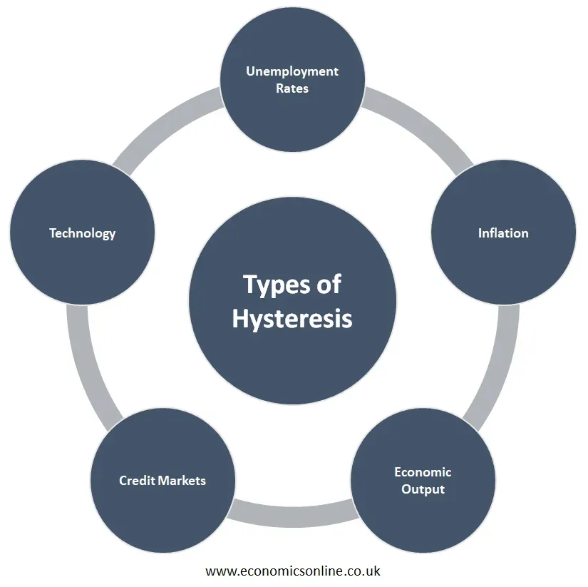

## Table of Contents

## What is hysteresis in economics?

Hysteresis in economics refers to the idea that the effects of certain economic events can persist even after the events themselves have ended. For example, if an economy goes through a period of high unemployment, the effects of that unemployment might continue to impact the economy even after the unemployment rate goes back down. This can happen because workers who were unemployed for a long time might lose skills or become discouraged, making it harder for them to find new jobs even when the economy improves.

This concept is important because it suggests that economic policies need to consider not just the immediate effects of events, but also their long-term impacts. For instance, if a government knows that high unemployment can have lasting effects, it might be more motivated to take strong action to reduce unemployment quickly. Understanding hysteresis can help economists and policymakers make better decisions to help the economy recover more fully from downturns.

## How does hysteresis differ from other economic concepts?

Hysteresis is different from other economic concepts because it focuses on the lasting effects of economic events, even after those events are over. Many economic concepts look at how things change in the short term. For example, the concept of supply and demand looks at how prices change when the amount of a product people want to buy goes up or down. But hysteresis is about how the economy can be changed in the long run by things like high unemployment or a big economic crisis.

Another way hysteresis is different is that it shows how the economy can have a kind of memory. Most economic theories assume that the economy will go back to normal after a shock, like how a rubber band goes back to its original shape after being stretched. But with hysteresis, the economy might not go back to how it was before. It's more like clay that keeps the shape it's pressed into. This means that if there's a big economic problem, like a recession, the effects might stick around and change how the economy works even after the recession is over.

Understanding hysteresis helps economists and policymakers see that some problems need quick and strong solutions. If they know that high unemployment can have long-lasting effects, they might work harder to create jobs and help people get back to work faster. This is different from other economic ideas that might suggest waiting for the market to fix itself over time.

## What are the main types of hysteresis in economics?

In economics, there are mainly two types of hysteresis: unemployment hysteresis and productivity hysteresis. Unemployment hysteresis happens when high unemployment lasts for a long time and changes the economy in ways that keep unemployment high even after the original problem is gone. For example, people might lose skills or get discouraged from looking for jobs, which makes it harder for them to find work even when the economy gets better.

Productivity hysteresis is about how big economic events can change how much workers can produce. If there's a big economic crisis, companies might cut back on things like training or new technology, which can make workers less productive. Even after the crisis is over, this lower productivity can stick around and slow down the economy's growth. Both types of hysteresis show how important it is to deal with economic problems quickly to avoid long-lasting damage.

## Can you explain the concept of hysteresis with a simple example?

Imagine a town where a big factory closes down, and lots of people lose their jobs. At first, everyone is looking for new work, but as time goes on, some people start to give up because they can't find a job. They stop looking and maybe even lose some of their skills. Even when the factory reopens a few years later and starts hiring again, not everyone can go back to work right away. Some people might have moved away, and others might not have the skills they need anymore. This is an example of unemployment hysteresis, where the effects of losing jobs last longer than the factory being closed.

Now think about a different town where a big storm hits and damages a lot of businesses. Because of the storm, companies have to cut back on things like training their workers or buying new equipment. As a result, the workers in the town become less productive. Even after the storm is over and the businesses start to recover, the workers are still not as good at their jobs as they used to be because they didn't get the training or tools they needed. This is an example of productivity hysteresis, where the effects of the storm keep the town's productivity lower for a long time.

## How does hysteresis affect economic policy?

Hysteresis affects economic policy by showing that some problems need quick fixes. If policymakers know that high unemployment can have long-lasting effects, they might work harder to create jobs right away. For example, they might start job training programs or give money to businesses to hire more people. This is because they want to stop the bad effects of unemployment from sticking around and hurting the economy for a long time.

Hysteresis also makes policymakers think about the long-term effects of economic events. If a big economic crisis can lower productivity for years, then it's important to help businesses keep training their workers and investing in new technology, even during tough times. By doing this, policymakers can help the economy bounce back faster and avoid the lasting damage that hysteresis can cause.

## What role does hysteresis play in unemployment?

Hysteresis plays a big role in unemployment by showing how the effects of losing jobs can last a long time. When a lot of people are out of work for a while, they might start to lose their skills or feel too discouraged to keep looking for jobs. Even when the economy gets better and there are more jobs available, these people might not be able to go back to work right away. They might need more training or time to get their confidence back. This is why high unemployment can keep the economy from getting back to normal even after the original problem is gone.

Understanding hysteresis helps people who make economic policy see why it's important to deal with high unemployment quickly. If they know that long periods of unemployment can hurt the economy for a long time, they might start programs to help people find jobs faster. They might offer job training, give money to businesses to hire more workers, or find other ways to get people back to work. By acting quickly, they can help stop the bad effects of unemployment from sticking around and slowing down the economy's recovery.

## How can hysteresis be observed in economic data?

Hysteresis can be seen in economic data by looking at how unemployment and productivity change over time. If a country goes through a big economic problem, like a recession, and unemployment stays high even after the recession is over, that's a sign of hysteresis. Economists might look at unemployment rates before, during, and after the recession. If the unemployment rate doesn't go back to what it was before the recession, it suggests that the effects of the recession are sticking around, which is what hysteresis is all about.

Another way to see hysteresis in economic data is by looking at productivity. If there's a big event, like a financial crisis, and productivity stays lower than it was before the crisis, even after things start to get better, that's another sign of hysteresis. Economists might compare productivity levels before and after the crisis. If productivity doesn't bounce back to its old level, it means the crisis had a lasting impact on how much workers can produce, which is an example of productivity hysteresis.

## What are the theoretical models that explain hysteresis in economics?

One theoretical model that explains hysteresis in economics is the insider-outsider model. This model says that when a lot of people lose their jobs, the ones who still have jobs, called insiders, can keep wages high. They do this because they have more power in the job market. The people who lost their jobs, called outsiders, have a hard time finding new work because the wages are too high for companies to hire them. This can keep unemployment high even after the economy gets better, showing hysteresis.

Another model is the human capital model. This model says that when people are out of work for a long time, they might lose their skills or stop learning new ones. This makes it harder for them to find jobs even when the economy improves. The loss of skills can keep unemployment high, which is another way to see hysteresis in action. Both models show how the effects of bad economic times can stick around and change how the economy works even after the bad times are over.

## How does hysteresis impact long-term economic growth?

Hysteresis can slow down long-term economic growth by making unemployment and lower productivity last longer than they should. When a lot of people lose their jobs and stay out of work for a long time, they might lose their skills or feel too discouraged to keep looking for jobs. Even when the economy gets better and there are more jobs, these people might not be able to go back to work right away. This means that the economy can't grow as fast as it could because not everyone is working and contributing to growth.

Also, if a big economic problem like a financial crisis happens, companies might cut back on things like training or new technology to save money. This can make workers less productive because they aren't learning new skills or using better tools. Even after the crisis is over, this lower productivity can stick around and slow down the economy's growth. By understanding hysteresis, people who make economic policy can work to fix these problems quickly and help the economy grow better in the long run.

## What are the criticisms or limitations of the hysteresis concept in economics?

Some people think that the idea of hysteresis in economics is too hard to prove. They say it's tough to show that the effects of things like high unemployment or a big economic crisis really do last a long time. It's hard to tell if the economy is slow to recover because of hysteresis or because of other problems that come up later. This makes it tricky for economists to use hysteresis to make good predictions or to decide on the best policies.

Another problem with hysteresis is that it might make people think that the economy can't fix itself. Some economists worry that if everyone believes in hysteresis, they might think that the government always needs to step in to help the economy recover. But sometimes, the economy can get better on its own without too much help. So, it's important to be careful about how much we rely on the idea of hysteresis when we're making decisions about economic policy.

## How do economists measure the effects of hysteresis in an economy?

Economists measure the effects of hysteresis by looking at unemployment and productivity data over time. They compare how these things change before, during, and after big economic events like recessions. If unemployment stays high even after the economy starts to get better, it might be a sign of hysteresis. This means the effects of the recession are sticking around and keeping people out of work longer than they should be. Economists use this data to see if the economy is having a hard time getting back to normal because of hysteresis.

Another way economists measure hysteresis is by looking at productivity levels. If a big event like a financial crisis happens and productivity stays lower than it was before, even after things start to improve, that's another sign of hysteresis. Economists might look at how much workers can produce before and after the crisis. If productivity doesn't go back to its old level, it means the crisis had a lasting impact on how much workers can do. This helps economists understand how hysteresis can slow down the economy's growth in the long run.

## What are some advanced case studies that demonstrate hysteresis in different economic contexts?

One advanced case study that shows hysteresis is from Europe after the 2008 financial crisis. Many countries in Europe had high unemployment for a long time after the crisis. Even when the economy started to get better, unemployment stayed high in places like Spain and Greece. This was because a lot of people lost their jobs and then lost their skills or got too discouraged to keep looking for work. The high unemployment kept the economy from growing as fast as it could, showing how hysteresis can have a big impact on a whole region.

Another case study is from Japan in the 1990s, when the country went through a period called the "Lost Decade." After a big economic bubble burst, Japan's economy slowed down a lot. Companies cut back on things like training and new technology, which made workers less productive. Even after the economy started to recover, productivity stayed lower than it was before. This showed how the effects of the economic crisis stuck around and slowed down Japan's growth for a long time, which is a clear example of productivity hysteresis.

## References & Further Reading

[1]: Blanchard, O. J., & Summers, L. H. (1986). ["Hysteresis and the European Unemployment Problem."](https://www.nber.org/papers/w1950) Brookings Papers on Economic Activity.

[2]: Pissarides, C. A. (1992). ["Loss of Skill During Unemployment and the Persistence of Employment Shocks."](https://www.jstor.org/stable/2118392) The Quarterly Journal of Economics, 107(4), 1371-1391.

[3]: Lopez, R. (2013). ["The Impact of Economic Shocks on Exchange Rates: The Role of Hysteresis."](https://link.springer.com/article/10.1007/s11079-022-09680-8) Research in Economics, 67(4), 316-332.

[4]: Aldridge, I. (2013). ["High-Frequency Trading: A Practical Guide to Algorithmic Strategies and Trading Systems"](https://www.amazon.com/High-Frequency-Trading-Practical-Algorithmic-Strategies/dp/1118343506) by Irene Aldridge.

[5]: Chan, E. (2009). ["Quantitative Trading: How to Build Your Own Algorithmic Trading Business"](https://github.com/ftvision/quant_trading_echan_book) by Ernest P. Chan.

[6]: Lopez de Prado, M. (2018). ["Advances in Financial Machine Learning"](https://www.amazon.com/Advances-Financial-Machine-Learning-Marcos/dp/1119482089) by Marcos Lopez de Prado.

[7]: Menkveld, A. J. (2013). ["High Frequency Trading and the New-Market Makers."](https://www.sciencedirect.com/science/article/pii/S1386418113000281) Journal of Financial Markets, 16(4), 712-740.

[8]: Jansen, S. (2020). ["Machine Learning for Algorithmic Trading: Predictive Models to Extract Signals from Market and Alternative Data for Systematic Trading Strategies."](https://github.com/stefan-jansen/machine-learning-for-trading) by Stefan Jansen.