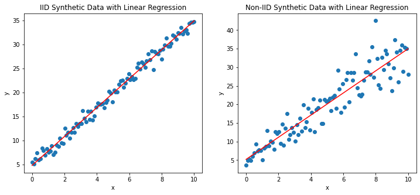

## Table of Contents

## What does I.I.D. stand for in the context of machine learning?

In machine learning, I.I.D. stands for "Independent and Identically Distributed." This term describes a situation where a set of random variables or data points are all independent of each other and drawn from the same probability distribution. Imagine you're rolling a fair die multiple times. Each roll is independent because the outcome of one roll doesn't affect the others, and they are identically distributed because each roll has the same chance of landing on any number from 1 to 6.

The concept of I.I.D. is important in machine learning because many algorithms and statistical methods assume that the training data follows this principle. This assumption helps simplify the math and makes it easier to predict how a model will perform on new, unseen data. However, in real-world scenarios, data often doesn't perfectly meet these conditions. For example, time series data, where the value at one point depends on previous values, violates the independence assumption. Despite these challenges, understanding I.I.D. provides a foundational framework for working with data in machine learning.

## Why is the I.I.D. assumption important in machine learning?

The I.I.D. assumption is important in machine learning because it makes it easier to build and understand models. When data is independent and identically distributed, it means each piece of data is like a new, fresh sample from the same source. This helps because it allows us to use simpler math to analyze and predict how well a model will work on new data. For example, if we train a model on I.I.D. data, we can assume that the model's performance on the training data will be similar to its performance on new, unseen data. This makes it easier to trust the model and use it in real-world situations.

However, real-world data often doesn't perfectly follow the I.I.D. assumption. For instance, in time series data, like stock prices, the value today can depend on the value yesterday, which breaks the independence part of I.I.D. Despite this, the I.I.D. assumption is still valuable because it provides a starting point for understanding and working with data. It helps us build simpler models first, and then we can adjust these models to handle more complex, non-I.I.D. data. By starting with the I.I.D. assumption, we can gradually improve our models to better fit the real world.

## How does the I.I.D. assumption affect the training of machine learning models?

The I.I.D. assumption makes training [machine learning](/wiki/machine-learning) models easier and more straightforward. When data is independent and identically distributed, each piece of data is like a new, fresh sample from the same source. This means that the model can learn from each piece of data without worrying about the influence of other data points. For example, if you're training a model to recognize pictures of cats, each picture is a new, independent sample from the same distribution of cat pictures. This assumption helps the model learn patterns that will likely work well on new, unseen cat pictures because the training data is a good representation of what the model will see in the future.

However, when data does not follow the I.I.D. assumption, training can become more complex. For instance, in time series data, like stock prices, the value today can depend on the value yesterday. This breaks the independence part of I.I.D., making it harder for the model to learn because it needs to account for these dependencies. If a model trained on non-I.I.D. data assumes the data is I.I.D., it might perform poorly on new data because the training data doesn't accurately represent the real-world conditions. Despite these challenges, starting with the I.I.D. assumption can still be helpful as a first step. It allows us to build simpler models and then adjust them to handle more complex, non-I.I.D. data, gradually improving our models to better fit real-world scenarios.

## Can you explain the difference between I.I.D. and non-I.I.D. data?

I.I.D. stands for "Independent and Identically Distributed." This means that each piece of data is like a new, fresh sample from the same source. Imagine rolling a fair die multiple times. Each roll is independent because the outcome of one roll doesn't affect the others, and they are identically distributed because each roll has the same chance of landing on any number from 1 to 6. In machine learning, if your data is I.I.D., it makes it easier to train models because each piece of data helps the model learn without being influenced by other data points.

Non-I.I.D. data, on the other hand, does not follow these rules. It can be either not independent, not identically distributed, or both. For example, in time series data like stock prices, the value today can depend on the value yesterday, which breaks the independence part of I.I.D. Another example is if you're trying to predict house prices in different cities; the distribution of house prices might be different in each city, which breaks the identically distributed part. When working with non-I.I.D. data, training machine learning models can be more challenging because the model needs to account for these dependencies and differences in distributions.

Understanding the difference between I.I.D. and non-I.I.D. data is crucial in machine learning because it affects how we build and evaluate our models. If we assume data is I.I.D. when it's not, our model might perform poorly on new data because the training data doesn't accurately represent real-world conditions. Starting with the I.I.D. assumption can be a helpful first step, but we need to adjust our models to handle non-I.I.D. data to make them more accurate and reliable in real-world scenarios.

## What are some common sources of I.I.D. data in machine learning?

One common source of I.I.D. data in machine learning is images from a large, diverse dataset like ImageNet. Imagine you're trying to teach a computer to recognize different objects in pictures. Each image in ImageNet is like a new, fresh sample, taken under different conditions but all representing the same types of objects. Because each image is independent and comes from the same overall distribution of object pictures, they are considered I.I.D. This makes it easier for the model to learn to recognize objects because each image helps the model without being influenced by other images.

Another source of I.I.D. data is randomly sampled text from a large corpus, like [books](/wiki/algo-trading-books) or articles on the internet. If you're building a language model, each sentence or paragraph you use to train the model can be thought of as an independent sample from the same distribution of text. This means that the model can learn patterns in language without worrying about one piece of text affecting another. For example, if you're training a model to predict the next word in a sentence, each sentence you use is a new, independent sample, making the data I.I.D.

## How can you test if your data satisfies the I.I.D. assumption?

To test if your data satisfies the I.I.D. assumption, you can start by checking for independence. One way to do this is by looking at the correlation between different data points. If the data points are independent, the correlation between them should be close to zero. For example, you can use a statistical test like the autocorrelation function for time series data to see if there's a pattern over time. If you find significant correlations, it suggests that your data is not independent, and thus not I.I.D.

Next, you can check if the data is identically distributed. This means that each data point should come from the same probability distribution. You can do this by comparing the distributions of different subsets of your data. For instance, you can use statistical tests like the Kolmogorov-Smirnov test to see if the distributions are the same. If the test shows that the distributions are significantly different, then your data is not identically distributed, and therefore not I.I.D. By carefully examining both independence and identical distribution, you can determine if your data meets the I.I.D. assumption.

## What challenges arise when the I.I.D. assumption is violated?

When the I.I.D. assumption is violated, it can make machine learning models less accurate and harder to trust. Imagine you're trying to predict the weather but you're using data from different cities as if they were the same place. If the data isn't independent, like if today's weather depends on yesterday's, your model might miss important patterns. If the data isn't identically distributed, like if one city is always rainy and another is always sunny, your model might learn the wrong things. This can lead to poor predictions because the model is trained on data that doesn't reflect the real world.

To deal with these challenges, you need to use special techniques. For example, if your data is not independent, like in time series data, you might use models that can handle dependencies, such as recurrent neural networks (RNNs). If your data is not identically distributed, you might need to use techniques like domain adaptation, where you adjust your model to work well on different types of data. By understanding and addressing these issues, you can build better models that work well even when the I.I.D. assumption doesn't hold.

## How do machine learning algorithms handle non-I.I.D. data?

When data isn't I.I.D., machine learning models need special tricks to work well. For example, if the data is not independent, like in time series data where today's value depends on yesterday's, models like recurrent neural networks (RNNs) or Long Short-Term Memory (LSTM) networks can be used. These models remember past data points, so they can learn from the patterns over time. If the data isn't identically distributed, like if you're trying to predict house prices in different cities, you might use techniques like domain adaptation. This means adjusting the model to work well on different types of data by learning how to shift from one distribution to another.

By using these special techniques, models can handle non-I.I.D. data better. For example, in time series forecasting, an RNN might learn that if it's raining today, it's more likely to rain tomorrow. In domain adaptation, a model might learn how house prices in one city relate to prices in another, even if the distributions are different. This helps the model make better predictions by understanding the unique challenges of non-I.I.D. data.

## Can you provide examples of machine learning applications where the I.I.D. assumption holds?

One example of a machine learning application where the I.I.D. assumption often holds is image classification using datasets like ImageNet. Imagine you're teaching a computer to recognize different objects in pictures. Each image in ImageNet is like a new, fresh sample, taken under different conditions but all representing the same types of objects. Because each image is independent and comes from the same overall distribution of object pictures, they are considered I.I.D. This makes it easier for the model to learn to recognize objects because each image helps the model without being influenced by other images.

Another example is natural language processing, specifically language modeling, where you might use a large corpus of text from books or articles on the internet. If you're building a model to predict the next word in a sentence, each sentence or paragraph you use to train the model can be thought of as an independent sample from the same distribution of text. This means that the model can learn patterns in language without worrying about one piece of text affecting another. For example, if you're training a model to predict the next word in a sentence, each sentence you use is a new, independent sample, making the data I.I.D.

## What are the implications of I.I.D. data on model generalization?

When data follows the I.I.D. assumption, it makes it easier for machine learning models to generalize well to new, unseen data. Imagine you're teaching a computer to recognize pictures of cats. If each picture you show the computer is a new, independent sample from the same overall set of cat pictures, the computer can learn to recognize cats without being confused by other pictures. This means the model can predict well on new cat pictures because the training data is a good representation of what it will see in the future.

However, if the I.I.D. assumption doesn't hold, the model might not generalize as well. For example, if you're trying to predict house prices in different cities, but you treat all the data as if it's from the same place, your model might learn the wrong things. It could perform poorly on new data because the training data doesn't accurately reflect the real world. By understanding and ensuring the I.I.D. assumption, you can build models that work better and make more accurate predictions on new data.

## How does the concept of I.I.D. relate to statistical learning theory?

In statistical learning theory, the I.I.D. assumption is a key idea that helps us understand how well a model can learn from data. Imagine you're trying to teach a computer to guess the outcome of rolling a die. If each roll is independent and comes from the same set of possible outcomes (1 through 6), the computer can learn the pattern better. In statistical learning theory, this means that if your data is I.I.D., you can use simpler math to figure out how well your model will work on new data. This is important because it helps us trust that the model's performance on the training data will be similar to its performance on new, unseen data.

However, real-world data often doesn't perfectly follow the I.I.D. assumption. For example, if you're trying to predict stock prices, today's price can depend on yesterday's price, which breaks the independence part of I.I.D. In statistical learning theory, this means we need more complex models to handle these dependencies. Despite these challenges, starting with the I.I.D. assumption can still be helpful as a first step. It allows us to build simpler models and then adjust them to handle more complex, non-I.I.D. data, gradually improving our models to better fit real-world scenarios.

## What advanced techniques exist to deal with data that does not meet the I.I.D. criteria?

When data doesn't follow the I.I.D. assumption, machine learning models need special techniques to handle it well. For example, if the data isn't independent, like in time series data where today's value depends on yesterday's, models like recurrent neural networks (RNNs) or Long Short-Term Memory (LSTM) networks can be used. These models remember past data points, so they can learn from the patterns over time. Another technique is to use models that can handle dependencies, such as autoregressive models, which predict future values based on past observations.

If the data isn't identically distributed, like if you're trying to predict house prices in different cities, techniques like domain adaptation can be helpful. Domain adaptation involves adjusting the model to work well on different types of data by learning how to shift from one distribution to another. For example, a model might learn how house prices in one city relate to prices in another, even if the distributions are different. By using these advanced techniques, models can make better predictions by understanding the unique challenges of non-I.I.D. data.

## References & Further Reading

[1]: Murphy, K. P. (2012). ["Machine Learning: A Probabilistic Perspective"](https://www.cs.ubc.ca/~murphyk/MLbook/pml-toc-1may12.pdf) MIT Press.

[2]: Shalev-Shwartz, S., & Ben-David, S. (2014). ["Understanding Machine Learning: From Theory to Algorithms"](https://assets.cambridge.org/97811070/57135/frontmatter/9781107057135_frontmatter.pdf) Cambridge University Press.

[3]: Bishop, C. M. (2006). ["Pattern Recognition and Machine Learning"](https://link.springer.com/book/9780387310732) Springer.

[4]: Hastie, T., Tibshirani, R., & Friedman, J. (2009). ["The Elements of Statistical Learning"](https://link.springer.com/book/10.1007/978-0-387-84858-7) Springer.

[5]: Goodfellow, I., Bengio, Y., & Courville, A. (2016). ["Deep Learning"](https://link.springer.com/article/10.1007/s10710-017-9314-z) MIT Press. 

[6]: Vapnik, V. N. (1998). ["Statistical Learning Theory"](https://link.springer.com/book/10.1007/978-1-4757-3264-1) Wiley-Interscience.

[7]: Devroye, L., Györfi, L., & Lugosi, G. (1996). ["A Probabilistic Theory of Pattern Recognition"](https://link.springer.com/book/10.1007/978-1-4612-0711-5) Springer.