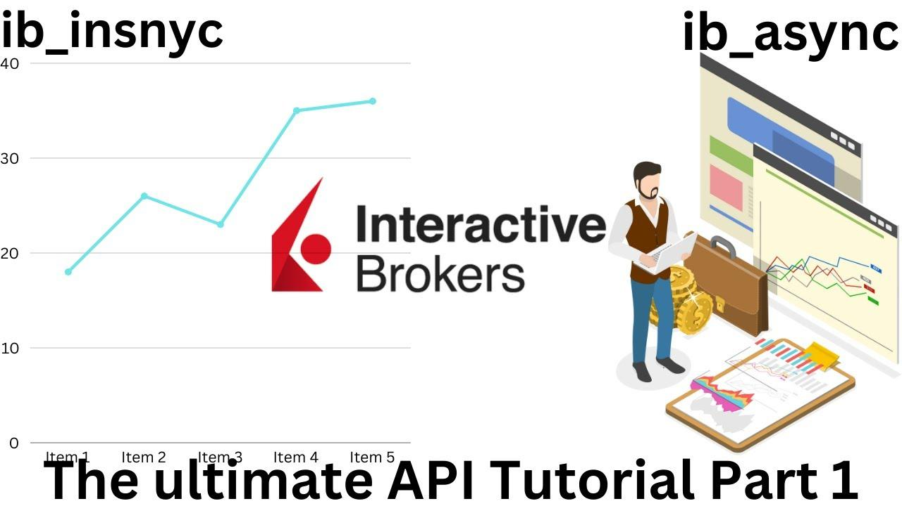

## Table of Contents

## What is IB Insync and how does it relate to the Interactive Brokers API?

IB Insync is a Python library that makes it easier to use the Interactive Brokers API. The Interactive Brokers API is a set of tools that allows programmers to connect their software to the Interactive Brokers trading platform. This connection lets them do things like get real-time market data, place trades, and manage their accounts automatically. IB Insync simplifies the process of working with the Interactive Brokers API by providing an easier-to-use interface and handling many of the complex details for you.

With IB Insync, you don't need to worry about the tricky parts of the Interactive Brokers API, like managing connections or dealing with the API's sometimes confusing error messages. Instead, IB Insync takes care of these issues in the background, letting you focus on writing your trading strategies or data analysis. This makes it a popular choice for both beginners and experienced programmers who want to use the Interactive Brokers platform without getting bogged down in the technical details of the API.

## How do I install IB Insync on my computer?

To install IB Insync on your computer, you need to use a tool called pip, which is a package manager for Python. First, make sure you have Python installed on your computer. Then, open a command prompt or terminal window. In the command prompt, type `pip install ib_insync` and press enter. This command will download and install IB Insync for you. It might take a few moments, so be patient.

Once the installation is complete, you can start using IB Insync in your Python programs. To check if it installed correctly, you can open a Python interpreter or create a new Python file and type `import ib_insync`. If you don't see any error messages, then IB Insync is ready to use. Now you can write code to connect to [Interactive Brokers](/wiki/interactive-brokers-api) and start using their services with the help of IB Insync.

## What are the basic steps to connect to Interactive Brokers using IB Insync?

To connect to Interactive Brokers using IB Insync, first make sure you have the library installed. Open your Python environment and import the necessary modules from IB Insync, like `IB` from `ib_insync`. Then, create an instance of the `IB` class. This instance is what you'll use to connect to the Interactive Brokers platform. You'll need to provide your username, password, and the trading mode you want to use, like 'paper' for a practice account or 'live' for real trading.

After setting up the `IB` instance, call the `connect` method on it. You'll need to pass in the IP address of the Interactive Brokers server, the port number, and a client ID. The default IP address is usually '127.0.0.1' if you're running the Interactive Brokers Trader Workstation (TWS) on the same computer. The port number is often 7497 for paper trading or 7496 for live trading, but you should check your TWS settings to be sure. Once you call `connect`, IB Insync will try to establish a connection. If everything is set up correctly, you'll be connected and ready to start using Interactive Brokers' services through your Python code.

## How can I retrieve real-time market data using IB Insync?

To get real-time market data using IB Insync, first make sure you are connected to Interactive Brokers. Once connected, you can use the `reqMktData` function to ask for market data. You need to give it a contract, which describes what you want data for, like a stock or an option. You also need to say what type of data you want, like the last price or the bid and ask prices. When you call `reqMktData`, IB Insync will start sending you updates about the market data you asked for.

After calling `reqMktData`, you can get the data in two ways. One way is to use a loop that keeps checking for new data. Another way is to use something called a callback function, which automatically runs every time new data comes in. Either way, you'll be able to see the latest prices and other market information in real-time. This lets you keep track of what's happening in the market and make decisions based on the most current data.

## What are the common methods for placing orders with IB Insync?

To place orders using IB Insync, you first need to create an order object that describes what you want to do. This object includes details like how much you want to buy or sell, the price you want, and the type of order, like a market order or a limit order. Once you have your order object, you need a contract object that says what you're trading, like a specific stock or option. With both the order and the contract ready, you can use the `placeOrder` method of the `IB` instance to send your order to Interactive Brokers. This method takes the contract and the order as arguments and sends your order to the market.

After you place the order, you can check on it to see if it went through and what's happening with it. You can use the `whatIfOrder` method to see what might happen if you placed an order without actually placing it. This is useful for testing. To get updates on your order, you can use the `reqOpenOrders` method to see all your current orders, or the `reqAllOpenOrders` method to see all open orders in your account. These methods help you keep track of your orders and make sure everything is going as planned.

## How do I manage and monitor my open orders using IB Insync?

To manage and monitor your open orders using IB Insync, you first need to know how to check what orders you have open. You can do this by using the `reqOpenOrders` method. This method will show you all the orders you have placed that are still active. If you want to see all the open orders in your account, even if you didn't place them, you can use the `reqAllOpenOrders` method. These methods help you keep track of what's happening with your orders so you can make changes if you need to.

Once you know what orders are open, you can decide what to do next. If you want to change an order, you can use the `placeOrder` method again with the new details. If you want to cancel an order, you can use the `cancelOrder` method. Both of these methods need the order object that you want to change or cancel. By using these tools, you can keep your trading strategy on track and make sure your orders are doing what you want them to do.

## What are some advanced features of IB Insync for portfolio management?

IB Insync has some advanced features that can help you manage your portfolio better. One of these features is the ability to use the `portfolio` method to get a full list of all the positions in your account. This lets you see at a glance what you own and how much of it you have. You can also use the `accountSummary` method to get a summary of your account, including things like your total cash balance and your total portfolio value. These tools make it easier to keep track of your investments and make sure your portfolio is doing what you want it to do.

Another advanced feature of IB Insync is the ability to set up automatic trading strategies. You can write scripts that check the market data and make trades based on what's happening. For example, you could set up a script that buys a stock when its price goes below a certain level and sells it when the price goes up. This can help you take advantage of market movements without having to watch the market all the time. With IB Insync, you can set these strategies to run in the background, making it easier to manage your portfolio and follow your trading plan.

## How can I automate trading strategies with IB Insync?

To automate trading strategies with IB Insync, you first need to write a script that tells the computer what to do. This script uses the tools in IB Insync to check the market data and make trades based on what's happening. For example, you could write a script that buys a stock when its price goes below a certain level and sells it when the price goes up. You can set up these rules in your script, and then let the computer do the work for you. This way, you don't have to watch the market all the time, and you can still take advantage of market movements.

Once you have your script ready, you can run it in the background while you do other things. IB Insync will keep checking the market data and following your rules to make trades. This makes it easier to manage your portfolio and follow your trading plan without having to be glued to your computer. By using IB Insync to automate your trading strategies, you can save time and make sure your trades are happening when they should, even if you're not watching.

## What are the best practices for error handling and logging in IB Insync?

When using IB Insync, it's important to handle errors well so your trading strategies keep working smoothly. One good way to do this is by using try-except blocks in your code. These blocks let you catch errors and deal with them without stopping your whole program. For example, if you're trying to place an order and something goes wrong, you can use a try-except block to catch the error, log it, and maybe try the order again later. This helps make sure small problems don't mess up your whole trading plan.

Logging is also really important when you're using IB Insync. You should set up a logging system that keeps track of what's happening in your program. This way, if something goes wrong, you can look at the logs to see what happened and fix it. You can use Python's built-in logging module to set this up. Make sure to log important events like when you place an order, when you get market data, and when errors happen. Good logging helps you keep an eye on your trading strategies and make them better over time.

## How do I optimize the performance of my IB Insync applications?

To make your IB Insync applications run faster, you should think about how you use the data. One good way is to use something called asynchronous programming. This means your program can do more than one thing at the same time. For example, while it's waiting for market data, it can also be checking your orders or doing other tasks. This can make your program run a lot faster because it's not just sitting around waiting for one thing to finish before it starts the next.

Another way to speed up your IB Insync applications is to be smart about how often you ask for data. If you're asking for market data too often, it can slow down your program and even cause problems with the Interactive Brokers server. Instead, try to ask for data only when you really need it. You can also use something called caching, which means saving data you've already asked for so you don't have to ask for it again. This can save time and make your program run more smoothly.

## What are some common pitfalls and how can I avoid them when using IB Insync?

When using IB Insync, one common pitfall is not handling errors properly. If your program runs into an error and you don't catch it, it can stop working and mess up your trading strategy. To avoid this, always use try-except blocks in your code. These blocks help you catch errors and deal with them without stopping your whole program. For example, if you're trying to place an order and something goes wrong, you can catch the error, log it, and maybe try the order again later. This way, small problems won't ruin your whole plan.

Another common issue is asking for too much data too often. If you're constantly requesting market data, it can slow down your program and even cause problems with the Interactive Brokers server. To avoid this, only ask for data when you really need it. You can also use caching, which means saving data you've already asked for so you don't have to ask for it again. This can save time and make your program run more smoothly. By being smart about how you use data, you can keep your IB Insync applications running well.

## How can I integrate IB Insync with other tools and platforms for enhanced functionality?

To make your IB Insync applications even better, you can connect them with other tools and platforms. For example, you might want to use a database to keep track of your trades and market data. You can use Python's libraries like SQLite or PostgreSQL to save this information. Then, you can write scripts that pull data from IB Insync and store it in the database. This way, you can look at your trading history and analyze it to make better decisions. You can also use tools like Excel or Google Sheets to see your data in a spreadsheet, which can help you understand it better.

Another way to enhance your IB Insync applications is by using other programming tools and libraries. For instance, you might want to use a charting library like Matplotlib or Plotly to make graphs of your market data. This can help you see trends and patterns more easily. You can also use [machine learning](/wiki/machine-learning) libraries like scikit-learn to build models that predict what the market might do next. By combining IB Insync with these other tools, you can create a powerful system that helps you trade smarter and more effectively.


## How to set up ib_insync for Algorithmic Trading

To effectively set up ib_insync for [algorithmic trading](/wiki/algorithmic-trading), certain prerequisites and steps need to be followed to ensure a smooth and functioning integration with Interactive Brokers. This section provides a comprehensive guide for setting up ib_insync, covering installation, configuration, necessary coding environments, and troubleshooting.

### Prerequisites for Using ib_insync

Before installing ib_insync, ensure that you have:

1. **Python Installed**: ib_insync is a Python library; hence, Python 3.6 or later should be installed on your system. You can download the latest version from the official [Python website](https://www.python.org/).

2. **Interactive Brokers Account**: You must have an active Interactive Brokers account, as ib_insync connects to Interactive Brokers’ Trader Workstation (TWS) or Gateway.

3. **Trader Workstation (TWS) or IB Gateway**: Download and install TWS or IB Gateway from the Interactive Brokers website. These platforms allow ib_insync to communicate with your IB account.

4. **Java Runtime Environment (JRE)**: Ensure that JRE is installed on your system because TWS and IB Gateway require Java to run.

### Step-by-Step Guide to Installing and Setting Up ib_insync

Follow these steps to install ib_insync and prepare it for use:

1. **Install ib_insync Library**: You can install ib_insync via pip, the Python package manager, by running the following command in your terminal or command prompt:

   ```bash
   pip install ib_insync
   ```

2. **Verify Installation**: After installation, verify that ib_insync was installed correctly by importing it in Python:

   ```python
   import ib_insync
   ```

If there are no errors, the installation was successful.

### Configuring ib_insync to Connect with Interactive Brokers

To configure ib_insync for connectivity, follow these steps:

1. **Start TWS or IB Gateway**: Launch either TWS or IB Gateway and ensure they are correctly configured to allow API connections. 

2. **API Settings**: In TWS or IB Gateway, go to the settings and enable API access by checking options such as "Enable ActiveX and Socket Clients" and "Download open orders on connection". Take note of the port number being used, typically 7496 or 7497.

3. **Connect ib_insync**: Use the following Python code to establish a connection:

   ```python
   from ib_insync import IB

   ib = IB()
   ib.connect('127.0.0.1', 7497, clientId=1)
   ```

Ensure that the IP address and port match the settings in TWS or IB Gateway.


A conducive coding environment is essential for running ib_insync effectively. Consider using:

- **Integrated Development Environment (IDE)**: IDEs like PyCharm, Visual Studio Code, or Jupyter Notebook provide comprehensive support for Python development and can facilitate code writing and testing.

- **Virtual Environments**: Creating a Python virtual environment will help manage dependencies and maintain a clean setup. Use the following commands to set it up:

  ```bash
  python -m venv ib_env
  source ib_env/bin/activate  # On Windows use `ib_env\Scripts\activate`
  ```

### Tips for Troubleshooting Common Installation and Setup Issues

If you encounter issues, consider the following troubleshooting tips:

1. **Python and Library Compatibility**: Ensure that the Python version is compatible with ib_insync and all dependencies are correctly installed.

2. **API Connection Errors**: If you experience connectivity issues, verify that API access is enabled in TWS or IB Gateway, and confirm the IP address and port number.

3. **Firewall and Security**: Check your system’s firewall and security settings to ensure they are not blocking connections between ib_insync and TWS/IB Gateway.

4. **Log Files**: Review log files for detailed error messages. TWS and IB Gateway maintain logs that can be helpful for diagnosing issues.

By following these instructions, you should be able to set up ib_insync effectively, paving the way for the development of robust algorithmic trading strategies.

## How to use ib_insync in Developing Trading Algorithms?

Algorithmic trading in financial markets has become increasingly reliant on sophisticated tools that enable efficient, automated strategies. ib_insync, an asynchronous Python library, facilitates seamless interaction with Interactive Brokers, a leading brokerage platform. This section explores how ib_insync enhances algorithm development, potential strategies, and the integration of [machine learning](/wiki/machine-learning) to elevate trading endeavors.

### Leveraging ib_insync’s Features for Algorithm Development

ib_insync provides an intuitive, asynchronous API for programmatically accessing Interactive Brokers' services. Its asynchronous nature ensures that trading algorithms remain responsive by allowing non-blocking execution of tasks. This is crucial for implementing real-time trading strategies where latency can significantly impact profitability.

Key features that aid algorithm development include easy access to market data, order placement, and monitoring account details. The API's simplicity allows for swift strategy prototyping and testing.

### Examples of Trading Strategies

Using ib_insync, traders can implement a variety of strategies, including:

- **Pair Trading**: This involves identifying two correlated assets and profiting from their relative movements. The strategy entails buying the underperformer and selling the outperformer.

- **Momentum Trading**: This approach capitalizes on the continuation of existing market trends. It involves buying assets with upward momentum and selling those with downward momentum.

- **Mean Reversion**: Based on the assumption that prices revert to their mean over time, this strategy involves buying undervalued assets and selling overvalued ones.

Each strategy benefits from ib_insync's real-time data handling and order management capabilities, which are crucial for timely execution.

### Case Studies of Successful Algo Trading with ib_insync

Several case studies illustrate the potential of using ib_insync in trading algorithms. For instance, traders have successfully developed high-frequency trading systems that leverage ib_insync's low-latency data access and order execution. These systems can analyze market data and execute trades in milliseconds, capitalizing on minute price changes.

Another case involved a trend-following strategy during volatile market conditions, where ib_insync's ability to handle large volumes of data enabled the algorithm to adapt rapidly, mitigating risks and enhancing returns.

### How to Backtest Algorithms with the ib_insync Library

Backtesting is essential for assessing the viability of trading strategies. ib_insync can be integrated with [backtesting](/wiki/backtesting) frameworks like Backtrader, providing a platform to simulate trades based on historical data. This allows developers to evaluate strategy performance over different market conditions without risking capital.

A basic backtesting setup might involve fetching historical price data, simulating trades, and analyzing performance metrics like the Sharpe ratio, drawdowns, and total returns. Python code snippets can facilitate this process:

```python
from ib_insync import IB, Stock
import backtrader as bt

ib = IB()
# Connect to Interactive Brokers
ib.connect('127.0.0.1', 7497, clientId=1)

stock = Stock('AAPL', 'SMART', 'USD')
ib.reqHistoricalData(stock, endDateTime='', durationStr='1 Y', 
                     barSizeSetting='1 day', whatToShow='MIDPOINT', useRTH=True)
```

### Integrating Machine Learning Models with ib_insync for Advanced Strategies

The convergence of machine learning and algorithmic trading can unlock predictive insights. ib_insync's flexibility allows for easy integration with machine learning models built using libraries like TensorFlow or Scikit-learn. Traders can employ models to forecast price movements or detect patterns, incorporating these predictions into trading systems for enhanced decision-making.

An advanced strategy might involve developing a predictive model that signals buy or sell actions based on market indicators. This model can be trained on large datasets using classification or regression techniques and then deployed to work in tandem with ib_insync for executing trades.

In summary, ib_insync enriches the algorithmic trading landscape by providing robust tools for developing, testing, and deploying sophisticated trading strategies. It not only facilitates real-time market interaction but also enables seamless integration with advanced analytical models, pushing the boundaries of what is achievable in automated trading.

## References & Further Reading

[1]: Erdewitt, T. (2017). ["ib_insync Documentation"](https://ib-insync.readthedocs.io/). GitHub Repository.

[2]: Chan, E. (2009). ["Quantitative Trading: How to Build Your Own Algorithmic Trading Business"](https://github.com/ftvision/quant_trading_echan_book). John Wiley & Sons.

[3]: Lewis, A. (2020). ["Python for Finance: Mastering Data-Driven Finance"](https://books.google.com/books/about/Python_for_Finance.html?id=2qd9DwAAQBAJ). O'Reilly Media.

[4]: López de Prado, M. (2018). ["Advances in Financial Machine Learning"](https://www.amazon.com/Advances-Financial-Machine-Learning-Marcos/dp/1119482089). Wiley.

[5]: Aronson, D.R. (2007). ["Evidence-Based Technical Analysis: Applying the Scientific Method and Statistical Inference to Trading Signals"](https://www.amazon.com/Evidence-Based-Technical-Analysis-Scientific-Statistical/dp/0470008741). Wiley.

[6]: Jansen, S. (2020). ["Machine Learning for Algorithmic Trading"](https://github.com/stefan-jansen/machine-learning-for-trading). Packt Publishing.