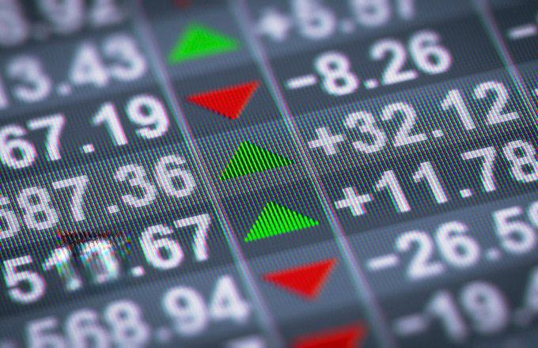

In finance, the iTraxx derivatives credit index plays a crucial role in providing transparency and risk management for market participants. As a standardized benchmark, it enables investors to efficiently trade credit default swaps, offering insights into the creditworthiness of various entities. This article examines the iTraxx index's relevance in algorithmic trading, a technique that leverages advanced computational algorithms to automate and optimize trading strategies. By understanding credit derivatives, investors gain access to unique financial instruments that allow them to manage risk and speculate on credit market changes.

Credit derivatives are financial contracts designed to mitigate or gain exposure to the credit risk of a borrower or a group of borrowers. Among them, credit default swaps (CDS) are widely used to transfer the risk of default from one party to another. iTraxx indices, comprising a range of these derivatives, provide traders with standardized tools to hedge against credit risk or speculate on credit events. They serve as vital instruments for investors looking to balance their portfolios and navigate complex market dynamics.

In addition to offering risk management and speculation opportunities, iTraxx indices play a pivotal role in enabling efficient market exposure. They are crucial for investors aiming to gain or reduce exposure to specific credit sectors without directly engaging in the underlying bond or debt markets. This capability is particularly important in volatile markets, where quick adjustments to market positions can mitigate potential losses or capitalize on emerging trends.

Algorithmic trading significantly impacts the efficiency and liquidity of credit markets. By automating the trading process, algorithms can execute trades rapidly and with precision, enhancing market liquidity and transparency. Such advancements have become indispensable in handling large volumes of trades that characterize modern financial markets. With algorithmic trading's integration of iTraxx indices, traders can efficiently navigate credit derivatives markets, exploiting arbitrage opportunities and optimizing risk management strategies.

As the financial industry continues to innovate, the relationship between iTraxx derivatives indices and algorithmic trading becomes increasingly intertwined. The integration of these elements forms the foundation for a more efficient and transparent trading environment, allowing investors to make informed decisions based on real-time data and market dynamics. This article will explore how the synergy between iTraxx indices and algorithmic trading shapes today's financial landscape.

## Table of Contents

## Understanding iTraxx Derivatives Credit Index

The iTraxx derivatives credit index is an essential tool in finance, commonly utilized in regions such as Europe, Asia, and Australia. These indices serve as standardized instruments for trading credit default swaps (CDS), providing market participants with crucial insights into credit market dynamics and facilitating effective risk management.

iTraxx indices are constructed based on liquidity data to ensure the inclusion of only the most liquid CDS contracts. This focus on liquidity is vital for maintaining a robust and active market, as liquid instruments enable smoother execution of trades and minimize the impact of significant transactions on market prices. By ensuring high liquidity, iTraxx indices attract a broader range of participants who rely on the indices as reliable benchmarks for credit market performance.

A key function of iTraxx indices is aiding traders and investors in managing credit risk. The indices are composed of a basket of CDS contracts referencing various corporate entities or sovereign debt. By analyzing the performance of these indices, traders can gauge market sentiment and identify changes in credit risk perception. This information empowers them to make informed decisions regarding hedging and speculative activities, as well as to adjust their market positions accordingly.

The informed decision-making process surrounding iTraxx indices is underpinned by the comprehensive data set the indices represent. Market participants can track fluctuations in the indices to understand broader credit market trends. For instance, a widening of spreads in an iTraxx index may signal increasing credit risk, prompting traders to reevaluate their exposure or consider hedging strategies.

In summary, the iTraxx derivatives credit index is a pivotal element in the landscape of credit derivatives, providing standardized, liquid, and informative benchmarks for market participants. The indices' structure and updates ensure they reflect current market conditions, supporting traders in their pursuit of effective risk management and informed investment strategies.

## Historical Development and Evolution of iTraxx

The iTraxx indices originated in the early 2000s, initiated through the collaborative efforts of J.P. Morgan and Morgan Stanley. Driven by the necessity for standardized measures within the rapidly growing credit derivatives market, these indices were crafted to facilitate a more structured approach to trading in credit default swaps (CDS). This standardization offered market participants a reliable framework to gauge credit risk and enabled more efficient risk management across portfolios.

Over time, the governance and development of the iTraxx indices transitioned to the International Index Company, which played a crucial role in refining and expanding the indices' utility. Following this, the responsibilities eventually moved to IHS Markit, which continues to oversee the indices' operations today. A key feature of the iTraxx indices is their biannual updates. This systematic process ensures that only the most liquid credit default swaps are included, thereby maintaining the indices' relevance and precision in reflecting current market conditions.

Throughout its evolution, iTraxx has become a pivotal instrument for global investors. It serves as a vital tool for hedging against credit risk and provides insights into market trends, thereby aiding in informed decision-making. The indices' capacity to represent a broad spectrum of market segments, from investment grade corporates to high-yield sectors, underscores its versatility and significance in financial markets globally. As financial markets continue to evolve, the iTraxx indices' role in shaping credit market dynamics remains indispensable, attesting to its foundational impact since its inception.

## Algorithmic Trading in the Credit Market

Algorithmic trading employs sophisticated algorithms to automate and improve trading strategies in financial markets. This practice is increasingly significant in the credit derivatives market, where speed and precision are essential. Algorithms help execute trades more efficiently, maximizing throughput and minimizing latency, which is crucial for high-frequency trading environments.

In the credit derivatives market, [algorithmic trading](/wiki/algorithmic-trading) takes advantage of [liquidity](/wiki/liquidity-risk-premium) and transparency facilitated by iTraxx indices. These indices serve as reliable references, aiding traders in determining fair market values for credit default swaps (CDS). By leveraging real-time data from iTraxx, trading algorithms can make instantaneous decisions that align with market movements, thus improving trade execution.

Furthermore, algorithmic trading enables market participants to exploit [arbitrage](/wiki/arbitrage) opportunities, which arise from price discrepancies between related financial instruments. For instance, if there is a temporary mispricing between the iTraxx index and an individual CDS, algorithms can execute trades to capitalize on the difference, profiting from minute price variances. This form of arbitrage relies on precise calculations and swift execution, both of which are facilitated by advanced algorithms.

Another notable contribution of algorithmic trading is optimizing portfolio risk management. Algorithms can continuously analyze market data and identify changes in credit spreads, allowing traders to adjust their portfolios in real-time and managing risk exposure effectively. The continuous monitoring and adjustment capabilities inherent in algorithmic trading systems are particularly beneficial for managing credit risk, which is inherently volatile and sensitive to macroeconomic changes.

Technological advancements also shape algorithmic trading in credit markets by enabling the development of more sophisticated models and strategies. Machine learning and [artificial intelligence](/wiki/ai-artificial-intelligence) allow these systems to learn from historical data, improve their predictive accuracy, and adapt to evolving market conditions. This constant innovation leads to an ever-evolving landscape where trading systems become increasingly autonomous and efficient, providing traders with a competitive edge.

In summary, algorithmic trading revolutionizes the credit derivatives market by enhancing trade efficiency and execution, leveraging iTraxx-derived data, facilitating arbitrage, and optimizing risk management strategies. As technology progresses, the influence of algorithmic trading on the credit markets is expected to continue expanding, offering new opportunities and challenges for market participants.

## The Synergy Between iTraxx and Algorithmic Trading

The iTraxx indices have gained notable prominence as benchmarks in developing and testing algorithmic trading strategies. Their broad acceptance and widespread availability enhance the liquidity of automated trading markets, providing a consistent platform for traders to execute sophisticated strategies. The precision and reliability offered by iTraxx data play a critical role in hedging market positions. Such data enables algorithmic trading systems to execute trades with remarkable accuracy, ensuring that positions are rebalanced swiftly in response to market fluctuations.

The transparency inherent in these indices significantly contributes to crafting trading strategies that are tightly aligned with prevailing market dynamics. Market participants leverage iTraxx's transparent metrics to optimize their algorithms, ensuring they remain attuned to real-time developments and historical trends within credit markets. This adaptability is crucial, particularly in volatile environments where quick, informed decision-making defines success.

The synergy between iTraxx indices and algorithmic trading enhances the operational efficiency of financial markets. This relationship not only introduces cost-effective solutions for traders but also fosters a trading environment characterized by reduced transaction costs and minimized slippage. With advanced algorithms tapping into iTraxx data, the market experiences increased liquidity and pricing accuracy.

Consequently, this synergy represents a significant advancement in modern trading technology, facilitating more efficient allocation of capital and risk across global markets. The structured nature of iTraxx indices simplifies integration with algorithmic systems, empowering traders with tools to exploit arbitrage opportunities and manage risk more effectively. As financial markets continue to evolve, the collaborative utility of iTraxx indices and algorithmic trading is likely to expand, greatly influencing the future of credit markets.

## Conclusion

iTraxx derivatives credit index serves as an essential instrument for investors aiming to manage credit risk exposure effectively. By providing a transparent and standardized framework for assessing credit default swaps, iTraxx indices enhance market understanding and facilitate more informed decision-making processes. This, in turn, bolsters both transparency and liquidity within the credit markets.

The integration of iTraxx indices with algorithmic trading is revolutionizing the credit derivatives market. Through the use of advanced algorithms, traders can execute trades with increased speed and precision, optimizing risk management strategies and capitalizing on market opportunities. The synergy between these indices and algorithmic trading systems ensures that market activities are aligned with prevailing economic conditions, enabling traders to maintain a competitive edge.

As financial innovations evolve, the importance of iTraxx indices in algorithmic trading is expected to increase. The scalability and adaptability of these tools make them invaluable in developing dynamic trading strategies that respond swiftly to market changes. Investors and trading firms should remain informed about advancements in this area to fully harness the capabilities of modern trading technologies.

By leveraging the potential of iTraxx indices in conjunction with algorithmic trading, market participants can achieve a more efficient allocation of resources and a comprehensive approach to managing credit risk. Staying abreast of these developments is crucial for those looking to maximize benefits from the evolving landscape of credit derivatives trading.

## References & Further Reading

[1]: ["iTraxx: The Standard for European Credit"](https://www.spglobal.com/spdji/en/landing/topic/itraxx/) - IHS Markit

[2]: Hull, J. C. (2018). ["Options, Futures, and Other Derivatives,"](https://www.semanticscholar.org/paper/Options%2C-Futures%2C-and-Other-Derivatives-Hull/89bdee500c8623864fc9eb7a471546aa713acc44) 10th Edition. Pearson.

[3]: Näf, M., Förster, M., & Wenger, F. (2014). ["Impact of Algorithmic Trading on Market Quality"](https://papers.ssrn.com/sol3/papers.cfm?abstract_id=2022034) - Swiss Institute of Banking and Finance.

[4]: O'Kane, D. (2008). ["Modelling Single-name and Multi-name Credit Derivatives."](https://onlinelibrary.wiley.com/doi/book/10.1002/9781119201960) Wiley Finance.

[5]: Luenberger, D. G. (2013). ["Investment Science."](https://www.amazon.com/Investment-Science-David-G-Luenberger/dp/0199740089) Oxford University Press.