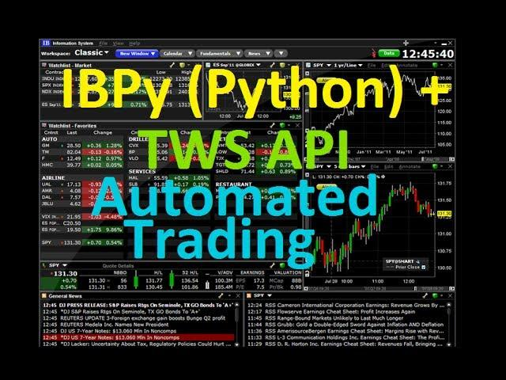

## Table of Contents

## What is IBPy and why is it used with Interactive Brokers?

IBPy is a Python API wrapper for Interactive Brokers' Trader Workstation (TWS) and their IB Gateway. It makes it easier for people who use Python to connect to Interactive Brokers' trading platform. With IBPy, you can write Python code to do things like get stock prices, place trades, and manage your portfolio without having to use the Interactive Brokers' software directly.

People use IBPy with Interactive Brokers because it helps automate trading and investment tasks. For example, if you want to create a program that automatically buys or sells stocks based on certain rules, IBPy can help you do that. It's especially useful for people who want to build their own trading systems or do a lot of data analysis, because it lets them use Python's powerful tools and libraries alongside Interactive Brokers' trading capabilities.

## How do I install IBPy and set up my environment for using the Interactive Brokers API?

To install IBPy and set up your environment for using the Interactive Brokers API, start by making sure you have Python installed on your computer. Once you have Python, you can install IBPy using pip, which is a package installer for Python. Just open a command prompt or terminal, and type `pip install ibpy`. This will download and install IBPy on your system. Next, you need to download and install the Interactive Brokers TWS or IB Gateway from their website. These are the programs that IBPy will connect to.

After you have installed both IBPy and the [Interactive Brokers](/wiki/interactive-brokers-api) software, you need to set up your environment. Open the Interactive Brokers TWS or IB Gateway and log in with your account. Make sure you enable the API in the settings of the TWS or IB Gateway. Then, you can start writing your Python scripts using IBPy. You'll need to include some basic code to connect to the TWS or IB Gateway, like setting the host, port, and client ID. Once you have this set up, you can start using IBPy to interact with the Interactive Brokers platform and perform tasks like getting market data or placing orders.

## What are the basic steps to connect to Interactive Brokers using IBPy?

To connect to Interactive Brokers using IBPy, you first need to make sure you have the Interactive Brokers TWS or IB Gateway running on your computer. Open the TWS or IB Gateway and log in with your Interactive Brokers account. In the settings, make sure you enable the API so that IBPy can connect to it. 

Next, in your Python script, you'll need to import the IBPy library and create a connection to the TWS or IB Gateway. You do this by setting the host, port, and client ID in your code. The host is usually '127.0.0.1' if you're running everything on the same computer, the port is often '7497' for TWS or '4002' for IB Gateway, and the client ID can be any unique number you choose. Once you've set these up, you can start using IBPy to send commands and receive data from Interactive Brokers.

## How can I retrieve real-time market data using IBPy?

To get real-time market data using IBPy, you first need to make sure you're connected to the Interactive Brokers TWS or IB Gateway. Once you're connected, you can use IBPy to ask for the data you want. For example, if you want to know the current price of a stock, you can use the `reqMktData` function in IBPy. You'll need to tell it which stock you're interested in, usually by its symbol or contract details. Once you send this request, Interactive Brokers will start sending you updates on the stock's price.

After you've sent the request for market data, IBPy will receive the updates from Interactive Brokers. These updates come in as messages, and you can set up your Python script to read these messages and do something with the data. For instance, you might want to print the latest price to the screen or save it to a file. To keep getting real-time updates, your script needs to keep running and listening for new messages from Interactive Brokers.

## What are the common methods for placing orders through IBPy?

To place orders using IBPy, you first need to make sure you're connected to the Interactive Brokers TWS or IB Gateway. Once connected, you can use the `placeOrder` function in IBPy. You'll need to tell it what you want to buy or sell, how much you want to buy or sell, and at what price. For example, if you want to buy 100 shares of a stock at the current market price, you would set up an order with the stock's symbol, the quantity as 100, and the order type as 'MKT' for market order.

After you've set up your order, you send it to Interactive Brokers using the `placeOrder` function. IBPy will then send your order to the TWS or IB Gateway, and Interactive Brokers will try to fill your order. You can also set up different types of orders, like limit orders where you specify a maximum price you're willing to pay, or stop orders that trigger when a stock reaches a certain price. Once your order is placed, you can use IBPy to check if it's been filled and what price you got.

## How do I manage and modify existing orders using IBPy?

To manage and modify existing orders using IBPy, you need to first know the order ID of the order you want to change. This ID is given to you when you place the order. Once you have the order ID, you can use the `reqAllOpenOrders` function to see all your open orders. This will show you what orders you have and their current status. If you want to change an order, you use the `placeOrder` function again, but this time you include the order ID of the order you want to change. You can then change things like the quantity or the price of the order.

After you've modified an order, IBPy will send the changes to Interactive Brokers, and they will try to update your order. You can check if the changes were made by using the `reqAllOpenOrders` function again to see the updated status of your orders. If you want to cancel an order instead of modifying it, you can use the `cancelOrder` function with the order ID. This will tell Interactive Brokers to stop trying to fill that order. By using these functions, you can keep track of and change your orders easily with IBPy.

## What are some advanced features of IBPy for handling account information and portfolio management?

IBPy has some cool features that help you manage your account and keep track of your investments. One of these features is the `reqAccountUpdates` function, which lets you see all the details about your account, like how much money you have, what your buying power is, and what positions you're holding. This is really useful if you want to keep an eye on your account and make sure everything is going as planned. Another feature is the `reqPortfolio` function, which gives you a list of all the stocks, options, or other investments you own. This helps you see your whole portfolio at a glance and make decisions about what to buy or sell.

Another advanced feature of IBPy is the ability to get detailed information about your trades and orders. You can use the `reqExecutions` function to see a history of all the trades you've made, including when they happened, what you bought or sold, and at what price. This is great for keeping track of your trading activity and analyzing your performance over time. Additionally, IBPy lets you set up alerts and notifications using the `reqNewsBulletins` function, so you can stay updated on important news or events that might affect your investments. By using these features, you can manage your account and portfolio more effectively and make smarter investment choices.

## How can I automate trading strategies using IBPy?

Automating trading strategies with IBPy is all about writing Python code that can make decisions and place trades without you having to do it manually. You start by connecting to Interactive Brokers using IBPy, and then you can set up rules for when to buy or sell. For example, you might write a script that checks the price of a stock every few minutes and buys it if the price goes below a certain level. Once you have your rules set up, IBPy can send orders to Interactive Brokers automatically, based on what your code tells it to do. This way, your trading strategy can run all day, even when you're not at your computer.

To make your automated trading strategy work well, you need to keep an eye on how it's doing and make changes if needed. IBPy lets you check your account balance, see what stocks you own, and review your past trades. You can use this information to tweak your strategy, like changing the price levels where you buy or sell, or adding new rules based on how the market is behaving. By using IBPy, you can create a trading system that works on its own but still gives you the control to adjust things when you need to.

## What are the best practices for error handling and logging in IBPy?

When using IBPy, it's important to handle errors well so your trading program doesn't crash if something goes wrong. You can use Python's `try` and `except` blocks to catch errors and deal with them. For example, if you're trying to place an order and it doesn't work, you can use `try` to attempt the order and `except` to handle any errors that come up. This way, your program can keep running and maybe even try the order again later. Also, it's a good idea to log these errors so you can look at them later and figure out what went wrong.

Logging is another important part of using IBPy. You can use Python's `logging` module to keep track of what your program is doing, like when it places orders or gets market data. This helps you see if your trading strategy is working as expected and makes it easier to fix problems if they come up. By setting up good error handling and logging, you can make your IBPy program more reliable and easier to manage.

## How do I ensure the security and compliance of my trading activities when using IBPy?

When using IBPy for trading, it's really important to keep your activities secure and follow the rules. One way to do this is by using strong passwords and keeping your Interactive Brokers login details safe. Make sure you only run IBPy on a computer that you trust and keep your software up to date to protect against any security threats. Also, be careful about sharing any information about your trades or account with others, as this can help keep your activities private and secure.

Another important thing is to make sure you're following all the rules and regulations that apply to trading. This means understanding the laws in your country and any rules set by Interactive Brokers. For example, you might need to keep records of your trades and report them to the right authorities. IBPy can help you do this by letting you log your activities and keep track of what you're doing. By being careful and following the rules, you can use IBPy safely and responsibly.

## What are some common pitfalls and how can they be avoided when using IBPy?

When using IBPy, one common pitfall is not handling errors properly. If your program runs into a problem and crashes, it could leave your orders hanging or miss important market updates. To avoid this, always use try and except blocks in your code to catch errors and deal with them without stopping your program. Another pitfall is not keeping track of what your program is doing. If you don't log your actions and check them regularly, you might miss out on seeing if your trading strategy is working or if something is going wrong. Make sure to use logging to keep a record of everything your program does.

Another issue people run into is not setting up their connection to Interactive Brokers correctly. If the connection isn't right, your program won't be able to place orders or get market data. Always double-check your host, port, and client ID settings to make sure they're correct. Also, some people forget to keep their software updated, which can lead to security problems or missing out on new features. Keep your IBPy and Interactive Brokers software up to date to avoid these issues. By being careful and following these tips, you can use IBPy more effectively and avoid common problems.

## How can I extend IBPy's functionality or integrate it with other Python libraries for more complex trading systems?

To make IBPy do more or work with other Python libraries for more complex trading systems, you can start by adding new features to your IBPy code. For example, if you want to analyze stock prices in a special way, you can use libraries like Pandas or NumPy to help you. Pandas is great for organizing and analyzing data, while NumPy can help with math calculations. You can write code that uses IBPy to get market data and then use Pandas to look at that data and find patterns or trends. This way, you can make smarter trading decisions based on your analysis.

Another way to extend IBPy is by connecting it to other tools or services that can help with your trading. For instance, you might want to use a charting library like Matplotlib to create graphs of stock prices, or you could connect to a database to store all your trading data. You can also use [machine learning](/wiki/machine-learning) libraries like scikit-learn to predict future stock prices based on past data. By combining IBPy with these other libraries, you can build a trading system that not only places orders but also analyzes data, makes predictions, and keeps track of everything in a way that suits your needs.


## How to integrate IBPy with Interactive Brokers?

Integrating IBPy with Interactive Brokers involves several methodical steps to ensure a stable and efficient trading environment. The process can be meticulously broken down into two main areas: setting up the Python environment with IBPy and configuring the Interactive Brokers platform.

The initial step mandates installing IBPy within the Python environment. IBPy can be accessed and downloaded from its GitHub repository, offering the latest version for algorithmic traders. It is prudent to implement this installation within a Python virtual environment to manage dependencies and maintain the system's organization. This can be achieved using the following command lines in a terminal:

```bash
# Create a virtual environment
python -m venv ibpy_env

# Activate the virtual environment
# On Windows
ibpy_env\Scripts\activate
# On macOS/Linux
source ibpy_env/bin/activate

# Install IBPy via pip using the GitHub link
pip install git+https://github.com/blampe/IbPy.git
```

Setting up the Interactive Brokers Trader Workstation (TWS) or IB Gateway is equally critical. These platforms must be configured to allow API connections, facilitating seamless interactivity with IBPy. Traders need to adjust TWS API settings by permitting active socket clients and configuring secure IPs for trusted connections. This setup involves navigating through the TWS or IB Gateway interface:

1. In TWS, go to `Edit` > `Global Configuration` > `API` > `Settings`.
2. Enable the checkbox for "Enable ActiveX and Socket Clients."
3. Optionally, set a trusted IP address to restrict access for enhanced security.

Network connectivity is a vital element in the communication bridge between IBPy and the Interactive Brokers server. Ensuring proper network configurations allows command execution without delays or failures, thereby optimizing trading operations. Once these setups are aligned, traders can venture into programming their trading strategies.

Python scripts utilizing IBPy can automate trade executions effectively. A basic example to establish a connection and perform trading activities might look like this:

```python
from ib.ext.Contract import Contract
from ib.ext.Order import Order
from ib.opt import ibConnection, message

def watch_results(msg):
    print(f"Received Message: {msg}")

# Create connection to IB server
conn = ibConnection()
conn.registerAll(watch_results)
conn.connect()

# Define contract
contract = Contract()
contract.m_symbol = "AAPL"
contract.m_secType = "STK"
contract.m_exchange = "SMART"
contract.m_currency = "USD"

# Define order
order = Order()
order.m_action = "BUY"
order.m_totalQuantity = 100
order.m_orderType = "MKT"

# Place the order
conn.placeOrder(123, contract, order)
```

This snippet illustrates connecting to the IB server, defining a contract for a stock (e.g., Apple Inc.), and placing a market order. Such scripts can be further enhanced and tailored as per trading strategies, incorporating error handling and order management techniques to minimize risk and grievances. 

The deployment of IBPy in an Interactive Brokers trading setup can significantly influence a trader’s operational efficiency, provided the integration steps are meticulously followed and maintained for ongoing compatibility.

## How to set up the environment?

Setting up a trading environment with IBPy involves several critical steps to ensure seamless integration with Interactive Brokers' systems. The primary components needed are Python, the IBPy library, and either the Interactive Brokers Trader Workstation (TWS) or IB Gateway. 

To begin, ensure Python is installed on your system, which you can download from the official Python website. It is recommended to use a Python version compatible with IBPy, commonly Python 3.x. Setting up a Python virtual environment is advisable to manage dependencies and isolate the trading environment. This can be done using the following commands:

```bash
# Install virtualenv if you haven't already
pip install virtualenv

# Create a virtual environment
virtualenv ibpy-env

# Activate the virtual environment
# On Windows
ibpy-env\Scripts\activate
# On macOS and Linux
source ibpy-env/bin/activate
```

After setting up the virtual environment, you can proceed to install IBPy. Though IBPy is no longer officially maintained, you can find forks on GitHub. Clone the repository and install it using:

```bash
git clone https://github.com/blampe/IbPy.git
cd IbPy
python setup.py install
```

Configuring Interactive Brokers' systems is the next step. You must configure the TWS or IB Gateway to accept API connections. This involves opening TWS, navigating to the configuration settings, and adjusting the API settings to permit socket client connections. Within TWS, follow these steps:

1. Go to `Edit` → `Global Configuration...`.
2. Under `API`, ensure the `Enable ActiveX and Socket Clients` option is checked.
3. Set the `Trusted IPs` to include the IP address of the machine running your Python scripts. This enhances security by allowing only specific machines to connect.
4. Optionally, modify the socket port number if the default port (7496 for TWS or 4001 for IB Gateway) conflicts with other services.

Ensure your network firewall settings allow outbound connections to Interactive Brokers servers on the specified port. This enables IBPy to communicate effectively with the IB servers to execute trades.

By following these steps, you establish a robust environment conducive to developing and testing [algorithmic trading](/wiki/algorithmic-trading) strategies using IBPy and Interactive Brokers. This setup lays the foundation for automating trades and engaging effectively with global financial markets.

## How to write your first Automated Trading Program?

Once the setup for IBPy is complete, traders can begin crafting their first automated trading script in Python. IBPy serves as an intermediary library that facilitates communication between Python and Interactive Brokers' comprehensive API, allowing users to implement, execute, and manage algorithmic trading strategies effectively.

Start by importing the necessary modules from the IBPy library. To place trades, you'll need to create contract and order objects that specify the details of the securities you wish to trade. Here is a basic structure for a Python script using IBPy:

```python
from ib.ext.Contract import Contract
from ib.ext.Order import Order
from ib.opt import ibConnection, message

def create_contract(symbol, sec_type='STK', exch='SMART', curr='USD'):
    """Function to create a contract object"""
    contract = Contract()
    contract.m_symbol = symbol
    contract.m_secType = sec_type
    contract.m_exchange = exch
    contract.m_currency = curr
    return contract

def create_order(action, quantity, order_type='MKT'):
    """Function to create an order object"""
    order = Order()
    order.m_action = action
    order.m_totalQuantity = quantity
    order.m_orderType = order_type
    return order

def error_handler(msg):
    """Function to handle error messages"""
    print("Error:", msg)

def order_status_handler(msg):
    """Function to handle server responses for order status"""
    print("Order Status:", msg)

if __name__ == "__main__":
    # Connect to IB's API
    con = ibConnection()
    con.register(error_handler, 'Error')
    con.register(order_status_handler, 'OrderStatus')
    con.connect()

    # Define a contract and an order
    contract = create_contract('AAPL')
    order = create_order('BUY', 10)

    # Place order
    con.placeOrder(1, contract, order)
```

In this script, the `create_contract` function outlines the specifics of a financial instrument, with provisions to adjust parameters such as the stock symbol, type, exchange, and currency. The `create_order` function defines the order details, specifying whether to buy or sell, the quantity, and the order type (e.g., market order).

The API connection is established using `ibConnection()`, and it's critical to register handlers like `error_handler` and `order_status_handler` to manage feedback from the Interactive Brokers server. These handlers will help in managing potential errors and monitoring the status of orders, a necessary component of robust algorithmic trading systems.

Order management and error handling are pivotal. They ensure that the trading script can gracefully handle issues such as network interruptions or invalid orders, minimizing the risk of failed executions. Regularly updating your script in response to changes in the IB API or the IBPy library itself is essential to maintain compatibility and functionality. Through careful scripting and attention to detail, traders can automate complex strategies efficiently using IBPy.

## References & Further Reading

[1]: ["Interactive Brokers API"](https://www.interactivebrokers.com/campus/ibkr-api-page/ibkr-api-home/) - Official Interactive Brokers API Documentation

[2]: GitHub Repository for [IBPy](https://github.com/blampe/IbPy) - The Python wrapper for Interactive Brokers API

[3]: ["Advances in Financial Machine Learning"](https://www.amazon.com/Advances-Financial-Machine-Learning-Marcos/dp/1119482089) by Marcos Lopez de Prado

[4]: ["Machine Learning for Algorithmic Trading"](https://github.com/stefan-jansen/machine-learning-for-trading) by Stefan Jansen

[5]: ["Quantitative Trading: How to Build Your Own Algorithmic Trading Business"](https://books.google.com/books/about/Quantitative_Trading.html?id=j70yEAAAQBAJ) by Ernest P. Chan