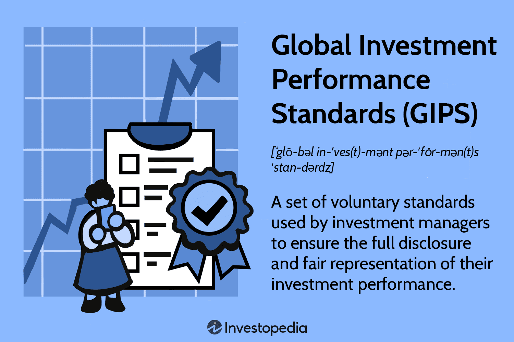

The financial services sector is continuously undergoing transformation, and algorithmic trading has emerged as a crucial component of this change. This article examines the impact and role of ICAP, a prominent financial services brokerage, in algorithmic trading. Historically, ICAP was the largest interdealer broker worldwide, playing a significant role in facilitating over-the-counter (OTC) trading across a diverse spectrum of financial instruments. These include interest rate swaps, exotic options, and foreign exchange, which underpin the global financial infrastructure.

ICAP's journey reflects the broader evolution seen across financial markets, characterized by technological advancements and increasingly stringent regulatory landscapes. The firm has forged a path by transitioning focus towards electronic trading platforms and the development of sophisticated algorithmic trading solutions. This shift underscores ICAP's strategic adaptation to the changing market demands, enabling the firm to offer enhanced trading efficiencies and streamlined operations.

The narrative will progress through an exploration of ICAP's rich history and its evolution into the NEX Group. This transition represents a strategic restructuring aimed at leveraging electronic markets and post-trade services, essential for meeting the modern demands for automation and market efficiency. In understanding ICAP’s legacy and its pivotal movement towards algorithmic trading, we aim to illuminate the broader implications of ICAP’s innovative approaches in shaping the future of financial transactions.

## Table of Contents

## The Evolution of ICAP

ICAP emerged as a dominant force in the interdealer brokerage industry through the strategic merger of Garban plc and Intercapital plc in 1999. This merger aimed to consolidate expertise and market presence, setting the stage for ICAP to become a leading entity in facilitating over-the-counter (OTC) trading across diverse financial products.

Throughout its growth, ICAP pursued a trajectory of strategic acquisitions to enhance its technological capabilities and market reach. Notably, the acquisition of BrokerTec and EBS marked significant milestones in this journey. BrokerTec, renowned for its electronic trading platforms for fixed income products, and EBS, a leading electronic trading platform for foreign exchange, bolstered ICAP's foray into electronic trading. These platforms collectively expanded ICAP's capabilities, enabling it to handle an impressive trading volume of over $2.3 trillion in daily transactions.

In 2016, ICAP underwent a transformative restructuring by selling its global broker business to Tullett Prebon. This strategic divestment resulted in the rebranding of ICAP's remaining operations as NEX Group. The rebranding was more than a mere name change; it represented ICAP's strategic pivot toward electronic markets and post-trade services. This shift was in response to the increasing demand for automated and efficient trading solutions in the financial services industry.

By focusing on electronic trading, NEX Group capitalized on the rising importance of technology-driven trading solutions, underscoring ICAP's commitment to innovation and adaptability. This strategic realignment allowed ICAP to specialize and refine its offerings in electronic platforms, catering to the evolving needs of the financial markets driven by automation and data analytics.

## ICAP’s Role in Algo Trading

Algorithmic trading, commonly referred to as algo trading, employs computer algorithms to automate trading decisions and execute orders according to predefined criteria. This methodology allows for the swift execution of trades, leveraging speed, precision, and data analysis which are critical in today's fast-paced financial markets. 

ICAP has effectively utilized its technological infrastructure and deep market expertise to advance its algo trading solutions. The company's platforms, such as BrokerTec and EBS BrokerTec, offer robust capabilities in servicing a variety of financial products, ensuring high-speed access and market transparency that are crucial for modern trading activities. BrokerTec and EBS BrokerTec are integral to ICAP's provision of efficient trade execution and deep [liquidity](/wiki/liquidity-risk-premium) pools.

BrokerTec specializes in handling high-[volume](/wiki/volume-trading-strategy) bond and fixed income trades. It employs sophisticated algorithms to enhance execution speed and accuracy, often utilizing techniques such as time priority or pro rata matching to match orders optimally. This ensures that trades are executed under the best possible conditions, reducing transaction time and market impact.

EBS BrokerTec, with its focus on currency trading, supports high-frequency trading and market-making strategies through advanced technological solutions. The platform's infrastructure allows for the implementation of complex algorithms capable of handling large data volumes and executing a high number of trades per second, crucial for currency markets where fluctuations can occur in milliseconds.

ICAP's investment in algo trading highlights its commitment to maintaining a leading edge in financial technology. By offering clients enhanced efficiency and reduced market impact, ICAP stays ahead of industry trends. The shift to algo trading represents a move towards data-driven strategies enabling traders to capitalize on fleeting market opportunities quickly and effectively. As the trading environment continues to evolve with new technologies and regulatory landscapes, ICAP's integration of algorithmic solutions positions it as a major player capable of meeting the current and future needs of its clientele.

## ICAP's Electronic Trading Platforms

ICAP's electronic platforms, BrokerTec and EBS BrokerTec, are integral components of its trading infrastructure, providing clients with essential access to substantial liquidity pools and efficient trade execution. These platforms are designed to meet the high demands of today's electronic trading environment, showcasing ICAP’s versatility and commitment to technology-driven solutions that align with the needs of institutional investors and global financial institutions.

BrokerTec has distinguished itself as an industry leader in handling high-volume bond and fixed income trading. The platform leverages sophisticated algorithms that optimize execution speed and accuracy, ensuring that large trades are processed efficiently and with minimal market impact. This is particularly crucial in fixed income markets, where precision and timing can significantly influence trading outcomes.

On the other hand, EBS BrokerTec focuses on the currency trading sector, where it provides state-of-the-art technology to facilitate high-frequency trading and complex market-making strategies. Its advanced infrastructure supports rapid execution and robust risk management features, allowing traders to navigate the dynamic foreign exchange markets effectively.

These platforms are a testament to ICAP's ability to innovate and respond to the growing demands of electronic trading. By integrating voice brokerage with electronic execution, ICAP delivers a diverse array of trading solutions, accommodating a wide spectrum of market requirements. This dual capability not only maximizes informational advantages but also ensures a seamless transition between traditional and electronic trading channels.

Furthermore, ICAP's electronic trading platforms are equipped to handle extensive data aggregation and analytics, providing traders with powerful tools for price discovery and strategic decision-making. The resulting insights enhance the traders' ability to act swiftly on market opportunities while maintaining discretion and reducing the risk of information leakage.

Overall, ICAP's investment in cutting-edge technology and electronic platforms positions it as a forward-thinking leader in the financial services industry, continually enhancing its offerings to meet the evolving needs of its clients. As electronic trading continues to gain prominence, platforms like BrokerTec and EBS BrokerTec will remain crucial to ICAP's strategy and success in the market.

## Advantages of Algo Trading with ICAP

ICAP’s algo trading services offer significant advantages that cater to the needs of modern financial markets, providing execution efficiency, reduced trading costs, and enhanced market access. The capability to execute large orders while maintaining anonymity is one of the core benefits of ICAP's algorithms. This confidentiality is essential for traders seeking to minimize market impact and safeguard their trading intentions. By effectively concealing such strategies, ICAP allows its clients to operate with confidence, knowing that their large-scale orders will not disrupt market equilibrium or inadvertently affect prices.

ICAP plays a pivotal role in price discovery by leveraging its vast data resources to aggregate comprehensive market data. This aggregation empowers traders to make informed, data-driven decisions, translating raw market data into actionable insights. Through sophisticated algorithms and analytics, ICAP helps traders identify and exploit favorable market conditions, thus allowing for precise decision-making which is particularly valuable in volatile market environments.

The firm’s infrastructure, known for its robustness and global reach, enhances trading capabilities across multiple asset classes. This broad access ensures ample liquidity and transparency, crucial for optimizing trading strategies in a fast-paced financial landscape. By offering a stable and wide-reaching platform, ICAP provides clients with the flexibility to engage in diverse markets seamlessly.

Moreover, ICAP implements cutting-edge algorithms which are designed to minimize latency and maximize execution precision. This technological sophistication ensures that trading strategies are executed swiftly, helping clients capitalize on market opportunities as they arise. By using advanced computational techniques and optimized pathways, ICAP maintains execution speed and accuracy, which are critical for success in a competitive market setting.

In conclusion, ICAP’s commitment to integrating innovative technologies within its trading services highlights its dedication to providing superior algo trading solutions. By ensuring efficient execution, cost reduction, and enhanced access, ICAP remains a valuable partner for traders looking to navigate and excel in the complex world of financial transactions.

## Conclusion

ICAP's journey from being a leading interdealer broker to establishing a prominent presence in [algorithmic trading](/wiki/algorithmic-trading) highlights its adaptability and commitment to innovation. The company's strategic transition to electronic trading platforms, such as BrokerTec and EBS BrokerTec, signifies a pivotal shift towards automation and data-driven strategies. By developing sophisticated algorithmic techniques, ICAP has successfully maintained a competitive advantage within the ever-evolving financial markets. 

This evolution aligns with the broader industry trend, which increasingly relies on automation and data analytics to optimize trading processes. ICAP's ongoing investment in technological advancements ensures that it remains well-positioned to deliver comprehensive trading solutions, aspiring to meet the growing demands of its diverse clientele. As financial markets continue to evolve with technological progress, firms like ICAP are set to play a critical role in shaping the future landscape by leveraging technology to enhance trading practices and fulfill the changing needs of clients worldwide.

## References & Further Reading

[1]: ["Brokers, Interdealer"](https://en.wikipedia.org/wiki/Inter-dealer_broker) New York Times

[2]: Lopez de Prado, M. (2018). ["Advances in Financial Machine Learning."](https://www.amazon.com/Advances-Financial-Machine-Learning-Marcos/dp/1119482089) Wiley.

[3]: Johnson, B. (2010). ["Algorithmic Trading & DMA: An introduction to direct access trading strategies."](https://archive.org/details/algorithmictradi0000john) 4Myeloma Press.

[4]: Pardo, R. (2008). ["The Evaluation and Optimization of Trading Strategies."](https://onlinelibrary.wiley.com/doi/book/10.1002/9781119196969) Wiley Trading.

[5]: ["ICAP to Sell Global Broking Unit to Rival Tullett Prebon"](https://www.fia.org/marketvoice/articles/icap-exits-voice-brokerage-through-deal-tullett-prebon) Reuters.