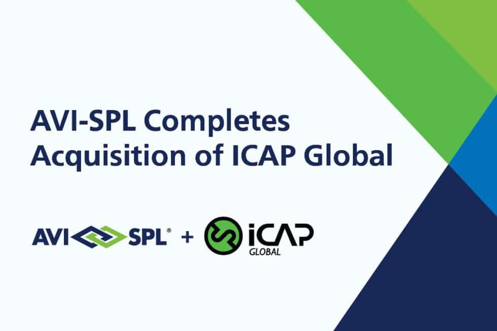

## Table of Contents

## What is ICAP and what services do they provide?

ICAP, which stands for International Center for AIDS Care and Treatment Programs, is an organization that works to improve the health of people around the world. They focus a lot on helping with HIV and AIDS, but they also work on other health issues like tuberculosis, malaria, and non-communicable diseases.

ICAP provides many services to help people stay healthy. They offer medical care, testing, and treatment for diseases. They also help train health workers and support health systems so they can better serve their communities. ICAP works in many countries and partners with local groups to make sure their programs meet the needs of the people they serve.

## How did ICAP start and what is its history?

ICAP started in 2003 at Columbia University in New York. It was created to help fight HIV and AIDS around the world. At first, ICAP focused on giving care and treatment to people with HIV in Africa. They worked hard to help people get the medicine they needed and to train doctors and nurses to take care of them.

Over time, ICAP grew and started working on other health problems too. They began helping with tuberculosis, malaria, and other diseases. ICAP also started working in more countries and helping more people. Today, ICAP is known for its work in improving health systems and training health workers all over the world. They still focus a lot on HIV and AIDS, but they do a lot more to help keep people healthy.

## In which countries does ICAP operate?

ICAP works in many countries around the world. They started in Africa and now they help people in countries like Ethiopia, Kenya, Mozambique, and South Africa. These are some of the places where they first began helping with HIV and AIDS.

Over time, ICAP grew and started working in more places. They now help in countries in Asia like India and China, and in countries in Latin America and the Caribbean like Brazil and Haiti. They also work in some countries in Eastern Europe and Central Asia, like Ukraine and Kyrgyzstan.

ICAP keeps growing and helping more people in different parts of the world. They always try to work with local groups to make sure their help is what people need.

## What are the main sectors ICAP focuses on?

ICAP focuses on a few main sectors to help people stay healthy. One big sector is HIV and AIDS. They work hard to give people medicine, testing, and care for these diseases. They also help train doctors and nurses so they can take care of people with HIV and AIDS better.

Another sector ICAP works in is other diseases like tuberculosis and malaria. They help people get the right treatment and care for these diseases too. ICAP also works on non-communicable diseases, which are diseases that you can't catch from someone else, like heart disease and diabetes.

ICAP also focuses on improving health systems. They help make health services better so more people can get the care they need. They work with local groups to make sure their help fits what people need in different places.

## How does ICAP ensure the quality of its services?

ICAP makes sure its services are good by working closely with local groups and health workers. They listen to what people in the communities need and try to help in the best way. They also keep checking their work to see if it's working well. If something isn't working, they change it to make it better. This way, they can give the best care possible to people.

They also train health workers a lot. ICAP teaches doctors, nurses, and other health workers how to give good care. They make sure these workers know the latest ways to help people with diseases like HIV and AIDS, tuberculosis, and others. By training health workers well, ICAP helps make sure that the care people get is good and safe.

## What are some notable projects or clients ICAP has worked with?

ICAP has worked on many important projects to help people stay healthy. One big project is in Ethiopia, where they help with HIV care and treatment. They work with the Ethiopian government and local groups to make sure people with HIV get the medicine and care they need. Another project is in Mozambique, where ICAP helps train health workers to fight diseases like HIV and tuberculosis. They teach doctors and nurses how to give good care and make sure people get the right treatment.

ICAP also works with many important clients around the world. They partner with the U.S. President's Emergency Plan for AIDS Relief (PEPFAR) to help fight HIV and AIDS. PEPFAR is a big program that gives money and support to countries to help with these diseases. ICAP also works with the Global Fund, which helps countries fight diseases like AIDS, tuberculosis, and malaria. By working with these big groups, ICAP can help more people and make a bigger difference.

In addition, ICAP has projects in many other places. In Kenya, they help with a program to stop the spread of HIV from mothers to their babies. This is very important because it helps keep babies healthy. In South Africa, ICAP works on projects to make health systems better so more people can get the care they need. All these projects and clients show how ICAP works hard to help people stay healthy all over the world.

## What is ICAP's approach to sustainability and corporate social responsibility?

ICAP cares a lot about making sure their work lasts a long time and helps the communities they work in. They do this by working closely with local groups and governments. ICAP makes sure that the health programs they start can keep going even after they leave. They train local health workers well so they can take care of their own people. They also help build strong health systems so communities can keep getting good care.

ICAP also thinks about the bigger picture and tries to help the whole community, not just with health. They work on projects that can help with things like jobs and education. By doing this, they help make the community stronger and better off. ICAP believes that by helping in these ways, they can make a real difference that lasts for a long time.

## How does ICAP integrate technology in its service delivery?

ICAP uses technology to make their work better and help more people. They use computers and phones to keep track of who needs medicine and when they should get it. This helps make sure that people with diseases like HIV and tuberculosis get their treatment on time. ICAP also uses special computer programs to collect information about how many people are sick and what kind of help they need. This information helps them plan better and make sure their programs are working well.

They also use technology to teach health workers. ICAP makes online classes and videos to show doctors and nurses the best ways to take care of people. This means that even if someone is far away, they can still learn how to help their patients. By using technology like this, ICAP can reach more people and make sure that the care they give is good and safe.

## What are the career opportunities and professional development programs at ICAP?

ICAP offers many different kinds of jobs for people who want to help others stay healthy. You can work as a doctor, nurse, or health worker to give care to people with diseases like HIV and tuberculosis. They also need people to help with planning and running their programs, so jobs like project managers and data analysts are important too. ICAP works all over the world, so you might get to travel and work in different countries. They care about their workers and try to make sure everyone has a good job and feels valued.

ICAP also helps their workers learn and grow in their jobs. They have special programs to teach new skills and help people get better at what they do. These programs can be online classes or in-person training sessions. ICAP wants their workers to keep learning and improving so they can give the best care to people. They also help people move up in their careers by giving them chances to take on new roles and responsibilities. This way, working at ICAP can be a good place to build a strong career in helping others.

## How does ICAP handle data security and privacy for its clients?

ICAP takes data security and privacy very seriously. They know that the information they collect about people's health is very important and private. So, they use strong computer systems to keep this information safe. They make sure that only the right people can see the data, and they use special codes to protect it from hackers. ICAP also follows the rules and laws about keeping data private in the countries where they work.

They also train their workers to handle data carefully. ICAP teaches everyone who works with them how to keep information private and secure. They have rules that everyone must follow to make sure no one's information gets shared without permission. By doing all these things, ICAP makes sure that the people they help can trust them to keep their health information safe and private.

## What are the competitive advantages of ICAP over other global professional services providers?

ICAP has a few big advantages that help them stand out from other global professional services providers. One big advantage is that they work closely with local groups and governments. This means they really understand what people in different places need and can make their programs fit those needs. ICAP also trains a lot of health workers, so they help build strong health systems that can keep working even after ICAP leaves. This makes their work last longer and helps more people over time.

Another advantage is that ICAP uses technology well to help with their work. They use computers and phones to keep track of who needs medicine and when, which helps make sure people get their treatment on time. They also use technology to teach health workers, so even people far away can learn how to help their patients. By using technology like this, ICAP can reach more people and make sure the care they give is good and safe.

## What future trends does ICAP anticipate in the professional services industry and how is it preparing for them?

ICAP sees that the future of the professional services industry will have a lot of new technology and more focus on working together. They think that using computers, phones, and other new tools will be really important. These tools can help keep track of who needs medicine and when, and they can also help teach health workers from far away. ICAP also believes that working closely with local groups and governments will be even more important. This way, they can make sure their programs fit what people need in different places.

To get ready for these changes, ICAP is already using a lot of technology in their work. They use special computer programs to keep track of health information and make sure people get the care they need on time. They also make online classes and videos to teach health workers new skills. ICAP is also working hard to build strong relationships with local groups and governments. By doing this, they can make sure their programs keep working well and help more people in the future.

## References & Further Reading

[1]: ["Brokers, Interdealer"](https://en.wikipedia.org/wiki/Inter-dealer_broker) New York Times

[2]: Lopez de Prado, M. (2018). ["Advances in Financial Machine Learning."](https://www.amazon.com/Advances-Financial-Machine-Learning-Marcos/dp/1119482089) Wiley.

[3]: Johnson, B. (2010). ["Algorithmic Trading & DMA: An introduction to direct access trading strategies."](https://archive.org/details/algorithmictradi0000john) 4Myeloma Press.

[4]: Pardo, R. (2008). ["The Evaluation and Optimization of Trading Strategies."](https://onlinelibrary.wiley.com/doi/book/10.1002/9781119196969) Wiley Trading.

[5]: ["ICAP to Sell Global Broking Unit to Rival Tullett Prebon"](https://www.fia.org/marketvoice/articles/icap-exits-voice-brokerage-through-deal-tullett-prebon) Reuters.