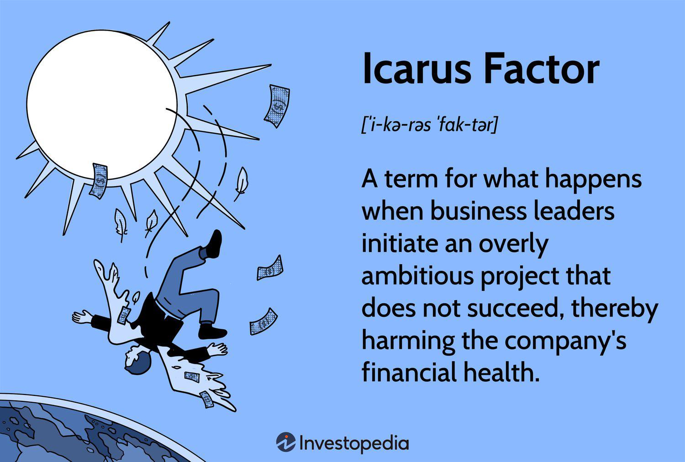

In the convergence of literature, psychology, and algorithmic trading, the Icarus Factor serves as a poignant metaphor for ambition and its risks. The term, derived from the Greek myth of Icarus, symbolizes the dangers of overambition and hubris. In the myth, Icarus, despite warnings, flew too close to the sun, causing his wings to melt and leading to his fall. This narrative resonates strongly in modern business ventures, where unchecked ambition can similarly lead to downfall.

Algorithmic trading, which leverages mathematical models and algorithms to execute trades at high speed, embodies a field where the Icarus Factor is particularly relevant. Themes from the Icarus myth are applicable as traders and developers often push the limits of their strategies, sometimes without adequate risk assessment. This overconfidence can lead to significant financial loss, akin to Icarus' fateful descent.



Psychological biases play a crucial role in decision-making processes within trading environments. Traders, influenced by cognitive biases such as overconfidence and loss aversion, may embed these very biases into the algorithms they design. This biased perspective can lead to flawed strategies, as the algorithms may overestimate potential gains while underestimating associated risks. Consequently, understanding how these biases manifest is essential for developing sound trading strategies that avoid unnecessary pitfalls.

The study of the Icarus Factor in the context of algorithmic trading not only highlights the metaphorical parallels but also underscores the importance of balancing ambition with prudence. By examining the integration of literary themes and psychological insights in trading, traders can gain a better understanding of their strategies and potentially avoid the traps set by excessive ambition. For those involved in algorithmic trading, acknowledging and mitigating these risks is crucial to achieving sustainable success in the financial markets.

## Table of Contents

## The Icarus Factor: A Literary Exploration

Derived from Greek mythology, the story of Icarus serves as a poignant cautionary tale about overambition and the consequences of ignoring wise counsel. In the myth, Icarus, the son of Daedalus, attempts to escape Crete using wings fashioned from feathers and wax. Despite warnings from his father not to fly too close to the sun, Icarus's overambitious nature compels him to soar higher, resulting in the wax wings melting and his eventual downfall into the sea. This narrative epitomizes the perils of unchecked ambition and has become a powerful metaphor for scenarios where excessive aspirations lead to failure.

In a business context, the 'Icarus Factor' has emerged as a term to describe the tendency of leaders to embark on overly ambitious projects without conducting adequate risk assessments. Such endeavors, often driven by hubris or a desire for rapid expansion, can lead to critical oversights in planning and execution. This hubris—a dangerous blend of pride and overconfidence—can blind leaders to potential pitfalls, echoing Icarus's tragic oversight of his mortal limitations. 

Literature routinely explores themes of hubris and the limitations of human endeavor, offering insights that translate into real-world business scenarios. Works like Mary Shelley's "Frankenstein" reflect this narrative by highlighting the catastrophic outcomes of unchecked ambition and the neglect of ethical considerations in scientific advancements. Similarly, Herman Melville's "Moby Dick" portrays Captain Ahab’s obsessive pursuit of a singular goal, ultimately leading to his demise. These stories underscore the importance of balancing ambition with prudence and foresight, a lesson that resonates with modern business practices.

In the business world, the Icarus Factor is particularly relevant in strategic decision-making, where ambitious projects can result in significant financial and reputational losses if not tempered with comprehensive risk assessments. Examples of such failures can be seen in myriad industries, where companies have suffered after ignoring market realities or overextending resources. Thus, the Icarus Factor serves as a compelling reminder of the need to balance visionary ambitions with realistic appraisals of potential risks and limitations.

## Psychological Perspectives on Ambition and Risk

Ambition, a fundamental driving force behind progress and innovation, can also obscure the vision of decision-makers to the inherent risks and potential pitfalls that accompany their ventures. In the financial world, particularly [algorithmic trading](/wiki/algorithmic-trading), understanding the psychological implications of ambition is crucial to mitigating risk and enhancing decision-making processes.

The concept of loss aversion, a key principle within behavioral economics, elucidates the tendency of individuals to prefer avoiding losses over acquiring equivalent gains. Formally, this is captured in the value function of Prospect Theory, which is generally steeper for losses than for gains. This asymmetrical perception can profoundly influence trading decisions, as the fear of incurring losses can lead to overly conservative strategies or, conversely, aggressive attempts to quickly recover losses, also known as "loss chasing."

Another significant bias is overconfidence, which manifests when traders overestimate their knowledge, undervalue risks, or underappreciate the limitations of their strategies. Overconfidence can lead to excessive trading, underestimation of variance, and neglect of potential downside risks. In mathematical terms, overconfidence can be modeled by the miscalibration of probability distributions—where actual outcomes fall outside the expected confidence intervals more frequently than predicted.

In the context of algorithmic trading, these biases are not eliminated but can be compounded during the algorithm design phase. Designers may inadvertently embed their biases into the algorithms, particularly during model training and parameter optimization. For example, overfitting—optimizing a model too closely to historical data—often results from the overconfidence in the model's ability to generalize to unseen data. Presenting a false sense of security, such misplaced confidence can lead to severe financial losses when market conditions deviate from past patterns.

To address these biases, algorithmic trading systems can incorporate rigorous [backtesting](/wiki/backtesting) and stress testing across various market conditions. Backtesting involves applying a trading model to historical data to verify its effectiveness, aiming to identify and rectify potential overfitting issues. Stress testing further evaluates an algorithm's robustness by simulating extreme market scenarios. By leveraging these strategies, traders can create more balanced algorithms capable of navigating real-world market dynamics.

Incorporating psychological insights into the design and execution of trading algorithms is pivotal. Recognizing and mitigating biases like loss aversion and overconfidence can significantly improve trading outcomes, allowing for more informed and prudent risk-taking, ultimately crafting algorithms that are not only ambitious but also resilient and adaptive.

## Algorithmic Trading: The Role of Human Bias

Algorithmic trading involves using computers to execute trading strategies based on predefined rules, often aiming to capitalize on market inefficiencies with speed unattainable by human traders. A key advantage of algorithmic trading is its potential to eliminate emotional biases from decision-making processes. However, human biases can still infiltrate these systems during the design and implementation phases, potentially compromising their effectiveness.

Over-optimisation, known as "curve-fitting," occurs when a trading algorithm is excessively tailored to historical data, capturing noise rather than genuine market patterns. This results in strategies that perform exceptionally well on historical data but fail under new market conditions. Over-optimisation can be identified and minimized by using out-of-sample testing and cross-validation techniques. For example, dividing historical data into training and test datasets can help ensure the algorithm generalizes well.

Overconfidence bias can significantly affect algorithm development as well. It refers to the tendency of developers to overestimate their understanding of market complexities and the predictive power of their strategies. This bias can lead to overly aggressive risk models and inadequate consideration of worst-case scenarios. To mitigate this, developers should employ Monte Carlo simulations to test algorithm performance under varied market conditions and assess robustness.

Rigorous backtesting is one of the primary strategies for countering biases in algorithmic trading. Backtesting involves testing a trading strategy on historical data to evaluate its performance. It should be conducted across different market conditions to ensure that the strategy is not just profitable in specific scenarios. Employing walk-forward analysis, where the strategy is periodically re-optimized using the latest data, can further enhance model robustness by adjusting to changing market dynamics.

Maintaining a diversified approach to algorithm development can also reduce the risk of bias. Diversification involves using multiple algorithms with varying strategies and asset classes, reducing dependence on a single model and spreading risk. This approach leverages the law of large numbers, enhancing the chances of achieving consistent returns.

In conclusion, while algorithmic trading offers significant advantages in removing emotional biases, it is not immune to human cognitive biases during the algorithm design process. Addressing these biases through methodological backtesting, cross-validation, and diversification strategies is essential for developing robust and effective trading algorithms.

## The Icarus Factor in Algorithmic Trading

Algorithmic trading, a strategy that uses complex algorithms and data analysis to decide trading actions, can result in significant gains but carries inherent risks, particularly when traders overestimate the effectiveness of a given strategy. This overestimation, embodying the Icarus Factor from Greek mythology, can lead traders to overlook essential risk warnings present in market dynamics and data variations.

One of the key steps in mitigating these risks is the rigorous application of market simulation and historical backtesting. These methodologies allow traders to test their algorithms against historical data to predict how they would perform in real-time scenarios. By doing so, potential vulnerabilities or flaws in the algorithm can be identified before any actual capital is at risk. For instance, backtesting enables traders to assess the effectiveness of a strategy over various market conditions, helping to distinguish between genuinely profitable strategies and those that might only appear successful in specific conditions.

Backtesting involves the compilation of historical market data and simulating how a trading algorithm would have performed. This process is critical because it provides a more realistic picture of a strategy's performance by exposing it to a wide array of market environments. However, improper backtesting can themselves lead to dangerous overestimations of an algorithm's potential profitability. This can occur due to issues like look-ahead bias, where decisions are made using data not available at the time of action, or overfitting, where a model is too closely tailored to historical data and underperforms in new, unseen data scenarios.

Here's a simple Python snippet to demonstrate backtesting:

```python
import pandas as pd
import numpy as np

# Assuming historical_prices is a pandas DataFrame with a 'price' column
def moving_average_strategy( prices, short_window=40, long_window=100):
    signals = pd.DataFrame(index=prices.index)
    signals['signal'] = 0.0

    # Short moving average
    signals['short_mavg'] = prices['price'].rolling(window=short_window, min_periods=1, center=False).mean()

    # Long moving average
    signals['long_mavg'] = prices['price'].rolling(window=long_window, min_periods=1, center=False).mean()

    # Generate buy signals
    signals['signal'][short_window:] = np.where(signals['short_mavg'][short_window:] > signals['long_mavg'][short_window:], 1.0, 0.0)

    # Create sell signals
    signals['positions'] = signals['signal'].diff()

    return signals

# Usage
historical_prices = pd.DataFrame({'price': [100, 102, 101, 105, 110, 108, 107, 111]})
signals = moving_average_strategy(historical_prices)

print(signals)
```

Beyond technical testing, traders must routinely calibrate their algorithms to adjust for new economic data, market shifts, and geopolitical events that continuously influence trading environments. This adaptability ensures that traders do not become over-reliant on past data, which may no longer provide accurate guidance.

Ultimately, embracing a diversified approach is prudent. Relying on multiple strategies and continuously adjusting them helps avoid the missteps associated with overestimating a single approach's efficacy. Traders must remember that unchecked ambition can lead to significant financial downfall, akin to Icarus' mythological descent. The key lies in balancing innovative ambition with meticulous risk management and humility in the face of unpredictable markets.

## Case Study: The Icarus Factor in Modern Business

The rise and fall of Kingfisher Airlines is a salient example of the Icarus Factor, where unchecked ambition and imprudent decision-making led to the company's downfall. Founded in 2003 by Vijay Mallya, Kingfisher Airlines quickly gained a reputation for luxurious service and rapid growth, attributing to its initial success. However, the company's trajectory shifted dramatically due to strategic errors that echo the cautionary themes of the Icarus myth.

Initially, Kingfisher's expansion strategy prioritized establishing a strong foothold in the competitive Indian aviation market. However, ambition soon overshadowed prudence, resulting in overexpansion into international routes without adequate market analysis or risk assessment. The company's aggressive acquisition of Air Deccan in 2007 marked a crucial turning point. Although intended to consolidate market presence, this acquisition strained Kingfisher's finances and diverted its focus from core operations.

Kingfisher's downfall also illustrates the consequences of failing to adapt to changing market conditions. As global oil prices surged and economic conditions fluctuated, Kingfisher continued to pursue its growth agenda without recalibrating its strategy. This approach, reminiscent of Icarus' disregard for warnings, led to unsustainable operational costs and mounting debts. Additionally, regulatory challenges and funding obstacles compounded the airline's struggles, culminating in operational suspension in 2012.

In trading, similar pitfalls occur when algorithms are overstretched beyond their intended market conditions. Algorithmic strategies that perform well under specific scenarios may falter when applied to new, untested environments. This is often due to inadequate risk management and an overestimation of the strategy's robustness, akin to Kingfisher's overzealous market expansion. The process of market simulation and historical backtesting serves as an essential countermeasure, providing traders with a realistic appraisal of strategy viability across diverse conditions.

Avoiding the pitfalls exemplified by Kingfisher Airlines requires a balance between ambition and cautious strategy execution. Traders can learn from such real-world case studies, ensuring algorithmic methodologies are adaptable to evolving market landscapes to prevent the Icarus Factor's dire consequences.

## Conclusion: Balancing Ambition and Prudence

Balancing ambition and prudence in trading is essential to navigating the challenges posed by the Icarus Factor. While ambition drives innovation, unchecked ambition can lead to reckless strategies that invite significant risk. Traders must develop an acute awareness of psychological biases that can impact decision-making, such as overconfidence and loss aversion.

Strategies to mitigate these biases include implementing systematic checks throughout the trading process. One effective approach is rigorous backtesting of algorithms, which allows traders to evaluate how strategies would have performed under various historical market conditions. This can highlight potential weaknesses and help prevent the overestimation of a strategy’s effectiveness. 

Additionally, maintaining a diversified portfolio of algorithms can reduce the risk associated with relying on a single trading strategy. Diversification acts as a buffer against market [volatility](/wiki/volatility-trading-strategies) and unforeseen scenarios that could lead to significant losses. 

Furthermore, traders can benefit from lessons in literature and psychology that emphasize the dangers of hubris and unchecked ambition. These subjects provide valuable insights into human behavior and can inform a more balanced approach to trading strategy development.

By integrating these strategies and insights, traders can create a more resilient trading framework that harnesses ambition constructively while remaining vigilant against the pitfalls of the Icarus Factor.

## References & Further Reading

[1]: Bergstra, J., Bardenet, R., Bengio, Y., & Kégl, B. (2011). ["Algorithms for Hyper-Parameter Optimization."](https://dl.acm.org/doi/10.5555/2986459.2986743) Advances in Neural Information Processing Systems 24.

[2]: ["Advances in Financial Machine Learning"](https://www.amazon.com/Advances-Financial-Machine-Learning-Marcos/dp/1119482089) by Marcos Lopez de Prado

[3]: ["Evidence-Based Technical Analysis: Applying the Scientific Method and Statistical Inference to Trading Signals"](https://www.amazon.com/Evidence-Based-Technical-Analysis-Scientific-Statistical/dp/0470008741) by David Aronson

[4]: ["Machine Learning for Algorithmic Trading"](https://github.com/stefan-jansen/machine-learning-for-trading) by Stefan Jansen

[5]: ["Quantitative Trading: How to Build Your Own Algorithmic Trading Business"](https://www.amazon.com/Quantitative-Trading-Build-Algorithmic-Business/dp/1119800064) by Ernest P. Chan