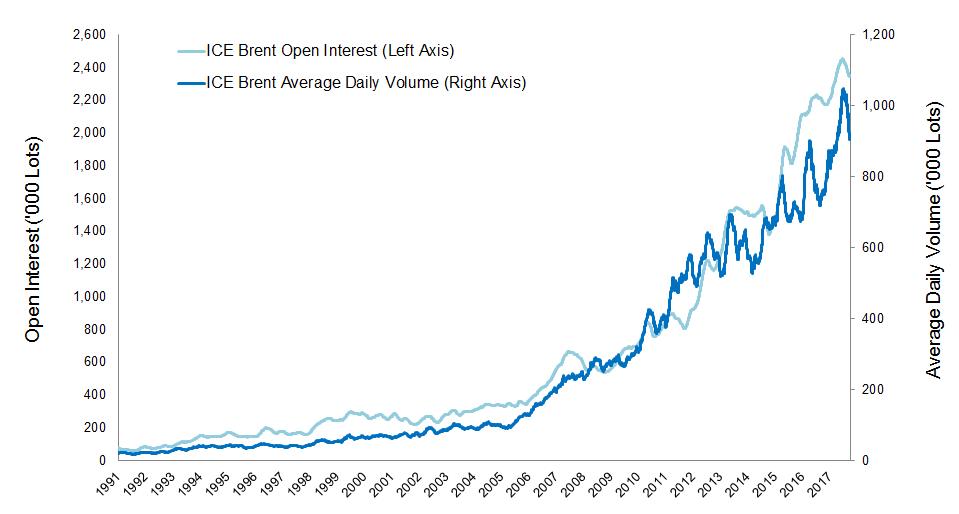

## Table of Contents

## What is ICE Brent Crude Oil?

ICE Brent Crude Oil is a type of oil that comes from the North Sea, near Europe. It is very important because it is used as a standard to set the price for other types of oil around the world. Traders and companies buy and sell this oil on a big market called the Intercontinental Exchange (ICE). This market helps people all over the world know how much oil costs.

Brent Crude is a mix of oil from different fields, like Brent, Forties, Oseberg, and Ekofisk. This mix makes it a good example of the oil that Europe uses. Because it is easy to move and sell, many people use Brent Crude as a way to guess what oil prices will be in the future. It helps everyone from big companies to small investors understand the oil market better.

## How is Brent Crude Oil different from other types of crude oil?

Brent Crude Oil is different from other types of crude oil mainly because of where it comes from and how it is used. It is a type of oil that is taken from the North Sea, near Europe. This makes it special because it is a mix of oil from different fields like Brent, Forties, Oseberg, and Ekofisk. This mix is called a benchmark, which means it is used as a standard to set prices for other oils around the world. Because it is easy to move and sell, many people use Brent Crude to help them understand and predict oil prices.

Another way Brent Crude is different is in its quality and use. It is a light and sweet [crude oil](/wiki/crude-oil), which means it has less sulfur and is easier to refine into products like gasoline and diesel. This makes it very popular in Europe and other places. Other types of crude oil, like West Texas Intermediate (WTI) from the United States or Dubai Crude from the Middle East, might have different qualities and be used in different ways. For example, WTI is also light and sweet but comes from a different place and might be used more in the Americas.

## What are the key characteristics of Brent Crude Oil?

Brent Crude Oil comes from the North Sea, near Europe. It is a special kind of oil because it is a mix from different places like Brent, Forties, Oseberg, and Ekofisk. This mix is called a benchmark, which means it helps set the price for other oils around the world. People all over the world use Brent Crude to understand and guess what oil prices will be in the future. It is easy to move and sell, which makes it very important in the oil market.

Brent Crude is also known for being light and sweet. This means it has less sulfur and is easier to turn into things like gasoline and diesel. Because of this, it is very popular in Europe and other places. Other oils, like West Texas Intermediate from the U.S. or Dubai Crude from the Middle East, might be different in quality and where they come from. But Brent Crude's special mix and easy-to-use nature make it a key player in the global oil market.

## Where is Brent Crude Oil extracted and traded?

Brent Crude Oil is extracted from the North Sea, which is near Europe. It comes from different places in the North Sea, like Brent, Forties, Oseberg, and Ekofisk. These places are all part of the mix that makes up Brent Crude.

Brent Crude is traded on a big market called the Intercontinental Exchange (ICE). This market is very important because it helps people all over the world know how much oil costs. Traders and companies buy and sell Brent Crude on this market, and it helps set the price for other types of oil around the world.

## How does the pricing of Brent Crude Oil work?

The pricing of Brent Crude Oil is based on what people are willing to pay for it on the Intercontinental Exchange (ICE). This market is like a big store where traders and companies from all over the world come to buy and sell oil. The price changes every day depending on how much people want to buy and how much oil is available. If more people want to buy Brent Crude than there is oil to sell, the price goes up. If there is more oil than people want to buy, the price goes down.

Brent Crude is very important because it is used as a benchmark. This means it helps set the price for other types of oil around the world. When the price of Brent Crude goes up or down, it can affect the price of other oils too. Many people watch the price of Brent Crude to understand what is happening in the oil market and to guess what prices might be in the future. This helps everyone from big companies to small investors make decisions about buying and selling oil.

## What are the major factors that influence Brent Crude Oil prices?

The price of Brent Crude Oil is influenced by many things. One big [factor](/wiki/factor-investing) is how much oil people want to buy compared to how much oil is available. If more people want to buy oil than there is oil to sell, the price goes up. This can happen because of things like growing economies that need more energy, or because of cold winters that make people use more oil for heating. On the other hand, if there is more oil than people want to buy, the price goes down. This can happen if new oil fields are found or if countries produce more oil than they did before.

Another important factor is what is happening in the world. If there are problems in countries that produce a lot of oil, like wars or strikes, it can make it harder to get oil, and the price goes up. Also, decisions made by groups like OPEC, which is a group of countries that work together to control oil prices, can affect the price of Brent Crude. If OPEC decides to produce less oil, the price can go up because there is less oil available. On the other hand, if they decide to produce more oil, the price can go down.

The value of money also plays a role in the price of Brent Crude Oil. If the U.S. dollar, which is the currency used to buy and sell oil, becomes weaker, it can make oil cheaper for people using other currencies. This can make more people want to buy oil, which can push the price up. On the other hand, if the U.S. dollar becomes stronger, it can make oil more expensive for people using other currencies, which can make fewer people want to buy oil, and the price can go down.

## How is the Brent Crude Oil futures contract structured on the ICE?

The Brent Crude Oil futures contract on the Intercontinental Exchange (ICE) is a deal to buy or sell a certain amount of oil at a set price on a future date. Each contract is for 1,000 barrels of oil. The price of the contract changes every day based on what people are willing to pay. These contracts are traded every day from Monday to Friday, except for holidays, and they are open for trading during certain hours.

The contracts are set up for different months in the future, which are called delivery months. The closest month to the current date is the most important because it gives the best idea of what oil prices will be soon. As time goes on, the contract for the next month becomes more important. This is called the rolling process. When the contract for a month ends, people have to either take the oil or pay the difference in price if they don't want the oil. This helps everyone know what oil prices might be in the future and helps them plan.

## What role does Brent Crude Oil play in the global oil market?

Brent Crude Oil is very important in the global oil market because it is used as a benchmark. This means it helps set the price for other types of oil around the world. When the price of Brent Crude goes up or down, it can affect the price of other oils too. Many people watch the price of Brent Crude to understand what is happening in the oil market and to guess what prices might be in the future. This helps everyone from big companies to small investors make decisions about buying and selling oil.

Brent Crude comes from the North Sea, near Europe, and it is a mix of oil from different places like Brent, Forties, Oseberg, and Ekofisk. Because it is easy to move and sell, it is very popular in Europe and other places. The price of Brent Crude is decided on a big market called the Intercontinental Exchange (ICE), where traders and companies from all over the world buy and sell oil. This market helps everyone know how much oil costs and helps set the price for oil everywhere.

## How can investors and traders access the Brent Crude Oil market?

Investors and traders can access the Brent Crude Oil market by buying and selling futures contracts on the Intercontinental Exchange (ICE). This is a big market where people from all over the world come to trade oil. To start trading, investors need to open an account with a broker who is allowed to trade on the ICE. They can then buy or sell contracts for Brent Crude Oil, which are agreements to buy or sell a certain amount of oil at a set price on a future date. Each contract is for 1,000 barrels of oil, and the price changes every day based on what people are willing to pay.

Another way to access the Brent Crude Oil market is through Exchange-Traded Funds (ETFs) and other financial products that are based on the price of Brent Crude. These products allow investors to bet on the price of oil without having to trade futures contracts directly. ETFs can be bought and sold like stocks on a stock exchange, making it easier for people to invest in oil. Some investors also use options, which are contracts that give them the right, but not the obligation, to buy or sell oil at a certain price. This can be a way to manage risk or make money if the price of oil changes in a certain way.

## What are the risks associated with trading Brent Crude Oil?

Trading Brent Crude Oil can be risky because the price of oil can change a lot. The price can go up or down because of things like how much oil people want to buy, how much oil is available, or problems in countries that produce oil. If the price goes down after you buy oil, you could lose money. This is called market risk. Also, trading oil futures means you might have to put up money to cover losses if the price goes against you. This is called margin risk.

Another risk is what is called geopolitical risk. This means that if there are wars or strikes in oil-producing countries, it can make it harder to get oil, and the price can go up quickly. This can be hard to predict and can cause big changes in the price of oil. Also, trading oil can be complex, and if you don't understand how it works, you could make mistakes. This is called operational risk. It's important to know these risks before you start trading Brent Crude Oil.

## How have historical events impacted the price of Brent Crude Oil?

Historical events have had a big impact on the price of Brent Crude Oil. For example, in 1973, there was an oil crisis when some countries in the Middle East stopped sending oil to the United States and other places because of a war. This made the price of oil go up a lot because there was less oil available. Another time was in 1990 when Iraq invaded Kuwait. This caused a big problem because both countries produce a lot of oil, and it made the price of oil go up again. These events show how wars and problems in oil-producing countries can make the price of oil change a lot.

Also, big economic changes can affect the price of Brent Crude Oil. In 2008, there was a global financial crisis, and the price of oil went down a lot because fewer people were buying things, so they didn't need as much oil. On the other hand, when economies grow and more people need oil, like in the early 2000s, the price can go up. In 2020, the price of oil even went negative for a short time because of the COVID-19 pandemic. This was because many people were not traveling, so they didn't need as much oil, and there was too much oil that no one wanted to buy. These examples show how the price of oil can be affected by what is happening in the world's economy.

## What are the future trends and predictions for Brent Crude Oil?

The future of Brent Crude Oil prices depends on many things. One big thing is how the world's economy grows. If more countries start to use more oil because their economies are growing, the price of Brent Crude might go up. Another thing is what happens with new technology. If people find new ways to get oil or if they start using less oil because of things like electric cars, the price could go down. Also, what countries that produce a lot of oil, like those in OPEC, decide to do can affect the price. If they decide to produce less oil, the price might go up because there is less oil to buy.

Another important thing to think about is what is happening with the environment. More and more people are worried about climate change and want to use less oil. This could mean that in the future, people might use less oil, and the price of Brent Crude could go down. But, it's hard to predict exactly what will happen because so many things can change. For example, if there are new wars or problems in oil-producing countries, the price could go up quickly. So, while we can guess what might happen, the future of Brent Crude Oil prices is not easy to know for sure.

## References & Further Reading

[1]: Official Intercontinental Exchange (ICE) website. Available at: [www.theice.com](https://www.ice.com/index)

[2]: Chan, E. P. (2009). ["Algorithmic Trading: Winning Strategies and Their Rationale."](https://github.com/ftvision/quant_trading_echan_book) Wiley.

[3]: Zhang, F. (2010). ["High-Frequency Trading and Its Impact on Markets."](https://papers.ssrn.com/sol3/papers.cfm?abstract_id=1691679) Financial Management.

[4]: Python `pandas` documentation. Available at: [https://pandas.pydata.org](https://pandas.pydata.org/pandas-docs/stable/)

[5]: U.S. Energy Information Administration (EIA). Available at: [www.eia.gov](https://www.eia.gov/)

[6]: Jansen, S. (2020). ["Machine Learning for Algorithmic Trading."](https://github.com/stefan-jansen/machine-learning-for-trading) Packt.