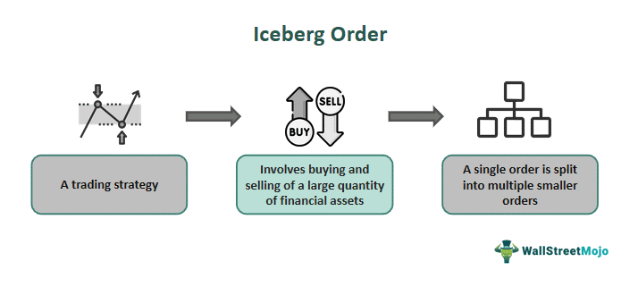

In algorithmic trading, understanding different order types can provide strategic advantages for traders seeking to optimize their strategies and execution quality. Among these order types, iceberg orders stand out as a hidden form, enabling traders to execute large trades discreetly without causing significant market disruption. Institutional investors often use iceberg orders to maintain discretion and minimize the market impact of their transactions.

This article focuses on the mechanics of iceberg orders, the methods traders use to identify them, and the various strategies employed in algorithmic trading to leverage their unique properties. Iceberg orders are executed by breaking down large orders into smaller visible parts that are incrementally released to the market, much like only the tip of an iceberg is visible above water. This method aims to keep the full order size concealed, reducing the price impact and enabling traders to complete large trades at favorable prices over time.



We will explore techniques such as order book data analysis, which is instrumental in detecting the presence of iceberg orders and plays a crucial role in enabling traders to adjust their strategies accordingly. Additionally, understanding the strategic benefits of iceberg orders, such as reducing market impact and achieving execution anonymity, will be covered alongside potential risks. These include the possibility of detection by others in the market, which could lead competitors to modify their strategies in response.

By the article's conclusion, readers will gain a comprehensive understanding of iceberg orders, including how they function and how they might be integrated into trading strategies. This knowledge equips traders to navigate complex market environments more effectively and to capitalize on opportunities in algorithmic trading.

## Table of Contents

## Understanding Iceberg Orders

Iceberg orders are a sophisticated type of limit order specifically designed to manage the complexities of executing large trades in financial markets. The primary characteristic of an iceberg order is its ability to divide a large order into smaller, more manageable blocks. This segmentation conceals the full size of the order from the market, thereby minimizing the potential for sudden price fluctuations that could be triggered by the visibility of a substantial order.

Institutional investors, such as hedge funds and mutual funds, predominantly use iceberg orders. Their primary goal is to execute large trades with minimal market disruption. By releasing only a small portion of their total order at any given time, these investors can prevent other market participants from becoming aware of the order's full size, which could lead to unfavorable market movements if the complete order were visible.

The term 'iceberg' is a metaphor for the order's structural design — much like an iceberg, where only a fraction is visible above the waterline, while the bulk remains hidden beneath the surface. This design enables traders to maintain a significant degree of anonymity, as the market only detects the visible tip of the order, leaving the majority concealed.

The strategic objective of iceberg orders is to moderate price movements by keeping the larger part of the order concealed from the market. This approach allows the trade to be executed gradually, reducing the likelihood of triggering a significant market reaction and maintaining price stability. In practice, iceberg orders are particularly advantageous in volatile or less liquid markets, where the presence of a large order might otherwise provoke abrupt price shifts or slippage.

Iceberg orders are configured with a specified visible quantity, also known as the display quantity. This allows traders to strategically manage the market's perception of buying or selling pressure. Once the visible part of the order is executed, another portion of the hidden order is released automatically, continuing the execution process without altering the overall market visibility.

The mechanics behind iceberg orders offer significant advantages in terms of execution control and market impact minimization, making them an invaluable tool for institutional trading strategies.

## Mechanics and Operation of Iceberg Orders

Iceberg orders are strategic market tools designed to manage the exposure of large trades by revealing only a fragment of the full order size at any given time. This concealment is achieved by dividing the full order into smaller visible segments, which are executed sequentially. As one segment (or "peak") is filled, the next segment is automatically placed into the market while the remainder of the order remains hidden from other participants.

The fundamental operation of an iceberg order is built on setting a "display quantity," that is, the portion of the total order visible on the [order book](/wiki/order-book-trading-strategies). For example, a trader wishing to sell 10,000 shares could configure the iceberg order to display only 500 shares at a time. Once the visible portion is executed, another 500 shares become visible, continuing this process until the entire order is completed. 

This approach facilitates the execution of large trades at a favorable average price over time, without alerting the market to the true size of the order. By obfuscating the order's real [volume](/wiki/volume-trading-strategy), it aims to prevent significant market movements that might be triggered by the perception of a large buy or sell interest. As market conditions fluctuate, traders might adjust the visible quantity to optimize the flow of the order, which is particularly useful in markets with varying [liquidity](/wiki/liquidity-risk-premium).

Configuration flexibility is a key advantage; traders can tailor the visible size of their iceberg orders according to specific market conditions or estimated liquidity levels. This customization allows them to mitigate the risks associated with large transactions, such as price slippage or signal distortion.

Iceberg orders are most efficient in markets where liquidity is variable or when price impact of large trades is a concern. By controlling the visible portion of their orders, traders can maintain anonymity and reduce the likelihood of their trades being detected and acted upon by other market participants, ensuring that their strategic objectives are met while minimizing adverse price movements.

## Identifying Iceberg Orders in Trading

Identifying iceberg orders in trading requires a meticulous examination of market data to detect patterns indicative of their presence. Iceberg orders, by nature, display only a small fraction of their full size, making their detection subtle but crucial for traders aiming to understand and leverage underlying market dynamics.

One of the primary techniques employed is order flow analysis. This involves scrutinizing the sequence of buy and sell orders to identify repetitions that might suggest hidden orders. For instance, if a specific price level repeatedly receives similarly sized small orders from the same market participant, this may indicate an iceberg order, as portions of a larger order are gradually executed without revealing the total order size. 

Level 2 data, or market depth data, provides comprehensive information on bids and asks at various price levels beyond the best available prices. Examining Level 2 data allows traders to spot suspicious activities such as oscillations in visible quantities at a particular price point, a common clue for the presence of iceberg orders. The visible portion frequently replenishing with new small orders after execution is a hallmark of these hidden strategies. 

VWAP (Volume Weighted Average Price) slippage analysis is another method to detect iceberg orders. By comparing the execution price of an order to the VWAP, traders can evaluate whether repeated small orders diverge significantly from the average price, suggesting strategic placement of an iceberg order to maintain price stability and conceal trading intentions.

Analyzing these data points involves not just observing raw figures but also identifying deviations from normal market behavior that suggest hidden orders. Traders who can recognize these patterns can adjust their strategies accordingly, potentially exploiting the pressure exerted by underlying iceberg orders on the market. For example, if an iceberg order is sustaining a price level, traders might use this information to anticipate potential price movements once the order is fully executed.

Here is a simple Python script that demonstrates how one might begin to analyze trading data for iceberg orders using order flow analysis:

```python
def detect_iceberg_orders(order_book):
    iceberg_indicators = []
    threshold = 10  # Set a threshold for repeated small orders

    for price_level in order_book:
        # Count small orders at each price level
        small_orders = [order for order in order_book[price_level] if order['size'] < threshold]
        if len(small_orders) >= 3:  # Check for multiple small orders
            iceberg_indicators.append(price_level)
    return iceberg_indicators

# Example order book data
order_book = {
    '100.5': [{'size': 5, 'source': 'A'}, {'size': 5, 'source': 'A'}, {'size': 5, 'source': 'A'}],
    '101.0': [{'size': 10, 'source': 'B'}]
}

icebergs = detect_iceberg_orders(order_book)
print("Potential iceberg order at price levels:", icebergs)
```

This example script sets a threshold based on order size and examines the order book for repeated small orders at each price level. If found, these patterns could signal potential iceberg orders, which traders can then monitor for strategic opportunities.

## Strategic Advantages and Risks

Iceberg orders are an essential tool for traders looking to minimize the market impact of executing large trades. By revealing only a portion of the total order size at any given time, these orders allow traders to maintain anonymity and avoid signaling their true trading intentions to the market. This anonymity is crucial for reducing the likelihood of adverse price movements caused by other market participants reacting to large visible orders.

Enhancing execution quality is a significant advantage of iceberg orders. By breaking a large order into smaller blocks, executed gradually, traders can achieve better price control. This method prevents sudden spikes or dips in the asset price, which might occur if a large order were placed all at once. This staggered execution helps in maintaining a stable market environment and potentially securing more favorable prices throughout the transaction.

Despite their strategic benefits, iceberg orders [carry](/wiki/carry-trading) the inherent risk of detection. Sophisticated market participants employ advanced analytical techniques to identify patterns consistent with iceberg orders. For instance, they might analyze repeated patterns of small, identically sized trades emanating from the same source. If detected, these hidden orders might lose their edge, as other traders could adjust their strategies to exploit this information. To mitigate the risk of detection, traders can further obfuscate their trading patterns or adjust the parameters of their iceberg orders, such as the size and timing of the visible portions, to remain unpredictable. 

Balancing these advantages and risks is crucial for traders who wish to leverage iceberg orders effectively. By doing so, they can execute large trades more discreetly and efficiently, while reducing the chances of their strategies being exposed and counteracted by other market players.

## Implementing Iceberg Orders in Algorithmic Trading

In [algorithmic trading](/wiki/algorithmic-trading), the implementation of iceberg orders serves as a crucial method for managing market exposure and reducing trading costs. The key to effectively using iceberg orders in an algorithmic context lies in the ability to tailor both the size of the order and its timing in response to prevailing market conditions. By breaking a large order into smaller, strategically-timed segments, traders can mitigate the risk of market impact and preserve execution quality.

Dynamic pricing, an advanced strategy employed with iceberg orders, adjusts the price levels at which parts of the order are exposed in response to real-time market data. This technique allows the algorithm to dynamically respond to fluctuations, ensuring that the trade is executed at optimal price points as market conditions change. For instance, an algorithm might adjust the visible portion of an iceberg order according to the price [volatility](/wiki/volatility-trading-strategies) or liquidity levels detected in the order book.

Python, widely used in algo trading, offers numerous tools and libraries for implementing dynamic pricing strategies. A simple example of dynamic pricing adjustment in Python might involve using a moving average to decide when to reveal additional portions of an iceberg order:

```python
import numpy as np

def dynamic_pricing(current_price, market_data, threshold=0.05):
    moving_average = np.mean(market_data[-20:])
    if abs(current_price - moving_average) > threshold:
        return True  # Signal to expose more of the order
    return False  # Hold current exposure level
```

Another sophisticated strategy, trailing triggers, involves setting conditional points at which additional portions of the iceberg order become visible. These triggers are based on certain pre-defined conditions such as price movements or time delays. Trailing triggers help ensure the algorithm adapts not only to immediate market data but also to broader price trends, allowing for a more strategic trade execution across volatile sessions.

Traders must possess deep insights into market liquidity and prevalent conditions to optimize the use of iceberg orders. A comprehensive analysis of liquidity helps in determining appropriate order size for the visible portion and timing for successive reveals. This prevents the risk of orders not being fully filled or incurring higher transaction costs due to sudden liquidity changes. Moreover, understanding the risk of detection by other market participants remains critical, as excessive exposure of visible segments could alert others to the hidden order, thereby jeopardizing execution quality. When set up expertly, iceberg orders contribute significantly to executing large trades with minimal disruption, enabling traders to maintain strategic anonymity and achieve favorable terms in fast-paced marketplaces.

## Conclusion

Iceberg orders serve as a sophisticated tool for traders aiming to execute large transactions without significantly impacting market prices. They achieve this by concealing the majority of the order, showing only a small portion at any given time. This method minimizes the visibility of the order's full size, potentially reducing market volatility and maintaining price stability. By employing iceberg orders effectively, traders can manage sizable trades efficiently, avoiding the typical pitfalls associated with large orders that might otherwise lead to adverse price movements.

The strategic use of iceberg orders provides opportunities for improved trading outcomes. When market participants are unable to fully perceive the size of an order, it becomes challenging for them to adjust their trading behaviors in ways that could disrupt the market or result in unfavorable price changes. As a result, traders utilizing iceberg orders can ensure a more controlled and gradual execution of trades, preserving market stability in the process.

Mastery of iceberg order techniques can lead to enhanced algorithmic trading strategies. In complex market environments, where liquidity fluctuates rapidly, and price movements can be unpredictable, the ability to execute large trades smoothly without revealing intentions offers a crucial advantage. By combining this knowledge with algorithmic approaches, traders can develop robust strategies tailored to navigate dynamic markets efficiently.

To conclude, iceberg orders offer significant benefits by mitigating the impact of large trades on market dynamics. Proper identification and execution can facilitate superior trading results while contributing positively to overall market stability. Traders who invest time and resources into honing their skills in deploying iceberg orders can confidently engage with intricate market landscapes, maximizing their potential for successful outcomes.

## Frequently Asked Questions

### What are iceberg orders and how do they differ from traditional limit orders?

Iceberg orders are a sophisticated type of limit order used in financial markets. Unlike traditional limit orders, which expose the entire volume of the order to the market, iceberg orders reveal only a small portion of the total order size. The remainder of the order stays hidden and is gradually displayed as each visible portion is filled. This mechanism allows traders to execute large trades without significantly impacting market prices or alerting other market participants to large pending transactions. The name "iceberg" derives from the analogy to an iceberg structure, where the bulk of its mass is beneath the surface.

### How can advanced traders detect iceberg orders in real-time?

Advanced traders detect iceberg orders in real-time through the analysis of order book data and trading patterns. Key methods include:

1. **Order Flow Analysis**: By monitoring the sequence and frequency of trades, traders can identify repeated small orders from the same source, suggesting the presence of an iceberg order.

2. **Level 2 Market Data**: Analyzing the depth of the market allows traders to observe changes in bid and ask orders, looking for repeated replenishment of similar-sized orders, which might indicate an iceberg order.

3. **VWAP Slippage Analysis**: Discrepancies between the volume-weighted average price (VWAP) and current market prices might hint at hidden liquidity being executed, signaling potential iceberg activity.

### What are the primary risks associated with using iceberg orders, and how can they be mitigated?

One of the primary risks of using iceberg orders is the potential for other market participants to detect the presence of these hidden orders. If competitors identify an iceberg order, they might alter their trading strategies to capitalize on this information, potentially diminishing the order’s strategic advantage. 

To mitigate these risks, traders can:

- **Vary the visible portion size**: By altering the size of the visible block of the order periodically, traders can make the order patterns less predictable.

- **Employ Algorithm Complexity**: Use more sophisticated algorithms that incorporate randomization or adaptive strategies to obscure the order's characteristics.

### How do trailing triggers and dynamic pricing enhance the execution of iceberg orders in volatile markets?

Trailing triggers and dynamic pricing are advanced features that optimize iceberg order execution in volatile market conditions:

- **Trailing Triggers**: These adjust the execution parameters of the order as the market price moves. For example, an iceberg order could be set to reveal a larger portion if the price moves favorably or a smaller portion if it moves unfavorably. This keeps the execution aligned with market conditions.

  ```python
  def apply_trailing_stop(price, trail):
      stop_price = price - trail
      return stop_price
  ```

- **Dynamic Pricing**: Involves adjusting the limit price of the iceberg order automatically in response to market conditions. If a trader expects increased volatility, they might allow the order to chase the price within a specified range, thus achieving a better execution price than originally set.

By employing these strategies, traders can increase the likelihood of filling their orders at favorable prices without significant market impact, even in fluctuating market environments.

## References & Further Reading

[1]: Harris, L. (2003). ["Trading & Exchanges: Market Microstructure for Practitioners"](https://www.amazon.com/Trading-Exchanges-Market-Microstructure-Practitioners/dp/0195144708). Oxford University Press.

[2]: Easley, D., López de Prado, M. M., & O'Hara, M. (2012). ["Flow Toxicity and Liquidity in a High-Frequency World."](https://www.semanticscholar.org/paper/Flow-Toxicity-and-Liquidity-in-a-High-Frequency-Easley-Prado/9369430bd005d194f9332ae7cbd5a57ace5e9ab3) Financial Analysts Journal, 68(3), 23-34.

[3]: O'Hara, M. (2015). ["High-Frequency Market Microstructure"](https://www.sciencedirect.com/science/article/pii/S0304405X15000045). The Review of Financial Studies, 28(6), 1491-1516.

[4]: Aldridge, I. (2013). ["High-Frequency Trading: A Practical Guide to Algorithmic Strategies and Trading Systems"](https://www.amazon.com/High-Frequency-Trading-Practical-Algorithmic-Strategies/dp/1118343506). Wiley.

[5]: Hasbrouck, J. (2007). ["Empirical Market Microstructure: The Institutions, Economics, and Econometrics of Securities Trading"](https://academic.oup.com/book/52241). Oxford University Press.

[6]: Gomber, P., Arndt, B., Lutat, M., & Uhle, T. (2011). ["High-Frequency Trading"](https://papers.ssrn.com/sol3/papers.cfm?abstract_id=1858626). Business & Information Systems Engineering, 3(2), 71-79.