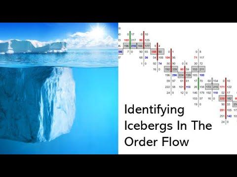

## Table of Contents

## What is an iceberg order?

An iceberg order is a type of large order in trading that is split into smaller parts. Traders use it to buy or sell a big amount of stocks without showing the full size of their order to others. Only a small part of the order, called the "peak," is visible to the market at one time. The rest of the order, which is much larger, stays hidden, like the part of an iceberg that is under water. This helps traders keep their strategies secret and avoid affecting the market price too much.

When someone places an iceberg order, the visible part gets filled first. Once that part is done, another small part of the order shows up automatically. This keeps happening until the whole order is filled. Iceberg orders are often used by big investors or institutions who want to trade large volumes without causing big price changes. By hiding the true size of their order, they can buy or sell without other traders knowing their full intentions.

## Why do traders use iceberg orders?

Traders use iceberg orders to keep their big trades secret. When someone wants to buy or sell a lot of stocks, showing the whole order at once can make the price go up or down a lot. By using an iceberg order, only a small part of the order shows up at a time. This way, other traders don't know the full size of the order, and the price doesn't change as much.

Iceberg orders help big investors and institutions trade large amounts without scaring the market. If everyone knew about a huge order, they might start buying or selling too, which could make the price move a lot. By hiding most of their order, these traders can slowly fill their order without other people knowing their full plan. This makes their trading smoother and less risky.

## How can you identify an iceberg order in a trading platform?

Spotting an iceberg order on a trading platform can be tricky, but there are some signs to look for. One way is to watch the [order book](/wiki/order-book-trading-strategies) closely. If you see the same small order size being filled over and over again, it might be part of a bigger iceberg order. For example, if you keep seeing orders for 100 shares being filled, but the total [volume](/wiki/volume-trading-strategy) traded is much higher, it could mean there's a larger hidden order behind it.

Another way to identify an iceberg order is by looking at the price action. If the price stays steady even though a lot of shares are being traded, it might be because of an iceberg order. Big orders usually move the price a lot, but iceberg orders are designed to hide their size, so the price might not change as much. By paying attention to these signs, you can get better at spotting iceberg orders on a trading platform.

## What are the key indicators of iceberg orders?

One key indicator of an iceberg order is seeing the same small order size being filled repeatedly in the order book. For example, if you keep seeing orders for 100 shares being filled, but the total volume traded is much higher, it might mean there's a bigger hidden order behind it. This happens because iceberg orders show only a small part of the total order at a time, and once that part is filled, another small part appears.

Another indicator is the price action. If the price stays steady even though a lot of shares are being traded, it could be because of an iceberg order. Big orders usually make the price move a lot, but iceberg orders are meant to hide their size, so the price might not change as much. By watching these signs, you can get better at spotting iceberg orders on a trading platform.

## How do iceberg orders affect market liquidity?

Iceberg orders can help improve market [liquidity](/wiki/liquidity-risk-premium) by allowing big trades to happen without causing big price changes. When someone wants to buy or sell a lot of shares, showing the whole order at once can scare other traders and make the price move a lot. But with an iceberg order, only a small part of the order shows up at a time. This means the market can handle the order better, and more people might be willing to trade because the price stays more stable.

On the other hand, iceberg orders can also make it harder to know the true liquidity of the market. Because these orders hide most of their size, other traders might not see the full picture of how many shares are really available to buy or sell. This can make the market seem less liquid than it really is, which might make some traders more cautious. So, while iceberg orders can help with big trades, they can also make it trickier for everyone to understand the market's real liquidity.

## What are the potential risks associated with trading against iceberg orders?

Trading against iceberg orders can be risky because you might not know the full size of the order you're up against. If you see a small order in the market, you might think it's easy to trade against it. But if it's part of a bigger iceberg order, you could end up facing a much larger order than you expected. This can make the price move in a way you didn't plan for, and you might lose money if the price goes against you.

Another risk is that iceberg orders can make the market seem less liquid than it really is. If you think there are fewer shares available to trade because you can't see the full iceberg order, you might be more cautious or even decide not to trade at all. This can affect your trading strategy and make it harder to get the prices you want. So, it's important to be aware of these hidden orders and how they might impact your trades.

## How can algorithmic trading systems detect iceberg orders?

Algorithmic trading systems can detect iceberg orders by watching the order book closely. These systems look for patterns where the same small order size keeps showing up and getting filled. For example, if they see orders for 100 shares being filled over and over, but the total volume traded is much higher, they might guess there's a bigger iceberg order behind it. The algorithms are smart and can spot these patterns faster than humans, helping them figure out when someone is using an iceberg order.

Another way algorithmic systems detect iceberg orders is by looking at how the price moves. If the price stays steady even though a lot of shares are being traded, it might mean there's an iceberg order at work. Big orders usually make the price jump around, but iceberg orders are meant to hide their size, so the price might not change as much. By watching these signs, [algorithmic trading](/wiki/algorithmic-trading) systems can get better at spotting iceberg orders and making smarter trading choices.

## What are the best practices for analyzing iceberg order data?

When analyzing iceberg order data, it's important to look closely at the order book. Watch for patterns where the same small order size keeps showing up and getting filled. For example, if you see orders for 100 shares being filled over and over, but the total volume traded is much higher, it might mean there's a bigger iceberg order behind it. By paying attention to these patterns, you can get a better idea of when someone is using an iceberg order to trade.

Another good practice is to look at how the price moves. If the price stays steady even though a lot of shares are being traded, it could mean there's an iceberg order at work. Big orders usually make the price jump around, but iceberg orders hide their size, so the price might not change as much. By watching these signs, you can understand how iceberg orders might be affecting the market and make better trading decisions.

## How do iceberg orders impact price discovery in financial markets?

Iceberg orders can make it harder for the market to find the right price for a stock. When big traders use iceberg orders, they hide most of their order size. This means other traders can't see the full demand or supply for the stock. If everyone knew about a big order, the price might change a lot. But because iceberg orders keep their size secret, the market might not move as much as it should. This can lead to prices that don't fully show what people really want to buy or sell.

On the other hand, iceberg orders can also help keep the market calm. When big orders are split into smaller parts, they don't scare other traders as much. This means the price might stay more stable, even if a lot of shares are being traded. By hiding the true size of their order, big traders can slowly buy or sell without causing big price jumps. So, while iceberg orders can make price discovery trickier, they can also help keep the market from getting too wild.

## What advanced techniques can be used to predict the size of hidden portions of iceberg orders?

One advanced technique to predict the size of hidden portions of iceberg orders is to use [machine learning](/wiki/machine-learning) algorithms. These algorithms can look at past data to find patterns in how iceberg orders behave. For example, they might notice that when a certain trader uses iceberg orders, the hidden part is usually a certain size compared to the visible part. By learning from this data, the algorithms can make guesses about how big the hidden part of a new iceberg order might be. This can help traders make better decisions about how to trade against these orders.

Another technique is to use statistical models to analyze the order book and trading volume. These models can look at how often the visible part of an iceberg order gets filled and how much the total volume traded changes. If the visible part keeps getting filled and the total volume is much higher than expected, the models can estimate the size of the hidden part. By watching these patterns closely, traders can get a better idea of the true size of iceberg orders and plan their trades more carefully.

## How do regulations affect the use and detection of iceberg orders?

Regulations can make it harder or easier to use iceberg orders, depending on the rules in place. Some countries have strict rules about how much of an order can be hidden. For example, they might say that at least half of an order has to be visible. These rules are meant to keep the market fair and stop big traders from hiding their orders too much. If the rules are too strict, traders might not use iceberg orders as much because it's harder to hide their trades. On the other hand, if the rules are more relaxed, traders might use iceberg orders more often because they can hide more of their order.

Regulations can also affect how easy it is to detect iceberg orders. In some places, trading platforms have to show more information about orders, which can help other traders spot iceberg orders. For example, if the platform has to show the total volume of an order, even if part of it is hidden, it's easier to guess if there's an iceberg order. But if the rules don't require this information, it's harder to tell if an order is an iceberg order. So, regulations play a big role in both how traders use iceberg orders and how other traders can find them.

## What are the latest research findings on iceberg order strategies and their market impact?

Recent research on iceberg order strategies has shown that these orders can help big traders buy or sell a lot of shares without making the price move too much. Studies have found that when traders use iceberg orders, the market stays calmer because other traders don't see the full size of the order. This can be good for big investors who want to trade large amounts without scaring the market. But, it can also make it harder for everyone to know the true demand or supply for a stock, which can affect how the market finds the right price.

Another finding from recent research is that algorithmic trading systems are getting better at spotting iceberg orders. These systems use smart math and past data to guess when an order might be an iceberg order. By watching the order book and how the price moves, these algorithms can make better guesses about the hidden parts of orders. This can help other traders make smarter choices about how to trade against iceberg orders. But, as these systems get better, big traders might need to change their strategies to keep their orders secret.

## References & Further Reading

[1]: Harris, L. (2003). ["Trading & Exchanges: Market Microstructure for Practitioners"](https://www.amazon.com/Trading-Exchanges-Market-Microstructure-Practitioners/dp/0195144708). Oxford University Press.

[2]: Easley, D., López de Prado, M. M., & O'Hara, M. (2012). ["Flow Toxicity and Liquidity in a High-Frequency World."](https://www.semanticscholar.org/paper/Flow-Toxicity-and-Liquidity-in-a-High-Frequency-Easley-Prado/9369430bd005d194f9332ae7cbd5a57ace5e9ab3) Financial Analysts Journal, 68(3), 23-34.

[3]: O'Hara, M. (2015). ["High-Frequency Market Microstructure"](https://www.sciencedirect.com/science/article/pii/S0304405X15000045). The Review of Financial Studies, 28(6), 1491-1516.

[4]: Aldridge, I. (2013). ["High-Frequency Trading: A Practical Guide to Algorithmic Strategies and Trading Systems"](https://www.amazon.com/High-Frequency-Trading-Practical-Algorithmic-Strategies/dp/1118343506). Wiley.

[5]: Hasbrouck, J. (2007). ["Empirical Market Microstructure: The Institutions, Economics, and Econometrics of Securities Trading"](https://academic.oup.com/book/52241). Oxford University Press.

[6]: Gomber, P., Arndt, B., Lutat, M., & Uhle, T. (2011). ["High-Frequency Trading"](https://papers.ssrn.com/sol3/papers.cfm?abstract_id=1858626). Business & Information Systems Engineering, 3(2), 71-79.