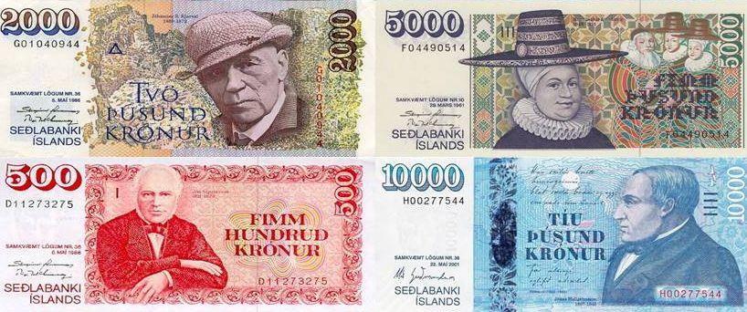

The Iceland Krona (ISK) stands as the official currency of Iceland, a nation characterized by its unique geographical, cultural, and economic attributes. As an island country located at the junction of the North Atlantic and Arctic Oceans, Iceland's financial system is both historically rich and dynamically modern. The ISK holds a distinctive position within these landscapes due to its historical evolution and its contemporary relevance in global financial markets. 

The currency's inception traces back to 1918, when Iceland separated from the Danish Krone and began issuing its own coins and banknotes, marking a pivotal step towards economic sovereignty. Throughout the 20th century, the krona was subject to various economic trials, notably including episodes of devaluation and inflation. These challenges necessitated structural adjustments, culminating in a significant currency revaluation in 1981. 

In modern times, the ISK maintains its prominence amid an increasingly interconnected global economy. While Iceland is not part of the European Union and does not adopt the euro, the krona freely floats on international currency markets. This independence subjects it to the volatility and opportunities inherent in global trading environments. Particularly noteworthy is the advent of algorithmic trading, a technological advancement that has transformed financial markets worldwide. This methodical trading strategy plays a significant role in the management and trading of the ISK, contributing to enhanced market efficiency. 

Exploring the history and contemporary dynamics of the Iceland Krona, including these trading practices, offers valuable insights into the country's financial ecosystem. This article endeavors to comprehensively outline the journey of the ISK, underscoring its economic significance and the innovative trading techniques that shape its modern trade. This understanding is crucial for appreciating the resilience and adaptability of Iceland's economy in the face of past and future challenges.

## Table of Contents

## Historical Background of the Iceland Krona

The Iceland Krona (ISK) was officially established in 1918, marking Iceland's financial independence following its separation from the Danish Krone. This development was a significant milestone in Iceland's pursuit of economic autonomy. Upon gaining sovereignty over its monetary system, Iceland embarked on the creation and distribution of its own coins and banknotes, distinguishing its currency from the Danish fiscal influence that had prevailed.

During the early 20th century, Iceland gradually developed its currency infrastructure. This period marked the construction of a robust framework for future monetary policy and economic planning. With this newfound autonomy, Iceland launched efforts to define and stabilize the value of the krona, which became crucial given the country's subsequent economic challenges.

Throughout the 20th century, Iceland encountered significant economic difficulties, prominently featuring currency devaluation and inflation fluctuations. These challenges were not unique to Iceland but were indicative of broader global economic pressures and shifts. Inflation, characterized by a sustained increase in prices, eroded the purchasing power of the krona, necessitating ongoing adjustments in currency value.

In response to persistent economic instability, Iceland took decisive action to revalue its currency in 1981. This revaluation was a strategic measure aimed at counterbalancing the effects of inflation and stabilizing the country's economic standing. The 1981 currency revaluation was a pivotal response to the inflationary tides that had undermined the krona's value. It represented a recalibration of the currency's worth in order to restore economic equilibrium and drive future financial growth.

The historical evolution of the Icelandic Krona underscores a journey replete with challenges and adaptations, which have shaped its role in Iceland's economic framework and laid the foundation for its contemporary monetary policy.

## The Role of the Central Bank of Iceland

The Central Bank of Iceland, founded in 1961, is a pivotal institution responsible for sustaining the stability of the Icelandic króna (ISK) and steering the country’s monetary policy. Its primary objectives include maintaining low and stable inflation, safeguarding the internal and external value of the ISK, and promoting an efficient and secure financial system.

One of the Central Bank's significant roles is to control inflation, a critical [factor](/wiki/factor-investing) for economic stability. To achieve this, the bank employs various monetary policy tools such as [interest rate](/wiki/interest-rate-trading-strategies) adjustments, open market operations, and foreign exchange interventions. These tools are aimed at influencing money supply and demand, which in turn affect inflation rates and the economy's overall health.

During the 2008 financial crisis, the Central Bank of Iceland faced extraordinary challenges. The global financial downturn led to severe implications for Iceland, resulting in the collapse of its banking sector and a sharp depreciation of the ISK. This crisis underscored the need for robust monetary policy frameworks and effective crisis management strategies. The Central Bank responded by employing emergency measures, including securing loans from the International Monetary Fund (IMF) and other international entities to stabilize the currency and rebuild foreign reserves.

Throughout various economic cycles, the Central Bank has played a critical role in crisis management and recovery. It has introduced regulatory reforms to enhance financial sector resilience and transparency, ensuring the stability of the banking system and reinforcing public confidence in financial institutions. Through these efforts, the Central Bank continues to be an essential pillar in Iceland's pursuit of economic stability and growth, proving its importance in navigating the complexities of modern financial challenges.

## Iceland's Financial Crisis and the Impact on the Krona

The 2008 financial crisis was a pivotal event for Iceland, marking one of the most severe economic downturns in the country's history. Key structural weaknesses, such as an oversized banking sector relative to the economy and its dependence on foreign currency funding, exacerbated the economic turmoil. As the global financial system teetered, Iceland's major banks - Kaupþing, Landsbanki, and Glitnir - encountered insolvency due to their inability to refinance short-term debt. This resulted in their rapid collapse, which had profound ramifications on Iceland's financial stability.

The impact on the Icelandic krona (ISK) was drastic. The currency saw a swift depreciation, losing significant value against major currencies such as the euro and the US dollar. As the crisis unfolded, foreign exchange markets reacted with heightened uncertainty and [volatility](/wiki/volatility-trading-strategies), leading to an even steeper decline in the krona's value. The central bank was forced into action, implementing emergency measures to stabilize the currency. These measures included intervening in foreign exchange markets and raising interest rates dramatically. Despite these efforts, the situation worsened, leading to the suspension of ISK trading at one point to prevent further devaluation.

Beyond domestic measures, Iceland was compelled to seek international monetary support to stabilize its economy. The International Monetary Fund (IMF) played a crucial role by extending a financial aid package that was contingent on Iceland implementing substantial economic reforms. Additionally, several countries, including those in the Nordic region, provided bilateral loans. These efforts aimed at not only supporting the struggling economy but also restoring confidence in the krona.

The crisis necessitated structural adjustments and comprehensive policies aimed at rebuilding and enhancing the resilience of Iceland's financial system. The financial turmoil and the krona's collapse underscored the necessity for stronger regulatory frameworks and decreased reliance on volatile external markets. Although the road to recovery was challenging, these reforms became a crucial part of Iceland's economic rebuilding efforts.

For further exploration, one might consider examining detailed reports and analyses prepared by financial institutions like the IMF and the Central Bank of Iceland, which provide insights into the crisis's specifics and the response measures implemented.

## ISK in the Global Market

Iceland's choice to remain outside the European Union (EU) and retain its own currency, the Iceland Krona (ISK), as opposed to adopting the euro, positions it uniquely within the global market. The ISK operates independently and floats freely, unlike the fixed or semi-fixed arrangements seen in some countries. This independence is characterized by fluctuations in exchange rates, influenced by economic indicators, market speculation, and external economic factors.

The free-floating nature of the ISK creates specific trading dynamics. Traders who participate in the ISK market must navigate a landscape marked by volatility and frequent shifts in economic conditions. Such conditions arise partly due to Iceland's relatively small economy, which means that geopolitical events or domestic economic changes can lead to pronounced effects on the currency's value. These elements introduce both risk and opportunity, inviting speculative movements while demanding proficient risk management strategies.

Another significant factor affecting ISK trading involves Iceland's policy stance on capital controls, which have been historically implemented during periods of economic stress. These controls can impact [liquidity](/wiki/liquidity-risk-premium) in the foreign exchange markets, influencing trading volumes of the krona. For traders, this necessitates an understanding of Iceland's regulatory environment and its potential implications on currency availability and exchange mechanisms.

Moreover, the absence of Iceland from the EU currency framework implies that the ISK is excluded from the monetary policies set by the European Central Bank (ECB). This exclusion requires Iceland to manage its monetary policy independently, crafted by its Central Bank with a focus on domestic economic goals. Consequently, traders must factor in these autonomous policies, which may diverge from broader European trends.

In summary, while the ISK's global market presence is defined by independence and volatility, it offers unique trading avenues reliant on the keen analysis of Iceland-specific economic trends and policies. The intricate balance of risk and opportunity makes the ISK a distinctive subject of interest for global currency traders.

## The Modern Era: Algorithmic Trading in Iceland

Algorithmic trading, a method of executing trades using automated, pre-programmed trading instructions, tailored for variables such as time, price, and [volume](/wiki/volume-trading-strategy), has increasingly permeated financial markets worldwide. Iceland is no exception, with the Icelandic financial sector progressively integrating these cutting-edge technologies to enhance the efficiency and execution of trades involving the Iceland Krona (ISK).

Algorithmic trading offers several advantages over traditional manual trading, including enhanced speed, accuracy, and efficiency, minimizing the potential for human error. In Iceland, this approach has been instrumental in managing ISK trades, allowing for quick responses to market fluctuations, optimizing trading strategies, and improving liquidity in the financial markets.

The implementation of [algorithmic trading](/wiki/algorithmic-trading) in Iceland involves several key components. One crucial element is the deployment of sophisticated algorithms that analyze market data to identify trading opportunities. These algorithms are designed to handle large volumes of data at high speeds, which is particularly beneficial given the volatility often associated with smaller currencies like the ISK. By using historical data and real-time analysis, these algorithms can detect market patterns and predict trends, enabling traders to execute more informed and timely trades.

Moreover, algorithmic trading facilitates the efficient pricing of ISK, contributing to overall market efficiency. By automating the trading process, participants can benefit from reduced transaction costs and minimized market impact. This efficiency is vital for maintaining the competitiveness of Iceland's financial markets, especially in a global context where traders and institutions require seamless and cost-effective access to foreign exchange ([FX](/wiki/fx-anomaly)) markets.

The impact of algorithmic trading on market transparency in Iceland is also noteworthy. With the precision and predictability that algorithms provide, market participants gain better insights into trade execution and pricing. This transparency is essential for fostering trust and participation in the Icelandic financial ecosystem, ensuring that the markets function efficiently and fairly.

Furthermore, as technology continues to evolve, advancements in [machine learning](/wiki/machine-learning) and [artificial intelligence](/wiki/ai-artificial-intelligence) offer promising prospects for further enhancing algorithmic trading strategies involving ISK. These technologies can potentially increase the predictive power of trading algorithms, allowing for even more precise analysis of complex market dynamics.

Despite the benefits, the adoption of algorithmic trading is not without challenges. Regulatory bodies, including the Central Bank of Iceland, play a critical role in overseeing and ensuring the integrity of such trading activities. Developing a regulatory framework that balances innovation with market stability and fairness is a continuous endeavour. This involves setting guidelines that prevent market abuse and ensuring that algorithmic trading participants adhere to ethical and transparent trading practices.

In conclusion, algorithmic trading represents a significant advancement in the management of ISK trades, contributing to improved market efficiency and liquidity. Its integration into the Icelandic financial markets highlights the importance of technological innovation in maintaining competitive and resilient financial systems. As algorithmic trading continues to evolve, it will likely play an even more pivotal role in shaping the future of currency trading in Iceland and beyond.

## Future Prospects for ISK and Iceland’s Economy

Iceland's economy has consistently demonstrated remarkable resilience, recovering from various financial challenges and adapting to global economic trends. This adaptability is a crucial factor in shaping the future prospects of the Icelandic króna (ISK) and the broader economy of Iceland. 

As Iceland continues to recover from past economic downturns, including the severe 2008 financial crisis, economic reforms and policy adjustments are anticipated to play a pivotal role in stabilizing and strengthening the national currency. One potential reform could involve further integration with international financial markets to enhance the stability of the ISK. Innovation in policy measures to mitigate inflation and control interest rates could provide a more predictable economic environment, thereby increasing investor confidence. 

Technological advancements, particularly in trading platforms, are expected to significantly influence the future landscape for ISK. Algorithmic trading, which has already begun to permeate Icelandic financial markets, could offer increased efficiency and transparency. The use of algorithms can optimize trading strategies by analyzing vast datasets for patterns that human traders may miss, ultimately improving liquidity and reducing transaction costs. The implementation of blockchain technology and digital currencies, such as Central Bank Digital Currencies (CBDCs), might provide additional avenues for modernizing financial transactions involving the ISK.

Furthermore, Iceland's renewable energy sector presents unique opportunities for economic growth and stability. Investing in sustainable energy solutions not only aligns with global environmental efforts but also enhances Iceland’s position in the export market. These investments could provide a vital boost to the national economy, indirectly supporting the strength and stability of the ISK.

However, challenges remain. Maintaining economic resilience amid changing geopolitical and environmental conditions will require strategic planning and flexibility. The potential economic impacts of climate change and fluctuating global markets necessitate a proactive approach by policymakers.

In summary, while past difficulties have tested the Icelandic economy, the future prospects for the ISK remain promising if underpinned by strategic economic reforms and technological advancements. By continuing to adapt to both local and global economic trends, Iceland is well-positioned to capitalize on opportunities for growth and stability.

## Conclusion

The Icelandic Krona (ISK) symbolizes a narrative of perseverance and flexibility throughout Iceland's financial history. The currency's development and resilience are testaments to a nation that has navigated through significant economic challenges, including episodes of devaluation and a major financial crisis in 2008. These events have been pivotal in shaping how Iceland has managed its national currency, fostering a robust understanding of economic governance through the Central Bank of Iceland. The ability of the ISK to withstand such pressure reflects the strength of Iceland's regulatory and monetary policies.   

In today's financial environment, the ISK operates without the stabilizing anchor of the European Union's euro, allowing it to maintain a unique presence in the [forex](/wiki/forex-system) market. This situation presents both challenges and possibilities, driven by the currency's independent status. The advent and utilization of algorithmic trading have further amplified this dynamic, influencing how the ISK is perceived and traded globally. By automating trading strategies, algorithmic trading has introduced a level of market efficiency and responsiveness previously unexplored for the ISK.

The journey of the ISK highlights not just Iceland's ability to adapt, but also its capacity for economic innovation. Moving forward, the possibilities for the ISK and Iceland's economic landscape are exciting. Potential reforms and advances in trading technology could shape the future, offering new avenues for growth and stability. This intricate blend of history, technological adaptation, and strategic foresight provides critical insights into the ever-evolving economic narrative of Iceland. Understanding these elements is essential for comprehending the resilience embedded in the fabric of Icelandic financial practices.

## References & Further Reading

[1]: Sigurjonsson, F. (2010). ["The Icelandic Financial Crisis: Causes, Consequences and Lessons."](https://www.chiefscientist.gov.au/sites/default/files/09TIE53_2Sigurjonsson.pdf) Reykjavik University.

[2]: Glitnir Bank. (2008). ["The 2008 Financial Crisis in Iceland: An Analysis and Overview."](https://www.knowway.org/en/the-collapse-of-glitnir-bank-a-look-back-at-the-2008-financial-crisis-in-iceland)

[3]: Central Bank of Iceland. (2011). ["Prudential Regulation and Crisis Management."](https://www.sedlabanki.is/library/Skraarsafn/Radstefnur-og-rannsoknir/Tjorvi_Olafsson_slides.pdf)

[4]: Loftsson, A. K. (2006). ["Iceland's Central Bank in the Learning Process of Inflation Targeting."](https://www.bis.org/review/r070607e.pdf)

[5]: Jónsson, Á. (2009). ["Why Iceland? How One of the World's Smallest Countries Became the Meltdown's Biggest Casualty."](https://www.amazon.com/Why-Iceland-Smallest-Countries-Meltdowns/dp/0071632840) McGraw-Hill Education.

[6]: Kaupthing Bank. (2008). ["Kaupthing Annual Report: An Overview of the Banking Crisis."](https://en.wikipedia.org/wiki/Kaupthing_Bank)

[7]: International Monetary Fund. (2012). ["Iceland: Advancements and Strategy Following the Financial Crisis."](https://www.imf.org/en/Publications/AREB/Issues/2016/12/31/International-Monetary-Fund-Annual-Report-2012-Working-Together-To-Support-Global-Recovery-26104)

[8]: ["Algorithmic and High-Frequency Trading"](https://www.amazon.com/Algorithmic-High-Frequency-Trading-Mathematics-Finance/dp/1107091144) by Bjoern Greinert

[9]: Jónsson, M. (2020). ["Iceland: The Birth, the Boom, and the Bust of a Central Bank."](https://www.sciopen.com/article/10.1007/s42978-023-00237-w) Routledge.

[10]: Danielsson, J. (2008). ["The First Casualty: Iceland in the Global Financial Crisis."](https://www.nakedcapitalism.com/2008/11/first-casualty-of-crisis-iceland.html) Centre for Economic Policy Research.