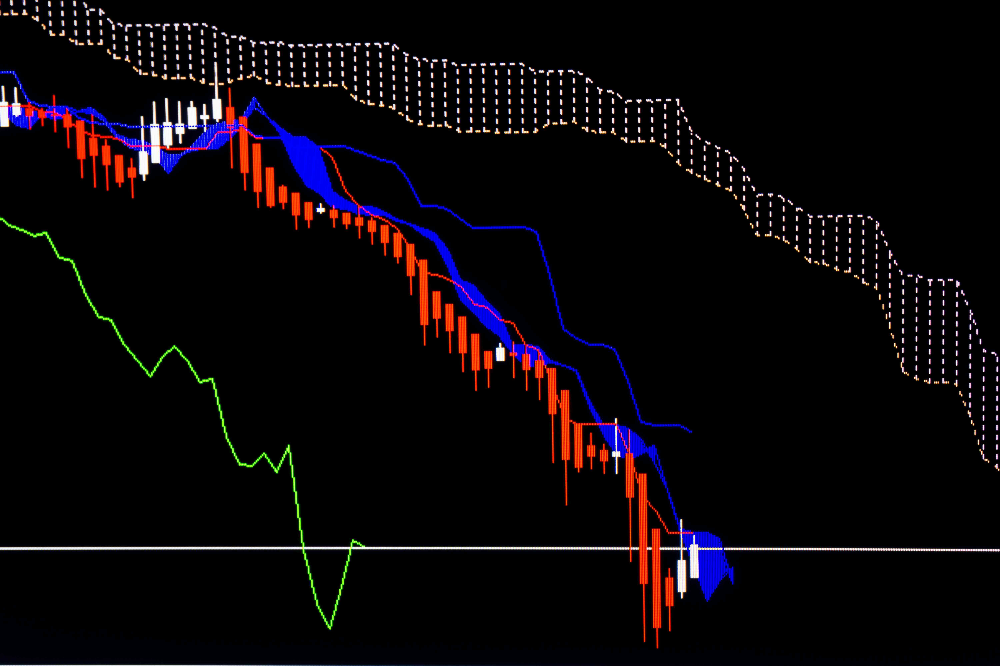

The Ichimoku Cloud is a well-regarded technical analysis tool widely used in trading to assess market behavior. Developed by Japanese journalist Goichi Hosoda in the late 1960s, it is designed to enhance the visualization of important trading elements: support and resistance levels, momentum, and trend direction. Unlike traditional indicators that might focus on singular aspects of the market, the Ichimoku Cloud provides a multi-dimensional perspective, offering traders a holistic view of potential market movements.

At its core, the Ichimoku Cloud consists of five lines that collectively capture critical market dynamics and offer visual insights into the current state and future beliefs about market trends. This comprehensive nature makes it especially useful for spotting potential support and resistance zones, identifying trend reversals, and gauging momentum strength. Due to these capabilities, many traders integrate it into their decision-making processes, using it to evaluate the strength of various market signals.



Understanding the Ichimoku Cloud is increasingly relevant for those engaging in algorithmic trading. As trading strategies become more automated, the capacity of the Ichimoku Cloud to distill complex market information into easily interpretable signals proves advantageous. Its ability to provide real-time analysis of market conditions allows algorithmic traders to automate entry and exit points based on dynamic interpretations of market behavior. Consequently, incorporating the Ichimoku Cloud into algorithmic trading strategies can enhance the precision and responsiveness of trading algorithms, potentially improving their efficacy across diverse market conditions.

## Table of Contents

## What is the Ichimoku Cloud?

The Ichimoku Cloud, also known as Ichimoku Kinko Hyo, is a comprehensive collection of technical indicators used primarily in trading to provide a clearer picture of potential market movements. This tool allows traders to gauge support and resistance levels, momentum, and trend direction all in a single glance. Distinct from traditional technical analysis tools, the Ichimoku Cloud plots multiple average calculations on a chart, offering a multi-dimensional insight into the market's dynamics.

Originally developed by Japanese journalist Goichi Hosoda in the late 1930s, the Ichimoku Cloud was created with the aim of allowing traders to quickly and efficiently assess market conditions. It was later published in 1969 after three decades of refinement and research. Hosoda sought to create a method that would depict all critical market information visually, combining elements that would typically require separate analysis tools.

The Ichimoku Cloud's composition includes several moving averages that work together to form what traders refer to as the "cloud" and additional elements that help in assessing momentum. The primary concept behind this tool is the creation of a unique equilibrium chart that provides support and resistance levels along with trend direction. These multiple averages form bands that can visually demonstrate current and future support and resistance zones.

The basic plotting involves calculating averages using different period lengths, which display potential turning points in market [momentum](/wiki/momentum). The cloud itself is formed by two lines—Senkou Span A and Senkou Span B—each calculated using the midpoints of previous highs and lows over set periods, plotted 26 periods ahead. When price is above the cloud, it signals an uptrend, while below it indicates a downtrend. Inside the cloud, the market may be considered range-bound or less certain. This visualization provides previously hidden insights into the strength and potential future direction of market trends.

Traders worldwide appreciate the Ichimoku Cloud for its holistic approach to analyzing market conditions. Unlike singular moving averages that track price momentum over time, the Ichimoku Cloud offers a simultaneous view of trend direction, momentum, and [volatility](/wiki/volatility-trading-strategies). This comprehensive view can aid traders in making more informed decisions by highlighting not only prevailing market trends but also possible reversals and consolidation periods. As such, the Ichimoku Cloud has gained significant traction across various financial markets, appealing to those who seek a well-rounded trading tool that synthesizes multiple aspects of market analysis.

## Components of the Ichimoku Cloud

The Ichimoku Cloud is composed of five key components: Tenkan Sen, Kijun Sen, Senkou Span A, Senkou Span B, and Chikou Span. These elements work together to provide a comprehensive view of market dynamics, including support, resistance, momentum, and trend direction.

### Tenkan Sen (Conversion Line)

The Tenkan Sen, or Conversion Line, is calculated by averaging the highest high and the lowest low over the past nine periods:

$$
\text{Tenkan Sen} = \frac{\text{Highest High} + \text{Lowest Low}}{2}
$$

This line reflects short-term price momentum and serves as a minor support and resistance level. Traders often look at the angle and position of the Tenkan Sen for indications of short-term trend direction.

### Kijun Sen (Base Line)

The Kijun Sen, or Base Line, is determined by taking the average of the highest high and the lowest low over the past 26 periods:

$$
\text{Kijun Sen} = \frac{\text{Highest High} + \text{Lowest Low}}{2}
$$

Acting as a medium-term trend indicator, the Kijun Sen provides insight into potential reversals or continuations of the trend. It is often used as a confirmation line for trading signals.

### Senkou Span A (Leading Span A)

Senkou Span A is the average of the Tenkan Sen and Kijun Sen, projected 26 periods into the future:

$$
\text{Senkou Span A} = \frac{\text{Tenkan Sen} + \text{Kijun Sen}}{2}
$$

This component aids in forming the Ichimoku Cloud and indicates the leading edge of the kumo, or cloud. A rising Senkou Span A is indicative of positive market sentiment, while a falling Senkou Span A suggests bearish conditions.

### Senkou Span B (Leading Span B)

Senkou Span B is calculated by averaging the highest high and the lowest low over the past 52 periods and projecting this 26 periods ahead:

$$
\text{Senkou Span B} = \frac{\text{Highest High} + \text{Lowest Low}}{2}
$$

Known for its longer-term perspective, Senkou Span B defines the other boundary of the Ichimoku Cloud. It often provides stronger support and resistance levels due to its lengthier calculation period.

### Chikou Span (Lagging Span)

The Chikou Span, or Lagging Span, is the current closing price, plotted 26 periods behind:

$$
\text{Chikou Span} = \text{Current Closing Price}
$$

This element offers a visual representation of price momentum and allows traders to compare current price action against past performance. A price level above the Chikou Span often signals bullish sentiment, whereas below it, bearish.

### Interaction and Cloud Formation

The relationship between Senkou Span A and Senkou Span B creates the Ichimoku Cloud, or kumo. Generally, when prices are above the cloud, it suggests an uptrend, while prices below indicate a downtrend. The cloud itself serves as a robust support/resistance zone, with shifts in the cloud offering potential trend reversals. The thickness of the cloud is also significant, with thicker clouds typically providing stronger support or resistance due to increased market uncertainty.

### Code Example

Here is a simple Python code snippet using the `pandas` library to compute these components:

```python
import pandas as pd

def ichimoku_calculator(high, low, close):
    nine_period_high = high.rolling(window=9).max()
    nine_period_low = low.rolling(window=9).min()
    twenty_six_period_high = high.rolling(window=26).max()
    twenty_six_period_low = low.rolling(window=26).min()
    fifty_two_period_high = high.rolling(window=52).max()
    fifty_two_period_low = low.rolling(window=52).min()

    tenkan_sen = (nine_period_high + nine_period_low) / 2
    kijun_sen = (twenty_six_period_high + twenty_six_period_low) / 2
    senkou_span_a = ((tenkan_sen + kijun_sen) / 2).shift(26)
    senkou_span_b = ((fifty_two_period_high + fifty_two_period_low) / 2).shift(26)
    chikou_span = close.shift(-26)

    return tenkan_sen, kijun_sen, senkou_span_a, senkou_span_b, chikou_span
```

By integrating these components, the Ichimoku Cloud offers traders a multifaceted view of market activity, making it a valuable tool for technical analysis.

## Understanding Ichimoku Cloud Trading Signals

Traders interpret the Ichimoku Cloud, or Kumo, to determine trend direction and strength by observing the position of the price relative to the cloud. The cloud is formed by Senkou Span A and Senkou Span B, and its position, along with thickness, provides visual cues about market dynamics. When the price is above the cloud, it generally indicates a bullish trend, while a position below the cloud suggests a bearish trend. A price residing within the cloud signifies consolidation or indecision, highlighting areas of potential support and resistance.

Crossover events between the Tenkan Sen (often referred to as the conversion line) and Kijun Sen (the baseline) are particularly significant in reading Ichimoku signals. The Tenkan Sen is calculated as the average of the highest high and lowest low over the past nine periods:

$$
\text{Tenkan Sen} = \frac{\text{Highest High} + \text{Lowest Low}}{2}
$$

Similarly, the Kijun Sen is determined as the average over the past 26 periods:

$$
\text{Kijun Sen} = \frac{\text{Highest High} + \text{Lowest Low}}{2}
$$

A bullish signal occurs when the Tenkan Sen crosses above the Kijun Sen, suggesting upward momentum, whereas a bearish signal happens when the Tenkan Sen crosses below the Kijun Sen, indicating downward momentum. These crossovers, particularly when confirmed by the position relative to the cloud, aid traders in making informed trading decisions.

For example, consider a scenario where the price is above the cloud and a bullish crossover occurs; this combination strengthens the bullish signal, guiding the trader towards a potential buy decision. Conversely, if the price is below the cloud and a bearish crossover is observed, it reinforces a sell signal. 

Traders often use these signals to determine entry and [exit](/wiki/exit-strategy) points, stop-loss placements, and to confirm trends with other technical indicators. Utilizing the visual nature and dynamics of the Ichimoku Cloud simplifies complex data, thereby supporting strategic decision-making in various market conditions.

## Calculating and Plotting the Ichimoku Cloud

The Ichimoku Cloud is a technical analysis tool that provides a comprehensive representation of market trends and potential support and resistance levels. It comprises five primary components, each calculated using specific formulas. Understanding how to manually compute these components offers deeper insights into their significance and function within trading charts.

### Calculating the Components

1. **Tenkan Sen (Conversion Line)**:
   - Formula: \[ \text{Tenkan Sen} = \frac{(\text{Highest High} + \text{Lowest Low})}{2}
$$
   - Calculation Period: Typically 9 periods.
   - The Tenkan Sen reflects the mid-point of the high-low range over nine periods and is used to gauge short-term price momentum.

2. **Kijun Sen (Base Line)**:
   - Formula: \[ \text{Kijun Sen} = \frac{(\text{Highest High} + \text{Lowest Low})}{2}
$$
   - Calculation Period: Typically 26 periods.
   - Serving as a gauge for medium-term momentum, the Kijun Sen signals potential market trends by comparing it with the Tenkan Sen.

3. **Senkou Span A (Leading Span A)**:
   - Formula: \[ \text{Senkou Span A} = \frac{(\text{Tenkan Sen} + \text{Kijun Sen})}{2}
$$
   - Calculation Offset: Plotted 26 periods ahead.
   - This line forms one edge of the Ichimoku Cloud, offering a projected support or resistance level, depending on its position relative to price.

4. **Senkou Span B (Leading Span B)**:
   - Formula: \[ \text{Senkou Span B} = \frac{(\text{Highest High} + \text{Lowest Low})}{2}
$$
   - Calculation Period: 52 periods, Offset 26 periods ahead.
   - As the other boundary of the cloud, Senkou Span B typically signals longer-term trend direction.

5. **Chikou Span (Lagging Span)**:
   - Formula: \[ \text{Chikou Span} = \text{Current Closing Price}
$$
   - Calculation Offset: Plotted 26 periods back.
   - This component illustrates market sentiment by comparing current price levels with past prices, aiding in confirming trends.

### Plotting the Ichimoku Cloud

To visualize these computations on trading charts, the plotted components create the 'cloud'—a critical element that highlights areas of potential support and resistance, helping traders identify trend direction and momentum. The area between Senkou Span A and Senkou Span B is shaded to form the cloud. When the price is above the cloud, it indicates a potential bullish trend, while below suggests bearish momentum.

### Automation through Trading Platforms

Performing these calculations manually can be cumbersome, especially in dynamically changing markets. However, modern trading platforms such as MetaTrader, TradingView, and various [algorithmic trading](/wiki/algorithmic-trading) software automate these calculations, allowing traders to rapidly integrate the Ichimoku Cloud with other analyses. These platforms provide customizable settings, enabling traders to adapt Ichimoku parameters to align with different market conditions and trading styles.

By automating the plotting of the Ichimoku Cloud, traders can efficiently apply this multifaceted tool to enhance their market analysis, making informed decisions with both algorithmic and discretionary trading strategies.

## Comparing Ichimoku Cloud with Traditional Moving Averages

The Ichimoku Cloud, with its integrated approach to analyzing markets, offers a unique set of averages that differ significantly from traditional moving averages. Traditional moving averages, such as the simple moving average (SMA) or the exponential moving average (EMA), are calculated by taking the average of a selected data range, smoothing out price movements to identify trends over time. These averages are based solely on past price data, thus reflecting historical trends without necessarily providing forward-looking insights.

The Ichimoku Cloud, however, not only incorporates multiple averages but also includes leading (forward-looking) components that project future support and resistance levels, differentiating it from traditional moving averages. The five components of the Ichimoku Cloud include the Tenkan Sen (conversion line), Kijun Sen (baseline), Senkou Span A, Senkou Span B, and Chikou Span (lagging span). These elements work collectively to provide a comprehensive view of current and potential future market conditions.

The Tenkan Sen and Kijun Sen can be likened to short-term and medium-term moving averages, respectively. However, they are calculated differently from the SMAs. The Tenkan Sen is derived from the average of the highest high and lowest low over the past nine periods, whereas the Kijun Sen considers the same calculation over a 26-period horizon:

$$
\text{Tenkan Sen} = \frac{(\text{Highest High} + \text{Lowest Low})}{2} \, \text{over the last 9 periods}
$$

$$
\text{Kijun Sen} = \frac{(\text{Highest High} + \text{Lowest Low})}{2} \, \text{over the last 26 periods}
$$

One of the most significant components of the Ichimoku Cloud is the "Kumo" or Cloud itself, formed by Senkou Span A and Senkou Span B. Unlike traditional averages, these lines are plotted 26 periods ahead, offering a predictive element that is particularly valued by traders. Senkou Span A represents the midpoint between the Tenkan Sen and Kijun Sen, while Senkou Span B is the average of the highest high and lowest low over the past 52 periods:

$$
\text{Senkou Span A} = \frac{(\text{Tenkan Sen} + \text{Kijun Sen})}{2} \, \text{plotted 26 periods ahead}
$$

$$
\text{Senkou Span B} = \frac{(\text{Highest High} + \text{Lowest Low})}{2} \, \text{over the last 52 periods, plotted 26 periods ahead}
$$

By using the cloud structure, traders gain insight into potential support and resistance zones. When the price is above the cloud, it signifies an uptrend; below the cloud, a downtrend; and within the cloud, potential market indecision or transition.

The benefits of using the Ichimoku Cloud over traditional moving averages lie in its comprehensive, holistic approach that merges multiple timeframes and includes future projections. This not only helps in identifying current trends but also in anticipating future market movements, which is a distinctive advantage for strategizing trades. However, while the Ichimoku Cloud provides significant insights, its complexity and the need for visual interpretation may be considered a drawback when compared to the simplicity of traditional moving averages. Moreover, its reliance on historical data can still lead to potential limitations during highly volatile market conditions. 

Overall, the Ichimoku Cloud's forward-looking aspect and multifaceted data integration make it a powerful tool for those seeking a detailed perspective on market dynamics beyond what traditional moving averages can offer.

## Algorithmic Trading with Ichimoku Cloud

Ichimoku Cloud is a versatile tool in algorithmic trading, providing critical insights into market trends, support, and resistance levels. Its integration into algorithmic strategies leverages its holistic view to inform trading decisions. Unlike traditional indicators that focus on specific market aspects, Ichimoku Cloud offers a comprehensive perspective. 

Algorithmic trading with Ichimoku Cloud starts with identifying trading signals based on the cloud's components. Strategies can be built by monitoring the crossover of the Tenkan Sen (conversion line) and Kijun Sen (base line), the position of the market price relative to the cloud, and the color and shape of the cloud itself. For instance, prices above the cloud generally indicate a bullish trend, while prices below suggest a bearish trend. Traders look for the Tenkan Sen to cross above the Kijun Sen above the cloud to confirm a buying opportunity.

Backtesting has demonstrated that Ichimoku-based strategies can be effective in various markets, including equities, [forex](/wiki/forex-system), and commodities. Backtesting involves simulating a trading strategy over historical data to evaluate its potential performance. In several tests, strategies using Ichimoku have shown promising results in trending markets, where the cloud's ability to indicate support and resistance becomes a valuable asset. For instance, during strongly trending periods, Ichimoku strategies have been found to maintain a favorable risk-reward ratio, as evidenced by the distinct trends captured by the cloud's signals.

Incorporation of Ichimoku Cloud in automated trading strategies typically involves coding these signals into a trading algorithm. In Python, one might use libraries such as Pandas to calculate Ichimoku components, and Backtrader for simulating the trading strategy. The following is a basic conceptual approach to implement Ichimoku in Python:

```python
import pandas as pd
import talib

# Load market data
data = pd.read_csv('market_data.csv')

# Calculate Ichimoku components using `talib`
data['tenkan_sen'], data['kijun_sen'], data['senkou_span_a'], data['senkou_span_b'], data['chikou_span'] = talib.ICHIMOKU(data['high'], data['low'], data['close'])

# Define trading signals
data['signal'] = 0
data.loc[(data['tenkan_sen'] > data['kijun_sen']) & (data['close'] > data['senkou_span_a']), 'signal'] = 1 # Bullish signal
data.loc[(data['tenkan_sen'] < data['kijun_sen']) & (data['close'] < data['senkou_span_a']), 'signal'] = -1 # Bearish signal
```

Beyond individual trades, algorithmic strategies can also integrate Ichimoku Cloud with [machine learning](/wiki/machine-learning) models to enhance predictions for trend shifts. This hybrid approach can adapt to varying market conditions, balancing Ichimoku's visual insights with statistical forecasts.

Despite its strengths, Ichimoku Cloud's effectiveness may vary. It excels in trending markets, but ranges can produce false signals. To counter this, some strategies combine Ichimoku with other indicators, such as relative strength index (RSI), to filter trades. This multi-layered approach helps mitigate risks and capitalizes on the cloud's predictive power.

Overall, while the Ichimoku Cloud is inherently beneficial to algorithmic trading, its success depends on careful implementation and market context awareness. Its ability to offer a multifaceted view of the market provides traders with a robust framework for making informed decisions, particularly when coded into systematic strategies.

## Limitations of the Ichimoku Cloud

The Ichimoku Cloud is a widely-used technical analysis tool, renowned for its ability to provide comprehensive insights into market trends, momentum, support, and resistance levels. However, like any trading system, it has its limitations that traders must be aware of to use it effectively.

One significant limitation of the Ichimoku Cloud is its reliance on historical data. The tool is designed to identify trends, support, and resistance based on past price movements and averages. This reliance can sometimes result in lagging indicators, meaning the signals may arrive slightly after a market move has already started. In fast-moving markets, this lag can lead to missed opportunities or delayed responses, potentially affecting the effectiveness of trading decisions.

Additionally, the visual complexity of the Ichimoku Cloud can pose challenges for traders, especially those unfamiliar with its components. With multiple lines plotted on the chart—Tenkan Sen, Kijun Sen, Chikou Span, Senkou Span A, and Senkou Span B—the Ichimoku Cloud may appear cluttered to some traders. This complexity can make it difficult to interpret signals quickly and may require a steep learning curve to understand and use effectively.

There are also scenarios where the Ichimoku Cloud may fail to provide decisive trade signals. For example, in a sideways or non-trending market, the signals from the Ichimoku Cloud components might be ambiguous or conflicting. The overlapping of multiple lines could lead to false signals, making it challenging to determine the accurate direction of the market.

To mitigate these limitations, traders can employ several strategies. First, combining the Ichimoku Cloud with other indicators, such as moving averages or momentum oscillators, can provide additional confirmation and reduce the likelihood of false signals. This combination helps create a more rounded view of the market's state, providing additional layers of verification before making trade decisions.

Additionally, traders can customize parameters within the Ichimoku calculation to better suit specific market conditions or to align with their trading style. Adjusting the look-back periods for the Tenkan Sen and Kijun Sen, for example, can fine-tune the sensitivity of the indicators to market changes.

Utilizing automated trading platforms and algorithms can further enhance the effectiveness of the Ichimoku Cloud by [backtesting](/wiki/backtesting) strategies and continuously monitoring multiple market conditions. Automated systems can process complex data patterns more rapidly than manual analysis, allowing traders to act on signals that fit predefined criteria without the burden of manual interpretation.

By understanding these limitations and implementing strategies to address them, traders can harness the Ichimoku Cloud as a more reliable component of their technical analysis toolkit.

## Conclusion

The Ichimoku Cloud stands as a multifaceted tool in technical analysis and algorithmic trading, offering a robust framework to evaluate market conditions. Its value lies in its ability to combine various indicators that provide insights into support and resistance levels, momentum, and trend direction. Despite its visual complexity and reliance on historical data, the Ichimoku Cloud presents a comprehensive picture of market trends, helping traders identify potential pivots and entry or exit points more effectively.

The Ichimoku Cloud's versatility is highlighted by its integration of five key components—Tenkan Sen, Kijun Sen, Senkou Span A, Senkou Span B, and Chikou Span—that work together to form a holistic view of market dynamics. These elements provide traders with the ability to quickly interpret complex data and anticipate market movements. This comprehensive approach surpasses conventional moving averages by delivering predictive insights that are crucial for informed trading decisions.

In algorithmic trading, the Ichimoku Cloud can be an invaluable asset, as it can be systematically incorporated into automated strategies to analyze large datasets and identify profitable trading opportunities. The capacity for backtesting these strategies across various markets further underscores the adaptability of the Ichimoku method in diverse trading environments.

While acknowledging the limitations of the Ichimoku Cloud, such as its dependence on past price information and potential for ambiguous signals during sideways markets, these can often be mitigated by using the Cloud in conjunction with other technical indicators. This combined approach not only leverages the strengths of multiple tools but also enhances the robustness of trading strategies, promoting a balanced and well-rounded perspective on market analysis.

In conclusion, the Ichimoku Cloud is an indispensable tool for traders seeking a comprehensive analysis method. By incorporating it alongside other indicators, traders can construct a diversified strategy that maximizes the Cloud's strengths, ensuring a more complete and nuanced understanding of market behavior.

## References & Further Reading

[1]: Hosoda, G. (1969). *Ichimoku Kinko Hyo*. Pan Rolling.

[2]: Nison, S. (1991). *Japanese Candlestick Charting Techniques*. Prentice Hall Press.

[3]: Kirkpatrick, C. D., & Dahlquist, J. R. (2010). *Technical Analysis: The Complete Resource for Financial Market Technicians*. FT Press.

[4]: Morris, G. (2006). *Candlestick Charting Explained: Timeless Techniques for Trading Stocks and Futures*. McGraw-Hill Education.

[5]: Murphy, J. J. (1999). *Technical Analysis of the Financial Markets: A Comprehensive Guide to Trading Methods and Applications*. New York Institute of Finance.

[6]: Thomsett, M. C. (2017). *A Practical Guide to Swing Trading*. FT Press.

[7]: Ulrich, U. (2019). *Algorithmic Trading: Winning Strategies and Their Rationale*. Wiley.

[8]: Kaufman, P. J. (2013). *Trading Systems and Methods*. Wiley.