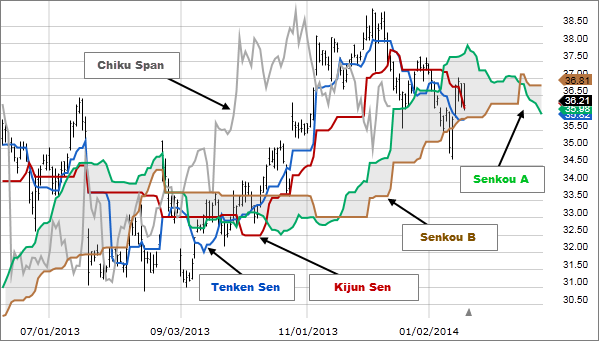

## Table of Contents

## What is the Ichimoku Cloud and its purpose in technical analysis?

The Ichimoku Cloud is a type of technical analysis tool used in trading to help predict future price movements. It was developed by a Japanese journalist named Goichi Hosoda in the late 1960s. The Ichimoku Cloud, also known as Ichimoku Kinko Hyo, which means "one look equilibrium chart," is designed to give traders a quick and easy way to see the overall trend, support and resistance levels, and momentum of an asset all at once. This is done through a series of lines and a "cloud" formed by two of these lines, which together provide a visual representation of the market's direction and potential turning points.

The main components of the Ichimoku Cloud are five lines: Tenkan-sen, Kijun-sen, Senkou Span A, Senkou Span B, and Chikou Span. The cloud, or "Kumo," is created by the area between Senkou Span A and Senkou Span B, which are plotted 26 periods ahead of the current price. If the price is above the cloud, it suggests a bullish trend, and if it's below the cloud, it indicates a bearish trend. The thickness of the cloud can also show the strength of the support or resistance; a thicker cloud means stronger support or resistance. Traders use these elements to make decisions about when to buy or sell, helping them to find the best entry and exit points in the market.

## Who developed the Ichimoku Cloud and when was it introduced?

The Ichimoku Cloud was developed by a Japanese journalist named Goichi Hosoda. He worked on it for many years and finally introduced it to the public in the late 1960s. Hosoda wanted to create a tool that could help people understand the stock market more easily.

The Ichimoku Cloud, also called Ichimoku Kinko Hyo, means "one look equilibrium chart." This name shows that the tool is designed to give traders a quick and clear picture of the market. It helps them see trends, support and resistance levels, and the [momentum](/wiki/momentum) of an asset all at once.

## What are the five main components of the Ichimoku Cloud?

The Ichimoku Cloud has five main parts that help traders see what's happening in the market. The first part is the Tenkan-sen, also called the Conversion Line. It shows the average of the highest high and the lowest low over the last nine periods. The second part is the Kijun-sen, or the Base Line, which is the average of the highest high and the lowest low over the last 26 periods. The third part is the Senkou Span A, or the Leading Span A, which is calculated by averaging the Tenkan-sen and the Kijun-sen and plotting it 26 periods ahead.

The fourth part is the Senkou Span B, or the Leading Span B. It's the average of the highest high and the lowest low over the last 52 periods, plotted 26 periods ahead. These two Leading Spans create the "cloud" or "Kumo," which shows where the price might go in the future. The fifth part is the Chikou Span, or the Lagging Span. It's the current closing price plotted 26 periods back. All these parts together help traders see the trend, support and resistance, and possible turning points in the market.

## How is the Tenkan-sen (Conversion Line) calculated and what does it represent?

The Tenkan-sen, or Conversion Line, is part of the Ichimoku Cloud. To calculate it, you take the highest price and the lowest price over the last nine periods. Then, you find the average of these two numbers. This line helps traders see the short-term trend of the market.

The Tenkan-sen shows where the price has been in the recent past. If it's going up, it means the short-term trend is bullish. If it's going down, the short-term trend is bearish. Traders use it to find good times to buy or sell, based on how the price is moving compared to this line.

## What is the Kijun-sen (Base Line) and how is it different from the Tenkan-sen?

The Kijun-sen, or Base Line, is another important part of the Ichimoku Cloud. To calculate it, you take the highest price and the lowest price over the last 26 periods and find their average. This line helps traders understand the medium-term trend of the market. It gives a longer view than the Tenkan-sen because it looks at more periods. When the Kijun-sen is going up, it means the medium-term trend is bullish, and when it's going down, it means the trend is bearish.

The main difference between the Kijun-sen and the Tenkan-sen is the time frame they cover. The Tenkan-sen looks at the last nine periods, which makes it more sensitive to short-term price changes. On the other hand, the Kijun-sen looks at the last 26 periods, making it less reactive to short-term fluctuations and better at showing the overall direction of the market. Traders use both lines together to get a better picture of the market's trend, with the Tenkan-sen helping to spot quick changes and the Kijun-sen providing a more stable view of where the market is heading.

## Can you explain the Senkou Span A and Senkou Span B, and how they form the Kumo (Cloud)?

The Senkou Span A and Senkou Span B are parts of the Ichimoku Cloud that help traders see where the price might go in the future. Senkou Span A is calculated by taking the average of the Tenkan-sen and the Kijun-sen and then plotting it 26 periods ahead of the current time. This line shows the middle ground between the short-term and medium-term trends. On the other hand, Senkou Span B is found by averaging the highest high and the lowest low over the last 52 periods, and it's also plotted 26 periods into the future. This line gives a longer-term view of where the market could be heading.

Together, Senkou Span A and Senkou Span B form the Kumo, or Cloud. The area between these two lines is shaded and creates the cloud. If the Senkou Span A is above the Senkou Span B, the cloud is usually colored green, which means the market might be bullish. If the Senkou Span B is above the Senkou Span A, the cloud is often colored red, suggesting a bearish market. The cloud acts like a map, showing traders where the price might find support or resistance in the future. A thicker cloud means stronger support or resistance, helping traders make better decisions about when to buy or sell.

## How does the Chikou Span (Lagging Span) contribute to the Ichimoku Cloud analysis?

The Chikou Span, or Lagging Span, is a part of the Ichimoku Cloud that helps traders see the past. It's the current closing price of an asset, but it's plotted 26 periods back on the chart. This means it shows where the price was 26 periods ago. By looking at the Chikou Span, traders can see if the current price is above or below where it was in the past, which can help them understand the strength of the current trend.

The Chikou Span is useful because it gives a different view of the market. If the Chikou Span is above the price from 26 periods ago, it might mean the market is strong and could keep going up. If it's below the past price, it might mean the market is weak and could go down. Traders use the Chikou Span along with the other parts of the Ichimoku Cloud to make better decisions about buying or selling. It helps them see if the current trend is likely to continue or if it might change soon.

## What are the basic trading signals provided by the Ichimoku Cloud?

The Ichimoku Cloud gives traders some basic signals to help them decide when to buy or sell. One signal is when the price moves above or below the cloud. If the price goes above the cloud, it's a sign that the market might be starting to go up, which could be a good time to buy. If the price goes below the cloud, it might mean the market is starting to go down, and it could be a good time to sell. Another signal is when the Tenkan-sen (Conversion Line) crosses the Kijun-sen (Base Line). If the Tenkan-sen goes above the Kijun-sen, it's a bullish signal, suggesting it might be a good time to buy. If the Tenkan-sen goes below the Kijun-sen, it's a bearish signal, which might mean it's time to sell.

The Chikou Span (Lagging Span) also gives important signals. If the Chikou Span is above the price from 26 periods ago, it's a sign that the market might be strong, and it could be a good time to buy. If the Chikou Span is below the price from 26 periods ago, it might mean the market is weak, and it could be a good time to sell. Traders also look at how the price interacts with the cloud. If the price is inside the cloud, it means the market might be unsure about which way to go, so traders might want to wait before making a move. By using these signals together, traders can get a better idea of what the market might do next.

## How can the Ichimoku Cloud be used to identify support and resistance levels?

The Ichimoku Cloud helps traders find where prices might stop going up or down, which are called support and resistance levels. The cloud itself is the main thing to look at for this. The cloud is made from two lines, Senkou Span A and Senkou Span B, and the space between them is shaded. If the price is above the cloud, the top of the cloud can act like a support level, where the price might stop going down. If the price is below the cloud, the bottom of the cloud can act like a resistance level, where the price might stop going up. The thicker the cloud, the stronger the support or resistance it shows.

Traders also use the Tenkan-sen and Kijun-sen lines to find support and resistance. The Tenkan-sen is the average of the highest and lowest prices over the last nine periods, and the Kijun-sen is the average over the last 26 periods. These lines can act as support or resistance too. If the price is going up and touches the Tenkan-sen or Kijun-sen but doesn't go below them, these lines can be seen as support. If the price is going down and touches these lines but doesn't go above them, they can be seen as resistance. By looking at the cloud and these lines, traders can get a good idea of where the price might stop moving.

## What are some advanced strategies for using the Ichimoku Cloud in trend analysis?

One advanced way to use the Ichimoku Cloud for trend analysis is to look at how the cloud changes over time. If the cloud is getting thicker and moving up, it means the trend might be getting stronger and going up too. Traders can use this to decide when to buy, because a thicker and rising cloud can show strong support levels. On the other hand, if the cloud is getting thinner and moving down, it might mean the trend is getting weaker and could be going down. This could be a sign for traders to sell, as a thinner and falling cloud can show weak resistance levels. By watching how the cloud changes, traders can get a better idea of where the market might be heading next.

Another advanced strategy is to use the Chikou Span along with the cloud to confirm trends. The Chikou Span is the current price plotted 26 periods back, so it helps traders see if the current trend matches what happened in the past. If the Chikou Span is above both the price from 26 periods ago and the cloud, it's a strong sign that the trend is bullish. This can give traders more confidence to buy. If the Chikou Span is below both the past price and the cloud, it's a strong sign that the trend is bearish, and traders might want to sell. By combining the Chikou Span with the cloud, traders can get a clearer picture of the market's direction and strength.

## How does the Ichimoku Cloud compare to other technical indicators like moving averages or Bollinger Bands?

The Ichimoku Cloud is different from other technical indicators like moving averages or Bollinger Bands because it shows more information on one chart. Moving averages are lines that show the average price over a certain time, like the last 50 days or 200 days. They help traders see the general direction of the market, but they don't show support and resistance levels or future price movements like the Ichimoku Cloud does. The Ichimoku Cloud uses multiple lines and a shaded area called the "cloud" to give traders a quick look at the trend, support and resistance, and where the price might go next. This makes it a more complete tool for understanding the market.

Bollinger Bands are another kind of indicator that show how much the price is moving around its average. They have a middle line that's a moving average and two outer lines that show how far the price usually goes from the average. Bollinger Bands are good for seeing if the price is moving a lot or staying steady, but they don't give as much information about the overall trend or future price movements as the Ichimoku Cloud. The Ichimoku Cloud, with its multiple lines and cloud, can help traders see the trend, support and resistance, and possible turning points all at once, making it a powerful tool for making trading decisions.

## What are common pitfalls and misconceptions when using the Ichimoku Cloud for trading?

One common pitfall when using the Ichimoku Cloud is relying too much on just one part of it. Some traders might only look at the cloud or just the Tenkan-sen and Kijun-sen lines, but the Ichimoku Cloud works best when all its parts are used together. The cloud, the lines, and the Chikou Span all give different information, and using them all helps traders get a fuller picture of the market. If you only use one part, you might miss important signals that could help you make better trading decisions.

Another misconception is thinking that the Ichimoku Cloud is a magic tool that always predicts the market perfectly. No indicator can do that. The Ichimoku Cloud is a helpful tool, but it's not always right. Sometimes the market can move in ways that the cloud doesn't expect. Traders need to use the Ichimoku Cloud along with other tools and their own judgment to make the best choices. It's also important to practice using the Ichimoku Cloud and learn how it works in different market situations before relying on it too much.

## What are the components of the Ichimoku Cloud?

The Ichimoku Cloud is composed of five key components: Tenkan Sen, Kijun Sen, Senkou Span A, Senkou Span B, and Chikou Span. These elements work together to provide a comprehensive view of market dynamics, including support, resistance, momentum, and trend direction.

### Tenkan Sen (Conversion Line)

The Tenkan Sen, or Conversion Line, is calculated by averaging the highest high and the lowest low over the past nine periods:

$$
\text{Tenkan Sen} = \frac{\text{Highest High} + \text{Lowest Low}}{2}
$$

This line reflects short-term price momentum and serves as a minor support and resistance level. Traders often look at the angle and position of the Tenkan Sen for indications of short-term trend direction.

### Kijun Sen (Base Line)

The Kijun Sen, or Base Line, is determined by taking the average of the highest high and the lowest low over the past 26 periods:

$$
\text{Kijun Sen} = \frac{\text{Highest High} + \text{Lowest Low}}{2}
$$

Acting as a medium-term trend indicator, the Kijun Sen provides insight into potential reversals or continuations of the trend. It is often used as a confirmation line for trading signals.

### Senkou Span A (Leading Span A)

Senkou Span A is the average of the Tenkan Sen and Kijun Sen, projected 26 periods into the future:

$$
\text{Senkou Span A} = \frac{\text{Tenkan Sen} + \text{Kijun Sen}}{2}
$$

This component aids in forming the Ichimoku Cloud and indicates the leading edge of the kumo, or cloud. A rising Senkou Span A is indicative of positive market sentiment, while a falling Senkou Span A suggests bearish conditions.

### Senkou Span B (Leading Span B)

Senkou Span B is calculated by averaging the highest high and the lowest low over the past 52 periods and projecting this 26 periods ahead:

$$
\text{Senkou Span B} = \frac{\text{Highest High} + \text{Lowest Low}}{2}
$$

Known for its longer-term perspective, Senkou Span B defines the other boundary of the Ichimoku Cloud. It often provides stronger support and resistance levels due to its lengthier calculation period.

### Chikou Span (Lagging Span)

The Chikou Span, or Lagging Span, is the current closing price, plotted 26 periods behind:

$$
\text{Chikou Span} = \text{Current Closing Price}
$$

This element offers a visual representation of price momentum and allows traders to compare current price action against past performance. A price level above the Chikou Span often signals bullish sentiment, whereas below it, bearish.

### Interaction and Cloud Formation

The relationship between Senkou Span A and Senkou Span B creates the Ichimoku Cloud, or kumo. Generally, when prices are above the cloud, it suggests an uptrend, while prices below indicate a downtrend. The cloud itself serves as a robust support/resistance zone, with shifts in the cloud offering potential trend reversals. The thickness of the cloud is also significant, with thicker clouds typically providing stronger support or resistance due to increased market uncertainty.

### Code Example

Here is a simple Python code snippet using the `pandas` library to compute these components:

```python
import pandas as pd

def ichimoku_calculator(high, low, close):
    nine_period_high = high.rolling(window=9).max()
    nine_period_low = low.rolling(window=9).min()
    twenty_six_period_high = high.rolling(window=26).max()
    twenty_six_period_low = low.rolling(window=26).min()
    fifty_two_period_high = high.rolling(window=52).max()
    fifty_two_period_low = low.rolling(window=52).min()

    tenkan_sen = (nine_period_high + nine_period_low) / 2
    kijun_sen = (twenty_six_period_high + twenty_six_period_low) / 2
    senkou_span_a = ((tenkan_sen + kijun_sen) / 2).shift(26)
    senkou_span_b = ((fifty_two_period_high + fifty_two_period_low) / 2).shift(26)
    chikou_span = close.shift(-26)

    return tenkan_sen, kijun_sen, senkou_span_a, senkou_span_b, chikou_span
```

By integrating these components, the Ichimoku Cloud offers traders a multifaceted view of market activity, making it a valuable tool for technical analysis.

## What is Understanding Ichimoku Cloud Trading Signals?

Traders interpret the Ichimoku Cloud, or Kumo, to determine trend direction and strength by observing the position of the price relative to the cloud. The cloud is formed by Senkou Span A and Senkou Span B, and its position, along with thickness, provides visual cues about market dynamics. When the price is above the cloud, it generally indicates a bullish trend, while a position below the cloud suggests a bearish trend. A price residing within the cloud signifies consolidation or indecision, highlighting areas of potential support and resistance.

Crossover events between the Tenkan Sen (often referred to as the conversion line) and Kijun Sen (the baseline) are particularly significant in reading Ichimoku signals. The Tenkan Sen is calculated as the average of the highest high and lowest low over the past nine periods:

$$
\text{Tenkan Sen} = \frac{\text{Highest High} + \text{Lowest Low}}{2}
$$

Similarly, the Kijun Sen is determined as the average over the past 26 periods:

$$
\text{Kijun Sen} = \frac{\text{Highest High} + \text{Lowest Low}}{2}
$$

A bullish signal occurs when the Tenkan Sen crosses above the Kijun Sen, suggesting upward momentum, whereas a bearish signal happens when the Tenkan Sen crosses below the Kijun Sen, indicating downward momentum. These crossovers, particularly when confirmed by the position relative to the cloud, aid traders in making informed trading decisions.

For example, consider a scenario where the price is above the cloud and a bullish crossover occurs; this combination strengthens the bullish signal, guiding the trader towards a potential buy decision. Conversely, if the price is below the cloud and a bearish crossover is observed, it reinforces a sell signal. 

Traders often use these signals to determine entry and [exit](/wiki/exit-strategy) points, stop-loss placements, and to confirm trends with other technical indicators. Utilizing the visual nature and dynamics of the Ichimoku Cloud simplifies complex data, thereby supporting strategic decision-making in various market conditions.

## How does the Ichimoku Cloud compare with Traditional Moving Averages?

The Ichimoku Cloud, with its integrated approach to analyzing markets, offers a unique set of averages that differ significantly from traditional moving averages. Traditional moving averages, such as the simple moving average (SMA) or the exponential moving average (EMA), are calculated by taking the average of a selected data range, smoothing out price movements to identify trends over time. These averages are based solely on past price data, thus reflecting historical trends without necessarily providing forward-looking insights.

The Ichimoku Cloud, however, not only incorporates multiple averages but also includes leading (forward-looking) components that project future support and resistance levels, differentiating it from traditional moving averages. The five components of the Ichimoku Cloud include the Tenkan Sen (conversion line), Kijun Sen (baseline), Senkou Span A, Senkou Span B, and Chikou Span (lagging span). These elements work collectively to provide a comprehensive view of current and potential future market conditions.

The Tenkan Sen and Kijun Sen can be likened to short-term and medium-term moving averages, respectively. However, they are calculated differently from the SMAs. The Tenkan Sen is derived from the average of the highest high and lowest low over the past nine periods, whereas the Kijun Sen considers the same calculation over a 26-period horizon:

$$
\text{Tenkan Sen} = \frac{(\text{Highest High} + \text{Lowest Low})}{2} \, \text{over the last 9 periods}
$$

$$
\text{Kijun Sen} = \frac{(\text{Highest High} + \text{Lowest Low})}{2} \, \text{over the last 26 periods}
$$

One of the most significant components of the Ichimoku Cloud is the "Kumo" or Cloud itself, formed by Senkou Span A and Senkou Span B. Unlike traditional averages, these lines are plotted 26 periods ahead, offering a predictive element that is particularly valued by traders. Senkou Span A represents the midpoint between the Tenkan Sen and Kijun Sen, while Senkou Span B is the average of the highest high and lowest low over the past 52 periods:

$$
\text{Senkou Span A} = \frac{(\text{Tenkan Sen} + \text{Kijun Sen})}{2} \, \text{plotted 26 periods ahead}
$$

$$
\text{Senkou Span B} = \frac{(\text{Highest High} + \text{Lowest Low})}{2} \, \text{over the last 52 periods, plotted 26 periods ahead}
$$

By using the cloud structure, traders gain insight into potential support and resistance zones. When the price is above the cloud, it signifies an uptrend; below the cloud, a downtrend; and within the cloud, potential market indecision or transition.

The benefits of using the Ichimoku Cloud over traditional moving averages lie in its comprehensive, holistic approach that merges multiple timeframes and includes future projections. This not only helps in identifying current trends but also in anticipating future market movements, which is a distinctive advantage for strategizing trades. However, while the Ichimoku Cloud provides significant insights, its complexity and the need for visual interpretation may be considered a drawback when compared to the simplicity of traditional moving averages. Moreover, its reliance on historical data can still lead to potential limitations during highly volatile market conditions. 

Overall, the Ichimoku Cloud's forward-looking aspect and multifaceted data integration make it a powerful tool for those seeking a detailed perspective on market dynamics beyond what traditional moving averages can offer.

## References & Further Reading

[1]: Hosoda, G. (1969). *Ichimoku Kinko Hyo*. Pan Rolling.

[2]: Nison, S. (1991). *Japanese Candlestick Charting Techniques*. Prentice Hall Press.

[3]: Kirkpatrick, C. D., & Dahlquist, J. R. (2010). *Technical Analysis: The Complete Resource for Financial Market Technicians*. FT Press.

[4]: Morris, G. (2006). *Candlestick Charting Explained: Timeless Techniques for Trading Stocks and Futures*. McGraw-Hill Education.

[5]: Murphy, J. J. (1999). *Technical Analysis of the Financial Markets: A Comprehensive Guide to Trading Methods and Applications*. New York Institute of Finance.

[6]: Thomsett, M. C. (2017). *A Practical Guide to Swing Trading*. FT Press.

[7]: Ulrich, U. (2019). *Algorithmic Trading: Winning Strategies and Their Rationale*. Wiley.

[8]: Kaufman, P. J. (2013). *Trading Systems and Methods*. Wiley.