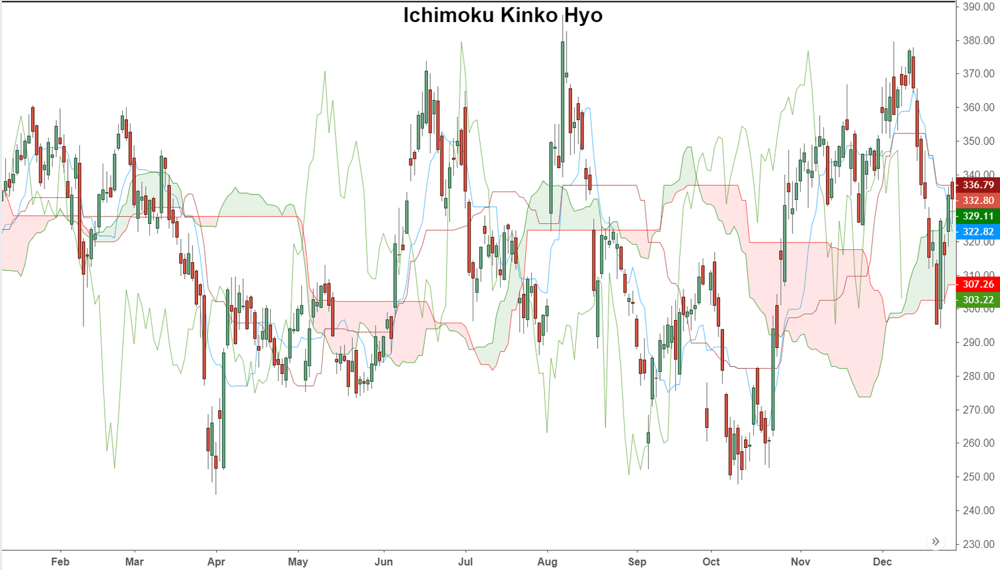

The Ichimoku Kinko Hyo indicator is a multifaceted tool in technical analysis, designed to evaluate market momentum and establish key support and resistance levels. Originating from Japan, the term "Ichimoku" translates to "one look," aptly capturing its holistic approach to market analysis. This unique capability allows traders to derive multiple analytical insights from a single glance at a chart. Since its conception, the Ichimoku Kinko Hyo has gained widespread acceptance across various global financial markets, including stocks, forex, and commodities.

Ichimoku's distinctiveness lies in its integration of five key components, offering traders a comprehensive market view without necessitating additional tools. This feature significantly contrasts with other indicators, which often require combination with supplementary indicators to achieve a comparable depth of analysis. The Ichimoku system incorporates aspects such as trend direction, momentum, and potential reversal points, which are critical in crafting more informed trading decisions.



Its global acceptance is further anchored by its versatility and adaptability to different markets, underscoring its importance beyond the Japanese markets where it was initially deployed. As traders increasingly seek robust tools to handle complex market environments, the Ichimoku Kinko Hyo stands out as an effective solution. Embracing it can potentially enhance a trader's ability to navigate the dynamic nature of financial markets, leveraging its comprehensive insights to achieve better trading outcomes.

## Table of Contents

## Understanding Ichimoku Kinko Hyo

Ichimoku Kinko Hyo, commonly known as Ichimoku Cloud, was developed by Japanese journalist Goichi Hosada in the late 1930s, becoming widely available in the 1960s after decades of research and refinement. The term "Ichimoku Kinko Hyo" translates to "one look equilibrium chart," reflecting its purpose of providing a comprehensive snapshot of market sentiment at a glance. This technical indicator is extensively utilized across various financial markets, including stocks, forex, and commodities.

The Ichimoku Kinko Hyo consists of five distinct components, each contributing unique insights into market trends, momentum, and potential support and resistance levels:

1. **Tenkan-sen (Conversion Line)**:
   - **Calculation**: The average of the highest high and the lowest low over the past 9 periods:
$$
     \text{Tenkan-sen} = \frac{(\text{Highest High}_{9 \text{ periods}} + \text{Lowest Low}_{9 \text{ periods}})}{2}

$$
   - **Significance**: The Tenkan-sen is used to detect short-term trends. A rising line indicates upward momentum, while a declining line suggests a downtrend.

2. **Kijun-sen (Base Line)**:
   - **Calculation**: The average of the highest high and the lowest low over the past 26 periods:
$$
     \text{Kijun-sen} = \frac{(\text{Highest High}_{26 \text{ periods}} + \text{Lowest Low}_{26 \text{ periods}})}{2}

$$
   - **Significance**: The Kijun-sen acts as an indicator of medium-term market trends. It often serves as a point of reference or a support/resistance level.

3. **Senkou Span A (Leading Span A)**:
   - **Calculation**: The average of the Tenkan-sen and Kijun-sen, plotted 26 periods ahead:
$$
     \text{Senkou Span A} = \frac{(\text{Tenkan-sen} + \text{Kijun-sen})}{2}

$$
   - **Significance**: As part of the Ichimoku Cloud or Kumo, it offers insights into potential future support/resistance levels.

4. **Senkou Span B (Leading Span B)**:
   - **Calculation**: The average of the highest high and lowest low over the past 52 periods, plotted 26 periods ahead:
$$
     \text{Senkou Span B} = \frac{(\text{Highest High}_{52 \text{ periods}} + \text{Lowest Low}_{52 \text{ periods}})}{2}

$$
   - **Significance**: Together with Senkou Span A, it forms the boundaries of the Ichimoku Cloud. The cloud's thickness and position indicate the strength of support/resistance zones.

5. **Chikou Span (Lagging Span)**:
   - **Calculation**: The closing price plotted 26 periods behind.
   - **Significance**: The Chikou Span serves as a lagging indicator, offering insight into the relationship between current and past prices. It can help confirm trend direction when aligned with current market prices.

Collectively, these elements offer a multi-dimensional view of the market, providing traders with the ability to assess market conditions, trends, and potential entry or [exit](/wiki/exit-strategy) points with a single glance. By combining historical data reference points and predictive elements, Ichimoku Kinko Hyo aids in making informed trading decisions.

## Components of Ichimoku Kinko Hyo

The Ichimoku Kinko Hyo indicator is composed of five distinct components that work together to provide a comprehensive view of market trends, support, and resistance levels. Each of these components plays a unique role in the analytical process, offering traders various insights based on market data.

### Tenkan-sen (Conversion Line)
The Tenkan-sen is calculated as the average of the highest high and the lowest low over the past nine periods. It can be expressed mathematically as:

$$
\text{Tenkan-sen} = \frac{\text{Highest High (9 periods)} + \text{Lowest Low (9 periods)}}{2}
$$

This line reflects the short-term price movement and serves as an indicator of trend direction. When the Tenkan-sen is trending upwards, it suggests an emerging bullish trend, while a downward trend may indicate a bearish market. It also acts as a minor support or resistance line.

### Kijun-sen (Base Line)
The Kijun-sen is similar in calculation to the Tenkan-sen but uses a longer time frame, analyzing the highest high and lowest low over the past 26 periods:

$$
\text{Kijun-sen} = \frac{\text{Highest High (26 periods)} + \text{Lowest Low (26 periods)}}{2}
$$

Functioning as a more stable indicator of market trends, the Kijun-sen offers signals of longer-term market direction. It can also signify potential reversals when the price crosses this line. Additionally, it often serves as a stronger support or resistance level compared to the Tenkan-sen.

### Senkou Span A (Leading Span A)
Senkou Span A is one of the boundaries that make up the Ichimoku cloud (Kumo) and is calculated as the average of the Tenkan-sen and Kijun-sen, projected 26 periods into the future:

$$
\text{Senkou Span A} = \frac{\text{Tenkan-sen} + \text{Kijun-sen}}{2} \, \text{(shifted 26 periods ahead)}
$$

This component forms the faster-moving boundary of the Kumo, indicating support or resistance. A rising Senkou Span A signals potential support, while a falling line may indicate potential resistance.

### Senkou Span B (Leading Span B)
Senkou Span B, the other boundary of the Kumo, is calculated using a longer 52-period high-low average and is also projected 26 periods into the future:

$$
\text{Senkou Span B} = \frac{\text{Highest High (52 periods)} + \text{Lowest Low (52 periods)}}{2} \, \text{(shifted 26 periods ahead)}
$$

This line often represents a longer-term support or resistance level compared to Senkou Span A. The space between Senkou Span A and B forms the cloud, which is pivotal in identifying the overall trend. If the price is above the Kumo, it suggests an upward trend, whereas a price below the Kumo indicates a downward trend.

### Chikou Span (Lagging Span)
The Chikou Span is the current period's closing price plotted 26 periods behind. This line provides a historical perspective of how today's price compares to past prices:

$$
\text{Chikou Span} = \text{Current Closing Price (shifted 26 periods back)}
$$

The Chikou Span helps in confirming trends; if this line is above past price levels, it corroborates a bullish trend and vice versa for a bearish trend.

Overall, these five components interact to provide a holistic view of market conditions, helping traders make informed decisions. The combination of short-term and long-term analyses, through different calculations and projections, enables Ichimoku Kinko Hyo to offer dynamic insights into potential price movements, effectively guiding traders in their strategies.

## Interpreting Ichimoku Kinko Hyo Indicators

The Ichimoku Kinko Hyo indicator provides various signals that traders can use to interpret market conditions. Understanding these signals involves analyzing the five lines of the indicator to discern trends and predict potential reversals. 

**Identifying Trends**

At the core of the Ichimoku system is the analysis of the Ichimoku cloud, or 'kumo'. The cloud, formed by the space between Senkou Span A and Senkou Span B, acts as a visual indicator of market trend and [momentum](/wiki/momentum). A bullish trend is suggested when the price is above the cloud, signaling upward momentum. Conversely, a bearish trend is indicated when the price is below the cloud, implying downward momentum. The thickness of the cloud can also provide insights into market [volatility](/wiki/volatility-trading-strategies) and potential support or resistance levels. A thicker cloud denotes stronger support or resistance, whereas a thinner cloud indicates weaker levels.

**Potential Reversal Signals**

Reversal signals in Ichimoku are often identified through crossovers and changes in cloud positioning. The Tenkan-sen (conversion line) crossing above the Kijun-sen (base line) typically signals a bullish reversal, whereas the Kijun-sen crossing above the Tenkan-sen suggests a bearish reversal. Additionally, when the price moves into the cloud, it can signal a potential change in trend, often preceding significant market reversals.

**Significance of the Ichimoku Cloud (Kumo)**

The Ichimoku cloud serves as a future projection of potential support and resistance areas. The cloud's leading nature offers traders a glimpse into possible future price movements, thus providing an advantage in anticipating shifts in the market. A bullish signal is reinforced when Senkou Span A is above Senkou Span B, whereas a bearish signal is when Senkou Span A is below Senkou Span B. 

**Use in Conjunction with Other Technical Analysis Tools**

While Ichimoku is a comprehensive indicator, employing it alongside other technical analysis tools can enhance its predictive power. For example, integrating the Ichimoku indicator with the Relative Strength Index (RSI) can provide deeper insights into overbought or oversold conditions. Similarly, using the Moving Average Convergence Divergence (MACD) alongside Ichimoku can help to confirm trend direction and strength.

In conclusion, by correctly interpreting the various signals provided by Ichimoku Kinko Hyo, traders can make informed decisions, anticipate potential market movements, and enhance trade accuracy when used in combination with other technical indicators.

## Trading Strategies Using Ichimoku Kinko Hyo

The Ichimoku Kinko Hyo indicator is a robust tool in technical analysis, providing traders with comprehensive insights for developing effective trading strategies. This section explores how the Ichimoku system can be employed to implement strategies, including trend identification, crossovers, and cloud breakouts, while also integrating with other technical indicators like RSI (Relative Strength Index) and MACD (Moving Average Convergence Divergence).

### Trend Identification

One of the primary uses of Ichimoku is trend identification. The Kijun-sen (baseline) and the Tenkan-sen (conversion line) serve as the primary trend indicators. A fundamental strategy is to observe these two lines for signals:

- **Bullish Trend:** When the Tenkan-sen crosses above the Kijun-sen, it suggests a bullish trend.
- **Bearish Trend:** Conversely, a cross of the Tenkan-sen below the Kijun-sen typically indicates a bearish trend.

The color and position of the Ichimoku cloud (kumo), formed between Senkou Span A and Senkou Span B, further confirm these trends. Prices above the cloud suggest bullishness, while prices below imply bearishness.

### Crossovers

Crossovers involving the Ichimoku components can serve as potent buy or sell signals. Besides the standard Tenkan-sen and Kijun-sen crossover:

- **Lagging Span (Chikou Span):** When this line crosses above past prices, it indicates a potential buy signal. Conversely, crossing below signifies a potential sell signal.

Python code for monitoring a crossover event can be essential for automation:

```python
# Sample Code for Monitoring Crossover
def check_crossover(tenkan_sen, kijun_sen):
    if tenkan_sen[-1] > kijun_sen[-1] and tenkan_sen[-2] <= kijun_sen[-2]:
        return "Bullish Crossover"
    elif tenkan_sen[-1] < kijun_sen[-1] and tenkan_sen[-2] >= kijun_sen[-2]:
        return "Bearish Crossover"
    return "No Crossover"
```

### Cloud Breakouts

The Ichimoku cloud, or kumo, offers support and resistance levels. A cloud [breakout](/wiki/breakout-trading) happens when the price moves through this cloud, representing significant momentum. Traders often look for:

- **Breakouts Above the Cloud:** Indicating potentially strong bullish momentum.
- **Breakouts Below the Cloud:** Suggesting a downward momentum.

Using these breakouts effectively often requires observing the thickness of the cloud, as thinner sections might indicate weaker support/resistance and could be more easily penetrated.

### Combining with Other Indicators

The Ichimoku system’s versatility is enhanced when paired with RSI and MACD:

- **RSI:** This momentum indicator can confirm Ichimoku's signals. For instance, an Ichimoku bullish signal paired with an RSI above 50 strengthens the buy decision.
- **MACD:** Identifying discrepancies between Ichimoku signals and MACD histograms can help catch early reversals or continuations, reducing false signals.

### Practical Application

Consider a scenario in which a stock exhibits upward momentum with the Tenkan-sen crossing above the Kijun-sen. If this crossover is followed by the price moving through the top of a thin Ichimoku cloud with the RSI confirming strength, this could solidify a buy position. Monitoring MacD might reveal supportive momentum, further enhancing decision accuracy.

This comprehensive approach, using Ichimoku as a standalone tool or in combination with other indicators, provides traders with a clearer picture of market conditions, enhancing their ability to make informed decisions swiftly.

## Pros and Cons of Ichimoku Kinko Hyo

Ichimoku Kinko Hyo is a widely respected technical analysis tool, known for its ability to provide a comprehensive view of market conditions. One of its most significant advantages is its all-encompassing nature. By integrating five different calculations, it offers traders a way to assess trend direction, momentum, and support/resistance levels all at once. This feature makes it particularly beneficial for those who seek to base their trading decisions on a holistic understanding of the market.

A crucial benefit of Ichimoku Kinko Hyo is its ability to present multiple data points in a single chart. It combines the Tenkan-sen (conversion line), Kijun-sen (base line), Senkou Span A (leading span), Senkou Span B (leading span), and the Chikou Span (lagging span) to provide a multi-dimensional view of price movements. This integration allows traders to identify potential entry and exit points quickly and helps them to visualize the strength or weakness of a market trend.

However, the Ichimoku Kinko Hyo is not without its limitations. One of the most commonly cited drawbacks is its complexity, particularly for novice traders. The multiple lines and spans can be overwhelming at first glance, making it challenging for beginners to interpret without adequate training. Additionally, the indicator can sometimes lag in markets characterized by high volatility and rapid price changes. This is due to its reliance on historical data, which might delay its responsiveness to swift market movements.

To overcome the challenges presented by the Ichimoku Kinko Hyo, traders are advised to complement it with other technical indicators. For example, combining it with momentum indicators such as the Relative Strength Index (RSI) or the Moving Average Convergence Divergence (MACD) can enhance the accuracy of trade signals. This multi-indicator approach can help mitigate the lagging issue in volatile markets by providing additional confirmation signals.

Furthermore, practice is essential for mastering the complexities of the Ichimoku Kinko Hyo. Traders should spend time back-testing the indicator with historical data to understand its nuances and how it performs under various market conditions. By doing so, they can develop a customized approach that aligns with their trading style and financial goals.

In summary, while Ichimoku Kinko Hyo is a powerful tool for providing a comprehensive market analysis, it requires practice and the potential combination with other indicators to maximize its effectiveness and mitigate its limitations.

## FAQs and Common Misconceptions

The Ichimoku Kinko Hyo indicator generates frequent queries from traders, particularly those new to its multifaceted approach. Below are some of the frequently asked questions and common misconceptions related to its application and interpretation.

### What Are the Best Uses of Ichimoku Kinko Hyo?

The Ichimoku Kinko Hyo is best used for identifying the direction and strength of trends, determining support and resistance levels, and identifying potential reversal points. Despite its apparent complexity, it is praised for providing a comprehensive market view using multiple data points simultaneously.

### Common Challenges Faced by Traders

One of the principal challenges is the perceived complexity of the Ichimoku Kinko Hyo. Beginners may struggle to interpret the various lines and the Ichimoku cloud's configurations. Additionally, applying default settings across all markets and time frames can lead to inaccuracies. Traders should tailor the settings to the specific market and time frame they are working within.

### Misconceptions About Predictive Abilities

A prevalent misconception is that Ichimoku Kinko Hyo can predict future price movements. While it provides insights into market dynamics, it is fundamentally based on historical data and trends, and should not be considered a tool for precise predictions. Its strength lies in offering a probabilistic outlook based on past market behavior rather than making deterministic forecasts.

### Practical Tips for Novices

1. **Start with Default Settings:** Begin with the standard settings (9, 26, 52) to get accustomed to the indicator's behavior and signals.

2. **Charts and Time Frames:** Use in conjunction with longer time frames for more reliable signals. Shorter time frames might introduce noise and false signals.

3. **Incremental Learning:** Focus on understanding each component separately—Tenkan-sen, Kijun-sen, Senkou Span A and B, and Chikou Span—before trying to interpret their combined signals.

4. **Supplement with Other Indicators:** Combine Ichimoku Kinko Hyo with other indicators such as RSI or MACD to provide additional confirmation and reduce the likelihood of false signals.

5. **Backtesting Strategies:** Utilize backtesting strategies on historical data to understand how the indicator would have behaved in past market conditions. This can help in fine-tuning parameters.

Implementing these practices can help novices avoid common pitfalls and harness the full potential of Ichimoku Kinko Hyo as a powerful tool in technical analysis.

## Conclusion

The Ichimoku Kinko Hyo indicator offers a distinctive method of technical analysis, providing a comprehensive view of market trends and dynamics through its multifaceted components. Despite its initial complexity, the Ichimoku system's design integrates multiple indicators into a single cohesive tool, thereby simplifying the technical analysis process for seasoned traders. By employing elements such as the Tenkan-sen, Kijun-sen, and the cloud (kumo), traders can effectively discern trend directions, momentum, and potential reversal points.

Traders are encouraged to incorporate the Ichimoku Kinko Hyo into their analysis toolkit, as it allows for simultaneous assessment of support and resistance levels while also highlighting potential trading signals. Its versatile nature makes it applicable across various financial markets, including equities, [forex](/wiki/forex-system), and commodities, aiding in the crafting of robust trading strategies.

To maximize the Ichimoku indicator's potential, readers are advised to practice its application across diverse market conditions. Customization to align with specific financial goals and trading styles can enhance its effectiveness. Newcomers to this technique should focus on understanding each component's role within the broader system to overcome any initial challenges. Employing Ichimoku alongside other technical tools, such as RSI or MACD, can further refine analysis and bolster decision-making.

By dedicating time to mastering the Ichimoku Kinko Hyo, traders can harness a powerful analytic perspective, tailored to navigating the complexities of the financial markets.

## References & Further Reading

[1]: Morimiya, K. (2012). ["Ichimoku Charts: An Introduction to Ichimoku Kinko Clouds"](https://books.google.com/books/about/Ichimoku_Charts.html?id=UMvZAgAAQBAJ) by Nicole Elliott. Harriman House.

[2]: Nison, S. (1991). ["Japanese Candlestick Charting Techniques"](https://archive.org/details/JapaneseCandlestickChartingTechniques2ndEditionSteveNison) by Steve Nison. Penguin Publishing Group.

[3]: Krzysztof, M. (2017). ["Forex guidebook - Ichimoku Kinko Hyo"](https://nononsenseforex.com/indicators/ichimoku-kinko-hyo/) IFC Markets.

[4]: Kirkpatrick, C. D., & Dahlquist, J. R. (2015). ["Technical Analysis: The Complete Resource for Financial Market Technicians"](https://ptgmedia.pearsoncmg.com/images/9780134137049/samplepages/9780134137049.pdf) by Charles D. Kirkpatrick II and Julie R. Dahlquist. FT Press.

[5]: Murphy, J. J. (1999). ["Technical Analysis of the Financial Markets: A Comprehensive Guide to Trading Methods and Applications"](https://archive.org/details/technicalanalysi0000murp) by John J. Murphy. New York Institute of Finance.