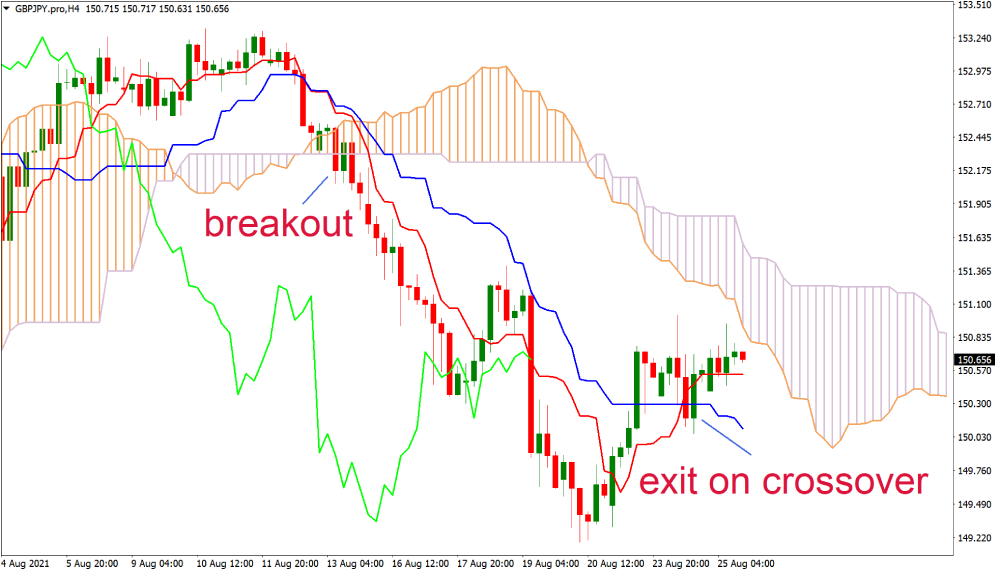

In algorithmic trading, technical indicators are indispensable for crafting effective trading strategies. Among these indicators, the Ichimoku Cloud stands out for its ability to provide a comprehensive analysis of market conditions, including trends, support and resistance levels, and momentum. This article focuses on the Ichimoku Cloud trading strategy and its significance in algorithmic trading. We will explore the components that constitute the Ichimoku Cloud, evaluate its effectiveness, and demonstrate the process of implementing this strategy using Python.

The Ichimoku Cloud, also known as Ichimoku Kinko Hyo, is a versatile tool developed by Japanese journalist Goichi Hosoda in the late 1930s and later published in the 1960s. It combines several elements to provide a quick glimpse of an asset's direction and potential future performance. The indicator includes five components: Tenkan-Sen, Kijun-Sen, Senkou Span A, Senkou Span B, and Chikou Span. These elements work in concert to form the 'cloud', which visualizes the equilibrium or balance of price action.



By understanding these components, traders can gain insights into the market's trend direction and strength, potential reversal points, and future price levels. This understanding makes the Ichimoku Cloud particularly helpful in identifying trends and making informed trading decisions. This article will equip you with the knowledge to use the Ichimoku Cloud effectively in your trading strategies and enhance your algorithmic trading performance.

## Table of Contents

## What is the Ichimoku Cloud Indicator?

The Ichimoku Cloud, formally known as Ichimoku Kinko Hyo, is a comprehensive technical analysis indicator developed by Japanese journalist Goichi Hosoda. It offers traders a multidimensional view of the market by illustrating potential price movements using five key components: Tenkan-Sen, Kijun-Sen, Senkou Span A, Senkou Span B, and Chikou Span. These components work synergistically to form a "cloud" (Kumo), which provides insight into market trend direction, support and resistance levels, and momentum.

1. **Tenkan-Sen (Conversion Line):** This is calculated as the average of the highest high and the lowest low over the past 9 periods. It serves as a minor support and resistance level and can indicate short-term price momentum. The formula is given by:
$$
   \text{Tenkan-Sen} = \frac{(\text{Highest High} + \text{Lowest Low})}{2}

$$

2. **Kijun-Sen (Base Line):** Calculated over the past 26 periods, this line represents a more significant support and resistance level. It also generates signals when used with the Tenkan-Sen. Its formula is:
$$
   \text{Kijun-Sen} = \frac{(\text{Highest High} + \text{Lowest Low})}{2}

$$

3. **Senkou Span A (Leading Span A):** This is the midpoint between the Tenkan-Sen and Kijun-Sen, plotted 26 periods ahead, contributing to the Ichimoku Cloud. It is calculated as follows:
$$
   \text{Senkou Span A} = \frac{(\text{Tenkan-Sen} + \text{Kijun-Sen})}{2}

$$

4. **Senkou Span B (Leading Span B):** Calculated as the average of the highest high and the lowest low over the past 52 periods, and plotted 26 periods into the future. Together with Senkou Span A, it forms the cloud's boundaries:
$$
   \text{Senkou Span B} = \frac{(\text{Highest High} + \text{Lowest Low})}{2}

$$

5. **Chikou Span (Lagging Span):** This is the current closing price plotted 26 periods back. It serves as a visual gauge of market sentiment.

The cloud (Kumo) formed between Senkou Span A and Senkou Span B visualizes support and resistance, with its thickness representing the strength of those levels. When price action is above the cloud, it suggests a bullish trend; when below, a bearish trend is implied. Furthermore, the space between the Spans can indicate potential trend reversals.

By providing a holistic view of the market at a single glance, the Ichimoku Cloud is valued for its ability to synthesize a wealth of information into an intuitive visual format, making it an indispensable tool for traders striving for comprehensive market analysis.

## Is Ichimoku a Good Strategy?

The effectiveness of an Ichimoku trading strategy is contingent upon several factors, including the prevailing market conditions and the trader's adherence to disciplined practices. At its core, the Ichimoku Cloud offers a comprehensive suite of insights into market dynamics, making it a versatile tool in the trader’s toolkit. However, as with any trading strategy, its success relies heavily on proper risk management and thorough [backtesting](/wiki/backtesting).

Risk management is paramount when employing the Ichimoku strategy to mitigate potential losses. This involves setting clear trading rules, such as stop-loss and take-profit levels, and adhering to them rigorously. Backtesting the Ichimoku strategy across historical data allows traders to assess its performance and robustness in various market conditions. This process involves testing the strategy on past data to evaluate its risk-reward profile and potential drawdowns.

Historically, the Ichimoku Cloud has been effective in reducing drawdowns, acting as a reliable tool for trend identification and reversal signals. Its components, especially the interaction of Tenkan-Sen and Kijun-Sen, provide clear guidance on potential trend changes. Nevertheless, it is important to acknowledge that the Ichimoku strategy may not consistently outperform the market under all conditions. Market [volatility](/wiki/volatility-trading-strategies), the asset class, and external economic factors can influence its effectiveness.

Ultimately, the key to harnessing the Ichimoku strategy lies in customizing it to align with individual trading goals and the specific market conditions one is trading in. This may involve adjusting the periods used for calculating the Ichimoku components or combining it with other technical indicators to enhance its predictive power.

In summary, while the Ichimoku Cloud presents numerous advantages as a technical analysis tool, its success as a trading strategy is not guaranteed. Traders must exercise due diligence in adapting and testing the strategy to meet their unique requirements and risk tolerance.

## Best Time Frame for Using Ichimoku in Algo Trading

The Ichimoku Cloud is a versatile technical indicator that can be applied across various time frames, allowing for its use in different trading strategies. Scalpers, who focus on short-term trades, may apply the Ichimoku Cloud on minute charts to take advantage of small price movements. Conversely, swing traders and position traders, who hold their positions over days or even weeks, might find the indicator more useful on hourly or daily charts.

Choosing the optimal time frame for deploying the Ichimoku Cloud in [algorithmic trading](/wiki/algorithmic-trading) hinges on backtesting, which allows traders to determine how the indicator performs across different scenarios. The choice of time frame should also consider the specific asset class and its volatility, as some assets may exhibit more pronounced trends over certain time frames.

In algorithmic trading, using daily bars is often recommended by experts. Daily bars can help capture significant market movements while minimizing the noise that smaller time frames often exhibit. This noise can lead to false signals and potentially unprofitable trades. For example, daily charts can offer a clearer picture of the longer-term trends, making it easier to identify genuine signals for entry and [exit](/wiki/exit-strategy) points.

When backtesting the Ichimoku Cloud strategy, traders should focus on key indicators, such as the Tenkan-Sen and Kijun-Sen crossovers, cloud support and resistance levels, and the position of the Chikou Span to past prices. Additionally, it is prudent to account for transaction costs and slippage in the model to ensure the strategy's practicality in real-world trading conditions.

By combining these findings with rigorous backtesting, traders can refine their strategies to better suit their risk appetite and trading objectives, enhancing the probability of success in an algorithmic trading framework.

## Using the Ichimoku Cloud Effectively

Understanding each component of the Ichimoku Cloud is essential for traders aiming to leverage its full potential. This technical indicator can provide critical insights into market trends, support and resistance levels, and potential price breakouts.

The Ichimoku Cloud consists of several lines: the Tenkan-Sen (conversion line), Kijun-Sen (base line), Senkou Span A, Senkou Span B, and Chikou Span (lagging span). Each of these components plays a distinct role in market analysis:

1. **Trend Identification**: The 'cloud' itself, formed between Senkou Span A and Senkou Span B, serves as a visual representation of market trends. When the price is above the cloud, it generally indicates a bullish trend, while a price below the cloud suggests a bearish trend. A thick cloud might denote significant support or resistance levels.

2. **Spotting Potential Price Breakouts**: The Tenkan-Sen and Kijun-Sen are crucial for identifying potential breakout opportunities. The crossover strategy is commonly used, where a cross of the Tenkan-Sen above the Kijun-Sen can signal a buying opportunity, and a cross below can signal a selling opportunity. This method is particularly valuable for traders looking to make timely market entries or exits.

3. **Gauging Market Sentiment**: The Chikou Span provides insights into market sentiment by comparing the current closing price to the previous prices. If it is above the price action, it suggests bullish sentiment; if below, bearish sentiment is inferred.

To apply the Ichimoku Cloud effectively, traders often pair it with other technical indicators to confirm signals and improve the reliability of trading strategies. For instance, combining it with indicators like RSI (Relative Strength Index) or MACD (Moving Average Convergence Divergence) can enhance the decision-making process by providing additional context to the market's [momentum](/wiki/momentum) and overbought or oversold conditions.

Backtesting any strategy incorporating the Ichimoku Cloud is a crucial step before applying it to live trading. This process involves using historical data to simulate how a strategy would have performed, allowing traders to optimize their settings like time frames and crossover thresholds. The goal is to assess the strategy's effectiveness over different market conditions and identify periods of high reliability or potential drawdowns.

Here is a basic Python snippet using popular libraries such as `pandas` and `mplfinance` to plot the Ichimoku Cloud:

```python
import pandas as pd
import mplfinance as mpf

def calculate_ichimoku(data):
    # Tenkan-Sen (9-period high + 9-period low)/2
    high_9 = data['High'].rolling(window=9).max()
    low_9 = data['Low'].rolling(window=9).min()
    tenkan_sen = (high_9 + low_9) / 2

    # Kijun-Sen (26-period high + 26-period low)/2
    high_26 = data['High'].rolling(window=26).max()
    low_26 = data['Low'].rolling(window=26).min()
    kijun_sen = (high_26 + low_26) / 2

    # Senkou Span A (Tenkan-Sen + Kijun-Sen)/2 shifted 26 periods ahead
    senkou_span_a = ((tenkan_sen + kijun_sen) / 2).shift(26)

    # Senkou Span B (52-period high + 52-period low)/2 shifted 26 periods ahead
    high_52 = data['High'].rolling(window=52).max()
    low_52 = data['Low'].rolling(window=52).min()
    senkou_span_b = ((high_52 + low_52) / 2).shift(26)

    # Chikou Span (closing price shifted 26 periods back)
    chikou_span = data['Close'].shift(-26)

    data['Tenkan-Sen'] = tenkan_sen
    data['Kijun-Sen'] = kijun_sen
    data['Senkou Span A'] = senkou_span_a
    data['Senkou Span B'] = senkou_span_b
    data['Chikou Span'] = chikou_span

    return data

# Example data, replace with actual data retrieval methods
data = pd.DataFrame({...})
ichimoku_data = calculate_ichimoku(data)

# Plotting
mpf.plot(ichimoku_data, type='candle', addplot=[
    mpf.make_addplot(ichimoku_data['Senkou Span A'], color='green'),
    mpf.make_addplot(ichimoku_data['Senkou Span B'], color='red'),
    mpf.make_addplot(ichimoku_data['Tenkan-Sen'], color='blue'),
    mpf.make_addplot(ichimoku_data['Kijun-Sen'], color='orange'),
    mpf.make_addplot(ichimoku_data['Chikou Span'], color='purple')
])
```

Implementing and backtesting the Ichimoku Cloud with code similar to this allows traders to refine their strategies based on historical performance, optimizing them for real-world trading.

## Implementing the Ichimoku Cloud Strategy in Python

Implementing the Ichimoku Cloud strategy in Python involves utilizing various libraries that facilitate data handling, visualization, and backtesting. Python’s `pandas` library is essential for managing financial data, while `mplfinance` offers powerful charting capabilities to visualize technical indicators, including the Ichimoku Cloud.

### 1. Downloading Financial Data

The first step is to obtain historical financial data, which can be accessed using libraries like `yfinance`. This library allows for easy download of historical stock data from Yahoo Finance.

```python
import yfinance as yf

# Download historical data for a given stock
symbol = 'AAPL'
data = yf.download(symbol, start='2020-01-01', end='2023-01-01')
```

### 2. Calculating Ichimoku Cloud Components

The Ichimoku Cloud consists of several components, calculated as follows:

- **Tenkan-Sen (Conversion Line):**
$$
  \text{Tenkan-Sen} = \frac{\text{Highest High (9 periods)} + \text{Lowest Low (9 periods)}}{2}

$$

- **Kijun-Sen (Base Line):**
$$
  \text{Kijun-Sen} = \frac{\text{Highest High (26 periods)} + \text{Lowest Low (26 periods)}}{2}

$$

- **Senkou Span A (Leading Span A):**
$$
  \text{Senkou Span A} = \frac{\text{Tenkan-Sen} + \text{Kijun-Sen}}{2}

$$

- **Senkou Span B (Leading Span B):**
$$
  \text{Senkou Span B} = \frac{\text{Highest High (52 periods)} + \text{Lowest Low (52 periods)}}{2}

$$

- **Chikou Span (Lagging Span):** Closing price plotted 26 days in the past.

These calculations can be implemented with `pandas` as:

```python
# Calculate the Ichimoku Cloud components
high_9 = data['High'].rolling(window=9).max()
low_9 = data['Low'].rolling(window=9).min()
data['Tenkan-Sen'] = (high_9 + low_9) / 2

high_26 = data['High'].rolling(window=26).max()
low_26 = data['Low'].rolling(window=26).min()
data['Kijun-Sen'] = (high_26 + low_26) / 2

data['Senkou Span A'] = ((data['Tenkan-Sen'] + data['Kijun-Sen']) / 2).shift(26)

high_52 = data['High'].rolling(window=52).max()
low_52 = data['Low'].rolling(window=52).min()
data['Senkou Span B'] = ((high_52 + low_52) / 2).shift(26)

data['Chikou Span'] = data['Close'].shift(-26)
```

### 3. Generating Buy/Sell Signals

Generating signals involves determining crossover points between the Tenkan-Sen and Kijun-Sen, as well as the position of the price relative to the cloud (Senkou Spans).

```python
# Determine buy and sell signals
data['Buy Signal'] = (data['Tenkan-Sen'] > data['Kijun-Sen']) & (data['Tenkan-Sen'].shift(1) <= data['Kijun-Sen'].shift(1))
data['Sell Signal'] = (data['Tenkan-Sen'] < data['Kijun-Sen']) & (data['Tenkan-Sen'].shift(1) >= data['Kijun-Sen'].shift(1))
```

### 4. Visualization

Visualizing the Ichimoku Cloud components and signals can be done using `mplfinance`:

```python
import mplfinance as mpf

# Add columns for the high and low values of the cloud
cloud = data[['Senkou Span A', 'Senkou Span B']].copy()
cloud.columns = ['spanA', 'spanB']

# Visualize
mpf.plot(
    data,
    type='candle',
    style='charles',
    volume=False,
    addplot=[
        mpf.make_addplot(data['Tenkan-Sen'], color='blue'),
        mpf.make_addplot(data['Kijun-Sen'], color='red'),
        mpf.make_addplot(data['Chikou Span'], color='green'),
        mpf.make_addplot(data['Buy Signal'], type='scatter', markersize=100, marker='^', color='g'),
        mpf.make_addplot(data['Sell Signal'], type='scatter', markersize=100, marker='v', color='r')
    ],
    fill_between=dict(y1=cloud.spanA, y2=cloud.spanB, color="grey", alpha=0.3)
)
```

### 5. Automated Backtesting

Automated backtesting in Python can be accomplished with libraries such as `Backtrader` or `PyAlgoTrade`, allowing for performance evaluation under historical market conditions. This helps refine trading strategies for optimal performance.

```python
# This is a conceptual backtest snippet
# Consider using libraries like Backtrader for full-featured backtesting
from backtest import Strategy, Backtest

class IchimokuStrategy(Strategy):
    def init(self):
        self.ichimoku = self.data['Ichimoku Cloud'].sma(10)

    def next(self):
        if self.buy_signal:
            self.buy()
        elif self.sell_signal:
            self.sell()

backtest = Backtest(data, IchimokuStrategy)
results = backtest.run()
```

By effectively using Python, traders can automate the complex calculations and enhance their decision-making process through data analysis and visualization, providing a robust framework for using the Ichimoku Cloud in algorithmic trading.

## Conclusion

The Ichimoku Cloud stands as a powerful component in the toolkit of algorithmic traders, providing a multifaceted approach to analyzing market trends, strength, and momentum. By synthesizing multiple market dynamics into a singular visual representation, it offers traders an efficient means to gauge potential market movements.

To deploy this indicator effectively, it is crucial to develop a comprehensive understanding of its distinct components, namely the Tenkan-Sen, Kijun-Sen, Senkou Span A, Senkou Span B, and Chikou Span. Each plays a pivotal role in interpreting market data, identifying trends, and signaling price breakouts, which are essential for making informed trading decisions.

Selection of appropriate time frames is integral to optimizing the use of the Ichimoku Cloud. Depending on the trader's specific strategy—be it [scalping](/wiki/gamma-scalping), [day trading](/wiki/day-trading-spy), swing trading, or position trading—different time frames may be more suitable. Daily charts, for instance, are often recommended for capturing substantial market movements while minimizing noise, making them particularly useful for algorithmic trading.

Risk management remains paramount when utilizing the Ichimoku Cloud. It is essential to develop strategies that incorporate sound risk management principles, such as setting stop-loss levels and position sizing. These strategies help mitigate potential losses and balance the pursuit of profit with the preservation of trading capital.

Incorporating the Ichimoku Cloud into an algorithmic trading strategy not only enhances the decision-making process but also potentially augments trading performance. By automating backtesting through programming languages such as Python, traders can refine their strategies to adapt to varying market conditions, ensuring their approach remains robust and responsive.

The Ichimoku Cloud, therefore, offers a comprehensive framework for traders seeking to leverage market data effectively, combining technical analysis with strategic execution to potentially improve outcomes in algorithmic trading.

## References & Further Reading

[1]: "Ichimoku Charts: An Introduction to Ichimoku Kinko Clouds" by Nicole Elliott. A detailed book providing a comprehensive introduction to the use of Ichimoku charts in trading.

[2]: "Trading with Ichimoku Clouds: The Essential Guide to Ichimoku Kinko Hyo Technical Analysis" by Manesh Patel. This book explores the practical application of Ichimoku charts in various market scenarios.

[3]: "Technical Analysis of the Financial Markets: A Comprehensive Guide to Trading Methods and Applications" by John J. Murphy. A widely respected book that offers insights into various technical indicators, including the Ichimoku Cloud.

[4]: "Algorithmic Trading: Winning Strategies and Their Rationale" by Ernie P. Chan. This book provides an overview of strategies used in algorithmic trading, including those involving technical indicators.