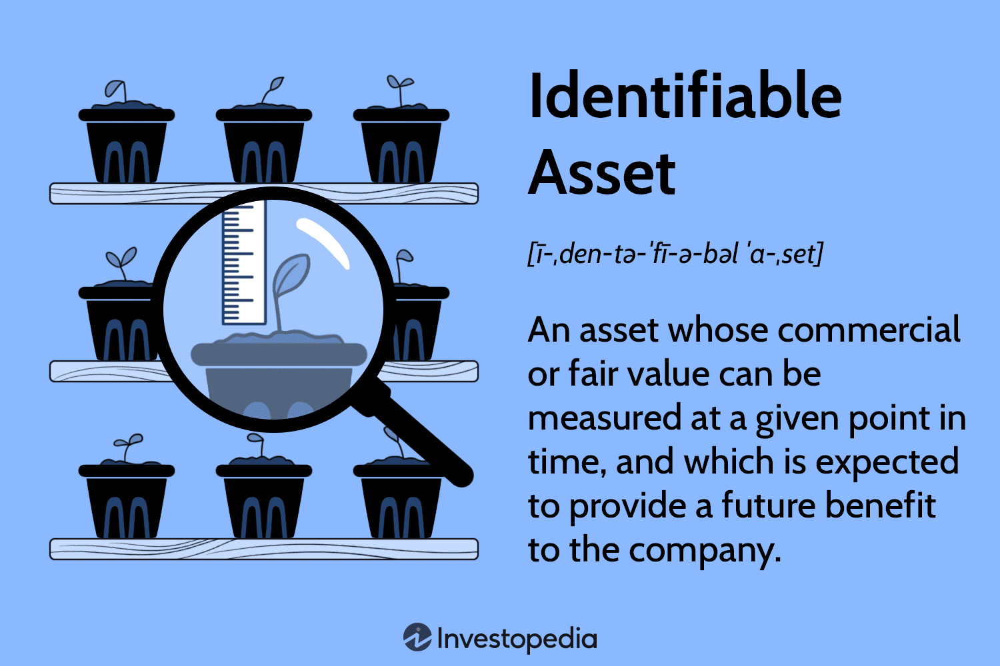

In today's rapidly evolving financial landscape, understanding key financial concepts and technologies is essential for investors and organizations. The ability to accurately assess and manage assets can significantly impact financial performance and strategic decisions. Among these concepts, 'identifiable assets' hold prominence, especially when considering mergers and acquisitions. Identifiable assets possess a recognizable commercial or fair value that can be crucial for determining the overall value of a company and its potential for generating future economic benefits. These assets can be tangible, such as cash or equipment, or intangible, like patents and proprietary technologies.

The integration of advanced technologies, specifically algorithmic trading, has revolutionized how assets are managed within the financial industry. Algorithmic trading, which utilizes complex algorithms to execute trades at high speed and volume, has become a formidable tool in asset management. This technology not only enhances the precision of trades but also enables the development of sophisticated trading strategies that can lead to improved investment outcomes.



By combining a deep understanding of identifiable assets with the strategic use of algorithmic trading, investors and organizations can optimize their financial positions and navigate the complexities of modern financial markets. This synergy allows for a more strategic allocation of resources and a sharper alignment of trading practices with overarching financial goals.

## Table of Contents

## Defining Identifiable Assets

Identifiable assets are defined as assets that possess a distinct commercial or fair value at a certain point in time, thereby providing potential future economic benefits to the entity that holds them. These assets are pivotal during mergers and acquisitions as they contribute to the determination of a company's valuation and subsequent integration processes. They typically fall into two categories: tangible and intangible assets.

Tangible assets are physical items that can be appraised with relative ease. Examples include cash, cash equivalents like treasury bills, and equipment. These assets are often critical for day-to-day operations and can be quickly liquidated or utilized to generate revenue. For instance, equipment contributes directly to the production process, thereby impacting both operational efficiency and revenue generation.

Conversely, intangible assets are non-physical entities that still hold substantial value. These include patents, trademarks, and copyrights, which are integral to maintaining competitive advantages and market positioning. Intangible assets often embody intellectual property, brand reputation, or exclusive rights, extending their utility beyond immediate commercial activities by ensuring sustained competitive advantages.

Overall, the identification and evaluation of these assets play a crucial role in financial planning and strategic development within organizations, ensuring informed decision-making and fostering long-term growth.

## Examples of Identifiable Assets

Identifiable assets are critical components in financial analysis and reporting, particularly in the context of mergers and acquisitions. These assets, both tangible and intangible, have a distinct and measurable value, which can be leveraged to predict potential future benefits for a company. Here are some common examples:

1. **Cash and Cash Equivalents**: This category includes assets that are immediately accessible and convertible to cash with negligible risk of value change. These encompass currency, bank deposits, and short-term investments like treasury bills and commercial paper. Cash and cash equivalents are vital for maintaining liquidity and ensuring the company can meet its immediate obligations.

2. **Inventories**: Comprising raw materials, work-in-progress, and finished goods, inventories are assets held for sale in the ordinary course of business or for use in producing goods or services. They are crucial for business operations, as they enable the company to meet consumer demand without delay. The valuation of inventories impacts a company's balance sheet and cost of goods sold, affecting profitability.

3. **Property and Equipment**: Tangible assets like buildings, machinery, vehicles, and office furniture fall under this category. These are used in a company's operations to generate income over time. The value of property and equipment, also known as fixed assets, diminishes over time through depreciation, which must be accounted for in financial statements to reflect their decreasing utility.

Identifiable assets play an essential role in determining a company's financial health and potential for growth. Accurately assessing these assets is fundamental for strategic planning and decision-making, enabling organizations to leverage their resources effectively.

## Algorithmic Trading: An Overview

Algorithmic trading refers to the deployment of computer algorithms to execute trades at speeds and volumes unattainable by human traders. Utilizing predefined criteria, algorithms automate the trading process, often leveraging statistical models to identify optimal market entry and [exit](/wiki/exit-strategy) points. This approach enhances trading efficiency by significantly reducing human error and emotional biases, which can lead to inconsistent decision-making.

Trading efficiency is markedly improved through several algorithmic functions. These include order execution strategies like [volume](/wiki/volume-trading-strategy)-weighted average price (VWAP) and time-weighted average price (TWAP), which systematically slice large trades into smaller, more manageable chunks. Such strategies minimize market impact and achieve better pricing.

Moreover, [algorithmic trading](/wiki/algorithmic-trading) enhances decision-making capabilities and investment outcomes. Algorithms analyze vast datasets to detect trading signals and execute trades when favorable conditions are met, often within milliseconds. For instance, mean reversion strategies assume that asset prices will revert to their historical mean, allowing algorithms to buy undervalued assets and sell overvalued ones. Conversely, [momentum](/wiki/momentum)-based algorithms capitalize on upward or downward price trends, executing trades in alignment with demonstrated market momentum.

In addition to improving execution, algorithmic trading optimizes risk management by implementing rigorous stop-loss rules and dynamic hedging strategies. This protective layer prevents runaway losses in volatile markets by ensuring exits when predefined risk thresholds are breached.

Algorithmic trading's advantages in managing financial assets are evident in various key areas such as equities, [forex](/wiki/forex-system), and derivatives markets. By integrating [machine learning](/wiki/machine-learning) models, algorithms adapt and refine their strategies based on evolving market conditions, thereby enhancing returns and mitigating risks.

In Python, a basic algorithmic trading strategy could involve the use of libraries like Pandas for data handling, NumPy for numerical computations, and [backtrader](/wiki/backtrader) or Zipline for simulating trading strategies:

```python
import pandas as pd
import numpy as np
import backtrader as bt

class MovingAverageStrategy(bt.SignalStrategy):
    def __init__(self):
        # Moving average crossover strategy
        ma_short = bt.indicators.SimpleMovingAverage(self.data.close, period=10)
        ma_long = bt.indicators.SimpleMovingAverage(self.data.close, period=30)
        self.signal_add(bt.SIGNAL_LONG, ma_short > ma_long)
        self.signal_add(bt.SIGNAL_SHORT, ma_short < ma_long)

# Initialize Cerebro engine
cerebro = bt.Cerebro()
cerebro.addstrategy(MovingAverageStrategy)

# Load data
data = bt.feeds.YahooFinanceData(dataname='AAPL', fromdate=pd.Timestamp('2022-01-01'),
                                 todate=pd.Timestamp('2023-01-01'))
cerebro.adddata(data)

# Run strategy
cerebro.run()
cerebro.plot()
```

This script provides a simple moving average crossover strategy, a common starting point in algorithmic trading. By continuously refining these strategies and incorporating advanced analytics, traders harness algorithmic trading to not only streamline execution but also enhance the overall strategic framework governing their investment positions.

## Role of Algorithmic Trading in Asset Management

Algorithmic trading is a pivotal component in modern financial environments, significantly impacting asset management through the facilitation of systematic and strategic approaches. The core advantages of algorithmic trading lie in its ability to enhance portfolio management and maximize trading efficiencies by leveraging sophisticated algorithms to make rapid and accurate trading decisions. 

At the center of algorithmic trading are various strategies that utilize mathematical models and computational techniques to achieve optimal trading outcomes. High-frequency trading ([HFT](/wiki/high-frequency-trading-strategies)) is one such strategy, characterized by executing a large number of orders at extremely high speeds. This strategy capitalizes on small price discrepancies and relies heavily on ultra-low latency execution to generate profits.

Trend following is another widely used strategy, where algorithms are designed to identify and exploit market momentum by detecting persistent trends. This approach involves the use of moving averages, momentum indicators, and other technical analysis tools to make informed trading decisions based on historical price patterns.

Market making is a strategy that aims to provide [liquidity](/wiki/liquidity-risk-premium) to markets by continuously quoting both buy and sell prices for selected securities. Market-making algorithms narrow the bid-ask spread, enabling traders to profit from the difference between the prices while minimizing their exposure to market [volatility](/wiki/volatility-trading-strategies).

These algorithmic trading strategies are applicable across a variety of asset classes, including stocks, derivatives, and cryptocurrencies. The efficiency gains from using algorithms are particularly pronounced in highly liquid markets, where rapid execution and adaptation to market conditions are paramount. 

In addition, the use of algorithms in asset management facilitates risk management by employing rigorous quantitative models to assess potential scenarios and reduce exposure to adverse market conditions. Advanced algorithms can dynamically adjust portfolio compositions to maintain alignment with investment objectives and risk tolerance.

By integrating such strategic approaches, algorithmic trading not only enhances the decision-making processes of asset managers but also contributes to increased market efficiency and liquidity. This aligns trading operations with broader financial goals, ultimately fostering growth and resilience in volatile markets.

## Examples of Financial Assets in Algo Trading

Stocks, exchange-traded funds (ETFs), and derivatives such as options and futures play a pivotal role in algorithmic trading due to their high liquidity and substantial trading volumes. These qualities make them ideal candidates for algorithmic strategies that require swift execution and the ability to process large volumes of trades rapidly. The liquidity of these financial assets ensures minimal slippage and allows traders to enter and exit positions efficiently, thereby enhancing the effectiveness of trading algorithms.

Furthermore, fixed-income securities such as bonds, and foreign exchange (forex) markets, also stand to benefit significantly from algorithmic trading. Bonds, traditionally viewed as more stable financial instruments, present opportunities for algorithmic trading algorithms to exploit inefficiencies and variances in yield curves, credit spreads, and [interest rate](/wiki/interest-rate-trading-strategies) changes. By utilizing advanced algorithms, traders can automate the execution of trades based on complex strategies that [factor](/wiki/factor-investing) in these variables, potentially capturing [arbitrage](/wiki/arbitrage) opportunities and optimizing yields.

In the forex market, the immense volume and continuous trading hours provide fertile ground for algorithmic trading. Algorithms can be programmed to monitor currency pairs continuously, identifying and acting on patterns that indicate potential price movements. The high liquidity of forex markets ensures that trades can be executed with minimal delay at nearly any time, optimizing strategy execution and allowing traders to respond swiftly to global economic events and emerging trends.

Overall, the integration of algorithmic trading into these asset classes enables more efficient trade execution, improved market-making, and enhanced strategy implementation. This technological advancement allows traders and asset managers to navigate complex markets with precision, leveraging the speed and accuracy of computational algorithms to drive trading success.

## Challenges and Considerations in Algorithmic Trading

Algorithmic trading has transformed the financial industry through its ability to execute large volumes of trades with high speed and precision. However, these advantages come with several challenges and considerations that traders must address to maintain effectiveness and stability in trading operations.

One significant challenge is over-optimization. This occurs when trading algorithms are excessively tuned to historical data, resulting in strategies that perform well in [backtesting](/wiki/backtesting) but fail in real-world conditions. Over-optimized algorithms often lack robustness, making them vulnerable to market changes and leading to substantial losses. To mitigate this risk, traders can use techniques such as cross-validation and walk-forward analysis to ensure that algorithms generalize well to unseen data.

Technical failures are another critical consideration in algorithmic trading. The reliance on complex software systems and hardware infrastructure exposes trades to various technical risks. Network failures, hardware malfunctions, and software bugs can lead to incorrect executions and substantial financial losses. Implementing redundancy and fail-safe mechanisms, regular system audits, and continuous monitoring of trading environments are essential strategies to manage these risks.

The evolving regulatory landscape also presents a challenge to algorithmic trading. Financial authorities globally are increasingly scrutinizing algorithmic trading practices to promote market fairness and stability. Regulations often require enhanced transparency, auditability of trading algorithms, and stringent risk management protocols. Traders must stay informed about regulatory changes and ensure compliance by maintaining detailed documentation of their algorithms and adopting risk management practices that align with regulatory standards.

Effective risk management is crucial in algorithmic trading given its inherent risks. Defining stop-loss limits is a fundamental practice to prevent excessive losses by automatically exiting positions that move against expectations. Maintaining adequate capital reserves is another important strategy. By ensuring sufficient liquidity, traders can withstand market volatility without being forced to liquidate positions under unfavorable conditions. Diversification of trading strategies and assets also helps mitigate exposure to specific market risks, enhancing the resilience of trading portfolios.

In conclusion, while algorithmic trading offers significant benefits in terms of speed and efficiency, recognizing and addressing its challenges is critical for sustainable operations. Balancing optimization with robustness, ensuring technical reliability, complying with regulatory standards, and implementing comprehensive risk management practices are vital for the successful deployment of algorithmic trading systems.

## Conclusion

The interplay between identifiable assets and algorithmic trading represents a dynamic aspect of modern finance. Identifiable assets, with their defined commercial or fair value, are foundational to corporate financial management. They play a crucial role in determining the overall value of a company, thereby influencing strategic decisions, particularly in contexts such as mergers and acquisitions. On the other hand, algorithmic trading introduces a technological revolution, enabling increased efficiency, precision, and speed in financial transactions.

Understanding these concepts is crucial for enhancing asset management strategies. The recognition of identifiable assets aids organizations in accurately valuing their holdings and optimizing resource allocation. Meanwhile, algorithmic trading empowers investors and institutions to execute trades with greater efficiency, minimizing human error and bias. This technological leverage allows for the development of sophisticated trading strategies that can adjust swiftly to market movements.

By adopting robust algorithms and advanced technologies, investors and institutions can effectively navigate the complexities of modern financial markets. This approach not only optimizes trading strategies but also aligns outcomes with broader financial goals, driving growth and improving the return on investments. Embracing these advancements equips market participants with tools that can enhance decision-making processes and strategic planning, paving the way for sustained financial success.

## References & Further Reading

Investopedia's resources provide foundational insights into both identifiable assets and algorithmic trading, offering practical definitions and applications in the financial world. These resources are useful for understanding the core concepts and operational frameworks involved in these areas.

The paper by Bergstra, J., Bardenet, R., Bengio, Y., & Kégl, B. titled "Algorithms for Hyper-Parameter Optimization," published in the Advances in Neural Information Processing Systems, explores advanced techniques for optimizing hyper-parameters in machine learning algorithms. This research is particularly relevant for improving algorithmic trading strategies, as these strategies often require fine-tuning of parameters to enhance performance and efficiency.

Lopez de Prado's "Advances in Financial Machine Learning" provides comprehensive coverage of cutting-edge machine learning techniques tailored for financial markets. This work offers insights into how machine learning can be applied to develop robust trading algorithms that adapt to evolving market conditions, making it a valuable resource for financial professionals interested in algorithmic trading.

Chan, E.P.'s book, "Quantitative Trading: How to Build Your Own Algorithmic Trading Business," is an essential guide for developing and implementing algorithmic trading systems. It covers practical aspects of building a trading infrastructure, designing trading strategies, and testing them in live markets, thus serving as a critical reference for those aiming to create their algorithmic trading businesses.

These references collectively offer a wealth of knowledge essential for deepening one's understanding of identifiable assets and algorithmic trading, providing both theoretical foundations and practical applications.

