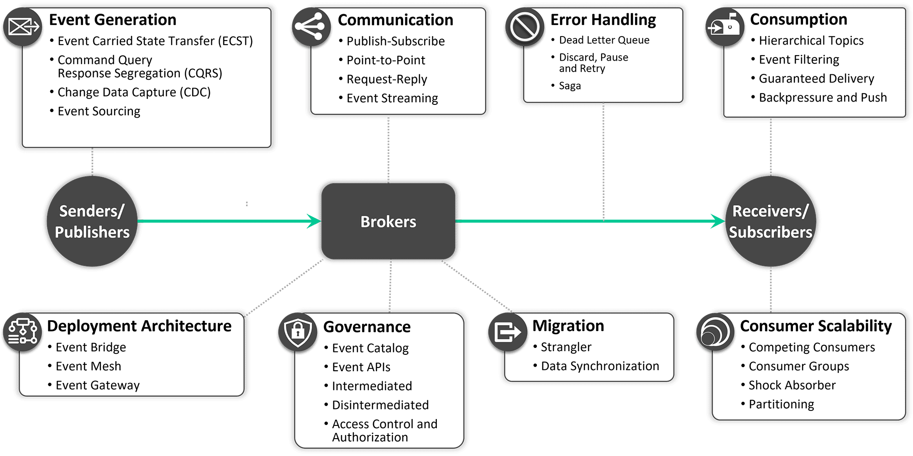

## Table of Contents

## What are entry points in trading?

Entry points in trading are the specific prices at which a trader decides to buy or sell a financial asset. These points are crucial because they determine the initial cost of the trade and can significantly impact the potential profit or loss. Traders use various strategies and tools, like technical analysis and chart patterns, to identify the best entry points. The goal is to enter the market at a time that maximizes the chances of a successful trade.

Choosing the right entry point involves understanding market trends and the behavior of the asset being traded. For example, a trader might wait for a stock to reach a support level before buying, hoping the price will rebound. Alternatively, they might enter a trade when a stock breaks through a resistance level, anticipating further upward movement. By carefully selecting entry points, traders aim to improve their overall trading performance and manage risk effectively.

## What is the difference between a filter and a trigger in trading?

In trading, a filter and a trigger are two different tools that help traders decide when to buy or sell. A filter is like a rule that helps you narrow down your choices. It's something you use to make sure the trade you're looking at meets certain conditions before you even think about entering it. For example, you might only want to trade stocks that have a certain amount of volume or that are moving in a specific direction. Filters help you avoid trades that don't fit your strategy.

A trigger, on the other hand, is what actually tells you to make the trade. It's the specific event or price point that makes you pull the trigger and enter the market. For instance, if you're waiting for a stock to hit a certain price before you buy it, that price is your trigger. Triggers are important because they help you time your entry into the market more precisely, based on the signals you're watching.

So, filters help you decide which trades to consider, while triggers tell you when to act on those trades. Using both together can make your trading more disciplined and effective.

## How can filters help in identifying entry points?

Filters help in identifying entry points by setting specific conditions that a trade must meet before you consider it. For example, you might use a filter to only look at stocks that have a certain amount of trading volume. This helps you avoid stocks that are not very active, which can be risky. Another filter could be to only consider stocks that are moving in a certain direction, like upward. By using these filters, you can focus on trades that fit your strategy and are more likely to be successful.

Once you have your filters set, they help you narrow down the list of potential trades. This makes it easier to find the best entry points because you're not looking at every single stock out there. Instead, you're only looking at the ones that meet your criteria. For instance, if your filter is set to only consider stocks that are above a certain moving average, you'll be looking at stocks that are already showing a positive trend. This can help you find entry points that are more likely to lead to profitable trades.

## What are some common types of filters used in trading?

Traders use different kinds of filters to help them pick the right trades. One common type of filter is volume. This means traders only look at stocks that have a lot of people buying and selling them. High volume can mean the stock is popular and easier to trade. Another filter is price movement. Traders might only want to trade stocks that are going up or down by a certain amount. This helps them find stocks that are moving in a way that fits their plan.

Another type of filter is based on technical indicators. For example, traders might use a moving average filter to only look at stocks that are above or below a certain moving average line. This can help them find stocks that are trending in a good direction. There are also filters based on fundamental analysis, like only trading stocks from companies that have good earnings or a strong balance sheet. These filters help traders focus on companies that are financially healthy.

Lastly, some traders use time-based filters. They might only trade during certain times of the day when the market is more active, or they might only look at stocks that have been moving in a certain way over a specific period. All these filters help traders narrow down their choices and find the best entry points for their trades.

## How do triggers work to signal entry points?

Triggers are like signals that tell traders when it's time to buy or sell a stock. They are specific events or price points that a trader has decided on ahead of time. For example, if a trader is waiting for a stock to reach $50 before buying, that $50 price is the trigger. When the stock hits that price, the trader knows it's time to make the trade. Triggers help traders be more disciplined and not miss good opportunities.

Using triggers can make trading easier because they take some of the guesswork out of when to enter the market. Instead of constantly watching the market and trying to decide when to buy or sell, a trader can set up triggers and wait for them to happen. This can help traders stick to their plan and not get swayed by emotions or sudden market changes. By using triggers, traders can be more confident in their entry points and improve their chances of making successful trades.

## Can you explain a simple strategy using both filters and triggers?

A simple strategy using both filters and triggers can help you decide when to buy or sell a stock. First, you set up your filters to narrow down which stocks you want to look at. For example, you might only want to trade stocks that have a lot of people buying and selling them, which means high volume. You could also set a filter to only look at stocks that are moving up in price. By using these filters, you can focus on stocks that fit your plan and are more likely to be good trades.

Next, you use triggers to know exactly when to make your trade. A trigger is like a signal that tells you it's time to buy or sell. For instance, if you're looking at a stock that's been going up and you want to buy it when it reaches $50, that $50 price is your trigger. When the stock hits $50, you know it's time to buy. Using triggers helps you be more disciplined and not miss the right moment to enter the market. Together, filters and triggers can make your trading easier and more successful.

## What technical indicators are commonly used as filters?

Technical indicators are tools traders use to help them pick the right stocks to trade. Some common ones used as filters are moving averages, which are lines on a chart that show the average price of a stock over a certain time. Traders might use a moving average filter to only look at stocks that are above a certain moving average line, like the 50-day or 200-day moving average. This helps them find stocks that are going up and might keep going up. Another popular filter is the Relative Strength Index (RSI), which measures how fast a stock's price is changing. Traders might set an RSI filter to only trade stocks that are not too overbought or oversold, which means the stock's price isn't too high or too low compared to its recent history.

Another technical indicator often used as a filter is the Bollinger Bands. These are lines on a chart that show how much a stock's price moves around its moving average. Traders might use Bollinger Bands to find stocks that are moving a lot, which can be a sign that the stock is about to make a big move. Volume indicators, like the On-Balance Volume (OBV), are also common filters. They show how many shares of a stock are being traded, and traders might use them to only look at stocks that have a lot of trading activity. By using these technical indicators as filters, traders can focus on stocks that fit their trading plan and have a better chance of making successful trades.

## How do you set up a trigger based on volume or price movement?

Setting up a trigger based on volume means you decide to buy or sell a stock when it reaches a certain amount of trading activity. For example, you might want to buy a stock if the volume of shares traded in a day is over a million. To do this, you watch the stock's volume and wait for it to hit that number. When it does, that's your signal to make the trade. This can be helpful because high volume often means more people are interested in the stock, which can make it easier to buy or sell without affecting the price too much.

Setting up a trigger based on price movement means you choose a specific price at which you want to buy or sell a stock. For instance, you might decide to buy a stock when it reaches $50. You keep an eye on the stock's price and wait for it to hit $50. When it does, that's your signal to buy. This can help you be more disciplined and not miss the right moment to enter the market. By using these triggers, you can make your trading decisions clearer and more straightforward.

## What are the risks of relying solely on filters and triggers for entry points?

Relying only on filters and triggers for entry points can be risky because markets are unpredictable. Filters and triggers are based on past data and patterns, but the future might not follow the same path. For example, a stock might meet all your filter conditions and hit your trigger price, but then suddenly drop because of unexpected news or events. This means you could end up buying a stock right before it falls, which could lead to losses.

Another risk is that you might miss out on good trades if you stick too strictly to your filters and triggers. Sometimes, a stock might not meet all your conditions but still be a good buy. If you're too focused on your set rules, you might ignore these opportunities. Also, markets can be influenced by emotions and sudden changes, which your filters and triggers might not account for. So, while filters and triggers are helpful tools, it's important to use them along with other methods and keep an eye on the bigger picture.

## How can backtesting improve the effectiveness of filters and triggers?

Backtesting helps you see how well your filters and triggers would have worked in the past. You take your rules and apply them to old market data to see if they would have made good trades. This can show you if your filters are too strict or too loose, and if your triggers are set at the right prices. By looking at past trades, you can tweak your rules to make them better and avoid common mistakes.

Using backtesting also helps you understand how your strategy might do in different market conditions. You can see how it would have worked during times when the market was going up, down, or staying the same. This can make you more confident in your filters and triggers because you know they've been tested against real data. Even though past results don't guarantee future success, backtesting gives you a solid base to start from and helps you make smarter trading choices.

## What advanced techniques can be used to refine entry point identification using filters and triggers?

To make your entry points better, you can use something called machine learning. This is like teaching a computer to find patterns in the market that you might miss. You give the computer a lot of old market data, and it learns what works best for your filters and triggers. Then, it can help you adjust them to catch even better trades. Machine learning can also look at more than just price and volume, like news and other market data, to give you a fuller picture of when to buy or sell.

Another way to refine your entry points is by using multiple time frames. This means looking at the same stock on different charts, like daily, hourly, and even minute-by-minute. By doing this, you can see if the short-term and long-term trends line up. If they do, it can make your entry point stronger. Also, combining different types of filters and triggers, like technical and fundamental ones, can give you a more complete view. This helps you make better decisions and find the best moments to enter the market.

## How do professional traders integrate filters and triggers into a comprehensive trading system?

Professional traders use filters and triggers as part of a bigger trading plan. They start by setting up filters to narrow down which trades to look at. For example, they might only consider stocks with high volume or ones that are moving in a certain direction. These filters help them focus on trades that fit their strategy and avoid ones that don't. Then, they use triggers to know exactly when to make a trade. A trigger could be a specific price or a certain amount of volume that tells them it's time to buy or sell. By using filters and triggers together, professional traders can make their trading more disciplined and effective.

In a comprehensive trading system, professional traders also combine filters and triggers with other tools and methods. They might use technical indicators like moving averages or RSI to help set their filters and triggers. They also look at the bigger picture, considering things like market trends, economic news, and company earnings. This helps them make more informed decisions. Additionally, they often backtest their strategies to see how well they would have worked in the past and adjust them accordingly. By integrating filters and triggers into a well-rounded system, professional traders aim to improve their chances of making successful trades.

## What are the Trade Triggers: The Call to Action?

Trade triggers are predefined conditions within algorithmic trading systems that dictate the precise moment to enter a trade. These triggers operate as the operational cue, often based on quantifiable metrics or market conditions, to execute a trade order. The distinct advantage of trade triggers lies in their ability to eliminate ambiguity by specifying exact criteria for trade execution.

For example, a common trade trigger is when a security's price crosses a moving average line, a widely respected technical indicator. A moving average provides a smoothed representation of price data over a specific period, helping to identify trends. A simple moving average (SMA) is calculated as follows:

$$
\text{SMA} = \frac{P_1 + P_2 + \ldots + P_n}{n}
$$

where $P_1, P_2, \ldots, P_n$ are the prices over a selected period, and $n$ is the number of periods. When the current price crosses above the SMA, it might signal a buying opportunity, whereas a cross below could signal selling.

Another effective method for creating trade triggers involves using other technical indicators such as the Relative Strength Index (RSI). The RSI measures the speed and change of price movements and is used to identify overbought or oversold conditions. A typical RSI trigger is set when the RSI crosses below the threshold of 30, indicating a potential buy, or above 70, suggesting a sell.

Algorithmic trading can also employ Bollinger Bands, which consist of a middle band (usually a 20-day SMA) and two outer bands representing standard deviations from the SMA. Trade triggers might be set when a price moves outside these bands, suggesting a potential reversal.

Python provides tools for implementing such strategies. Below is an example of a basic Python script to identify a moving average cross-over trigger for a trade:

```python
import pandas as pd
import numpy as np

# Assume df is a pandas DataFrame with stock data with columns 'Price'
df['SMA'] = df['Price'].rolling(window=20).mean()

# Identifying cross-over
df['Signal'] = 0
df['Signal'][20:] = np.where(df['Price'][20:] > df['SMA'][20:], 1, 0)
df['Position'] = df['Signal'].diff()
```

In this example, a position change from 0 to 1 would indicate a buy signal, and from 1 to 0 would signal selling.

These strategies highlight the objective, rules-based nature of trade triggers, leveraging market data to generate actionable insights. Properly defined trade triggers ensure that decisions are based on empirical evidence rather than subjective judgement, thereby enhancing trading efficiency.

## How can one implement filter and trigger strategies?

Implementing filter and trigger strategies is a critical component in the development of automated trading systems. These systems rely on programmable logic to identify and execute trades based on predefined criteria. To implement these strategies effectively, traders must follow a systematic approach that includes not only the application of filters and triggers but also robust backtesting and real-time adjustments.

### Application in Automated Trading Systems

Filters in automated trading systems are employed to set baseline conditions for entering the market, thereby minimizing risk and avoiding unfavorable trades. These can include various market indicators, such as volatility levels, trading [volume](/wiki/volume-trading-strategy) thresholds, or fundamental data points. Triggers, on the other hand, focus on the exact moments when trading actions should be triggered. This involves identifying specific signals, such as price movements that cross a moving average, or the breakout of resistance levels.

The synthesis of filters and triggers in a trading strategy allows for a tiered decision-making process where only opportunities meeting predefined conditions are actioned upon, ensuring precision and efficiency in trade execution.

### Backtesting for Strategy Evaluation

To evaluate the effectiveness of filter and trigger strategies, backtesting is an essential step. This process involves applying historical market data to the trading strategy to assess how it would have performed in the past. Key metrics such as the Sharpe ratio, maximum drawdown, and cumulative returns are often used to evaluate performance.

Backtesting typically follows these steps:

1. **Data Collection:** Obtain historical price and volume data for the target financial instruments.
2. **Strategy Simulation:** Implement the filter and trigger logic on the historical data. This can be executed using a variety of programming tools such as Python with libraries like pandas for data manipulation and backtrader for strategy testing.
3. **Performance Analysis:** Evaluate the strategy based on risk-adjusted returns, using metrics such as:
$$
    \text{Sharpe Ratio} = \frac{\overline{R_p} - R_f}{\sigma_p}

$$
   where $\overline{R_p}$ is the average return of the strategy, $R_f$ is the risk-free rate, and $\sigma_p$ is the standard deviation of the strategy's return.

An example in Python for backtesting a strategy using simple moving average which acts as a trigger might be as follows:
```python
import pandas as pd
import backtrader as bt

class SMAStrategy(bt.SignalStrategy):
    def __init__(self):
        sma = bt.indicators.SimpleMovingAverage(self.data.close, period=15)
        self.signal_add(bt.SIGNAL_LONG, self.data.close > sma)

cerebro = bt.Cerebro()
cerebro.addstrategy(SMAStrategy)

data = bt.feeds.YahooFinanceData(dataname='AAPL', fromdate=pd.Timestamp('2019-01-01'),
                                 todate=pd.Timestamp('2020-01-01'))
cerebro.adddata(data)

cerebro.run()
cerebro.plot()
```

### Real-Time Adjustments

Once a strategy is deployed, traders must remain vigilant to changing market conditions and unexpected trading outcomes. Real-time adjustments allow traders to refine their strategies dynamically in response to these conditions. Several approaches can be adopted for this purpose:

- **Monitoring and Alerts:** Continuous monitoring tools should be in place to alert traders of performance deviations or market volatility spikes.
- **Strategy Tweaking:** Adjust parameters such as filter severity or trigger sensitivity based on recent performance reviews.
- **Machine Learning Integrations:** Incorporate adaptive algorithms that can learn from recent market data and suggest optimized modifications to existing strategies.

These adjustments ensure that filter and trigger methodologies remain relevant and responsive, thus maximizing potential gains. It is important for traders to strike a balance between over-optimization and adaptability to maintain robust trading performance.

## References & Further Reading

[1]: Bergstra, J., Bardenet, R., Bengio, Y., & Kégl, B. (2011). ["Algorithms for Hyper-Parameter Optimization."](https://dl.acm.org/doi/10.5555/2986459.2986743) Advances in Neural Information Processing Systems 24.

[2]: ["Advances in Financial Machine Learning"](https://www.amazon.com/Advances-Financial-Machine-Learning-Marcos/dp/1119482089) by Marcos Lopez de Prado

[3]: ["Evidence-Based Technical Analysis: Applying the Scientific Method and Statistical Inference to Trading Signals"](https://www.amazon.com/Evidence-Based-Technical-Analysis-Scientific-Statistical/dp/0470008741) by David Aronson

[4]: ["Machine Learning for Algorithmic Trading"](https://github.com/stefan-jansen/machine-learning-for-trading) by Stefan Jansen

[5]: ["Quantitative Trading: How to Build Your Own Algorithmic Trading Business"](https://github.com/LucindaYa/quant-resources/blob/master/Quantitative%20Trading%20How%20to%20Build%20Your%20Own%20Algorithmic%20Trading%20Business.pdf) by Ernest P. Chan