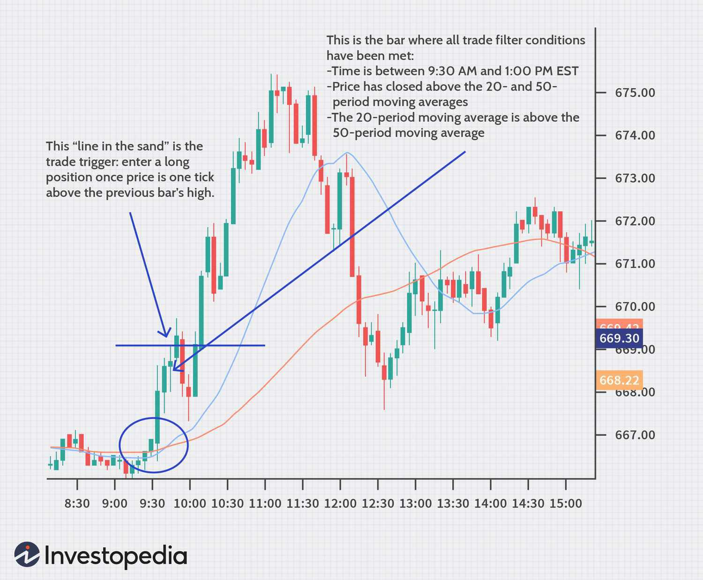

Algorithmic trading leverages computer programs to execute trades at speeds and frequencies that are impossible for human traders to achieve. Central to this form of trading is the ability to optimize entry points, which play a critical role in enhancing a trade's potential profitability. Precise entry points allow traders to capitalize on favorable market movements, minimizing losses and maximizing profits. Different types of traders, from high-frequency traders to institutional investors, benefit from precise trade entries as they aid in aligning the timing of trades with optimal market conditions, ultimately leading to more successful trading outcomes.

The concept of optimizing trade entry points primarily involves the use of two key mechanisms: trade filters and trade triggers. Trade filters are employed to sift through large volumes of market data, identifying trading opportunities that meet specific pre-defined criteria. These filters function as a market safety mechanism, ensuring that trades are only executed when certain conditions are met, thereby reducing exposure to undesirable market risks.



Conversely, trade triggers act as a prompt for action, marking the precise moment when a trade should be executed. They convert the potential opportunities identified by filters into executable trades by pinpointing the optimal timing for entry. Effective trade triggers are objective and clearly defined, often based on measurable indicators such as price crossings or technical analysis signals.

Both trade filters and triggers are integral to developing smarter trading strategies in algorithmic trading. They work in conjunction to facilitate trades that are not only well-timed but also strategically sound, contributing to consistent trading performance. By optimizing entry points through these mechanisms, traders can enhance their ability to navigate complex market environments with greater precision and control.

## Table of Contents

## Understanding Algorithmic Trading

Algorithmic trading refers to the use of computer algorithms to execute trading orders efficiently and with minimal human intervention. This method has gained significant traction in modern financial markets due to its ability to process vast amounts of data at high speeds and execute trades in milliseconds, which is especially important in highly volatile market conditions. 

The growing prominence of algorithmic trading can be attributed to several factors. Foremost among them is precision. Algorithms can be programmed to follow specific instructions to enter and exit trades, ensuring that these are executed upon the fulfillment of predefined criteria. This minimizes the risks associated with human errors and allows traders to execute their strategies consistently and systematically.

Another critical advantage is the reduction of emotional trading. Human traders are susceptible to emotions like fear and greed, which can lead to irrational decisions and significant financial losses. Algorithms, devoid of emotions, act strictly in accord with their programming, sticking to the set strategies without deviation. This objective nature helps in maintaining discipline in trading.

Efficiency is a further benefit of [algorithmic trading](/wiki/algorithmic-trading). Algorithms can simultaneously evaluate multiple market conditions and execute trades across various securities, markets, and exchanges without the limitations of human capacity. This ensures that trading opportunities are not missed, and the execution is faster than manual trading methods.

The concepts of trade filters and trade triggers are integral to algorithmic trading. Trade filters are criteria that help determine whether market conditions are favorable for entering a trade. They could be based on factors such as technical indicators, [liquidity](/wiki/liquidity-risk-premium), or [volatility](/wiki/volatility-trading-strategies). These filters prevent algorithms from executing trades in unfavorable market conditions, thereby acting as a safety mechanism.

Trade triggers, on the other hand, define the exact conditions required to initiate a trade. They are typically precise rules or benchmarks, such as a moving average crossover or a [breakout](/wiki/breakout-trading) pattern on a price chart. Such triggers ensure that trades are executed immediately when favorable conditions arise, optimizing entry points and maximizing potential returns.

In conclusion, algorithmic trading represents a sophisticated approach to modern trading, providing significant advantages in precision, emotional neutrality, and efficiency. By integrating trade filters and triggers, traders can develop strategies that respond swiftly and accurately to market changes, potentially enhancing profitability.

## Trade Filters: The Market Safety Mechanism

Trade filters act as essential market safety mechanisms that establish conditions for market entry in algorithmic trading. They serve as predefined criteria that determine whether the market environment is suitable for initiating trades. By setting these conditions, filters help traders avoid unprofitable or risky trades, ensuring that trading activities are conducted under optimal circumstances.

Various types of trade filters are employed by traders to define these entry conditions. Timing rules are one type of filter that ensures trades are executed during favorable market hours or in alignment with market events, such as earnings announcements or economic releases. These rules help avoid trading during periods of low liquidity or high volatility, which can adversely impact trade execution.

Price movement indicators are another form of filters that depend on specific price actions to validate trade signals. For instance, a trader might use a filter that only allows trades when the price of an asset surpasses its recent high, indicating upward [momentum](/wiki/momentum). Such filters are instrumental in confirming the strength or weakness of a price trend before entering a trade.

Moreover, technical analysis criteria are widely used as trade filters. These may include conditions based on candlestick patterns, support and resistance levels, or moving averages. For example, a moving average filter might mandate that the short-term moving average crosses above the long-term moving average before considering a long position.

Despite their usefulness, there are potential pitfalls associated with the overuse of trade filters. Excessive filtering can lead to missed trading opportunities, often referred to as "filtering out" potentially profitable trades. This happens when too many restrictive conditions prevent the execution of trades that could have been successful. Such over-filtering can result in lower trading volumes and diminished profitability, as the strategy becomes too conservative and fails to exploit favorable market movements.

Therefore, it is crucial for traders to strike a balance in applying trade filters. They must carefully evaluate each filter's impact on their trading strategy's performance and remain open to adjusting filter parameters as market conditions evolve. By maintaining this equilibrium, traders can harness the protective benefits of filters without compromising on potential gains.

## Trade Triggers: The Call to Action

Trade triggers are predefined conditions within algorithmic trading systems that dictate the precise moment to enter a trade. These triggers operate as the operational cue, often based on quantifiable metrics or market conditions, to execute a trade order. The distinct advantage of trade triggers lies in their ability to eliminate ambiguity by specifying exact criteria for trade execution.

For example, a common trade trigger is when a security's price crosses a moving average line, a widely respected technical indicator. A moving average provides a smoothed representation of price data over a specific period, helping to identify trends. A simple moving average (SMA) is calculated as follows:

$$
\text{SMA} = \frac{P_1 + P_2 + \ldots + P_n}{n}
$$

where $P_1, P_2, \ldots, P_n$ are the prices over a selected period, and $n$ is the number of periods. When the current price crosses above the SMA, it might signal a buying opportunity, whereas a cross below could signal selling.

Another effective method for creating trade triggers involves using other technical indicators such as the Relative Strength Index (RSI). The RSI measures the speed and change of price movements and is used to identify overbought or oversold conditions. A typical RSI trigger is set when the RSI crosses below the threshold of 30, indicating a potential buy, or above 70, suggesting a sell.

Algorithmic trading can also employ Bollinger Bands, which consist of a middle band (usually a 20-day SMA) and two outer bands representing standard deviations from the SMA. Trade triggers might be set when a price moves outside these bands, suggesting a potential reversal.

Python provides tools for implementing such strategies. Below is an example of a basic Python script to identify a moving average cross-over trigger for a trade:

```python
import pandas as pd
import numpy as np

# Assume df is a pandas DataFrame with stock data with columns 'Price'
df['SMA'] = df['Price'].rolling(window=20).mean()

# Identifying cross-over
df['Signal'] = 0
df['Signal'][20:] = np.where(df['Price'][20:] > df['SMA'][20:], 1, 0)
df['Position'] = df['Signal'].diff()
```

In this example, a position change from 0 to 1 would indicate a buy signal, and from 1 to 0 would signal selling.

These strategies highlight the objective, rules-based nature of trade triggers, leveraging market data to generate actionable insights. Properly defined trade triggers ensure that decisions are based on empirical evidence rather than subjective judgement, thereby enhancing trading efficiency.

## Integrating Filters and Triggers for Profitable Trading

Combining trade filters and triggers can enhance the efficiency and profitability of algorithmic trading strategies. Filters play a crucial role in identifying favorable market conditions that align with a trader's strategy, while triggers pinpoint the exact moments to execute trades. This synergy ensures that trades are not only well-timed but also executed under optimal market circumstances.

Trade filters act as preliminary checkpoints, sifting through market data to isolate scenarios that meet predefined criteria. These criteria can encompass a range of factors, including volatility thresholds, time-based conditions, or specific technical indicators. For example, a filter might only pass trades when a market index experiences volatility above a certain level, signaling potentially lucrative opportunities.

On the other hand, trade triggers execute buy or sell orders when specific conditions within the filtered market context are met. Triggers can be simple, such as executing a trade when the price crosses a moving average, or more complex, involving multiple indicators. The clarity and objectiveness of these triggers are vital to ensure consistent decision-making across different market conditions.

To integrate filters and triggers effectively, traders must find a balanced approach. Over-filtering can result in missed trading opportunities, as overly strict conditions might restrict execution to rare scenarios. Conversely, excessive reliance on triggers could lead to impulsive trades in suboptimal market conditions.

One strategy is to implement a two-tier system where broad filters narrow down the market landscape, followed by precise triggers that initiate trades. This system works as follows:
1. **Market Identification (Filter):** Use conditions such as time of day, overall sentiment, or macroeconomic indicators to scan the market.
2. **Specific Signal (Trigger):** Within the identified market context, apply precise signals such as RSI (Relative Strength Index) crossover or MACD (Moving Average Convergence Divergence) increase to trigger transactions.

To ensure the strategy remains robust, traders should continually evaluate the effectiveness of their filters and triggers through [backtesting](/wiki/backtesting) and live monitoring. Adjustments are crucial in response to changing market dynamics or strategy outcomes. Backtesting should provide insight into how the combination of filters and triggers performs across historical data, highlighting potential areas for improvement.

In practice, the integration of filters and triggers can be implemented using algorithmic scripts. A Python example involves using pandas for data handling and integrating filters and triggers into a decision-making process:

```python
import pandas as pd

def apply_filters(data):
    # Example filter: Only trade during high volatility periods
    data['HighVolatility'] = data['Volatility'] > data['Volatility'].quantile(0.75)
    return data

def apply_triggers(data):
    # Example trigger: Price crossing above a moving average
    data['MovingAverage'] = data['Close'].rolling(window=20).mean()
    data['Trigger'] = data['Close'] > data['MovingAverage']
    return data

def integrated_strategy(data):
    data = apply_filters(data)
    data = apply_triggers(data)
    data['TradeSignal'] = data['HighVolatility'] & data['Trigger']
    return data

# Load market data
market_data = pd.read_csv('market_data.csv')

# Apply the integrated strategy
strategy_data = integrated_strategy(market_data)
```

The effectiveness of this strategy depends on the quality of the filters and triggers and their relevance to the current market environment. By maintaining flexibility and a continual refinement process, traders can leverage the combined strength of filters and triggers to enhance their algorithmic trading performance.

## Implementing Filter and Trigger Strategies

Implementing filter and trigger strategies is a critical component in the development of automated trading systems. These systems rely on programmable logic to identify and execute trades based on predefined criteria. To implement these strategies effectively, traders must follow a systematic approach that includes not only the application of filters and triggers but also robust backtesting and real-time adjustments.

### Application in Automated Trading Systems

Filters in automated trading systems are employed to set baseline conditions for entering the market, thereby minimizing risk and avoiding unfavorable trades. These can include various market indicators, such as volatility levels, trading [volume](/wiki/volume-trading-strategy) thresholds, or fundamental data points. Triggers, on the other hand, focus on the exact moments when trading actions should be triggered. This involves identifying specific signals, such as price movements that cross a moving average, or the breakout of resistance levels.

The synthesis of filters and triggers in a trading strategy allows for a tiered decision-making process where only opportunities meeting predefined conditions are actioned upon, ensuring precision and efficiency in trade execution.

### Backtesting for Strategy Evaluation

To evaluate the effectiveness of filter and trigger strategies, backtesting is an essential step. This process involves applying historical market data to the trading strategy to assess how it would have performed in the past. Key metrics such as the Sharpe ratio, maximum drawdown, and cumulative returns are often used to evaluate performance.

Backtesting typically follows these steps:

1. **Data Collection:** Obtain historical price and volume data for the target financial instruments.
2. **Strategy Simulation:** Implement the filter and trigger logic on the historical data. This can be executed using a variety of programming tools such as Python with libraries like pandas for data manipulation and backtrader for strategy testing.
3. **Performance Analysis:** Evaluate the strategy based on risk-adjusted returns, using metrics such as:
$$
    \text{Sharpe Ratio} = \frac{\overline{R_p} - R_f}{\sigma_p}

$$
   where $\overline{R_p}$ is the average return of the strategy, $R_f$ is the risk-free rate, and $\sigma_p$ is the standard deviation of the strategy's return.

An example in Python for backtesting a strategy using simple moving average which acts as a trigger might be as follows:
```python
import pandas as pd
import backtrader as bt

class SMAStrategy(bt.SignalStrategy):
    def __init__(self):
        sma = bt.indicators.SimpleMovingAverage(self.data.close, period=15)
        self.signal_add(bt.SIGNAL_LONG, self.data.close > sma)

cerebro = bt.Cerebro()
cerebro.addstrategy(SMAStrategy)

data = bt.feeds.YahooFinanceData(dataname='AAPL', fromdate=pd.Timestamp('2019-01-01'),
                                 todate=pd.Timestamp('2020-01-01'))
cerebro.adddata(data)

cerebro.run()
cerebro.plot()
```

### Real-Time Adjustments

Once a strategy is deployed, traders must remain vigilant to changing market conditions and unexpected trading outcomes. Real-time adjustments allow traders to refine their strategies dynamically in response to these conditions. Several approaches can be adopted for this purpose:

- **Monitoring and Alerts:** Continuous monitoring tools should be in place to alert traders of performance deviations or market volatility spikes.
- **Strategy Tweaking:** Adjust parameters such as filter severity or trigger sensitivity based on recent performance reviews.
- **Machine Learning Integrations:** Incorporate adaptive algorithms that can learn from recent market data and suggest optimized modifications to existing strategies.

These adjustments ensure that filter and trigger methodologies remain relevant and responsive, thus maximizing potential gains. It is important for traders to strike a balance between over-optimization and adaptability to maintain robust trading performance.

## Avoiding Common Pitfalls in Using Filters and Triggers

In algorithmic trading, the misuse of filters and triggers can lead to several common mistakes, notably overfitting strategies to historical data or relying solely on mechanical signals. Overfitting occurs when a trading model is excessively tailored to fit past data, capturing noise rather than actual market patterns. This results in a model that performs well with historical data but fails to adapt to new, unseen market conditions. Traders can mitigate this issue by employing techniques such as cross-validation, where the dataset is divided into parts, using one part for training and another for testing, thereby ensuring the model's generalizability.

Moreover, relying solely on mechanical signals without considering market context can lead to inappropriate trading decisions. Mechanical signals are predefined conditions that prompt buy or sell actions; however, markets are influenced by a multitude of factors including news events, geopolitical developments, and economic indicators. Traders who ignore these factors may make trades that are technically justified but contextually inappropriate. To address this, traders can integrate qualitative analyses alongside quantitative signals, ensuring a well-rounded approach to strategy development.

Maintaining flexibility and adaptability in using filters and triggers is crucial. One method to achieve this is by incorporating adaptive algorithms that modify their parameters based on real-time market data. For example, a moving average filter could adjust its period based on current market volatility, becoming shorter in volatile conditions and longer in stable periods. This adaptability allows trading systems to respond dynamically to changing market environments, enhancing robustness and effectiveness.

Balancing risk and reward in filter and trigger-based strategies involves careful parameter tuning and risk management practices. Traders should establish clear risk thresholds and employ stop-loss orders to limit potential losses. Furthermore, diversification through multiple strategies or asset classes can reduce reliance on a single trading system, thereby mitigating risk. For instance, if a trader employs both momentum and mean-reversion strategies, poor performance in one may be offset by gains in the other.

Using Python for backtesting and simulation can aid traders in identifying and avoiding pitfalls in their strategies. Here is a simple code snippet demonstrating how to implement a basic moving average crossover strategy with stop-loss functionality:

```python
import pandas as pd

# Simulated market data
data = pd.DataFrame({'price': [100, 102, 101, 105, 107, 110, 108, 115]})
data['short_ma'] = data['price'].rolling(window=2, min_periods=1).mean()
data['long_ma'] = data['price'].rolling(window=3, min_periods=1).mean()

# Initial conditions
cash, position = 10000, 0
stop_loss = 0.05  # 5% stop loss

for i in range(1, len(data)):
    if data['short_ma'].iloc[i] > data['long_ma'].iloc[i]:
        if position == 0:  # Buy signal
            position = cash / data['price'].iloc[i]
            cash = 0
    elif data['short_ma'].iloc[i] < data['long_ma'].iloc[i]:
        if position > 0:  # Sell signal
            cash = position * data['price'].iloc[i]
            position = 0

    # Implementing stop-loss
    if position > 0 and data['price'].iloc[i] < (1 - stop_loss) * data['price'].iloc[i-1]:
        cash = position * data['price'].iloc[i]
        position = 0

# Output final portfolio value
portfolio_value = cash if cash > 0 else position * data['price'].iloc[-1]
print("Final Portfolio Value: ", portfolio_value)
```

This code simulates a basic strategy wherein trades are initiated based on moving average crossovers, and an additional stop-loss is incorporated to cap potential losses. Employing such simulations assists in spotting potential pitfalls and refining strategies for optimal market performance.

## Conclusion

In algorithmic trading, precise entry strategies are essential for executing successful trades. By integrating trade filters and triggers, traders can enhance their decision-making processes, ensuring that trades are made at optimal times based on well-defined conditions. Trade filters act as the initial screen, determining when the market meets certain criteria conducive to trading, while trade triggers signal the exact moments to enter or [exit](/wiki/exit-strategy) trades based on specific, actionable indicators.

The combination of filters and triggers offers a strategic advantage by reducing the emotional influences often experienced during manual trading and increasing the precision of trade execution. With filters identifying favorable market environments and triggers pinpointing optimal action points, traders can improve their chances of achieving desired outcomes. However, it's vital to balance these elements to avoid missing potential opportunities or falling into the trap of excessive reliance on mechanistic signals.

Adapting to changing market dynamics is critical. Continual refinement of strategies, through methods like backtesting and real-time adjustments, ensures that traders remain flexible and responsive. Regular evaluation allows for the incorporation of new data or strategies, preserving the relevance and effectiveness of the trading system. By doing so, traders can maintain a competitive edge in the fast-paced world of algorithmic trading, ultimately enhancing their overall success.

## References & Further Reading

[1]: Bergstra, J., Bardenet, R., Bengio, Y., & Kégl, B. (2011). ["Algorithms for Hyper-Parameter Optimization."](https://dl.acm.org/doi/10.5555/2986459.2986743) Advances in Neural Information Processing Systems 24.

[2]: ["Advances in Financial Machine Learning"](https://www.amazon.com/Advances-Financial-Machine-Learning-Marcos/dp/1119482089) by Marcos Lopez de Prado

[3]: ["Evidence-Based Technical Analysis: Applying the Scientific Method and Statistical Inference to Trading Signals"](https://www.amazon.com/Evidence-Based-Technical-Analysis-Scientific-Statistical/dp/0470008741) by David Aronson

[4]: ["Machine Learning for Algorithmic Trading"](https://github.com/stefan-jansen/machine-learning-for-trading) by Stefan Jansen

[5]: ["Quantitative Trading: How to Build Your Own Algorithmic Trading Business"](https://github.com/LucindaYa/quant-resources/blob/master/Quantitative%20Trading%20How%20to%20Build%20Your%20Own%20Algorithmic%20Trading%20Business.pdf) by Ernest P. Chan